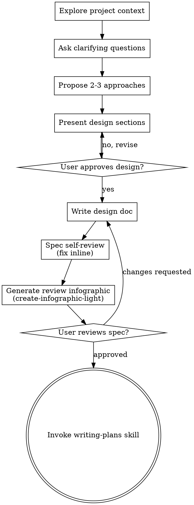

# Brainstorming Ideas Into Designs

Help turn ideas into fully formed designs and specs through natural collaborative dialogue.

Start by understanding the current project context, then ask questions one at a time to refine the idea. Once you understand what you're building, present the design and get user approval.

<HARD-GATE>
Do NOT invoke any implementation skill, write any code, scaffold any project, or take any implementation action until you have presented a design and the user has approved it. This applies to EVERY project regardless of perceived simplicity.
</HARD-GATE>

## Anti-Pattern: "This Is Too Simple To Need A Design"

Every project goes through this process. A todo list, a single-function utility, a config change — all of them. "Simple" projects are where unexamined assumptions cause the most wasted work. The design can be short (a few sentences for truly simple projects), but you MUST present it and get approval.

## Checklist

You MUST create a task for each of these items and complete them in order:

1. **Explore project context** — check files, docs, recent commits
2. **Offer the visual companion just-in-time** — NOT upfront. The first time a question would genuinely be clearer shown than described, offer it then (its own message); on approval its browser tab opens for you. If no visual question ever arises, never offer it. See the Visual Companion section below.
3. **Ask clarifying questions** — one at a time, understand purpose/constraints/success criteria
4. **Propose 2-3 approaches** — with trade-offs and your recommendation
5. **Present design** — in sections scaled to their complexity, get user approval after each section
6. **Write design doc** — save to `docs/superpowers/specs/YYYY-MM-DD-<topic>-design.md` and commit
7. **Spec self-review** — quick inline check for placeholders, contradictions, ambiguity, scope (see below)
8. **Generate review infographic** — invoke the create-infographic-light skill on the spec (and the plan, once written) and `open` it, so the user can review visually and attach comments
9. **User reviews written spec** — ask user to review the spec file before proceeding
10. **Transition to implementation** — invoke writing-plans skill to create implementation plan

## Process Flow



**The terminal state is invoking writing-plans.** Do NOT invoke frontend-design, mcp-builder, or any other implementation skill. The ONLY skill you invoke after brainstorming is writing-plans.

## The Process

**Understanding the idea:**

- Check out the current project state first (files, docs, recent commits)
- Before asking detailed questions, assess scope: if the request describes multiple independent subsystems (e.g., "build a platform with chat, file storage, billing, and analytics"), flag this immediately. Don't spend questions refining details of a project that needs to be decomposed first.
- If the project is too large for a single spec, help the user decompose into sub-projects: what are the independent pieces, how do they relate, what order should they be built? Then brainstorm the first sub-project through the normal design flow. Each sub-project gets its own spec → plan → implementation cycle.
- For appropriately-scoped projects, ask questions one at a time to refine the idea
- Prefer multiple choice questions when possible, but open-ended is fine too
- When the options are discrete (2-4 choices), use the AskUserQuestion tool — do NOT present numbered options as plain text (inconsistent across sessions and harder for the user to answer)
- One AskUserQuestion call = ONE question. Never bundle multiple questions into the questions array — that is a "one question at a time" violation even though the tool allows it
- Final litmus before sending any AskUserQuestion: if an option is marked (推奨/Recommended) and the recommendation rests on a principle or investigation fact (not user preference), the question is type-B — delete it and fold the recommendation into the premise declaration instead
- Only one question per message - if a topic needs more exploration, break it into multiple questions
- Focus on understanding: purpose, constraints, success criteria

**Exploring approaches:**

- Propose 2-3 different approaches with trade-offs
- Present options conversationally with your recommendation and reasoning
- Lead with your recommended option and explain why

**Self-refutation before presenting (required):**

- Before presenting any design, attack it yourself: construct at least one concrete input that must NOT work (rotation/orientation, multi-cell, boundary, scale, concurrent state) and verify the design rejects it. If the design cannot express the rejection, that is the signal to add an extension point — do not ship the design without resolving it.
- Include the strongest counterexample and how the design handles it in the presentation. Finding your design's fatal case before the user does is the single highest-trust move in a design dialogue.
- When a premise asserts game/physics behavior (e.g. "perpendicular gears never mesh"), check whether a real-world exception exists (e.g. bevel gears) — if the design would collapse when the assertion is wrong, confirm it with the user as a type-C question.

**Presenting the design:**

- Once you believe you understand what you're building, present the design
- Scale each section to its complexity: a few sentences if straightforward, up to 200-300 words if nuanced
- Ask after each section whether it looks right so far (small designs that fit in one message may be presented and approved as a whole)
- Cover: architecture, components, data flow, error handling, testing
- Be ready to go back and clarify if something doesn't make sense

**Design for isolation and clarity:**

- Break the system into smaller units that each have one clear purpose, communicate through well-defined interfaces, and can be understood and tested independently
- For each unit, you should be able to answer: what does it do, how do you use it, and what does it depend on?
- Can someone understand what a unit does without reading its internals? Can you change the internals without breaking consumers? If not, the boundaries need work.
- Smaller, well-bounded units are also easier for you to work with - you reason better about code you can hold in context at once, and your edits are more reliable when files are focused. When a file grows large, that's often a signal that it's doing too much.

**Working in existing codebases:**

- Explore the current structure before proposing changes. Follow existing patterns.
- Where existing code has problems that affect the work (e.g., a file that's grown too large, unclear boundaries, tangled responsibilities), include targeted improvements as part of the design - the way a good developer improves code they're working in.
- Don't propose unrelated refactoring. Stay focused on what serves the current goal.

## After the Design

**Documentation:**

- Write the validated design (spec) to `docs/superpowers/specs/YYYY-MM-DD-<topic>-design.md`
  - (User preferences for spec location override this default)
- Use elements-of-style:writing-clearly-and-concisely skill if available
- Commit the design document to git

**Spec Self-Review:**
After writing the spec document, look at it with fresh eyes:

1. **Placeholder scan:** Any "TBD", "TODO", incomplete sections, or vague requirements? Fix them.
2. **Internal consistency:** Do any sections contradict each other? Does the architecture match the feature descriptions?
3. **Scope check:** Is this focused enough for a single implementation plan, or does it need decomposition?
4. **Ambiguity check:** Could any requirement be interpreted two different ways? If so, pick one and make it explicit.
5. **Evidence scope check:** Every "verified/tested/実装済み" claim must not exceed what was actually checked — write "X is tested" only if a test exercises X itself; if it's a sibling going through the same path, say that instead (e.g. "same code path is tested with a machine block, chest itself untested").

Fix any issues inline. No need to re-review — just fix and move on.

**Review Infographic (required):**
After the spec review loop passes, invoke the create-infographic-light skill (in this repo: `.claude/skills/create-infographic-light`) with the spec as the source document, and `open` the generated HTML. The user reviews the spec through the infographic and can attach comments via its comment feature ("すべてコピー" Markdown gets pasted back for you to apply). Do the same for the implementation plan after writing-plans completes.

**User Review Gate:**
After the spec review loop passes, ask the user to review the written spec before proceeding:

> "Spec written and committed to `<path>`. Please review it and let me know if you want to make any changes before we start writing out the implementation plan."

Wait for the user's response. If they request changes, make them and re-run the spec review loop. Only proceed once the user approves.

**Implementation:**

- Invoke the writing-plans skill to create a detailed implementation plan
- Do NOT invoke any other skill. writing-plans is the next step.

## Key Principles

- **One question at a time** - Don't overwhelm with multiple questions
- **Multiple choice preferred** - Easier to answer than open-ended when possible
- **YAGNI ruthlessly** - Remove unnecessary features from all designs
- **Explore alternatives** - Always propose 2-3 approaches before settling
- **Incremental validation** - Present design, get approval before moving on
- **Be flexible** - Go back and clarify when something doesn't make sense

## Visual Companion

A browser-based companion for showing mockups, diagrams, and visual options during brainstorming. Available as a tool — not a mode. Accepting the companion means it's available for questions that benefit from visual treatment; it does NOT mean every question goes through the browser.

**Offering the companion (just-in-time):** Do NOT offer it upfront. Wait until a question would genuinely be clearer shown than told — a real mockup / layout / diagram question, not merely a UI *topic*. The first time that happens, offer it then, as its own message:
> "This next part might be easier if I show you — I can put together mockups, diagrams, and comparisons in a browser tab as we go. It's still new and can be token-intensive. Want me to? I'll open it for you."

**This offer MUST be its own message.** Only the offer — no clarifying question, summary, or other content. Wait for the user's response. If they accept, start the server with `--open` so their browser opens to the first screen automatically. If they decline, continue text-only and don't offer again unless they raise it.

**Per-question decision:** Even after the user accepts, decide FOR EACH QUESTION whether to use the browser or the terminal. The test: **would the user understand this better by seeing it than reading it?**

- **Use the browser** for content that IS visual — mockups, wireframes, layout comparisons, architecture diagrams, side-by-side visual designs
- **Use the terminal** for content that is text — requirements questions, conceptual choices, tradeoff lists, A/B/C/D text options, scope decisions

A question about a UI topic is not automatically a visual question. "What does personality mean in this context?" is a conceptual question — use the terminal. "Which wizard layout works better?" is a visual question — use the browser.

If they agree to the companion, read the detailed guide before proceeding:
`skills/brainstorming/visual-companion.md`

# 追加SKILL:design-question-triage

---
name: design-question-triage
description: |
  壁打ち・仕様相談・要件確認でユーザーへ質問を出す前に、質問候補を観点整理し「コード調査で解決できるもの」「設計原則で答えが一意に決まるもの」を弾いて自己解決し、根拠つきの前提として宣言する。本当にユーザーにしか決められない質問だけを届けるためのトリアージスキル。
  Use when:
  1. 「壁打ちしたい」「〜機能を作りたい」「仕様を詰めたい」「要件を整理したい」と言われて設計対話を始める時
  2. brainstorming 系スキルの質問フェーズ（clarifying questions）に入る時
  3. 設計の文脈で AskUserQuestion を組み立てようとする直前（毎回）
  4. 設計レビューで「そこは聞かなくても決まるでしょ」という指摘を受けた後の再発防止として
---

# design-question-triage — 質問する前に自明を弾く

## なぜこのスキルが必要か

壁打ちで最も信頼を損なうのは「聞かなくても決まる質問」と「原則に反する案を推奨として提示すること」である。
ユーザーの時間は質問1回ごとに消費される。質問は「トレードオフが実在し、価値判断がユーザー固有」なものだけに絞り、
それ以外は自分で決めて**拒否権つきの前提**として宣言するほうが、対話は速く、精度も上がる。

## 発火タイミング

設計対話でユーザーへ質問（AskUserQuestion 含む）を出す**すべての直前**。1回目だけでなく、対話の途中でも毎回適用する。

## Phase 1: 質問候補の全列挙（まだ聞かない）

まず観点チェックリストで質問候補を網羅的に洗い出す。頭の中ではなく列挙して書き出すこと（抜けは列挙しないと見えない）。

| 観点 | 典型的な問い |
|---|---|
| トリガー / 獲得経路 | 何がきっかけで発動・獲得されるか |
| 適用範囲 / 粒度 | 全体一律か個別か、段階か一回か |
| データ表現 / 置き場所 | マスタ・設定・セーブのどこに何を定義するか |
| 状態の所有ドメイン | 動的状態をどの層が持つか |
| 永続化 / 復元 / 順序 | 何を保存し、どの順で復元するか |
| 同期 / 通信 | サーバー・クライアント間で何をいつ同期するか |
| UI / 表示スコープ | どこまで見せるか、専用UIは要るか |
| 既存データ移行 | 既存データ・セーブをどう扱うか |
| エッジケース | 上限到達、重複適用、途中変更などの挙動 |
| データフロー参加位置 | 既存の駆動・反映の連鎖のどこに立つ機能か（書き手か・読み手か・交差点を足すか） |

**データフロー観点は最初に確定させる**（他観点の前提）: 対象が既存の一方向連鎖（入力→共有モデル→下流が変化から挙動を導出）に参加するなら、実体は「**共有モデルへの書き手が1人増える**」だけで自由度は「誰が・いつ書くか」に縮む。これを外すと全観点が「新しい制御フローありき」で膨らむ。矢印列を1本書いて立ち位置を置き、`bool` 戻り・迂回セッター・フレーム駆動へのイベント混入（＝交差点）は不可避理由が無ければ畳む。詳細は writing-plans の Phase 1.5 と同一。

## Phase 2: 3分類トリアージ

列挙した各候補を以下の3種に分類する。**分類してから**でないと質問を書き始めてはいけない。

### A. 調査解決型 — 聞かずに調べる
コード・スキーマ・過去コミット・ドキュメントを読めば確定する問い。
「既存に似た仕組みはあるか」「ロード順はどうなっているか」「この値はどこで参照されているか」は全部これ。
subagent や検索で解決し、結果は Phase 3 の前提に含める。

### B. 原則自明型 — 聞かずに決めて宣言する
選択肢を並べたとき、**片方を選ばない理由が存在しない（支配戦略がある）**問い。

判定テスト（どれかに該当すれば B）:
- **無料の上位互換テスト**: 一方が同コストで他方の性質を全て持ち、追加のデメリットがない（例: デメリット無く冪等にできるなら冪等一択。increment より unlock/set-max）
- **ドメイン整合テスト**: 一方が層・ドメインの責務定義に明確に反する（例: 実行時に変化する状態を「静的定義」のドメインに置く案は、変更量が少なくても選ばない）
- **先行パターンテスト**: コードベースに同種の仕組みが既にあり、それに乗らない理由がない
- **導出可能テスト**: 情報を運ぶ・保持する機構を新設する案は、その情報が既存の情報源から導出できるなら不採用。同じ情報の置き場・通り道を増やすことは Single Source of Truth を壊し、同期バグの温床になる。新設は「既存の情報源では足りない」ことを調査で示せたときだけ設計に含める
- **逆提案テスト**: 「逆を提案したらユーザーに修正されるだろう」と予想できる

**新設ゲート（必須）**: 前提・設計に「新しい機構（状態ストア・保存領域・通信経路・状態複製）を新設する」と書く前に、
同じ役割を担いうる既存機構をコードベースから検索し、**見つかった候補を実名で列挙**したうえで
「その拡張では足りない理由」を前提宣言に1行で明記する。候補列挙と拡張不可理由の両方が書けないうちは、新設を設計に含めてはならない。
注意: 「マスタ（静的定義）には置けない」は新設の根拠にならない。それは静的層を除外しただけで、
既存の**動的状態ストアや既存の同期・保存経路**を拡張できない理由にはなっていない。検索対象はまさにそちら側である。

⚠️ B を「推奨付きの質問」に変換して判断を外注するのは禁止。それは丁寧さではなく判断の放棄であり、
ユーザーに「明らかな正解を選ぶ作業」をさせることになる。B は宣言する。間違っていれば前提の段階で拒否される。

一般設計原則（B判定の照合表）:
1. デメリット無く冪等にできる操作は冪等にする（再実行・順序・リトライ・ロード時再適用に強い）
2. 動的な実行時状態を静的定義（マスタ / スキーマ / 設定）のドメインに置かない
3. 既存コードベースの同種パターンに従う（新パターンの発明には積極的な理由が要る）
4. 派生可能な状態は導出を基本とし、復元順序などの実制約があるときだけ既存の永続化パターンで補う
5. 置換・移行はコンパイルエラー駆動（型やプロパティを消して漏れを機械検出）にできるならそうする
6. YAGNI。将来の拡張可能性を理由に選択肢を増やさない
7. N対Nの適合・互換のような「関係」データは、各要素の属性（受け入れリスト等）に分散させず、中央の正規化テーブル（ペア表＋foreignKey＋検証）を第一候補にする（SSOT）。分散属性案を提示するなら必ず中央表案と並べて比較する
8. コードの注入点を設ける際は、実行時注入（delegate/interface渡し）と型レベル束縛（ジェネリック型パラメータ）の型安全度トレードオフを一度は比較する。「注入ミスがコンパイルエラーになるか」を比較軸に含める
9. 範囲・領域・対象集合を指定する契約（プロトコル/API/サービス引数）は一般形で受ける（3D空間ならXYZのAABB等）。UX都合の簡略化（「高さは全域でいい」等）はクライアント側の初期値・操作に留め、契約に焼き込まない。指定方式を推奨する前に「ユーザーが意図した集合を一意に表現できるか＝除外できない巻き込みが構造的に発生しないか」の反例を1つ構築して検査する（操作の手軽さは一意性の欠落を正当化しない）
10. 対で存在する操作（抽出/適用・serialize/deserialize・save/load）は同じインターフェースに対で定義する。片側だけのinterfaceは設計臭。適用側の実装は「各実装への分散（テンプレート個別対応等）」と「中央1箇所での汎用適用（factory等がinterfaceを列挙して適用）」を必ず並べて比較する。先行パターンに乗れた時点で探索を打ち切らず、そのパターン形の解にも無料の上位互換テストを適用する

プロジェクト固有の原則は `references/` を参照する（moorestech なら `references/moorestech-principles.md` を必ず読む）。

### C. 意思決定型 — これだけを聞く
トレードオフが実在し、どちらを取るかが**ユーザーの価値観・プロダクト方針・ゲームデザイン・スコープ感覚**に依存する問い。
例: 獲得手段（研究か消費アイテムか）、適用粒度（一律か個別か）、UIをどこまで作るか、データ移行の手間をどちらが払うか。

見分け方: 両案のメリット・デメリットを書き出したとき、**残る差が「好み・方針」だけ**になるなら C。
技術的優劣で決着がつくなら B に戻す。

**推奨リトマス（必須）**: 質問文を書いた後、自分がその質問に**原則・調査事実を根拠とする推奨**を添えられるか自問する。
添えられるなら、それは答えを知っている質問 = B である。質問を削除し、推奨内容を前提宣言に畳み込む
（例:「汎用システム化するか専用実装か」に YAGNI を根拠に専用実装を推奨できる時点で、それは質問ではなく宣言すべき決定）。
C として残してよいのは、推奨の根拠が「好み・方針の仮定」しか無い場合だけ。

## Phase 3: 出力形式 — 前提を先に、質問は後に

質問を出すときは必ずこの順で構成する:

```
## 前提（自己解決した決定 — 違ったら指摘してください）
- <決定>: <1行の根拠>（A: 調査結果 or B: 適用した原則）
- ...

## 質問（ユーザーの判断が必要なもの）
<C型の質問を1つずつ。各選択肢に実在するトレードオフを明記>
```

- 前提の宣言により、ユーザーは**拒否権を1行で行使できる**。質問に答えるより遥かに安い
- C型質問は1メッセージ1問。推奨を付けられるのは根拠が「好み・方針の仮定」に留まる場合のみ。
  原則・調査事実に基づく推奨を書けてしまったら、それは B だった質問なので前提宣言に戻す（推奨リトマス）
- 対話が進んで新しい質問候補が生まれたら、その都度 Phase 2 のトリアージを通す

## アンチパターン実例（実際にあった指摘）

1. **冪等の見落とし**: 研究による永続強化で「レベルを+1する(increment)」アクションを設計し提示した。
   ロード時の再実行・重複適用に弱く、「特定レベルを解放する」冪等アクションが同コストで実現できた。
   → 無料の上位互換テストで B と判定し、聞かずに冪等側を宣言すべきだった。
2. **ドメイン所有権の見落とし**: 動的に変わる「現在レベル」をマスタ管理クラス（静的定義のドメイン）に
   持たせる案を推奨として提示した。変更箇所が最少という理由で層の責務違反を正当化していた。
   → ドメイン整合テストで B と判定し、実行時層に置く案だけを提示すべきだった。
3. **不要な新設の見落とし**: 研究由来の派生値をクライアントへ届けるために新プロトコル＋イベントパケットの
   新設を設計に含めた。実際には研究完了状態が既にクライアントへ同期されており、派生値は共有マスタ＋
   同期済み状態から導出できたため新設は不要だった。
   → 導出可能テストを先に回し、「既存経路で足りない証拠」が出るまで新設を設計に書かないべきだった。

いずれも「質問・提案の形にしたこと」自体が誤りで、原則を照合していれば発生しなかった。
