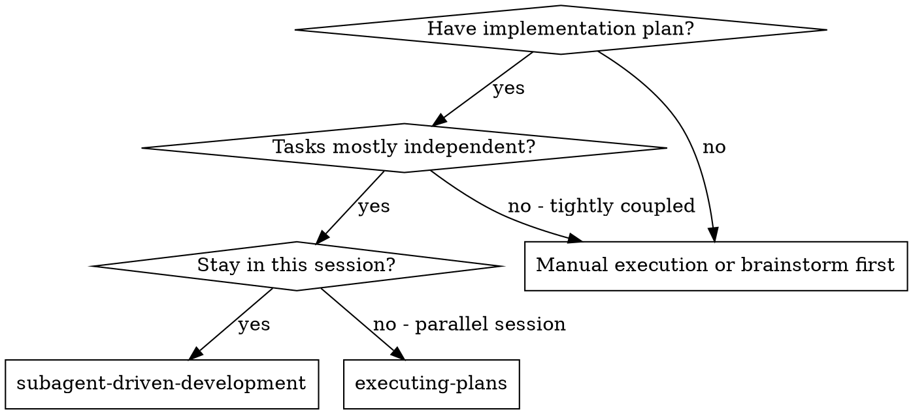
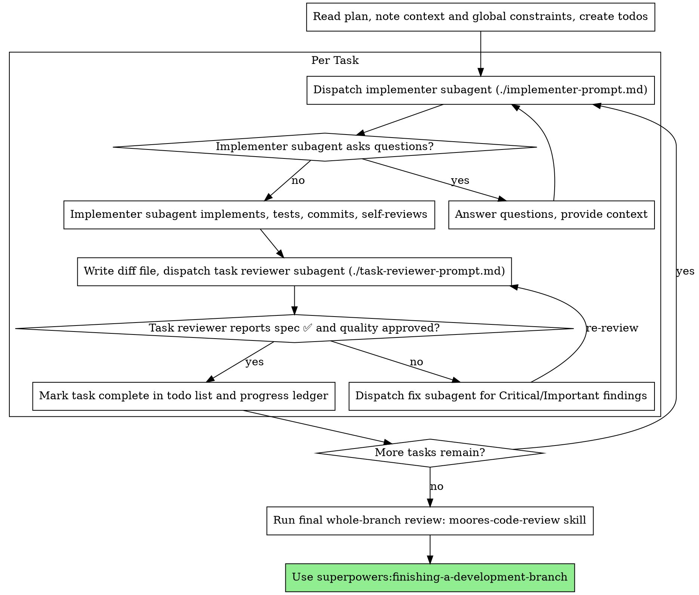

# Subagent-Driven Development

計画を実行する際、タスクごとに新しいimplementer subagentを派遣し、各タスク後にタスクレビュー（spec準拠＋コード品質）を行い、最後に広範なブランチ全体レビューを行う。

**なぜsubagentを使うのか:** 隔離されたコンテキストを持つ専門エージェントにタスクを委譲する。指示とコンテキストを精密に組み立てることで、彼らが集中してタスクを成功させることを保証する。彼らは自分のセッションのコンテキストや履歴を継承すべきではなく、必要なものだけを正確に構築して渡す。これにより自分自身のコンテキストも調整作業のために温存される。

**核となる原則:** タスクごとの新規subagent + タスクレビュー（spec + 品質） + 広範な最終レビュー = 高品質・高速なイテレーション

**ナレーション:** ツール呼び出しの間は最大1行だけ短く実況する。台帳とツール結果が記録を担う。

**継続実行:** タスクの合間に人間パートナーへ確認を取るために止まらない。計画の全タスクを止まらずに実行する。止まってよい理由は、解決できないBLOCKED状態、真に進行を妨げる曖昧さ、または全タスク完了のみ。「続けてよいですか？」という確認や進捗サマリーは相手の時間の無駄になる — 彼らは計画の実行を依頼したのだから、実行せよ。

## 使用場面



**vs. Executing Plans（並列セッション）:**
- 同一セッション（コンテキスト切り替えなし）
- タスクごとに新規subagent（コンテキスト汚染なし）
- 各タスク後にレビュー（spec準拠＋コード品質）、最後に広範なレビュー
- 高速なイテレーション（タスク間でhuman-in-loopなし）

## プロセス



## 最終ブランチ全体レビューは必須の自動ゲートである

最終moores-code-reviewパスは、最後のタスクが完了した瞬間、**自動的・無条件・確認なし**に実行される。これはこのプロセスの一部であり、ゴール記述の一部ではない:

- 「playtestまで実行」「テストが通るまで」といった形で表現されたゴールは、レビューを免除**しない**。ゴールの文言は機能実装の範囲を定めるものであり、このゲートを制限するものでは決してない。「ゴール境界に到達したから、レビューは次のステップだ」という推論は明示的に禁止されている — まさにこの推論によって、計画で義務付けられたハードコード（`BlockReplaceFamilyUtil`、replace-family
  BlockType列挙）がレビューされずに出荷され、人間によって捕捉された（`3ad0cd5c0`で修正）。
- 「moores-code-review 1パス推奨です・必要なら実行します」という言葉でセッションを終えてはならない。レビューを実行する代わりに推奨することは、それをスキップしたことになる。
- スキップできる唯一の方法は、人間がこのセッション内で自分の言葉で明示的にスキップを指示した場合のみ。その指示を進捗台帳に記録すること。
- 計画を書く・レビューする際は、タスクリストの末尾に明示的な最終タスクがあることを確認する: 「必ず最後にmoores-code-reviewスキルで全ブランチ
  レビューを実行する」。計画にこれが無い場合は自分のtodoリストに追加すること — タスク行の欠落はゲートを免除しない。

## 事前計画レビュー

タスク1を派遣する前に、計画を一度スキャンして矛盾を確認する:

- タスク同士、あるいはタスクと計画のGlobal Constraintsとが矛盾している箇所
- 計画が明示的に義務付けているが、レビューの基準では欠陥とみなされるもの（何も検証しないテスト、ロジックブロックの逐語的な重複）
- **moorestech設計レンズ:** 計画を`.claude/skills/moores-code-review/references/lens-digest.md`と照合する。計画がレンズ違反を義務付けている場合（例:「新しいイベントパケットの代わりに既存レスポンスから状態を導出する」「JSON更新を避けるためスキーマフィールドをoptionalにする」「isActive述語を基底コンポーネントに注入する」）は設計段階の欠陥であり、ここで捕捉する方が最終レビューで捕捉するより10倍安く済む。
  計画がspec-architecture-reviewを飛ばしている場合（配置と前例のセクションが無い場合）は、`.claude/skills/writing-plans/references/moorestech-layer-map.md`を使って今そのスキャンを実行する。

見つけたものはすべて一括した質問として人間パートナーに提示する — それを義務付ける計画テキストの隣に各所見を並べ、どちらを優先すべきか尋ねる — 実行開始前に行い、計画実行中の発見ごとに1つずつ割り込むのではない。スキャンが問題なければ、コメントなしで進める。実装からのみ明らかになる矛盾については、レビューループが引き続き網の役割を果たす。

## モデル選定

コストを抑え速度を高めるため、各役割をこなせる最も非力なモデルを使うこと。

**機械的な実装タスク**（孤立した関数、明確なspec、1〜2ファイル）: 高速で安価なモデルを使う。計画がよく記述されていれば、ほとんどの実装タスクは機械的である。

**統合・判断タスク**（複数ファイルにまたがる調整、パターンマッチング、デバッグ）: 標準モデルを使う。

**アーキテクチャ・設計タスク:** 利用可能な最も高性能なモデルを使う。
最終ブランチ全体レビューはこれに該当する — セッションのデフォルトではなく、利用可能な最も高性能なモデルで派遣すること。

**レビュータスク:** diffの規模・複雑さ・リスクに応じて、同じ判断基準でモデルを選ぶ。小さく機械的なdiffには最も高性能なモデルは不要だが、微妙な並行処理の変更には必要。

**subagentを派遣する際は常にモデルを明示的に指定すること。** モデル未指定はセッションのモデル（多くの場合最も高性能かつ高価）を暗黙に継承し、この節を無言のうちに無効化する。

**ターン数はトークン単価に勝る。** 経過時間とコンテキストコストは、subagentが何ターン要するかに比例してスケールする。安価なモデルは多段階の作業で常習的に2〜3倍のターン数を要し、結果的により高くつくことがある。レビュアーおよびプロース記述から作業するimplementerには、中位モデルを下限として使うこと。タスクの計画テキストに書くべきコードそのものが含まれている場合、実装は転記＋テストに過ぎないため、そのimplementerには最安ティアを使う。単一ファイルの機械的な修正も最安ティアでよい。

**タスク複雑度のシグナル（実装タスク）:**
- 完全なspecがあり1〜2ファイルに触れる → 安価なモデル
- 統合上の懸念がある複数ファイルに触れる → 標準モデル
- 設計判断や広範なコードベース理解を要する → 最も高性能なモデル

## Implementerのステータス対応

Implementer subagentは4つのステータスのいずれかを報告する。それぞれ適切に対応すること:

**DONE:** レビューパッケージを生成し（このスキルのディレクトリから`scripts/review-package BASE HEAD` — 書き出した一意のファイルパスを表示する。BASEはimplementerを派遣する前に記録したコミットであり、決して`HEAD~1`ではない — これは複数コミットタスクの最後以外を無言で切り捨ててしまう）、表示されたパスでタスクレビュアーを派遣する。

**DONE_WITH_CONCERNS:** implementerは作業を完了したが懸念を報告した。進める前に懸念を読むこと。懸念が正しさやスコープに関するものであれば、レビュー前に対処する。単なる所見（例:「このファイルが大きくなりつつある」）であればメモしてレビューに進む。

**NEEDS_CONTEXT:** implementerが提供されていない情報を必要としている。不足しているコンテキストを提供して再派遣する。

**BLOCKED:** implementerがタスクを完了できない。ブロッカーを評価する:
1. コンテキストの問題であれば、より多くのコンテキストを提供し同じモデルで再派遣する
2. タスクがより多くの推論を要する場合、より高性能なモデルで再派遣する
3. タスクが大きすぎる場合、より小さな単位に分割する
4. 計画自体が誤っている場合、人間にエスカレーションする

**エスカレーションを無視したり、変更なく同じモデルにリトライを強制したりすることは決してしないこと。** implementerが行き詰まったと言ったなら、何かを変える必要がある。

## レビュアーの⚠️項目への対応

タスクレビュアーは「⚠️ diffからは検証不能」という項目を報告することがある — 未変更のコードに存在する、またはタスクをまたぐ要件。これらは残りのレビューをブロックしないが、タスク完了とマークする前に自分自身で各項目を解決しなければならない: 計画とタスク横断のコンテキストを持つのはあなたであり、レビュアーはそれを持たない。項目が実際のギャップだと確認したら、失敗したspecレビューとして扱う — implementerに差し戻し再レビューする。

## レビュアープロンプトの組み立て

タスクごとのレビューはタスク単位のゲートである。広範なレビューは1回、最終ブランチ全体レビューでのみ行われる。レビュアーテンプレートを埋める際:

- 「すべての用途を確認せよ」「役立つならrace testを実行せよ」といった、具体的でタスク固有の理由のない自由裁量の指示を追加しないこと
- implementerがすでに同じコードに対して実行したテストを、レビュアーに再実行させないこと — implementerの報告がテスト証拠を担う
- レビュアーに対して所見を先取りして判断しないこと — 特定の問題を無視するよう、あるいはフラグを立てないよう指示することは決してしない。ある所見が偽陽性だと思うなら、レビュアーに提起させ、レビューループの中で裁定する。書いているプロンプトに「フラグを立てるな」「Xを欠陥として扱うな」「最大でもMinor」「計画が選んだ」といった文言が含まれているなら止まること — それは先取り判断であり、通常は自分がレビューループを避けたいだけである。
- レビュアーに渡すglobal-constraintsブロックは彼らの注意のレンズである。計画のGlobal Constraintsセクションまたはspecから、拘束力ある要件を逐語的にコピーすること: 正確な値、正確なフォーマット、コンポーネント間で述べられている関係性（「Xと同じレイアウト」「Yと一致」）。レビュアーのテンプレートにはすでにプロセスのルール（YAGNI、テスト衛生、レビュー手法）が含まれている — constraintsブロックはこのプロジェクトのspecが要求する内容のためのものである。
- レビュアーにはdiffをファイルとして渡すこと: このスキルの`scripts/review-package BASE HEAD`を実行し、表示されたファイルパスをレビュアーに渡す（bashが無い場合は`git log --oneline`、`git diff --stat`、範囲に対する`git diff -U10`を、一意な名前の1ファイルにリダイレクトする）。出力は自分自身のコンテキストには一切入らず、レビュアーはコミット一覧・stat要約・コンテキスト付き全diffを1回のRead呼び出しで見られる。implementerを派遣する前に記録したBASEを使うこと — 決して`HEAD~1`ではない。これは複数コミットタスクを無言で切り詰める。
- 派遣プロンプトは1つのタスクを記述するものであり、セッションの履歴ではない。蓄積された前タスクの要約（「タスク1〜3後の状態」）を後続の派遣に貼り付けないこと — 実セッションのある派遣は42k文字に達し、その99%が貼り付けられた履歴だった。新規subagentが必要とするのは自分のタスク、触れるインターフェース、global constraintsだけである。それ以外は不要。
- Critical・Important所見にはfix subagentを派遣すること。Minor所見は進捗台帳に記録し、最終ブランチ全体レビューにそのリストを参照させ、マージ前に修正すべきものを判定させる。誰も読まないロールアップは無言の握りつぶしである。
- plan-mandatedとラベル付けされた所見 — あるいは計画のテキストが要求する内容と矛盾する所見 — は、あらゆる計画との矛盾と同様に人間の判断事項である: 所見と計画テキストを提示し、どちらを優先するか尋ねる。計画が義務付けているという理由で所見を却下したり、計画と矛盾する修正を確認なしに派遣したりしないこと。
- 最終ブランチ全体レビューは**moores-code-reviewスキル**である（単一のレビュアーsubagentではなくSkillツール経由で呼び出す）。これは必須の自動ゲートである — 上記「最終ブランチ全体レビューは必須の自動ゲートである」を参照。決定論チェックとmoorestech設計レンズを並列実行し、所見を統合する。まずブランチdiffを`scripts/review-package MERGE_BASE HEAD`で生成し（MERGE_BASE = ブランチが分岐したコミット、例: `git merge-base main HEAD`）、表示されたファイルをスキルのPATCH_PATHとして使う。Minor所見台帳をレンズエージェント群の4カテゴリコンテキストに投入し、トリアージさせること。
- すべてのfix派遣はimplementer契約を担う: fix subagentは自分の変更をカバーするテストを再実行し結果を報告する。派遣時にカバーするテストファイル名を挙げること — 1行の修正にスイート全体は不要。レビュアーを再派遣する前に、fix報告にカバーするテスト・実行したコマンド・出力が含まれていることを確認し、この3つが揃ってから再レビューを派遣する。
- 最終ブランチ全体レビューで所見が返ってきた場合、所見1件につき1体ではなく、完全な所見リストを持った**単一の**fix subagentを派遣すること。所見ごとのfixerはそれぞれコンテキストを再構築しスイートを再実行するため、実セッションのある最終レビューのfix waveは全タスク合計より高コストになった。

## ファイルハンドオフ

派遣プロンプトに貼り付けたものすべて — そしてsubagentが返すものすべて — はセッション残り期間コンテキストに常駐し、以降の全ターンで再読込される。成果物はファイルとして受け渡すこと:

- **タスクブリーフ:** implementerを派遣する前に、このスキルの`scripts/task-brief PLAN_FILE N`を実行する — タスクの全文を一意な名前のファイルに抽出し、パスを表示する。ブリーフを唯一の要件ソースとして保つよう派遣を組み立てる。派遣内容には次を含めること: (1) このタスクがプロジェクトのどこに位置するかの1行、(2) ブリーフのパス（「まずこれを読め — あなたの要件であり、値はそのまま使うこと」として紹介）、(3) ブリーフが知り得ない、前タスクからのインターフェースと決定事項、(4) ブリーフで気づいた曖昧さに対する自分の解消、(5) 報告ファイルのパスと報告契約。正確な値（数値、マジックストリング、シグネチャ、テストケース）はブリーフにのみ現れる。
- **報告ファイル:** implementerの報告ファイルはブリーフに合わせた名前にし（ブリーフ`…/task-N-brief.md` → 報告`…/task-N-report.md`）、派遣プロンプトに記載する。implementerは完全な報告をそこに書き、返答ではステータス・コミット・1行のテスト要約・懸念のみを返す。
- **レビュアーの入力:** タスクレビュアーには3つのパス — 同じブリーフファイル、報告ファイル、レビューパッケージ — に加え、タスクを拘束するglobal constraintsを渡す。
- fix派遣は同じ報告ファイルにfix報告（テスト結果込み）を追記し、短い要約を返す。再レビューは更新されたファイルを読む。

## 永続的な進捗管理

会話メモリはcompactionを跨いで残らない。実セッションでは、自分の位置を見失ったコントローラーが完了済みのタスク列全体を再派遣してしまうことがあった — 観測された中で最も高くつく失敗だった。進捗はtodoだけでなく台帳ファイルで追跡すること。

- スキル開始時、台帳を確認する:
  `cat "$(git rev-parse --show-toplevel)/.superpowers/sdd/progress.md"`。そこに完了と記載されているタスクはDONEである — 再派遣せず、完了マークの無い最初のタスクから再開する。
- タスクのレビューがクリーンで返ってきたら、他の記帳と同じメッセージで台帳に1行追記する:
  `Task N: complete (commits <base7>..<head7>, review clean)`。
- 台帳は復旧マップである: そこに記載されたコミットは、自分のコンテキストがそれらを作成したことを覚えていなくてもgitに存在する。compaction後は自分の記憶よりも台帳と`git log`を信頼すること。
- `git clean -fdx`は台帳を破壊する（git-ignoreされたスクラッチのため）。発生した場合は`git log`から復旧すること。

## プロンプトテンプレート

- [implementer-prompt.md](implementer-prompt.md) - implementer subagentの派遣
- [task-reviewer-prompt.md](task-reviewer-prompt.md) - タスクレビュアーsubagentの派遣（spec準拠＋コード品質）
- 最終ブランチ全体レビュー: superpowers:requesting-code-reviewの[code-reviewer.md](../requesting-code-review/code-reviewer.md)を使用

## ワークフロー例

```
You: この計画をSubagent-Driven Developmentで実行します。

[計画ファイルを一度だけ読む: docs/superpowers/plans/feature-plan.md]
[全タスクのtodoを作成]

Task 1: Hookインストールスクリプト

[Task 1のtask-briefを実行。ブリーフ+報告パス+コンテキストでimplementerを派遣]

Implementer: 「開始前に確認です — このhookはuserレベル・systemレベルのどちらに
インストールすべきですか？」

You: 「userレベル（~/.config/superpowers/hooks/）」

Implementer: 「了解しました。実装を開始します…」
[しばらくして] Implementer:
  - install-hookコマンドを実装
  - テストを追加、5/5 passing
  - 自己レビュー: --forceフラグの見落としに気づき追加
  - コミット済み

[review-packageを実行し、表示されたパスでタスクレビュアーを派遣]
Task reviewer: Spec ✅ - 要件はすべて満たされ、余分なものもなし。
  強み: 良いテストカバレッジ、クリーン。問題: なし。Task quality: Approved。

[Task 1を完了とマーク]

Task 2: リカバリーモード

[Task 2のtask-briefを実行。ブリーフ+報告パス+コンテキストでimplementerを派遣]

Implementer: [質問なし、そのまま進める]
Implementer:
  - verify/repairモードを追加
  - 8/8 tests passing
  - 自己レビュー: 問題なし
  - コミット済み

[review-packageを実行し、表示されたパスでタスクレビュアーを派遣]
Task reviewer: Spec ❌:
  - 欠落: 進捗報告（specは「100件ごとに報告」と指定）
  - 余分: --jsonフラグを追加（依頼されていない）
  Issues (Important): マジックナンバー（100）

[全所見でfix subagentを派遣]
Fixer: --jsonフラグを削除、進捗報告を追加、PROGRESS_INTERVAL定数を抽出

[タスクレビュアーが再度レビュー]
Task reviewer: Spec ✅。Task quality: Approved。

[Task 2を完了とマーク]

…

[全タスク完了後]
[最終code-reviewerを派遣]
Final reviewer: 全要件を満たし、マージ可能

完了！
```

## 利点

**vs. 手動実行:**
- Subagentは自然にTDDに従う
- タスクごとに新しいコンテキスト（混乱なし）
- 並列安全（subagent同士が干渉しない）
- Subagentは質問できる（作業前・作業中の両方）

**vs. Executing Plans:**
- 同一セッション（引き継ぎなし）
- 継続的な進行（待機なし）
- レビューチェックポイントが自動

**効率の向上:**
- コントローラーが必要なコンテキストを正確にキュレーションする。大量の成果物は貼り付けテキストではなくファイルとして移動する
- Subagentは完全な情報を最初から受け取る
- 質問は作業開始前に表面化する（後からではない）

**品質ゲート:**
- 自己レビューがハンドオフ前に問題を捕捉する
- タスクレビューはspec準拠とコード品質の2つの判定を担う
- レビューループが修正の実効性を保証する
- Spec準拠が過剰・過小構築を防ぐ
- コード品質が実装の良好な構築を保証する

**コスト:**
- Subagent呼び出しが増える（タスクごとにimplementer + reviewer）
- コントローラーの準備作業が増える（全タスクの事前抽出）
- レビューループがイテレーションを追加する
- しかし問題を早期に捕捉する（後でデバッグするより安価）

## 危険信号

**絶対にしないこと:**
- 明示的なユーザー同意なしにmain/masterブランチで実装を開始する
- タスクレビューをスキップする、または片方の判定（spec準拠とタスク品質の両方が必須）を欠く報告を受け入れる
- 未修正の問題を抱えたまま進める
- 複数の実装subagentを並列に派遣する（衝突する）
- subagentに計画ファイル全体を読ませる（代わりにタスクブリーフ — `scripts/task-brief` — を渡す）
- 状況説明コンテキストを省略する（subagentはタスクがどこに位置するか理解する必要がある）
- subagentの質問を無視する（進める前に回答する）
- spec準拠について「まあ十分」を受け入れる（レビュアーがspec問題を見つけた = 未完了）
- レビューループをスキップする（レビュアーが問題を見つけた = implementerが修正 = 再レビュー）
- implementerの自己レビューを実際のレビューの代替にする（両方が必要）
- レビュアーに何をフラグ立てしないか指示する、または派遣プロンプトで所見の深刻度を先取り評価する（「最大でもMinorとして扱え」）— 計画のサンプルコードは出発点であり、その弱点が意図的に選ばれた証拠ではない
- diffファイルなしでタスクレビュアーを派遣する — 先に生成すること
  （`scripts/review-package BASE HEAD`）、表示されたパスをプロンプトに記載する
- レビューにオープンなCritical/Important問題がある間に次のタスクへ進む
- 進捗台帳がすでに完了とマークしているタスクを再派遣する — compactionや再開の後は台帳（と`git log`）を確認する

**subagentが質問してきた場合:**
- 明確かつ完全に回答する
- 必要なら追加のコンテキストを提供する
- 実装を急かさない

**レビュアーが問題を見つけた場合:**
- Implementer（同じsubagent）が修正する
- レビュアーが再度レビューする
- 承認されるまで繰り返す
- 再レビューをスキップしない

**subagentがタスクに失敗した場合:**
- 具体的な指示を持つfix subagentを派遣する
- 手動で修正しようとしない（コンテキスト汚染）

## 統合

**必須のワークフロースキル:**
- **superpowers:using-git-worktrees** - 隔離されたワークスペースを保証する（作成または既存のものを検証する）
- **superpowers:writing-plans** - このスキルが実行する計画を作成する
- **superpowers:requesting-code-review** - 最終ブランチ全体レビュー用のコードレビューテンプレート
- **superpowers:finishing-a-development-branch** - 全タスク完了後の開発を仕上げる

**Subagentが使うべきもの:**
- **superpowers:test-driven-development** - Subagentは各タスクでTDDに従う

**代替ワークフロー:**
- **superpowers:executing-plans** - 同一セッション実行の代わりに並列セッションで使用する
