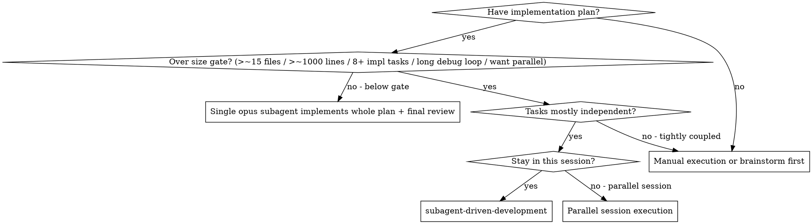
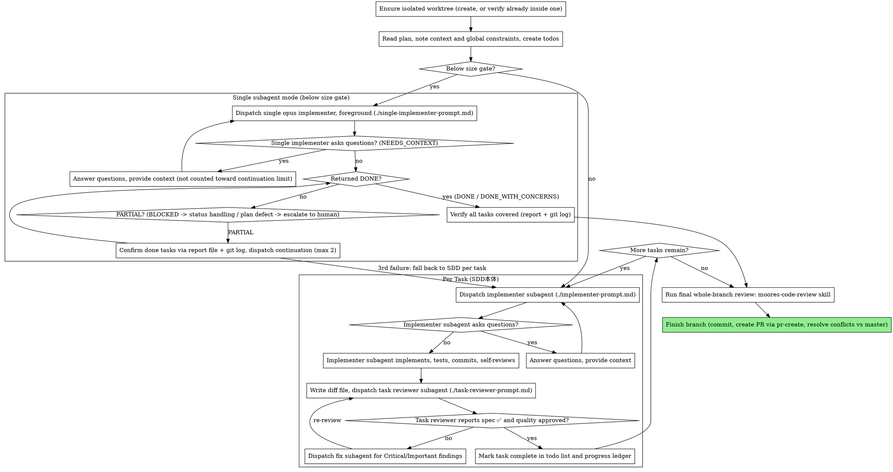

# Subagent-Driven Development

計画を実行する際、規模ゲート超ならタスクごとに新しいimplementer subagentを派遣し、各タスク後にタスクレビュー（spec準拠＋コード品質）を行い、最後に広範なブランチ全体レビューを行う。

**なぜsubagentを使うのか:** 隔離されたコンテキストを持つ専門エージェントにタスクを委譲する。指示とコンテキストを精密に組み立てることで、彼らが集中してタスクを成功させることを保証する。彼らは自分のセッションのコンテキストや履歴を継承すべきではなく、必要なものだけを正確に構築して渡す。これにより自分自身のコンテキストも調整作業のために温存される。

**核となる原則:** 本体は実装を書かない（閾値未満はopus単一subagent、閾値超はタスクごとの新規subagent + タスクレビュー） + 広範な最終レビュー = 高品質・高速なイテレーション

**ナレーション:** ツール呼び出しの間は最大1行だけ短く実況する。台帳とツール結果が記録を担う。

**継続実行:** タスクの合間に人間パートナーへ確認を取るために止まらない。計画の全タスクを止まらずに実行する。止まってよい理由は、解決できないBLOCKED状態、真に進行を妨げる曖昧さ、または全タスク完了のみ。「続けてよいですか？」という確認や進捗サマリーは相手の時間の無駄になる — 彼らは計画の実行を依頼したのだから、実行せよ。

## 規模ゲート: 閾値未満は単一subagent実装モード（2026-09-08 ADR 0053）

計画があっても、**規模が閾値未満ならタスクごとの派遣＋タスクレビューゲート（以下「SDD本体」）を使わず、opus固定のimplementer subagent 1体に計画全体を実装させる「単一subagent実装モード」が既定**である。本体セッションは実装コードを書かない — 担うのはワークスペース隔離・事前計画レビュー・派遣・最終レビュー・PR作成のみ。SDD本体の実装subagent自体は安いが、派遣往復によるコントローラーの肥大とタスクごとのレビューゲートが固定費として乗る（実測: 1計画あたり$40〜90相当 + 本体ループ肥大。実装subagentは大型セッション総額の6〜25%に過ぎなかった）。かつて閾値未満は本体が直接書くインライン実装だったが、本体コンテキストを実装で消費し最終レビュー対応の余力を削るため廃止した（`.decisions/2026-09-08-SDD閾値未満は本体インラインでなく単一opus-subagentで実装する.md`）。

**単一subagent実装モードの条件（すべて満たすなら単一subagent。AND）:**

1. **予想変更が約15ファイル以下**、かつ
2. **予想変更が全体で約1,000行以下**、かつ
3. **計画の独立タスクが7個以下**、かつ
4. 実装と並行した**長いデバッグ・実機e2e往復が見込まれない**（調査churnがコンテキストを食う）、かつ
5. **並列実行したい独立タスク群が無い**

**この5つを全部満たすなら単一subagent実装モードで実装する。** 1つでも外れた場合（約15ファイル超／約1,000行超／独立タスク8個以上／長いデバッグ往復あり／並列実行したい）だけSDD本体を発動する。単一subagentモードでも最終レビュー1本（moores-code-review）は省略しない。worktree隔離はどちらのモードでも必須である（下記「ワークスペース隔離」）。

**タスク数の数え方:** 数えるのは**実装タスク**である。実サービス・実機での動作確認タスク、最終レビュータスク、コミット/PR作成タスクのような、コードを書かない末尾の定型タスクは数に含めない。計画のタスク見出しを機械的に数えて発動判定をしないこと（2026-08-20: 実装4タスク・4ファイルの計画を「タスク6個」と数えてSDD本体を発動した実例がある）。

**閾値の根拠（両Mac 130+セッションのtranscript実測、2026-08-18）:** 単一コンテキストでの実装は編集約20ファイル・読み書き合計約45ファイルまでcompaction発生ゼロで完走している（25〜32ファイルも読み込みが少なければ可）。編集25〜30ファイル超または長いデバッグ往復を伴うと高頻度でcompactionし、文脈喪失は「完了済みタスクの再派遣」級の最も高くつく失敗につながる。15ファイルはこの実測限界に対する安全マージンである。単一subagentは履歴を継承しない新規コンテキストだが、新モードの実測が無いため同じ閾値を流用する。実測が溜まったら再裁定する。

**判定は必ず声に出す。** 最初のsubagent派遣より前に、数えた実装タスク数・予想ファイル数・判定結果を1行でユーザーへ出す（例:「実装4タスク・4ファイル → 単一subagent」）。黙って派遣を始めると、誤判定はsubagentが1本走り終えるまで是正されない（2026-08-20の実例）。

**ユーザーがスキル名を明示して起動した場合もゲートは評価する。** 閾値未満なら「この規模なら単一subagentモードが既定です」と1行述べてから**単一subagent実装モードで進める**。タスクごと派遣（SDD本体）へ移るのは、人間が「タスクごとに派遣して」等と明示的に求めた場合だけである。名指し起動はゲートの免除ではない（開始プロンプトは常にスキル名を名指しするため、名指しを「SDD本体で回せ」と読むとゲートが常に無効化される）。

**単一subagent実装モードの手順:**

1. ワークスペース隔離（下記、必須。単一subagentもコミットを行うimplementerである）
2. 事前計画レビュー（下記）
3. 判定を1行で声に出す
4. **隔離worktree側をcwdにして** `scripts/sdd-workspace` を実行し、作業ディレクトリを確保して報告ファイルパスを `<workspace>/single-report.md` に決める（このスクリプトは `git rev-parse --show-toplevel` でcwd基準にツリーを解決する。本体ワーキングツリーで実行すると報告ファイルがworktree外を指し、契約の「作業ディレクトリの外で編集しない」と正面衝突する）。**同名の `single-report.md` が既に在れば派遣前に削除する** — worktree再利用（隔離の例外1）で前計画の `Task N: done` 行が残ると、復旧の一次ソースが汚染される。派遣直前の `git rev-parse --short HEAD` を BASE として控える
5. 進捗台帳（下記）へ派遣行を書く: `Single-subagent: dispatched base <sha7> report <path>`
6. [single-implementer-prompt.md](single-implementer-prompt.md) で `model: opus` を明示し、**フォアグラウンド**で派遣する（バックグラウンド派遣は孤児化して止まる事故があった）
7. 返ってきたステータスに対応する（下記「Implementerのステータス対応」の「単一subagent実装モードの場合」）
8. DONE なら、報告ファイルの `Task N: done` 行が `[TASK_RANGE]` の全番号を覆い、`git log <base>..HEAD --oneline` の `Task N:` コミットと一致することを確認してから台帳へ完了行 `Single-subagent: complete (commits <base7>..<head7>)` を書き、最終ブランチ全体レビュー（moores-code-review）→ PR作成へ進む。欠けていれば継続再派遣する。タスクレビュアーは派遣しない

**計画のチェックボックス（`- [ ]`）は単一subagentモードでは誰も更新しない。** 進捗の正は報告ファイルの `Task N: done` 行と台帳の `Single-subagent:` 行であり、復旧もこの2つだけを読む。チェックボックスの未更新を未完了の根拠にしないこと。

**継続再派遣（途中失敗時）:** 継続再派遣の対象は**途中終了（ステータス `PARTIAL` — コンテキスト枯渇・一部タスクのみ完了）だけ**であり、**上限は2回**である。`NEEDS_CONTEXT` は完了タスク数に関わらず不足コンテキストを回答して再派遣し、**この2回には数えない**。`BLOCKED` は下記「Implementerのステータス対応」の1〜4に従い、原因が計画自体の誤り（4）なら**継続回数に関わらず即座に人間へエスカレーションする**（継続2回やSDD本体への切替を先に消化しない）。

継続の手順: 報告ファイルの `Task N: done <sha7>` 行と `git log <base>..HEAD --oneline` で完了タスクを確定し、残りタスクだけを `[TASK_RANGE]` に列挙した継続subagentを同じテンプレで派遣する（報告ファイルは同じものへ**追記**させる）。台帳に `Single-subagent: continuation #k from Task N base <sha7>` を追記する。**`k` は1始まりで、この台帳行の本数がそのまま継続回数である** — `NEEDS_CONTEXT` への回答再派遣と DONE_WITH_CONCERNS の fix 派遣はこの行を書かない（＝数えない）。したがって compaction 後は `continuation #` 行を数えるだけで残り回数が確定する。

2回の継続でも終わらなければ規模誤判定とみなし、残りタスクをSDD本体（タスクごと派遣＋タスクレビュー）へ切り替える。台帳には切替行を逐語で1行書く: `Single-subagent: switched to SDD per-task at Task N (continuations 2)`。この行があれば復旧時に「単一モードは終了しており、以降はSDD本体の `Task N: complete` 行を読む」と機械的に判定できる。

## 使用場面


```dot
digraph when_to_use {
    "Have implementation plan?" [shape=diamond];
    "Over size gate? (>~15 files / >~1000 lines / 8+ impl tasks / long debug loop / want parallel)" [shape=diamond];
    "Tasks mostly independent?" [shape=diamond];
    "subagent-driven-development" [shape=box];
    "Parallel session execution" [shape=box];
    "Manual execution or brainstorm first" [shape=box];
    "Single opus subagent implements whole plan + final review" [shape=box];
    "Stay in this session?" [shape=diamond];

    "Have implementation plan?" -> "Over size gate? (>~15 files / >~1000 lines / 8+ impl tasks / long debug loop / want parallel)" [label="yes"];
    "Have implementation plan?" -> "Manual execution or brainstorm first" [label="no"];
    "Over size gate? (>~15 files / >~1000 lines / 8+ impl tasks / long debug loop / want parallel)" -> "Tasks mostly independent?" [label="yes"];
    "Over size gate? (>~15 files / >~1000 lines / 8+ impl tasks / long debug loop / want parallel)" -> "Single opus subagent implements whole plan + final review" [label="no - below gate"];
    "Tasks mostly independent?" -> "Stay in this session?" [label="yes"];
    "Tasks mostly independent?" -> "Manual execution or brainstorm first" [label="no - tightly coupled"];
    "Stay in this session?" -> "subagent-driven-development" [label="yes"];
    "Stay in this session?" -> "Parallel session execution" [label="no - parallel session"];
}
```

## ワークスペース隔離（最初のsubagent派遣前・必須）

**専用worktreeの外でimplementer subagentを派遣してはならない。** 本体ワーキングツリーは他セッション・並行エージェントと共有されており、subagentのコミットが無関係な作業を巻き込む事故が実際に起きている。隔離は「あれば良いもの」ではなく最初の派遣（SDD本体ならタスク1、単一subagentモードならその1体）の前提条件である。

例外は2つだけ:

1. **既にworktree内にいる** — 新規作成せずそのまま再利用する
2. **人間がこのセッション内で自分の言葉で「本体ワーキングツリーで作業してよい」と指示した** — 進捗台帳に記録して続行する。ここでの「本体」は**ディレクトリ（本体ワーキングツリー）**のことだけを指す。**この例外は隔離の免除であって、実装の担い手の変更ではない** — 本体セッションが自分で実装コードを書いてよいという意味ではないし（規模ゲート未満は単一subagent実装モードが唯一の行き先。危険信号を参照）、SDD本体（タスクごと派遣）への切替でもない。本体セッションが実装コードを書くのは、人間が「本体セッションが自分で書け」と別途明示した場合に限られ、その場合は**自分のコンテキスト残量が3割を切った時点で作業を止め、残りを単一subagent実装モードへ引き渡し、切替点を台帳に記録する**（実装で本体コンテキストを使い切ると、最終レビュー所見への対応余力が消える）。

本体ワーキングツリーで既にfeatureブランチを切って作業中だった場合も例外にはならない。このタスクが所有すると確認できた未コミット変更だけをworktreeへ移してから着手する。所有者を判定できない変更が1件でもあれば移送せず、人間へエスカレーションする。

```bash
# 0. 現在地を判定する（2つの値が異なればworktree内 = 作成不要）
# 0. Detect the current location; differing values mean we are already in a worktree
git rev-parse --git-dir; git rev-parse --git-common-dir

# 1. 本体checkoutに触れずorigin/masterを最新化する
# 1. Refresh origin/master without touching the main checkout
git fetch origin master

# 1.5. dirtyなら所有者をパス単位で確認し、このタスク所有の変更だけを退避する
# 1.5. If dirty, verify ownership per path and stash only this task's changes
git status --short
TASK_OWNED_PATHS=(<validated-path> ...)
if test ${#TASK_OWNED_PATHS[@]} -gt 0; then
  git stash push --include-untracked -m "sdd-worktree-move-<task-slug>" -- "${TASK_OWNED_PATHS[@]}"
  SDD_STASH_COMMIT=$(git rev-parse stash@{0})
fi

# 2. 計画名から取ったslugでタスクブランチ付きworktreeを作る
# 2. Create a task-branch worktree named after the plan slug
MAIN=$(git rev-parse --show-toplevel)
git worktree add -b <task-slug> ~/moorestech-worktrees/<task-slug> <base>

# 2.5. 退避した変更を隔離worktreeへ復元し、stashは復旧用に保持する
# 2.5. Restore task changes in the isolated worktree and retain the stash for recovery
if test -n "${SDD_STASH_COMMIT:-}"; then
  git -C ~/moorestech-worktrees/<task-slug> stash apply "$SDD_STASH_COMMIT"
  git -C ~/moorestech-worktrees/<task-slug> status --short
fi

# 3. メイン側Unityを閉じてからLibraryをAPFSクローンで複製する
# 3. Close Unity for the main worktree before cloning its Library via APFS copy-on-write
cp -Rc "$MAIN/moorestech_client/Library" ~/moorestech-worktrees/<task-slug>/moorestech_client/Library
```

- `<base>`は計画が積み上がる土台。通常は最新の`origin/master`、本体の未コミット変更を移す場合と計画が現ブランチの続きなら`HEAD`
- Libraryの複製は計画がUnityに触れるかに関わらず常に行う。数秒の投資で、後からコンパイル・テストが必要になった際の再インポート数十分を確実に回避する
- メイン側Unityが開いている間はLibraryを複製しない。実行中ならUnityを閉じてから手順3を実行する
- 本体がdirtyなら全変更の所有者をパス単位で確認する。このタスク所有と確認できたパスだけを明示して`git stash push --include-untracked -- <paths>`で退避し、所有者不明の変更があれば移送せず人間へエスカレーションする
- worktree側ではstashを`apply`し、復元結果を確認する。復旧手段を失わないようstashは自動dropしない
- 以降の編集・`uloop`各コマンド・テスト・コミットは**すべてworktree側の絶対パス**で行う。`--project-path`もworktree側を指す
- 有料アセット(`PersonalAssets`)は本体にしか存在しない。計画がこれに依存する場合は着手前に人間へエスカレーションする
- サーバーポート11564は固定のため、他worktreeのPlayModeとは同時実行できない。プレイ録画テストを含む計画では1本ずつ動かす
- worktreeは完了後も削除しない（作業消失防止。cleanupは人間の指示があった時のみ）

## プロセス


```dot
digraph process {
    rankdir=TB;

    subgraph cluster_per_task {
        label="Per Task (SDD本体)";
        "Dispatch implementer subagent (./implementer-prompt.md)" [shape=box];
        "Implementer subagent asks questions?" [shape=diamond];
        "Answer questions, provide context" [shape=box];
        "Implementer subagent implements, tests, commits, self-reviews" [shape=box];
        "Write diff file, dispatch task reviewer subagent (./task-reviewer-prompt.md)" [shape=box];
        "Task reviewer reports spec ✅ and quality approved?" [shape=diamond];
        "Dispatch fix subagent for Critical/Important findings" [shape=box];
        "Mark task complete in todo list and progress ledger" [shape=box];
    }

    subgraph cluster_single {
        label="Single subagent mode (below size gate)";
        "Dispatch single opus implementer, foreground (./single-implementer-prompt.md)" [shape=box];
        "Single implementer asks questions? (NEEDS_CONTEXT)" [shape=diamond];
        "Answer questions, provide context (not counted toward continuation limit)" [shape=box];
        "Returned DONE?" [shape=diamond];
        "Verify all tasks covered (report + git log)" [shape=box];
        "PARTIAL? (BLOCKED -> status handling / plan defect -> escalate to human)" [shape=diamond];
        "Confirm done tasks via report file + git log, dispatch continuation (max 2)" [shape=box];
    }

    "Ensure isolated worktree (create, or verify already inside one)" [shape=box];
    "Read plan, note context and global constraints, create todos" [shape=box];
    "Below size gate?" [shape=diamond];
    "More tasks remain?" [shape=diamond];
    "Run final whole-branch review: moores-code-review skill" [shape=box];
    "Finish branch (commit, create PR via pr-create, resolve conflicts vs master)" [shape=box style=filled fillcolor=lightgreen];

    "Ensure isolated worktree (create, or verify already inside one)" -> "Read plan, note context and global constraints, create todos";
    "Read plan, note context and global constraints, create todos" -> "Below size gate?";
    "Below size gate?" -> "Dispatch single opus implementer, foreground (./single-implementer-prompt.md)" [label="yes"];
    "Dispatch single opus implementer, foreground (./single-implementer-prompt.md)" -> "Single implementer asks questions? (NEEDS_CONTEXT)";
    "Single implementer asks questions? (NEEDS_CONTEXT)" -> "Answer questions, provide context (not counted toward continuation limit)" [label="yes"];
    "Answer questions, provide context (not counted toward continuation limit)" -> "Dispatch single opus implementer, foreground (./single-implementer-prompt.md)";
    "Single implementer asks questions? (NEEDS_CONTEXT)" -> "Returned DONE?" [label="no"];
    "Returned DONE?" -> "Verify all tasks covered (report + git log)" [label="yes (DONE / DONE_WITH_CONCERNS)"];
    "Verify all tasks covered (report + git log)" -> "Run final whole-branch review: moores-code-review skill";
    "Returned DONE?" -> "PARTIAL? (BLOCKED -> status handling / plan defect -> escalate to human)" [label="no"];
    "PARTIAL? (BLOCKED -> status handling / plan defect -> escalate to human)" -> "Confirm done tasks via report file + git log, dispatch continuation (max 2)" [label="PARTIAL"];
    "Confirm done tasks via report file + git log, dispatch continuation (max 2)" -> "Returned DONE?";
    "Confirm done tasks via report file + git log, dispatch continuation (max 2)" -> "Dispatch implementer subagent (./implementer-prompt.md)" [label="3rd failure: fall back to SDD per task"];
    "Below size gate?" -> "Dispatch implementer subagent (./implementer-prompt.md)" [label="no"];
    "Dispatch implementer subagent (./implementer-prompt.md)" -> "Implementer subagent asks questions?";
    "Implementer subagent asks questions?" -> "Answer questions, provide context" [label="yes"];
    "Answer questions, provide context" -> "Dispatch implementer subagent (./implementer-prompt.md)";
    "Implementer subagent asks questions?" -> "Implementer subagent implements, tests, commits, self-reviews" [label="no"];
    "Implementer subagent implements, tests, commits, self-reviews" -> "Write diff file, dispatch task reviewer subagent (./task-reviewer-prompt.md)";
    "Write diff file, dispatch task reviewer subagent (./task-reviewer-prompt.md)" -> "Task reviewer reports spec ✅ and quality approved?";
    "Task reviewer reports spec ✅ and quality approved?" -> "Dispatch fix subagent for Critical/Important findings" [label="no"];
    "Dispatch fix subagent for Critical/Important findings" -> "Write diff file, dispatch task reviewer subagent (./task-reviewer-prompt.md)" [label="re-review"];
    "Task reviewer reports spec ✅ and quality approved?" -> "Mark task complete in todo list and progress ledger" [label="yes"];
    "Mark task complete in todo list and progress ledger" -> "More tasks remain?";
    "More tasks remain?" -> "Dispatch implementer subagent (./implementer-prompt.md)" [label="yes"];
    "More tasks remain?" -> "Run final whole-branch review: moores-code-review skill" [label="no"];
    "Run final whole-branch review: moores-code-review skill" -> "Finish branch (commit, create PR via pr-create, resolve conflicts vs master)";
}
```

## 最終ブランチ全体レビューは必須の自動ゲートである

最終moores-code-reviewパスは、最後のタスクが完了した瞬間、**自動的・無条件・確認なし**に実行される。これはこのプロセスの一部であり、ゴール記述の一部ではない:

- 「playtestまで実行」「テストが通るまで」といった形で表現されたゴールは、レビューを免除**しない**。ゴールの文言は機能実装の範囲を定めるものであり、このゲートを制限するものでは決してない。「ゴール境界に到達したから、レビューは次のステップだ」という推論は明示的に禁止されている — まさにこの推論によって、計画で義務付けられたハードコード（`BlockReplaceFamilyUtil`、replace-family
  BlockType列挙）がレビューされずに出荷され、人間によって捕捉された（`3ad0cd5c0`で修正）。
- 「moores-code-review 1パス推奨です・必要なら実行します」という言葉でセッションを終えてはならない。レビューを実行する代わりに推奨することは、それをスキップしたことになる。
- スキップできる唯一の方法は、人間がこのセッション内で自分の言葉で明示的にスキップを指示した場合のみ。その指示を進捗台帳に記録すること。
- 計画を書く・レビューする際は、タスクリストの末尾に明示的な最終タスクがあることを確認する: 「必ず最後にmoores-code-reviewスキルで全ブランチ
  レビューを実行する」。計画にこれが無い場合は自分のtodoリストに追加すること — タスク行の欠落はゲートを免除しない。

## セッション終了可能化（PR作成）も必須の自動ゲートである

最終レビュー完了後、**pr-createスキルでPRを作成し、セッションをそのまま閉じられる状態にする**ところまでがこのプロセスの一部である。「全タスク完了」はPR未作成なら完了ではない:

- 全作業をコミット・pushし、pr-createスキルでPRを作成する（既存PRがあればpushで更新する）。
- masterとのコンフリクトがある場合は、masterをブランチへマージして解消し、コンパイル（.cs変更時）を確認してからpushする。解消の実作業は**opus subagent**へ委譲する（pr-createスキルのステップ5がこの委譲を含む）。解消内容が設計判断を伴う場合のみユーザーに諮る。
- 「実装は完了しました。PRが必要なら作成します」という言葉でセッションを終えてはならない — それはPR作成をスキップしたことになる。
- スキップできる唯一の方法は、人間がこのセッション内で明示的に「PRは不要」と指示した場合のみ。その指示を進捗台帳に記録すること。計画にこのタスク行が無くてもゲートは免除されない。

## 事前計画レビュー

最初のsubagent（SDD本体ならタスク1のimplementer、単一subagentモードならその1体）を派遣する前に、計画を一度スキャンして矛盾を確認する:

- タスク同士、あるいはタスクと計画のGlobal Constraintsとが矛盾している箇所
- 計画が明示的に義務付けているが、レビューの基準では欠陥とみなされるもの（何も検証しないテスト、ロジックブロックの逐語的な重複）
- **moorestech設計レンズ:** 計画を`.claude/skills/moores-code-review/references/lens-digest.md`と照合する。計画がレンズ違反を義務付けている場合（例:「新しいイベントパケットの代わりに既存レスポンスから状態を導出する」「JSON更新を避けるためスキーマフィールドをoptionalにする」「isActive述語を基底コンポーネントに注入する」）は設計段階の欠陥であり、ここで捕捉する方が最終レビューで捕捉するより10倍安く済む。
  計画がspec-architecture-reviewを飛ばしている場合（配置と前例のセクションが無い場合）は、`.claude/skills/writing-plans/references/moorestech-layer-map.md`を使って今そのスキャンを実行する。

見つけたものはすべて一括した質問として人間パートナーに提示する — それを義務付ける計画テキストの隣に各所見を並べ、どちらを優先すべきか尋ねる — 実行開始前に行い、計画実行中の発見ごとに1つずつ割り込むのではない。スキャンが問題なければ、コメントなしで進める。実装からのみ明らかになる矛盾については、レビューループが引き続き網の役割を果たす。

## モデル選定

**例外（先に適用）: 単一subagent実装モードのimplementerは `opus` 固定。** 以下のティア規則はSDD本体のタスク単位派遣にのみ適用する。単一subagentは計画全体の統合判断を1体で担うため「機械的タスクは安価モデル」の前提が成り立たず、ユーザー裁定（2026-09-08「トークンコストがそこまで大きくならないのと精度優先」）でopusに固定した。

**最終レビュー所見を直すfix subagentのモデルは moores-code-review 側が決める。** 単一subagentモードから呼ばれた場合に `opus` 固定・本体の最小Editを禁止する規則は `moores-code-review/SKILL.md` の Step 7 にあり、ここでは二重定義しない（規則が2箇所にあると片方だけ改訂されて食い違う）。

コストを抑え速度を高めるため、各役割をこなせる最も非力なモデルを使うこと。

**機械的な実装タスク**（孤立した関数、明確なspec、1〜2ファイル）: 高速で安価なモデルを使う。計画がよく記述されていれば、ほとんどの実装タスクは機械的である。

**統合・判断タスク**（複数ファイルにまたがる調整、パターンマッチング、デバッグ）: 標準モデルを使う。

**アーキテクチャ・設計タスク:** 利用可能な最も高性能なモデルを使う。
最終ブランチ全体レビューはこれに該当する — セッションのデフォルトではなく、利用可能な最も高性能なモデルで派遣すること。

**レビュータスク:** diffの規模・複雑さ・リスクに応じて、同じ判断基準でモデルを選ぶ。小さく機械的なdiffには最も高性能なモデルは不要だが、微妙な並行処理の変更には必要。

**subagentを派遣する際は常にモデルを明示的に指定すること。** モデル未指定はセッションのモデル（多くの場合最も高性能かつ高価）を暗黙に継承し、この節を無言のうちに無効化する。

**ターン数はトークン単価に勝る。** 経過時間とコンテキストコストは、subagentが何ターン要するかに比例してスケールする。安価なモデルは多段階の作業で常習的に2〜3倍のターン数を要し、結果的により高くつくことがある。レビュアーおよびプロース記述から作業するimplementerには、中位モデルを下限として使うこと。タスクの計画テキストに書くべきコードそのものが含まれている場合、実装は転記＋テストに過ぎないため、そのimplementerには最安ティアを使う。単一ファイルの機械的な修正も最安ティアでよい。

**タスク複雑度のシグナル（実装タスク）:**
- 完全なspecがあり1〜2ファイルに触れる → 安価なモデル
- 統合上の懸念がある複数ファイルに触れる → 標準モデル
- 設計判断や広範なコードベース理解を要する → 最も高性能なモデル

## Implementerのステータス対応

Implementer subagentは5つのステータスのいずれかを報告する。それぞれ適切に対応すること（`PARTIAL` は単一subagent実装モード専用で、SDD本体のタスク単位派遣では使わない）:

**DONE:** レビューパッケージを生成し（このスキルのディレクトリから`scripts/review-package BASE HEAD` — 書き出した一意のファイルパスを表示する。BASEはimplementerを派遣する前に記録したコミットであり、決して`HEAD~1`ではない — これは複数コミットタスクの最後以外を無言で切り捨ててしまう）、表示されたパスでタスクレビュアーを派遣する。

**DONE_WITH_CONCERNS:** implementerは作業を完了したが懸念を報告した。進める前に懸念を読むこと。懸念が正しさやスコープに関するものであれば、レビュー前に対処する。単なる所見（例:「このファイルが大きくなりつつある」）であればメモしてレビューに進む。

**PARTIAL（単一subagent実装モードのみ）:** implementerが計画の一部まで完了し、残りタスクがあるがブロッカーは無い（コンテキスト枯渇等）。「継続再派遣（途中失敗時）」（規模ゲート節）に従って残りタスクだけを継続再派遣する。**継続上限2回に数えるのはこのステータスだけ**である。

**NEEDS_CONTEXT:** implementerが提供されていない情報を必要としている。不足しているコンテキストを提供して再派遣する。上限は無い（単一subagentモードでも継続上限2回には数えない）。

**BLOCKED:** implementerがタスクを完了できない。ブロッカーを評価する:
1. コンテキストの問題であれば、より多くのコンテキストを提供し同じモデルで再派遣する
2. タスクがより多くの推論を要する場合、より高性能なモデルで再派遣する
3. タスクが大きすぎる場合、より小さな単位に分割する
4. 計画自体が誤っている場合、人間にエスカレーションする

**エスカレーションを無視したり、変更なく同じモデルにリトライを強制したりすることは決してしないこと。** implementerが行き詰まったと言ったなら、何かを変える必要がある。

**単一subagent実装モードの場合:** DONE ならタスクレビュアーを派遣せず、台帳へ完了行を書いて最終ブランチ全体レビューへ直行する。DONE_WITH_CONCERNS も懸念対応の前に同じ網羅突合（報告ファイルの `Task N: done` 行が `[TASK_RANGE]` を全て覆っているか）を行う。未完了タスクがあれば継続再派遣する（懸念対応はその後）。網羅していれば懸念を読み、正しさ・スコープに関するものなら最終レビュー所見と同じ経路（単一fix subagent・opus）で直してから最終レビューへ（継続派遣ではないので上限2回には数えない）。単なる所見ならメモして最終レビューへ。

このモードにはタスクレビュー報告ファイルが存在しないため、**DONE_WITH_CONCERNS の fix 派遣に渡す入力は「報告ファイル（`<workspace>/single-report.md`）の絶対パス」＋「そのうち懸念セクションを読め」の1行＋`implementer-contract.md` の絶対パス**とする（既存規約と同じく懸念本文をコントローラーが転記しない。懸念は implementer が報告ファイルへ書き切っており、そこが正本である）。fix subagentは同じ報告ファイルへ fix 報告（テスト結果込み）を追記する。

PARTIAL は「継続再派遣（途中失敗時）」（規模ゲート節）に従う — 完了タスクは報告ファイルと `git log` で確定し、同じ subagent に再試行を強制しない。継続は最大2回で、3回目が必要なら残りをSDD本体へ切り替える。BLOCKED は上記1〜4に従い、原因が計画欠陥なら継続回数に関わらず人間へエスカレーションする。NEEDS_CONTEXT は回答して再派遣し、上限に数えない。

## レビュアーの⚠️項目への対応

タスクレビュアーは「⚠️ diffからは検証不能」という項目を報告することがある — 未変更のコードに存在する、またはタスクをまたぐ要件。これらは残りのレビューをブロックしないが、タスク完了とマークする前に自分自身で各項目を解決しなければならない: 計画とタスク横断のコンテキストを持つのはあなたであり、レビュアーはそれを持たない。項目が実際のギャップだと確認したら、失敗したspecレビューとして扱う — implementerに差し戻し再レビューする。

## レビュアープロンプトの組み立て

タスクごとのレビューはタスク単位のゲートである。広範なレビューは1回、最終ブランチ全体レビューでのみ行われる。レビュアーテンプレートを埋める際:

- 「すべての用途を確認せよ」「役立つならrace testを実行せよ」といった、具体的でタスク固有の理由のない自由裁量の指示を追加しないこと
- implementerがすでに同じコードに対して実行したテストを、レビュアーに再実行させないこと — implementerの報告がテスト証拠を担う
- レビュアーに対して所見を先取りして判断しないこと — 特定の問題を無視するよう、あるいはフラグを立てないよう指示することは決してしない。ある所見が偽陽性だと思うなら、レビュアーに提起させ、レビューループの中で裁定する。書いているプロンプトに「フラグを立てるな」「Xを欠陥として扱うな」「最大でもMinor」「計画が選んだ」といった文言が含まれているなら止まること — それは先取り判断であり、通常は自分がレビューループを避けたいだけである。
- レビュアーに渡すglobal-constraintsブロックは彼らの注意のレンズである。計画のGlobal Constraintsセクションまたはspecから、拘束力ある要件を逐語的にコピーすること: 正確な値、正確なフォーマット、コンポーネント間で述べられている関係性（「Xと同じレイアウト」「Yと一致」）。レビュアーのテンプレートにはすでにプロセスのルール（YAGNI、テスト衛生、レビュー手法）が含まれている — constraintsブロックはこのプロジェクトのspecが要求する内容のためのものである。
- レビュアーにはdiffをファイルとして渡すこと: このスキルの`scripts/review-package BASE HEAD`を実行し、表示されたファイルパスをレビュアーに渡す（bashが無い場合は`git log --oneline`、`git diff --stat`、範囲に対する`git diff -U10`を、一意な名前の1ファイルにリダイレクトする）。出力は自分自身のコンテキストには一切入らず、レビュアーはコミット一覧・stat要約・コンテキスト付き全diffを1回のRead呼び出しで見られる。implementerを派遣する前に記録したBASEを使うこと — 決して`HEAD~1`ではない。これは複数コミットタスクを無言で切り詰める。
- 派遣プロンプトは1つのタスクを記述するものであり、セッションの履歴ではない。蓄積された前タスクの要約（「タスク1〜3後の状態」）を後続の派遣に貼り付けないこと — 実セッションのある派遣は42k文字に達し、その99%が貼り付けられた履歴だった。新規subagentが必要とするのは自分のタスク、触れるインターフェース、global constraintsだけである。それ以外は不要。
- Critical・Important所見にはfix subagentを派遣すること。fix派遣にはレビュー報告ファイルのパスを渡し、所見の転記はしない。Minor所見は進捗台帳に記録し、最終ブランチ全体レビューにそのリストを参照させ、マージ前に修正すべきものを判定させる。誰も読まないロールアップは無言の握りつぶしである。
- plan-mandatedとラベル付けされた所見 — あるいは計画のテキストが要求する内容と矛盾する所見 — は、あらゆる計画との矛盾と同様に人間の判断事項である: 所見と計画テキストを提示し、どちらを優先するか尋ねる。計画が義務付けているという理由で所見を却下したり、計画と矛盾する修正を確認なしに派遣したりしないこと。
- 最終ブランチ全体レビューは**moores-code-reviewスキル**である（単一のレビュアーsubagentではなくSkillツール経由で呼び出す）。これは必須の自動ゲートである — 上記「最終ブランチ全体レビューは必須の自動ゲートである」を参照。決定論チェックとmoorestech設計レンズを並列実行し、所見を統合する。まずブランチdiffを`scripts/review-package MERGE_BASE HEAD`で生成し（MERGE_BASE = ブランチが分岐したコミット、例: `git merge-base main HEAD`）、表示されたファイルをスキルのPATCH_PATHとして使う。Minor所見台帳をレンズエージェント群の4カテゴリコンテキストに投入し、トリアージさせること。
- fix派遣プロンプトには`implementer-contract.md`の**絶対パス**も含める（fixはimplementer契約を担うが、fix subagentは契約ファイルの場所を自力では知らない）。
- すべてのfix派遣はimplementer契約を担う: fix subagentは自分の変更をカバーするテストを再実行し結果を報告する。派遣時にカバーするテストファイル名を挙げること — 1行の修正にスイート全体は不要。レビュアーを再派遣する前に、fix報告にカバーするテスト・実行したコマンド・出力が含まれていることを確認し、この3つが揃ってから再レビューを派遣する。
- 最終ブランチ全体レビューで所見が返ってきた場合、所見1件につき1体ではなく、完全な所見リストを持った**単一の**fix subagentを派遣すること。所見ごとのfixerはそれぞれコンテキストを再構築しスイートを再実行するため、実セッションのある最終レビューのfix waveは全タスク合計より高コストになった。

## ファイルハンドオフ

派遣プロンプトに貼り付けたものすべて — そしてsubagentが返すものすべて — はセッション残り期間コンテキストに常駐し、以降の全ターンで再読込される。成果物はファイルとして受け渡すこと:

- **タスクブリーフ:** implementerを派遣する前に、このスキルの`scripts/task-brief PLAN_FILE N`を実行する — タスクの全文を一意な名前のファイルに抽出し、パスを表示する。ブリーフを唯一の要件ソースとして保つよう派遣を組み立てる。派遣内容には次を含めること: (1) このタスクがプロジェクトのどこに位置するかの1行、(2) ブリーフのパス（「まずこれを読め — あなたの要件であり、値はそのまま使うこと」として紹介）、(3) ブリーフが知り得ない、前タスクからのインターフェースと決定事項、(4) ブリーフで気づいた曖昧さに対する自分の解消、(5) 報告ファイルのパスと報告契約。正確な値（数値、マジックストリング、シグネチャ、テストケース）はブリーフにのみ現れる。
- **報告ファイル:** implementerの報告ファイルはブリーフに合わせた名前にし（ブリーフ`…/task-N-brief.md` → 報告`…/task-N-report.md`）、派遣プロンプトに記載する。implementerは完全な報告をそこに書き、返答ではステータス・コミット・1行のテスト要約・懸念のみを返す。
- **レビュアーの入力:** タスクレビュアーには4つのパス — 同じブリーフファイル、報告ファイル、レビューパッケージ、レビュー報告ファイル（書き先） — に加え、タスクを拘束するglobal constraintsを渡す。
- **レビュー報告ファイル:** レビュアーは所見全文を`…/task-N-review.md`に書き、返答は判定サマリーのみ（Spec判定・⚠️項目全文・quality判定・Critical/Important各1行・Minor件数・ファイルパス）。fix subagentにはこのファイルのパスを渡す — コントローラーが所見を転記しない。
- fix派遣は同じ報告ファイルにfix報告（テスト結果込み）を追記し、短い要約を返す。再レビューは更新されたファイルを読む。
- **契約ファイル:** implementer/レビュアーの定型指示は`implementer-contract.md`・`task-reviewer-contract.md`にあり、subagentが自分で読む。派遣プロンプトには契約ファイルの絶対パスとタスク固有情報だけを書く — 定型文を派遣プロンプトへ展開しない（派遣プロンプトはコントローラーのコンテキストに残り続ける）。
- **単一subagent実装モード:** `scripts/task-brief` は使わず、計画ファイル全体の絶対パスをブリーフとして直渡しする（`[PLAN_FILE_ABS]`）。実装範囲は `[TASK_RANGE]` で列挙する（末尾の最終レビュー・PR作成タスクは含めない）。**計画ファイル全体を渡すため、派遣プロンプトには `single-implementer-prompt.md` のヘッダ無効化文言（冒頭の `> **For agentic workers:**` ブロックと末尾の最終レビュー・PR作成タスクはコントローラー向けであり、subagentはSDDスキルを起動せず・subagentを派遣せず・PRも作成しない）を必ず含める** — これが無いと subagent が平文の命令形ヘッダを自分への指示と読み、入れ子のSDD起動やPR作成という取り消せない副作用が起きる。報告ファイルは `<workspace>/single-report.md` 固定で、派遣前にコントローラーが既存ファイルを削除し、subagentがタスク完了ごとに `Task N: done <sha7> — <1行要約>` を追記する。継続派遣は同じ報告ファイルへ**追記**させる（Writeで置き換えさせない。1体目の done 行が消えると完了範囲の確定が壊れる）。

## 永続的な進捗管理

会話メモリはcompactionを跨いで残らない。実セッションでは、自分の位置を見失ったコントローラーが完了済みのタスク列全体を再派遣してしまうことがあった — 観測された中で最も高くつく失敗だった。進捗はtodoだけでなく台帳ファイルで追跡すること。

- スキル開始時、台帳を確認する:
  `cat "$(git rev-parse --show-toplevel)/.superpowers/sdd/progress.md"`。そこに完了と記載されているタスクはDONEである — 再派遣せず、完了マークの無い最初のタスクから再開する。
- タスクのレビューがクリーンで返ってきたら、他の記帳と同じメッセージで台帳に1行追記する:
  `Task N: complete (commits <base7>..<head7>, review clean)`。
- 台帳は復旧マップである: そこに記載されたコミットは、自分のコンテキストがそれらを作成したことを覚えていなくてもgitに存在する。compaction後は自分の記憶よりも台帳と`git log`を信頼すること。
- `git clean -fdx`は台帳を破壊する（git-ignoreされたスクラッチのため）。発生した場合は`git log`から復旧すること。
- **単一subagent実装モードの記帳はコントローラーが2行だけ書く:** 派遣時 `Single-subagent: dispatched base <sha7> report <path>`、完了時 `Single-subagent: complete (commits <base7>..<head7>)`（継続派遣があれば `Single-subagent: continuation #k from Task N base <sha7>` を間に挟み、SDD本体へ切り替えたなら `Single-subagent: switched to SDD per-task at Task N (continuations 2)` を書く）。タスク別の完了は subagent が報告ファイルへ書く。compaction後の復旧順は **台帳 → 元subagentの生存確認（ListAgents） → 報告ファイル → `git log`**。台帳に `dispatched` があって `complete` が無ければ、subagentが走っているか途中終了している — **継続派遣の前に ListAgents 等で元subagentの生存を確認し、生きていれば結果を待つ**（compaction後も subagent は生存しており、死亡と決めつけて再派遣し同一worktreeを二重編集した実事故がある）。不在または報告済みなら、報告ファイルの `Task N: done` 行と `git log` で完了タスクを確定する。完了タスクが `[TASK_RANGE]` を全て覆っていれば再派遣せず、完了行を台帳に補記して最終ブランチ全体レビューへ進む。覆っていなければ継続再派遣する。

## プロンプトテンプレート

- [single-implementer-prompt.md](single-implementer-prompt.md) - 単一subagent実装モードの派遣（規模ゲート未満。`model: opus` 固定。定型は[implementer-contract.md](implementer-contract.md)をsubagentが読む）
- [implementer-prompt.md](implementer-prompt.md) - implementer subagentの派遣（タスク固有情報のみ。定型は[implementer-contract.md](implementer-contract.md)をsubagentが読む）
- [task-reviewer-prompt.md](task-reviewer-prompt.md) - タスクレビュアーsubagentの派遣（同上。定型は[task-reviewer-contract.md](task-reviewer-contract.md)）
- 最終ブランチ全体レビュー: moores-code-review スキル（Skillツール経由で呼び出す。プロンプトテンプレートは持たない）

## ワークフロー例

**単一subagent実装モード（規模ゲート未満）:**

```
You: 実装4タスク・5ファイル → 単一subagent。worktreeを作成し事前計画レビューを通しました。

[sdd-workspace で報告パスを確保、BASE=ab12cd3 を台帳に記帳]
[single-implementer-prompt.md で model: opus をフォアグラウンド派遣]

Implementer:
  - Task 1〜4 を順に実装、タスクごとにコミット（4コミット）
  - 報告ファイルに Task N: done <sha> を4行追記
  - 12/12 tests passing、自己レビュー: 問題なし
  - ステータス: DONE

[報告ファイルの Task 1〜4: done 行が git log と一致することを確認]
[台帳に complete 行を記帳]
[moores-code-review を Skill ツールで実行 → 所見2件 → 単一fix subagent(opus)へ]
[pr-create で PR 作成]
```

**SDD本体（閾値超）:**

```
You: この計画をSubagent-Driven Developmentで実行します。

[計画ファイルを一度だけ読む: docs/superpowers/plans/feature-plan.md]
[全タスクのtodoを作成]

Task 1: Hookインストールスクリプト

[Task 1のtask-briefを実行。ブリーフ+報告パス+コンテキストでimplementerを派遣]

Implementer: 「開始前に確認です — このhookはuserレベル・systemレベルのどちらに
インストールすべきですか？」

You: 「userレベル（~/.config/superpowers/hooks/）」

Implementer: 「了解しました。実装を開始します…」
[しばらくして] Implementer:
  - install-hookコマンドを実装
  - テストを追加、5/5 passing
  - 自己レビュー: --forceフラグの見落としに気づき追加
  - コミット済み

[review-packageを実行し、表示されたパスでタスクレビュアーを派遣]
Task reviewer: Spec ✅ - 要件はすべて満たされ、余分なものもなし。
  強み: 良いテストカバレッジ、クリーン。問題: なし。Task quality: Approved。

[Task 1を完了とマーク]

Task 2: リカバリーモード

[Task 2のtask-briefを実行。ブリーフ+報告パス+コンテキストでimplementerを派遣]

Implementer: [質問なし、そのまま進める]
Implementer:
  - verify/repairモードを追加
  - 8/8 tests passing
  - 自己レビュー: 問題なし
  - コミット済み

[review-packageを実行し、表示されたパスでタスクレビュアーを派遣]
Task reviewer: Spec ❌:
  - 欠落: 進捗報告（specは「100件ごとに報告」と指定）
  - 余分: --jsonフラグを追加（依頼されていない）
  Issues (Important): マジックナンバー（100）

[全所見でfix subagentを派遣]
Fixer: --jsonフラグを削除、進捗報告を追加、PROGRESS_INTERVAL定数を抽出

[タスクレビュアーが再度レビュー]
Task reviewer: Spec ✅。Task quality: Approved。

[Task 2を完了とマーク]

…

[全タスク完了後]
[最終code-reviewerを派遣]
Final reviewer: 全要件を満たし、マージ可能

完了！
```

## 利点

以下の利点・コストは**SDD本体（タスクごと派遣＋タスクレビュー）**の性質である。単一subagent実装モードは「タスクごとに新しいコンテキスト」「タスクレビュー」を持たない代わりに、派遣往復の固定費とレビューゲートのコストを負わない。

**vs. 手動実行:**
- Subagentは自然にTDDに従う
- タスクごとに新しいコンテキスト（混乱なし）
- 並列安全（subagent同士が干渉しない）
- Subagentは質問できる（作業前・作業中の両方）

**vs. Executing Plans:**
- 同一セッション（引き継ぎなし）
- 継続的な進行（待機なし）
- レビューチェックポイントが自動

**効率の向上:**
- コントローラーが必要なコンテキストを正確にキュレーションする。大量の成果物は貼り付けテキストではなくファイルとして移動する
- Subagentは完全な情報を最初から受け取る
- 質問は作業開始前に表面化する（後からではない）

**品質ゲート:**
- 自己レビューがハンドオフ前に問題を捕捉する
- タスクレビューはspec準拠とコード品質の2つの判定を担う
- レビューループが修正の実効性を保証する
- Spec準拠が過剰・過小構築を防ぐ
- コード品質が実装の良好な構築を保証する

**コスト:**
- Subagent呼び出しが増える（タスクごとにimplementer + reviewer）
- コントローラーの準備作業が増える（全タスクの事前抽出）
- レビューループがイテレーションを追加する
- しかし問題を早期に捕捉する（後でデバッグするより安価）

## 危険信号

**絶対にしないこと:**
- 明示的なユーザー同意なしにmain/masterブランチで実装を開始する
- 規模ゲート未満だからという理由で本体セッションが実装コードを書く — 閾値未満は単一subagent実装モードであり、本体が書く選択肢は無い（ADR 0053）
- 単一subagentを `model: opus` 以外・model未指定・バックグラウンドで派遣する（ただし**呼び出し元がモデルを固定している場合はそちらが優先する** — 実験用オーケストレータ等、派遣モデルを実験条件として指定するエージェント定義から起動された場合、その指定に従う）
- 計画ファイル全体を渡すときに、冒頭の `> **For agentic workers:**` ヘッダと末尾の最終レビュー・PR作成タスクの無効化文言を書かずに派遣する — subagentがSDDスキルを入れ子起動したり、PRを勝手に作成したりする
- 単一subagentが途中終了したとき、元subagentの生存確認（ListAgents）と報告ファイル・`git log` の確認を経ずに再派遣する（生存中なら同一worktreeの二重編集、終了済みなら完了タスクの二重実装になる）
- worktreeを作らずに（あるいは既にworktree内かを確認せずに）最初のimplementer（単一subagent含む）を派遣する — 「今回は小さい計画だから」は理由にならない
- 本体ワーキングツリーで既にfeatureブランチを切っているという理由で隔離を省略する — 共有されているのはブランチではなくディレクトリである
- SDD本体でタスクレビューをスキップする、または片方の判定（spec準拠とタスク品質の両方が必須）を欠く報告を受け入れる（単一subagentモードはタスクレビューを持たず最終レビュー1本が正）
- 未修正の問題を抱えたまま進める
- 複数の実装subagentを並列に派遣する（衝突する）
- SDD本体のタスク単位派遣でsubagentに計画ファイル全体を読ませる（代わりにタスクブリーフ — `scripts/task-brief` — を渡す。単一subagentモードは計画ファイル全体のパスを渡すのが正）
- 状況説明コンテキストを省略する（subagentはタスクがどこに位置するか理解する必要がある）
- subagentの質問を無視する（進める前に回答する）
- spec準拠について「まあ十分」を受け入れる（レビュアーがspec問題を見つけた = 未完了）
- レビューループをスキップする（レビュアーが問題を見つけた = implementerが修正 = 再レビュー）
- implementerの自己レビューを実際のレビュー（SDD本体ならタスクレビュー、単一subagentモードなら最終レビュー）の代替にする（両方が必要）
- レビュアーに何をフラグ立てしないか指示する、または派遣プロンプトで所見の深刻度を先取り評価する（「最大でもMinorとして扱え」）— 計画のサンプルコードは出発点であり、その弱点が意図的に選ばれた証拠ではない
- diffファイルなしでタスクレビュアーを派遣する — 先に生成すること
  （`scripts/review-package BASE HEAD`）、表示されたパスをプロンプトに記載する
- レビューにオープンなCritical/Important問題がある間に次のタスクへ進む
- 進捗台帳がすでに完了とマークしているタスクを再派遣する — compactionや再開の後は台帳（と`git log`）を確認する

**subagentが質問してきた場合:**
- 明確かつ完全に回答する
- 必要なら追加のコンテキストを提供する
- 実装を急かさない

**レビュアーが問題を見つけた場合:**
- Implementer（同じsubagent）が修正する
- レビュアーが再度レビューする
- 承認されるまで繰り返す
- 再レビューをスキップしない

**subagentがタスクに失敗した場合:**
- 具体的な指示を持つfix subagentを派遣する
- 手動で修正しようとしない（コンテキスト汚染）

## 統合

**必須のワークフロースキル:**
- **ワークスペース隔離** - 上記「ワークスペース隔離（最初のsubagent派遣前・必須）」がこのスキル内で手順を持つ。外部スキルへは委譲しない
- **writing-plans** - このスキルが実行する計画を作成する
- **moores-code-review** - 最終ブランチ全体レビューの実体（Skillツール経由）

**代替ワークフロー:**
- **並列セッション実行** - 同一セッション実行の代わりに、タスクごとに別セッションを立てて進める
