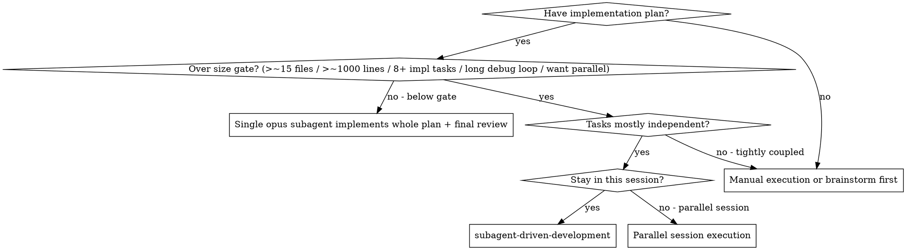
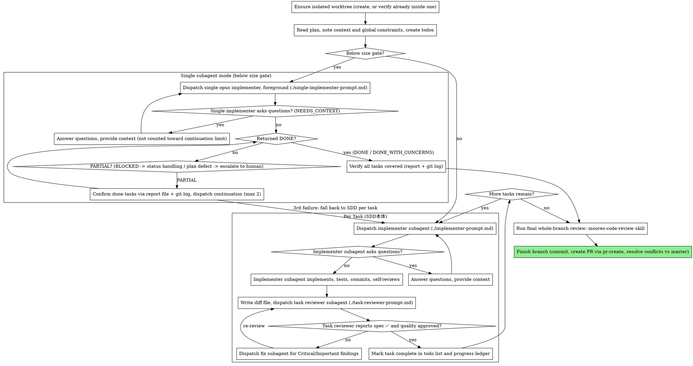

# 背景・根拠・図解

SKILL.md から切り出した、判断の根拠と俯瞰図。ルールの正本は SKILL.md と各 references。

## なぜsubagentを使うのか

隔離されたコンテキストを持つ専門エージェントにタスクを委譲する。指示とコンテキストを精密に組み立てることで、彼らが集中してタスクを成功させることを保証する。彼らは自分のセッションのコンテキストや履歴を継承すべきではなく、必要なものだけを正確に構築して渡す。これにより自分自身のコンテキストも調整作業のために温存される。

## 規模ゲートの根拠

**なぜ閾値未満を単一subagentにするか（ADR 0053, 2026-09-08）:** SDD本体の実装subagent自体は安いが、派遣往復によるコントローラーの肥大とタスクごとのレビューゲートが固定費として乗る（実測: 1計画あたり$40〜90相当 + 本体ループ肥大。実装subagentは大型セッション総額の6〜25%に過ぎなかった）。かつて閾値未満は本体が直接書くインライン実装だったが、本体コンテキストを実装で消費し最終レビュー対応の余力を削るため廃止した（`.decisions/2026-09-08-SDD閾値未満は本体インラインでなく単一opus-subagentで実装する.md`）。implementerをopusに固定したのはユーザー裁定「トークンコストがそこまで大きくならないのと精度優先」による。単一subagentは計画全体の統合判断を1体で担うため「機械的タスクは安価モデル」の前提が成り立たない。

**閾値の根拠（両Mac 130+セッションのtranscript実測、2026-08-18）:** 単一コンテキストでの実装は編集約20ファイル・読み書き合計約45ファイルまでcompaction発生ゼロで完走している（25〜32ファイルも読み込みが少なければ可）。編集25〜30ファイル超または長いデバッグ往復を伴うと高頻度でcompactionし、文脈喪失は「完了済みタスクの再派遣」級の最も高くつく失敗につながる。15ファイルはこの実測限界に対する安全マージンである。単一subagentは履歴を継承しない新規コンテキストだが、新モードの実測が無いため同じ閾値を流用する。実測が溜まったら再裁定する。

**タスク数の数え方の実例（2026-08-20）:** 実装4タスク・4ファイルの計画を「タスク6個」と数えてSDD本体を発動した。黙って派遣を始めると誤判定はsubagentが1本走り終えるまで是正されない。これが「判定を声に出す」規則の出所。

**名指し起動でゲートを評価する理由:** 開始プロンプトは常にスキル名を名指しするため、名指しを「SDD本体で回せ」と読むとゲートが常に無効化される。

## 使用場面

## プロセス図

## SDD本体の利点とコスト

以下は**SDD本体（タスクごと派遣＋タスクレビュー）**の性質である。単一subagent実装モードは「タスクごとに新しいコンテキスト」「タスクレビュー」を持たない代わりに、派遣往復の固定費とレビューゲートのコストを負わない。

- **vs. 手動実行:** subagentは自然にTDDに従う／タスクごとに新しいコンテキスト（混乱なし）／並列安全／作業前・作業中に質問できる
- **vs. Executing Plans:** 同一セッション（引き継ぎなし）／継続的な進行／レビューチェックポイントが自動
- **効率:** コントローラーが必要なコンテキストを正確にキュレーションし、大量の成果物はファイルとして移動する／subagentは完全な情報を最初から受け取る／質問は作業開始前に表面化する
- **品質ゲート:** 自己レビューがハンドオフ前に問題を捕捉／タスクレビューはspec準拠とコード品質の2判定／レビューループが修正の実効性を保証／spec準拠が過剰・過小構築を防ぐ
- **コスト:** subagent呼び出しが増える（タスクごとにimplementer + reviewer）／コントローラーの準備作業が増える／レビューループがイテレーションを追加する。しかし問題を早期に捕捉する（後でデバッグするより安価）

## 関連スキル

- **writing-plans** — このスキルが実行する計画を作成する
- **moores-code-review** — 最終ブランチ全体レビューの実体（Skillツール経由）
- **pr-create** — PR作成とコンフリクト解消
- **代替: 並列セッション実行** — 同一セッション実行の代わりに、タスクごとに別セッションを立てて進める
