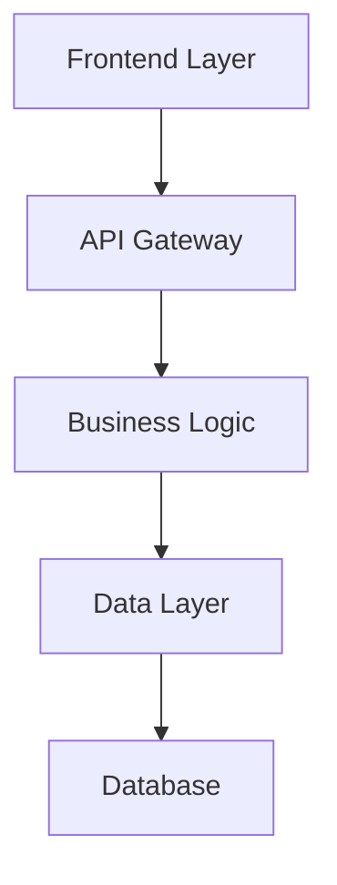
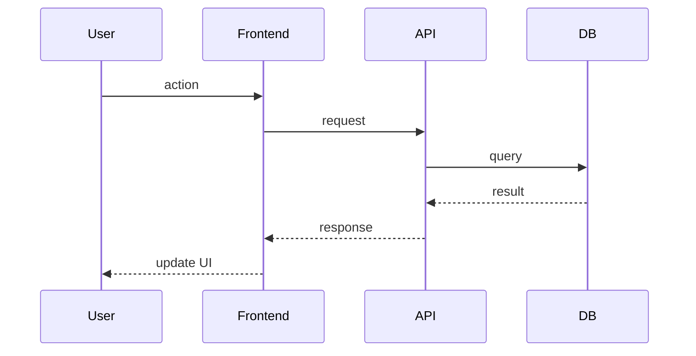
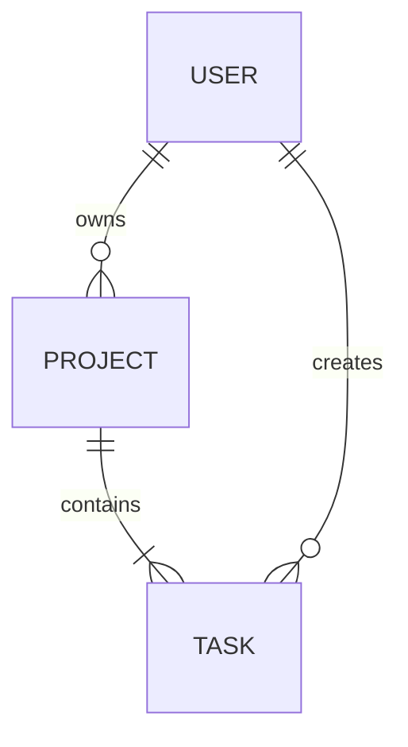
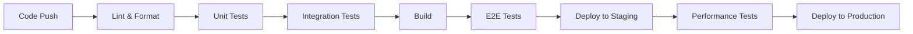

# Technical Design

Create comprehensive technical design for feature: **$ARGUMENTS**

## Requirements Approval Required

**CRITICAL**: Design can only be generated after requirements are reviewed and approved.

- Requirements document: @.kiro/specs/$ARGUMENTS/requirements.md
- Spec metadata: @.kiro/specs/$ARGUMENTS/spec.json

**Note**: If this command was called with `-y` flag, requirements are auto-approved (spec.json updated to set requirements.approved=true). Otherwise, requirements must be approved first via `/kiro:spec-requirements $ARGUMENTS` followed by `/kiro:spec-design $ARGUMENTS -y`.

## Context Analysis

### Requirements Foundation
**CRITICAL**: Design must be built upon approved requirements document.

- **Requirements document**: @.kiro/specs/$ARGUMENTS/requirements.md
- **EARS format requirements**: Each requirement with acceptance criteria
- **User stories mapping**: Design components must address specific user stories
- **Constraints and acceptance criteria**: Must be reflected in technical decisions

**Verification Required**: Ensure requirements.md exists and is approved before proceeding.

### Steering Context
- Current architecture: @.kiro/steering/structure.md
- Technology stack: @.kiro/steering/tech.md
- Product constraints: @.kiro/steering/product.md
- Custom steering: Load "Always" mode and design-pattern matching "Conditional" mode files

### Current Spec Context
- Current design: @.kiro/specs/$ARGUMENTS/design.md
- Spec metadata: @.kiro/specs/$ARGUMENTS/spec.json

## Task: Create Technical Design

**Prerequisites Verified**: Requirements are approved and ready for design phase.

### Research & Investigation Process

**MANDATORY**: Conduct research and investigation during the design process:

1. **Technology Research**
   - Research current best practices for the technology stack
   - Investigate security considerations and latest standards
   - Review performance benchmarks and scaling approaches
   - Examine integration patterns with existing architecture

2. **Context Building**
   - Build up research context in the conversation thread
   - Document key findings that inform design decisions
   - Cite sources and include relevant links for reference
   - Summarize insights that impact architectural choices

3. **Requirements Analysis**
   - Map each design component to specific EARS requirements
   - Ensure all user stories are addressed in the technical design
   - Validate that acceptance criteria can be met by the proposed solution
   - Identify any gaps between requirements and technical feasibility

### Design Document Generation

Generate comprehensive design document in the language specified in spec.json, incorporating research findings:

### 1. Design Document Structure
Create design.md in the language specified in spec.json (check `@.kiro/specs/$ARGUMENTS/spec.json` for "language" field):

```markdown
# Technical Design

## Overview
[Technical overview of the implementation approach, referencing key requirements from requirements.md]

## Requirements Mapping

### Design Component Traceability
Each design component addresses specific requirements:
- **[Component 1]** → REQ-X.X: [EARS requirement reference]
- **[Component 2]** → REQ-Y.Y: [EARS requirement reference]
- **[Integration Layer]** → REQ-Z.Z: [EARS requirement reference]

### User Story Coverage
[Ensure all user stories from requirements.md are addressed]
- User Story 1: [How design addresses this story]
- User Story 2: [Technical approach for this story]

## Architecture
[High-level system architecture and technology decisions]



### Technology Stack
[Based on research findings and requirements analysis]

- **Frontend**: [React/Vue/Next.js] + [TypeScript]
- **Backend**: [FastAPI/Express/Django] + [Language] 
- **Database**: [PostgreSQL/MySQL/MongoDB]
- **Authentication**: [JWT/OAuth/Auth0]
- **Testing**: [Jest/pytest] + [Testing Library/Playwright]
- **Deployment**: [Docker/Vercel/AWS]

### Architecture Decision Rationale
[Document reasoning behind key technology choices based on research]

- **Why [Frontend Framework]**: [Research-based justification]
- **Why [Backend Technology]**: [Performance, scalability, team expertise considerations]
- **Why [Database Choice]**: [Data model requirements, consistency needs, scaling patterns]
- **Why [Authentication Method]**: [Security requirements, integration capabilities, user experience]

## Data Flow
[Description of how data flows through the system]

### Primary User Flows
Include sequence diagrams for the top 1-3 user flows:



## Components and Interfaces
Generate a comprehensive component breakdown.

### Backend Services & Method Signatures
For each service identified in requirements, list public methods with concise doc-strings. Example (Python):
```python
class InvoiceService:
    def create_invoice(self, data: InvoiceData) -> Invoice:  # create & persist
    def send_invoice(self, invoice_id: str) -> None          # email/send
```

### Frontend Components
Provide a table: Component name │ Responsibility │ Props/state summary.

### API Endpoints
Provide a detailed API endpoint table:

| Method | Route | Purpose | Auth | Status Codes |
|--------|-------|---------|------|--------------|
| GET    | /api/[resource] | List resources | Required | 200, 401, 500 |
| POST   | /api/[resource] | Create resource | Required | 201, 400, 401, 500 |
| PUT    | /api/[resource]/:id | Update resource | Required | 200, 400, 401, 404, 500 |
| DELETE | /api/[resource]/:id | Delete resource | Required | 204, 401, 404, 500 |

## Data Models

### Domain Entities
1. **[Entity1]**: [Brief description]
2. **[Entity2]**: [Brief description]
3. **[Entity3]**: [Brief description]

### Entity Relationships


### Data Model Definitions
Provide language-specific models (TypeScript interfaces and/or Python dataclasses):

```typescript
interface [ModelName] {
  id: string;
  // Add relevant fields based on requirements
  createdAt: Date;
  updatedAt: Date;
}
```

```python
@dataclass
class [ModelName]:
    id: str
    # Add relevant fields based on requirements
    created_at: datetime
    updated_at: datetime
```

### Database Schema
[SQL schema or NoSQL document structure]

### Migration Strategy
- Migration approach for schema changes
- Backward compatibility considerations
- Data transformation requirements
- Indexing strategy for performance

## Error Handling
[Comprehensive error handling strategy]

## Security Considerations

### Authentication & Authorization
- Authentication flow (JWT/OAuth) with sequence diagram
- Authorization matrix (roles and permissions)
- Session management strategy

### Data Protection
- Input validation approach
- Data encryption at rest and in transit
- Sensitive data handling

### Security Best Practices
- OWASP Top 10 mitigation strategies
- API rate limiting
- CORS configuration
- Security headers implementation


## Performance & Scalability

### Performance Targets
| Metric | Target | Measurement |
|--------|--------|-------------|
| Response Time (p95) | < 200ms | API endpoints |
| Response Time (p99) | < 500ms | API endpoints |
| Throughput | > 1000 req/sec | Load testing |
| Database Query (p99) | < 50ms | Query monitoring |
| Concurrent Users | > 10,000 | System capacity |

### Caching Strategy
- **Browser Cache**: Static assets, API responses
- **CDN**: Media files, static content
- **Application Cache**: Redis/Memcached for session data
- **Database Cache**: Query result caching

### Scalability Approach
- Horizontal scaling for application servers
- Read replicas for database
- Background job queue for async processing
- Auto-scaling based on load metrics


## Testing Strategy

### Test Coverage Requirements
- **Unit Tests**: ≥80% code coverage
- **Integration Tests**: All API endpoints and external integrations
- **E2E Tests**: Critical user journeys
- **Performance Tests**: Load testing at 2× expected peak

### Testing Approach
1. **Unit Testing**
   - Test individual functions and methods
   - Mock external dependencies
   - Focus on business logic

2. **Integration Testing**
   - API contract tests
   - Database integration tests
   - External service integration tests

3. **End-to-End Testing**
   - User authentication flow
   - Core feature workflows
   - Cross-browser compatibility

4. **Performance Testing**
   - Load testing with k6 or similar
   - Stress testing for system limits
   - Endurance testing for memory leaks

### CI/CD Pipeline


```

### 2. Document Generation
Generate the design document content ONLY. Do not include any review or approval instructions in the actual document file.

### 3. Update Metadata
Update spec.json with:
```json
{
  "phase": "design-generated",
  "approvals": {
    "requirements": {
      "generated": true,
      "approved": true
    },
    "design": {
      "generated": true,
      "approved": false
    }
  },
  "updated_at": "current_timestamp"
}
```

---

## INTERACTIVE APPROVAL IMPLEMENTED (Not included in document)

The following is for Claude Code conversation only - NOT for the generated document:

### Interactive Approval Process
## Next Phase: Interactive Approval

After generating design.md, review the design and choose:

**If design looks good:**
Run `/kiro:spec-tasks $ARGUMENTS -y` to proceed to tasks phase

**If design needs modification:**
Request changes, then re-run this command after modifications

The `-y` flag auto-approves design and generates tasks directly, streamlining the workflow while maintaining review enforcement.

### Review Checklist (for user reference):
- [ ] Technical design is comprehensive and clear
- [ ] Architecture aligns with existing system
- [ ] Technology choices are appropriate
- [ ] Components and interfaces are well-defined
- [ ] Security and performance considerations are addressed

## Instructions

1. **Verify requirements foundation** - Ensure requirements.md exists and is approved
2. **Check spec.json for language** - Use the language specified in the metadata
3. **Conduct comprehensive research**:
   - Research technology best practices and latest standards
   - Investigate security, performance, and integration considerations
   - Build context through research findings in conversation thread
   - Document sources and key insights that inform design decisions
4. **Analyze requirements thoroughly**:
   - Map each design component to specific EARS requirements
   - Ensure all user stories are addressed in technical design
   - Validate acceptance criteria can be met by proposed solution
5. **Follow existing architecture patterns** from steering context
6. **Structure the document in logical order**:
   - Overview → Research & Context → Requirements Mapping → Architecture → Data Flow → Components → Data Models → Error Handling → Security → Performance → Testing
7. **Create detailed component design** with clear interfaces and API specifications
8. **Include comprehensive diagrams** using mermaid for architecture, data flow, and ER diagrams
9. **Document design rationale** - Explain reasoning behind key technical decisions
10. **Define concrete performance targets** and testing strategies
11. **Update tracking metadata** upon completion

Generate design that provides clear blueprint for implementation phase with proper consideration for scalability, security, and maintainability, all grounded in thorough research and explicit requirements traceability.
think deeply