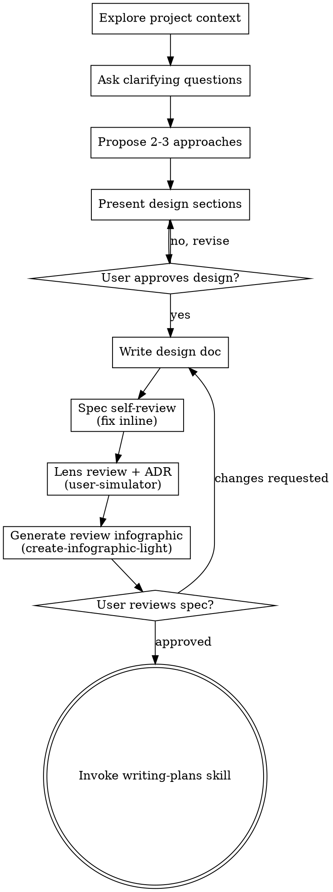

# アイデアを設計へ変えるブレインストーミング

自然な対話を通じて、アイデアを完成された設計とspecへ変えていく手助けをする。

まず現在のプロジェクトの状況を理解し、次にアイデアを磨き上げるための質問を一度に一つずつ行う。何を作るべきか理解できたら、設計を提示してユーザーの承認を得る。

<HARD-GATE>
設計を提示しユーザーの承認を得るまでは、いかなる実装スキルの呼び出し・コードの記述・プロジェクトの雛形作成・実装行為も行ってはならない。これは「シンプルに見える」プロジェクトであっても、あらゆるプロジェクトに適用される。
</HARD-GATE>

## アンチパターン: 「これは単純すぎて設計は不要」

あらゆるプロジェクトがこのプロセスを通る。TODOリスト、単一関数のユーティリティ、設定変更 — すべて例外はない。「単純」に見えるプロジェクトこそ、検証されていない前提が最も多くの手戻りを生む。設計は短くてよい（本当に単純なプロジェクトなら数文で足りる）が、必ず提示してユーザーの承認を得なければならない。

## チェックリスト

以下の各項目についてタスクを作成し、この順序で完了させなければならない：

1. **プロジェクトの状況を調べる** — ファイル・ドキュメント・直近のコミットを確認する
2. **ビジュアルコンパニオンをジャストインタイムで提案する** — 最初から提案しない。「見せた方が明らかに伝わりやすい質問」が実際に発生した最初のタイミングで、その時点で提案する（独立したメッセージとして）。承認されればブラウザタブが開かれる。ビジュアルな質問が一度も発生しなければ、一切提案しない。詳細は下記のビジュアルコンパニオンのセクションを参照。
3. **明確化のための質問をする** — 一度に一つずつ、目的・制約・成功基準を理解する
4. **2〜3のアプローチを提案する** — トレードオフと推奨案を添えて
5. **設計を提示する** — 複雑度に応じたセクション単位で、各セクションごとにユーザーの承認を得る
6. **設計ドキュメントを書く** — `docs/superpowers/specs/YYYY-MM-DD-<topic>-design.md` に保存しコミットする
7. **specのセルフレビュー** — プレースホルダー・矛盾・曖昧さ・スコープを手早くインラインで確認する（下記参照）
8. **Simulator review + 判断記録（ADR）** — user-simulator スキル（reviewモード）を呼び出す: Fable判事の予測レポートでCriticalを修正し、C型裁定・B型前提宣言を `## 判断記録（ADR）` セクションとしてspec末尾に記録する。C型質問は毎回preanswerモードを通す（確信高は前提宣言に降格）
9. **レビュー用インフォグラフィックを生成する** — create-infographic-light スキルをspec（および執筆後のplan）に対して呼び出し `open` する。ユーザーはこれを見て視覚的にレビューし、コメントを付けられる
10. **ユーザーが書かれたspecをレビューする** — 先へ進む前にspecファイルをレビューしてもらう
11. **実装への移行** — writing-plans スキルを呼び出し実装計画を作成する

## プロセスフロー



**終端状態は writing-plans の呼び出しである。** frontend-design、mcp-builder、その他の実装スキルは呼び出さない。ブレインストーミングの後に呼び出してよいスキルは writing-plans だけである。

## プロセス

**アイデアを理解する:**

- まず現在のプロジェクトの状況（ファイル・ドキュメント・直近のコミット）を確認する
- 詳細な質問をする前にスコープを見極める: もし依頼が複数の独立したサブシステムを述べている場合（例：「チャット・ファイルストレージ・課金・分析を備えたプラットフォームを作りたい」）、直ちにそれを指摘する。分解が必要なプロジェクトの細部を質問で詰めることに時間を使わない。
- プロジェクトが一つのspecには大きすぎる場合、ユーザーがサブプロジェクトへ分解するのを手伝う: 独立した部分は何か、どう関連するか、どの順序で作るべきか？その上で最初のサブプロジェクトを通常の設計フローでブレインストーミングする。各サブプロジェクトはそれぞれ独自のspec→plan→実装サイクルを持つ
- 適切な粒度のプロジェクトについては、アイデアを磨くための質問を一度に一つずつ行う
- 可能であれば多肢選択式の質問を優先するが、自由記述でもよい
- 選択肢が離散的（2〜4択）な場合は AskUserQuestion ツールを使う — 番号付き選択肢をプレーンテキストで提示しない（セッションをまたぐと一貫性がなく、ユーザーにとっても回答しづらい）
- AskUserQuestion 1回の呼び出し = 質問1つ。questions 配列に複数の質問を詰め込んではならない — ツールが許容していても、それは「一度に一つずつ」の違反である
- AskUserQuestion を送る前の最終リトマス試験: ある選択肢に（推奨）と印がついていて、その推奨がユーザーの好みではなく原則や調査事実に基づくものであれば、その質問はB型である — 質問を削除し、推奨内容を前提宣言に畳み込む
- Litmus通過後のC型質問は、送信前に user-simulator の **preanswerモード**を通す（`user-simulator/modes/preanswer/protocol.md`）: 確信高の予測は質問せず前提宣言（拒否権つき）へ降格、確信中は予測注記付きで質問、採点は misses.md へ自動記録
- 1メッセージにつき質問は一つだけ - あるトピックにさらなる掘り下げが必要なら、複数の質問に分割する
- 理解に集中する対象: 目的、制約、成功基準

**アプローチを検討する:**

- トレードオフを添えて2〜3の異なるアプローチを提案する
- 選択肢は対話調で、推奨とその理由とともに提示する
- 推奨案を先頭に置き、理由を説明する

**提示前のセルフ反証（必須）:**

- 設計を提示する前に、自分自身でそれを攻撃する: 「動いてはならない」具体的な入力を少なくとも一つ構築し（回転・向き、複数セル、境界、スケール、並行状態など）、設計がそれを正しく拒否することを確認する。設計がその拒否を表現できないなら、それは拡張ポイントを追加すべきという合図である — 解決しないまま設計を出荷しない
- 提示の中に、最も強力な反例とそれに対する設計の対処方法を含める。ユーザーより先に自分の設計の致命的なケースを見つけることは、設計対話における最も信頼を得られる一手である
- 前提がゲーム/物理挙動を主張している場合（例:「垂直な歯車は絶対に噛み合わない」）、現実の例外が存在しないか確認する（例：かさ歯車）。その主張が誤っていた場合に設計が破綻するなら、C型の質問としてユーザーに確認する

**設計を提示する:**

- 何を作るべきか理解できたと確信したら、設計を提示する
- 各セクションは複雑さに応じたスケールにする: 単純なら数文、込み入っているなら200〜300語まで
- 各セクションの後、ここまで問題ないか確認する（1メッセージに収まる小さな設計は、一括で提示・承認してもよい）
- カバーすべき範囲: アーキテクチャ、コンポーネント、データフロー、エラーハンドリング、テスト
- 何かつじつまが合わなければ、いつでも戻って確認する準備をしておく

**分離と明確さのための設計:**

- システムを、それぞれが一つの明確な目的を持ち、明確に定義されたインターフェースを通じて通信し、独立して理解・テストできる小さな単位に分割する
- 各単位について「何をするか」「どう使うか」「何に依存するか」に答えられるようにする
- 内部を読まなくても、ある単位が何をするか理解できるか？内部を変更しても呼び出し側を壊さずに済むか？できないなら、境界の見直しが必要である
- 小さく、境界の明確な単位は自分にとっても扱いやすい - 一度にコンテキストへ収まるコードの方が推論しやすく、ファイルが焦点を絞られているほど編集の信頼性も高まる。ファイルが肥大化してきたら、それは責務を持ちすぎているサインであることが多い

**既存コードベースでの作業:**

- 変更を提案する前に現在の構造を調べる。既存のパターンに従う
- 既存コードに作業へ影響する問題がある場合（肥大化しすぎたファイル、不明瞭な境界、絡み合った責務など）、良い開発者が作業対象のコードを改善するのと同じように、対象を絞った改善を設計に含める
- 無関係なリファクタリングは提案しない。現在の目的に資することに集中する

## 設計の後

**ドキュメント化:**

- 承認済みの設計（spec）を `docs/superpowers/specs/YYYY-MM-DD-<topic>-design.md` に書き込む
  - （spec配置場所についてユーザーの希望があればそちらを優先する）
- 利用可能であれば elements-of-style:writing-clearly-and-concisely スキルを使う
- 設計ドキュメントをgitにコミットする

**Specセルフレビュー:**
spec文書を書いた後、新鮮な目で見直す：

1. **プレースホルダー走査:** 「TBD」「TODO」、未完成セクション、曖昧な要件はないか？あれば修正する
2. **内部整合性:** セクション間で矛盾していないか？アーキテクチャは機能の説明と一致しているか？
3. **スコープチェック:** これは一つの実装計画にちょうど収まる粒度か、それとも分解が必要か？
4. **曖昧さチェック:** どれかの要件が二通りに解釈できないか？できるなら、一つを選び明示する
5. **証拠範囲チェック:** 「verified/tested/実装済み」というあらゆる主張は、実際に確認した範囲を超えてはならない — 「Xはテスト済み」と書けるのは、テストがX自体を通す場合のみ。同じ経路を通る兄弟要素の話であれば、そう明記する（例：「同じコード経路が機械ブロックでテスト済み、チェスト自体は未テスト」）

問題はすべてインラインで修正する。再レビューは不要 — 修正したら次に進む。

**Simulator Review + 判断記録（ADR）（必須）:**
Self-Review（内容）と spec-architecture-review（構造）の後、インフォグラフィック生成の**前**に user-simulator スキルを実行する（reviewモード）:

- `user-simulator/modes/review/protocol.md` に従いFable判事を起動し、予測レポート（元々の想定/適用済み指摘/要裁定/見なかった領域）を受けてCriticalをインライン修正、要裁定はpreanswerを通してAskUserQuestionへ。specのADRをcontextに含め、裁定済み事項を蒸し返させない。実行結果の採点を misses.md に記録し、外しは即ハンドオフ発行。
- spec末尾に `## 判断記録（ADR）` セクションを置き、対話中のC型ユーザー裁定（AskUserQuestion結果は全件）・B型前提宣言（適用原則名付き）・機構比較の結論を記録する。シミュレーター予測を承認させた裁定は出所「シミュレーター予測→ユーザー承認」と書く。判断をdiffやコミットメッセージに埋没させない。

**レビュー用インフォグラフィック（必須）:**
specレビューのループが通ったら、create-infographic-light スキル（本リポジトリでは `.claude/skills/create-infographic-light`）をspecをソース文書として呼び出し、生成されたHTMLを `open` する。ユーザーはインフォグラフィックを通じてspecをレビューし、コメント機能でコメントを付けられる（「すべてコピー」で得られるMarkdownを貼り戻せば適用できる）。writing-plans完了後の実装計画についても同様に行う。

**ユーザーレビューゲート:**
specレビューのループが通ったら、先へ進む前に書かれたspecをレビューしてもらう：

> 「specを `<path>` に書いてコミットしました。実装計画を書き始める前に、内容を確認して変更したい点があれば教えてください。」

ユーザーの返答を待つ。変更を要求されたら反映し、specレビューのループを再実行する。ユーザーが承認して初めて先へ進む。

**実装:**

- writing-plans スキルを呼び出し、詳細な実装計画を作成する
- 他のスキルは呼び出さない。次のステップは writing-plans である。

## 主要な原則

- **一度に一つの質問** - 複数の質問で圧倒しない
- **多肢選択を優先** - 可能なら自由記述より答えやすい
- **YAGNIを徹底する** - すべての設計から不要な機能を取り除く
- **代替案を検討する** - 決定する前に必ず2〜3のアプローチを提案する
- **段階的な検証** - 設計を提示し、先へ進む前に承認を得る
- **柔軟であること** - つじつまが合わなければ戻って確認する

## ビジュアルコンパニオン

ブレインストーミング中にモックアップ・図・視覚的な選択肢を見せるための、ブラウザベースのコンパニオン。モードではなくツールとして利用可能。コンパニオンを受け入れるということは、視覚的な扱いが有益な質問でそれが使えるようになるという意味であり、すべての質問がブラウザ経由になるという意味ではない。

**コンパニオンの提案（ジャストインタイム）:** 最初から提案しない。実際にモックアップ／レイアウト／図の質問が発生し、見せた方が明らかに伝わりやすいと分かるまで待つ（単なるUIの*話題*だけでは足りない）。それが最初に発生したタイミングで、独立したメッセージとして提案する：
> 「この先の部分は、実際にお見せした方が分かりやすいかもしれません — ブラウザタブでモックアップ・図・比較案をまとめてお見せできます。まだ新しい機能でトークン消費が大きめですが、使いますか？私の方で開いておきます。」

**この提案は必ず独立したメッセージでなければならない。** 提案のみを含み、確認の質問や要約など他の内容を含めない。ユーザーの返答を待つ。承認されたら `--open` 付きでサーバーを起動し、最初の画面が自動的にブラウザで開くようにする。断られたらテキストのみで続行し、ユーザーから改めて言及されない限り再提案しない。

**質問ごとの判断:** ユーザーが承認した後も、質問ごとにブラウザを使うかターミナルを使うか判断する。判断基準：**見せた方が読むよりも理解しやすいか？**

- **ブラウザを使う** — 内容自体が視覚的なもの（モックアップ、ワイヤーフレーム、レイアウト比較、アーキテクチャ図、視覚デザインの並列比較）
- **ターミナルを使う** — 内容がテキストであるもの（要件の質問、概念的な選択、トレードオフの一覧、A/B/C/Dのテキスト選択肢、スコープの決定）

UIに関する話題の質問が、自動的に視覚的な質問になるわけではない。「このコンテキストにおける『パーソナリティ』とは何を意味するか？」は概念的な質問 — ターミナルを使う。「どちらのウィザードのレイアウトの方が良いか？」は視覚的な質問 — ブラウザを使う。

コンパニオンに同意が得られたら、先へ進む前に詳細ガイドを読む：
`skills/brainstorming/visual-companion.md`

# 追加SKILL:design-question-triage

---
name: design-question-triage
description: |
  壁打ち・仕様相談・要件確認でユーザーへ質問を出す前に、質問候補を観点整理し「コード調査で解決できるもの」「設計原則で答えが一意に決まるもの」を弾いて自己解決し、根拠つきの前提として宣言する。本当にユーザーにしか決められない質問だけを届けるためのトリアージスキル。
  Use when:
  1. 「壁打ちしたい」「〜機能を作りたい」「仕様を詰めたい」「要件を整理したい」と言われて設計対話を始める時
  2. brainstorming 系スキルの質問フェーズ（clarifying questions）に入る時
  3. 設計の文脈で AskUserQuestion を組み立てようとする直前（毎回）
  4. 設計レビューで「そこは聞かなくても決まるでしょ」という指摘を受けた後の再発防止として
---

# design-question-triage — 質問する前に自明を弾く

## なぜこのスキルが必要か

壁打ちで最も信頼を損なうのは「聞かなくても決まる質問」と「原則に反する案を推奨として提示すること」である。
ユーザーの時間は質問1回ごとに消費される。質問は「トレードオフが実在し、価値判断がユーザー固有」なものだけに絞り、
それ以外は自分で決めて**拒否権つきの前提**として宣言するほうが、対話は速く、精度も上がる。

## 発火タイミング

設計対話でユーザーへ質問（AskUserQuestion 含む）を出す**すべての直前**。1回目だけでなく、対話の途中でも毎回適用する。

## Phase 1: 質問候補の全列挙（まだ聞かない）

まず観点チェックリストで質問候補を網羅的に洗い出す。頭の中ではなく列挙して書き出すこと（抜けは列挙しないと見えない）。

| 観点 | 典型的な問い |
|---|---|
| トリガー / 獲得経路 | 何がきっかけで発動・獲得されるか |
| 適用範囲 / 粒度 | 全体一律か個別か、段階か一回か |
| データ表現 / 置き場所 | マスタ・設定・セーブのどこに何を定義するか |
| 状態の所有ドメイン | 動的状態をどの層が持つか |
| 永続化 / 復元 / 順序 | 何を保存し、どの順で復元するか |
| 同期 / 通信 | サーバー・クライアント間で何をいつ同期するか |
| UI / 表示スコープ | どこまで見せるか、専用UIは要るか |
| 既存データ移行 | 既存データ・セーブをどう扱うか |
| エッジケース | 上限到達、重複適用、途中変更などの挙動 |
| データフロー参加位置 | 既存の駆動・反映の連鎖のどこに立つ機能か（書き手か・読み手か・交差点を足すか） |

**データフロー観点は最初に確定させる**（他観点の前提）: 対象が既存の一方向連鎖（入力→共有モデル→下流が変化から挙動を導出）に参加するなら、実体は「**共有モデルへの書き手が1人増える**」だけで自由度は「誰が・いつ書くか」に縮む。これを外すと全観点が「新しい制御フローありき」で膨らむ。矢印列を1本書いて立ち位置を置き、`bool` 戻り・迂回セッター・フレーム駆動へのイベント混入（＝交差点）は不可避理由が無ければ畳む。詳細は writing-plans の Phase 1.5 と同一。

## Phase 2: 3分類トリアージ

列挙した各候補を以下の3種に分類する。**分類してから**でないと質問を書き始めてはいけない。

### A. 調査解決型 — 聞かずに調べる
コード・スキーマ・過去コミット・ドキュメントを読めば確定する問い。
「既存に似た仕組みはあるか」「ロード順はどうなっているか」「この値はどこで参照されているか」は全部これ。
subagent や検索で解決し、結果は Phase 3 の前提に含める。

### B. 原則自明型 — 聞かずに決めて宣言する
選択肢を並べたとき、**片方を選ばない理由が存在しない（支配戦略がある）**問い。

判定テスト（どれかに該当すれば B）:
- **無料の上位互換テスト**: 一方が同コストで他方の性質を全て持ち、追加のデメリットがない（例: デメリット無く冪等にできるなら冪等一択。increment より unlock/set-max）
- **ドメイン整合テスト**: 一方が層・ドメインの責務定義に明確に反する（例: 実行時に変化する状態を「静的定義」のドメインに置く案は、変更量が少なくても選ばない）
- **先行パターンテスト**: コードベースに同種の仕組みが既にあり、それに乗らない理由がない
- **導出可能テスト**: 情報を運ぶ・保持する機構を新設する案は、その情報が既存の情報源から導出できるなら不採用。同じ情報の置き場・通り道を増やすことは Single Source of Truth を壊し、同期バグの温床になる。新設は「既存の情報源では足りない」ことを調査で示せたときだけ設計に含める
- **逆提案テスト**: 「逆を提案したらユーザーに修正されるだろう」と予想できる

**新設ゲート（必須）**: 前提・設計に「新しい機構（状態ストア・保存領域・通信経路・状態複製）を新設する」と書く前に、
同じ役割を担いうる既存機構をコードベースから検索し、**見つかった候補を実名で列挙**したうえで
「その拡張では足りない理由」を前提宣言に1行で明記する。候補列挙と拡張不可理由の両方が書けないうちは、新設を設計に含めてはならない。
注意: 「マスタ（静的定義）には置けない」は新設の根拠にならない。それは静的層を除外しただけで、
既存の**動的状態ストアや既存の同期・保存経路**を拡張できない理由にはなっていない。検索対象はまさにそちら側である。

⚠️ B を「推奨付きの質問」に変換して判断を外注するのは禁止。それは丁寧さではなく判断の放棄であり、
ユーザーに「明らかな正解を選ぶ作業」をさせることになる。B は宣言する。間違っていれば前提の段階で拒否される。

一般設計原則（B判定の照合表）:
1. デメリット無く冪等にできる操作は冪等にする（再実行・順序・リトライ・ロード時再適用に強い）
2. 動的な実行時状態を静的定義（マスタ / スキーマ / 設定）のドメインに置かない
3. 既存コードベースの同種パターンに従う（新パターンの発明には積極的な理由が要る）
4. 派生可能な状態は導出を基本とし、復元順序などの実制約があるときだけ既存の永続化パターンで補う
5. 置換・移行はコンパイルエラー駆動（型やプロパティを消して漏れを機械検出）にできるならそうする
6. YAGNI。将来の拡張可能性を理由に選択肢を増やさない
7. N対Nの適合・互換のような「関係」データは、各要素の属性（受け入れリスト等）に分散させず、中央の正規化テーブル（ペア表＋foreignKey＋検証）を第一候補にする（SSOT）。分散属性案を提示するなら必ず中央表案と並べて比較する
8. コードの注入点を設ける際は、実行時注入（delegate/interface渡し）と型レベル束縛（ジェネリック型パラメータ）の型安全度トレードオフを一度は比較する。「注入ミスがコンパイルエラーになるか」を比較軸に含める
9. 範囲・領域・対象集合を指定する契約（プロトコル/API/サービス引数）は一般形で受ける（3D空間ならXYZのAABB等）。UX都合の簡略化（「高さは全域でいい」等）はクライアント側の初期値・操作に留め、契約に焼き込まない。指定方式を推奨する前に「ユーザーが意図した集合を一意に表現できるか＝除外できない巻き込みが構造的に発生しないか」の反例を1つ構築して検査する（操作の手軽さは一意性の欠落を正当化しない）
10. 対で存在する操作（抽出/適用・serialize/deserialize・save/load）は同じインターフェースに対で定義する。片側だけのinterfaceは設計臭。適用側の実装は「各実装への分散（テンプレート個別対応等）」と「中央1箇所での汎用適用（factory等がinterfaceを列挙して適用）」を必ず並べて比較する。先行パターンに乗れた時点で探索を打ち切らず、そのパターン形の解にも無料の上位互換テストを適用する

プロジェクト固有の原則は `references/` を参照する（moorestech なら `references/moorestech-principles.md` を必ず読む）。

### C. 意思決定型 — これだけを聞く
トレードオフが実在し、どちらを取るかが**ユーザーの価値観・プロダクト方針・ゲームデザイン・スコープ感覚**に依存する問い。
例: 獲得手段（研究か消費アイテムか）、適用粒度（一律か個別か）、UIをどこまで作るか、データ移行の手間をどちらが払うか。

見分け方: 両案のメリット・デメリットを書き出したとき、**残る差が「好み・方針」だけ**になるなら C。
技術的優劣で決着がつくなら B に戻す。

**推奨リトマス（必須）**: 質問文を書いた後、自分がその質問に**原則・調査事実を根拠とする推奨**を添えられるか自問する。
添えられるなら、それは答えを知っている質問 = B である。質問を削除し、推奨内容を前提宣言に畳み込む
（例:「汎用システム化するか専用実装か」に YAGNI を根拠に専用実装を推奨できる時点で、それは質問ではなく宣言すべき決定）。
C として残してよいのは、推奨の根拠が「好み・方針の仮定」しか無い場合だけ。

## Phase 3: 出力形式 — 前提を先に、質問は後に

質問を出すときは必ずこの順で構成する:

```
## 前提（自己解決した決定 — 違ったら指摘してください）
- <決定>: <1行の根拠>（A: 調査結果 or B: 適用した原則）
- ...

## 質問（ユーザーの判断が必要なもの）
<C型の質問を1つずつ。各選択肢に実在するトレードオフを明記>
```

- 前提の宣言により、ユーザーは**拒否権を1行で行使できる**。質問に答えるより遥かに安い
- C型質問は1メッセージ1問。推奨を付けられるのは根拠が「好み・方針の仮定」に留まる場合のみ。
  原則・調査事実に基づく推奨を書けてしまったら、それは B だった質問なので前提宣言に戻す（推奨リトマス）
- 対話が進んで新しい質問候補が生まれたら、その都度 Phase 2 のトリアージを通す

## アンチパターン実例（実際にあった指摘）

1. **冪等の見落とし**: 研究による永続強化で「レベルを+1する(increment)」アクションを設計し提示した。
   ロード時の再実行・重複適用に弱く、「特定レベルを解放する」冪等アクションが同コストで実現できた。
   → 無料の上位互換テストで B と判定し、聞かずに冪等側を宣言すべきだった。
2. **ドメイン所有権の見落とし**: 動的に変わる「現在レベル」をマスタ管理クラス（静的定義のドメイン）に
   持たせる案を推奨として提示した。変更箇所が最少という理由で層の責務違反を正当化していた。
   → ドメイン整合テストで B と判定し、実行時層に置く案だけを提示すべきだった。
3. **不要な新設の見落とし**: 研究由来の派生値をクライアントへ届けるために新プロトコル＋イベントパケットの
   新設を設計に含めた。実際には研究完了状態が既にクライアントへ同期されており、派生値は共有マスタ＋
   同期済み状態から導出できたため新設は不要だった。
   → 導出可能テストを先に回し、「既存経路で足りない証拠」が出るまで新設を設計に書かないべきだった。

いずれも「質問・提案の形にしたこと」自体が誤りで、原則を照合していれば発生しなかった。
