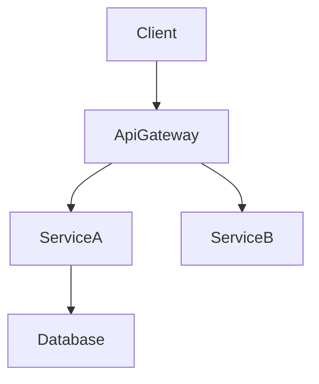

# Technical Design Rules and Principles

## Core Design Principles

### 1. Type Safety is Mandatory
- **NEVER** use `any` type in TypeScript interfaces
- Define explicit types for all parameters and returns
- Use discriminated unions for error handling
- Specify generic constraints clearly

### 2. Design vs Implementation
- **Focus on WHAT, not HOW**
- Define interfaces and contracts, not code
- Specify behavior through pre/post conditions
- Document architectural decisions, not algorithms

### 3. Visual Communication
- **Simple features**: Basic component diagram or none
- **Medium complexity**: Architecture + data flow
- **High complexity**: Multiple diagrams (architecture, sequence, state)
- **Always pure Mermaid**: No styling, just structure

### 4. Component Design Rules
- **Single Responsibility**: One clear purpose per component
- **Clear Boundaries**: Explicit domain ownership
- **Dependency Direction**: Follow architectural layers
- **Interface Segregation**: Minimal, focused interfaces

### 5. Data Modeling Standards
- **Domain First**: Start with business concepts
- **Consistency Boundaries**: Clear aggregate roots
- **Normalization**: Balance between performance and integrity
- **Evolution**: Plan for schema changes

### 6. Error Handling Philosophy
- **Fail Fast**: Validate early and clearly
- **Graceful Degradation**: Partial functionality over complete failure
- **User Context**: Actionable error messages
- **Observability**: Comprehensive logging and monitoring

### 7. Integration Patterns
- **Loose Coupling**: Minimize dependencies
- **Contract First**: Define interfaces before implementation
- **Versioning**: Plan for API evolution
- **Idempotency**: Design for retry safety

## Documentation Standards

### Language and Tone
- **Declarative**: "The system authenticates users" not "The system should authenticate"
- **Precise**: Specific technical terms over vague descriptions
- **Concise**: Essential information only
- **Formal**: Professional technical writing

### Structure Requirements
- **Hierarchical**: Clear section organization
- **Traceable**: Requirements to components mapping
- **Complete**: All aspects covered for implementation
- **Consistent**: Uniform terminology throughout

## Diagram Guidelines

### When to include a diagram
- **Architecture**: Use a structural diagram when 3+ components or external systems interact.
- **Sequence**: Draw a sequence diagram when calls/handshakes span multiple steps.
- **State / Flow**: Capture complex state machines or business flows in a dedicated diagram.
- **ER**: Provide an entity-relationship diagram for non-trivial data models.
- **Skip**: Minor one-component changes generally do not need diagrams.

### Mermaid requirements

- **Plain Mermaid only** – avoid custom styling or unsupported syntax.
- **Node IDs** – alphanumeric plus underscores only (e.g., `Client`, `ServiceA`). Do not use `@`, `/`, or leading `-`.
- **Labels** – simple words. Do not embed parentheses `()`, square brackets `[]`, quotes `"`, or slashes `/`.
  - ❌ `DnD[@dnd-kit/core]` → invalid ID (`@`).
  - ❌ `UI[KanbanBoard(React)]` → invalid label (`()`).
  - ✅ `DndKit[dnd-kit core]` → use plain text in labels, keep technology details in the accompanying description.
- **Edges** – show data or control flow direction.
- **Groups** – using Mermaid subgraphs to cluster related components is allowed; use it sparingly for clarity.

## Quality Metrics
### Design Completeness Checklist
- All requirements addressed
- No implementation details leaked
- Clear component boundaries
- Explicit error handling
- Comprehensive test strategy
- Security considered
- Performance targets defined
- Migration path clear (if applicable)

### Common Anti-patterns to Avoid
❌ Mixing design with implementation
❌ Vague interface definitions
❌ Missing error scenarios
❌ Ignored non-functional requirements
❌ Overcomplicated architectures
❌ Tight coupling between components
❌ Missing data consistency strategy
❌ Incomplete dependency analysis
