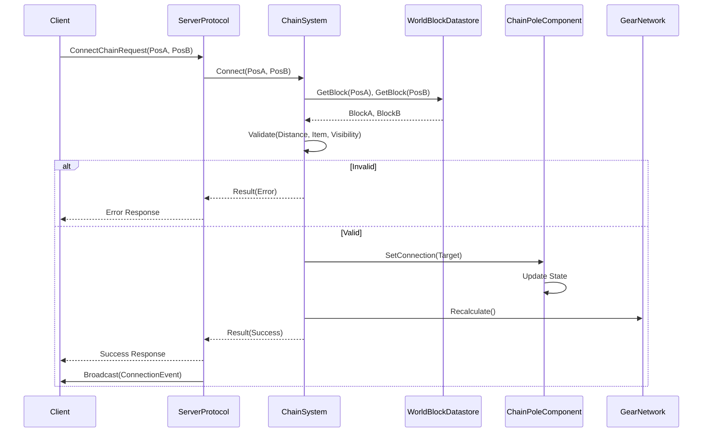

# Design Document

## Overview
**Purpose**: 本機能は、物理的に隣接していないブロック間で回転エネルギー（GearPower）を伝達する手段を提供します。
**Users**: 工業化を進めるプレイヤーは、この機能を使用して、離れた場所にある動力源から機械へ動力を供給したり、複雑な工場レイアウトを構築したりします。
**Impact**: これにより、従来の「隣接必須」という制約が取り払われ、より柔軟で拡張性の高い工場設計が可能になります。

### Goals
- チェーンポールブロックの実装
- チェーンによる長距離エネルギー伝送の実現（`GearNetwork`への統合）
- クライアント・サーバー間の接続・切断プロトコルの実装
- チェーン接続の視覚的同期

### Non-Goals
- チェーンの物理挙動シミュレーション（たるみや揺れなどの視覚効果はクライアント側の責務とし、サーバーは関与しない）
- 電力（Electricity）の伝送（これは回転エネルギーのみを対象とする）

## Architecture

### Architecture Pattern & Boundary Map
**RECOMMENDED**: Component-based Architecture within the existing ECS-like framework.

**Architecture Integration**:
- **Selected pattern**: ブロックコンポーネント拡張。`ChainPoleBlock`は`IGearEnergyTransformer`を実装する新しいブロックタイプとなる。
- **Domain boundaries**: `Game.Block`はコンポーネントロジックを担当。`Game.Gear`はネットワーク伝播を担当。`Server.Protocol`はユーザーリクエストを担当。
- **Existing patterns preserved**: エネルギー計算に`GearNetwork`を使用。データに`MasterHolder`を使用。プロトコルに`MessagePack`を使用。
- **New components rationale**: 接続プロセス（バリデーション、アイテム消費）を調整するために`ChainSystem`を導入し、「アクションロジック」を「コンポーネント状態」から分離する。

### Technology Stack

| Layer | Choice / Version | Role in Feature | Notes |
|-------|------------------|-----------------|-------|
| Protocol | MessagePack | Client-Server Communication | `ConnectChain` / `DisconnectChain` パケットを定義 |
| Server Logic | C# / .NET Standard 2.1 | Game Logic | `ChainPoleComponent`, `ChainSystem` を実装 |
| Data | YAML / SourceGenerator | Master Data | `ChainPoleBlock` スキーマを定義 |

## System Flows

### Chain Connection Flow



## Requirements Traceability

| Requirement | Summary | Components | Interfaces | Flows |
|-------------|---------|------------|------------|-------|
| 1.1, 1.2 | マスターデータ定義 | VanillaSchema, MasterHolder | `blocks.yml` | - |
| 2.1, 2.2, 2.5 | 接続バリデーションとアイテム消費 | ChainSystem | `IChainSystem` | Connection Flow |
| 2.3, 2.4 | 接続状態管理 | ChainPoleComponent | `IChainPole` | Connection Flow |
| 3.1, 3.2, 3.3, 3.4 | エネルギー伝送ロジック | ChainPoleComponent, GearNetwork | `IGearEnergyTransformer` | - |
| 4.1, 4.2 | プロトコル定義 | Server.Protocol | `IPacketResponse` | Connection Flow |
| 4.3, 4.4 | イベントブロードキャスト | Server.Protocol, Client.Network | `IEventProtocol` | Connection Flow |

## Components and Interfaces

### [Game.Block]

#### [ChainPoleComponent]

| Field | Detail |
|-------|--------|
| Intent | 接続状態を保持し、GearNetworkに参加する |
| Requirements | 2.3, 2.4, 3.1, 3.2, 3.3, 3.4 |
| Owner | Server Team |

**Responsibilities & Constraints**
- 接続相手の`BlockInstanceId`を保持する。
- `GearNetwork`への接続を公開するために`IGearEnergyTransformer`を実装する。
- セーブ/ロード用に自身の「接続」状態を管理する。

**Dependencies**
- Inbound: `GearNetwork` — `GetGearConnects`経由でアクセス (P0)
- Inbound: `ChainSystem` — 接続を設定 (P0)
- Outbound: `WorldBlockDatastore` — パートナーIDをコンポーネントに解決 (P0)

**Contracts**: Service [ ] / API [ ] / Event [ ] / Batch [ ] / State [x]

##### State Management
- State model: `ChainPoleSaveData` (ターゲット座標またはIDを保存)
- Persistence: 標準的なブロックのセーブ/ロード

**Implementation Notes**
- **Integration**: 接続されたブロックがアンロードまたは破壊されたケースを処理する必要がある（`GetGearConnects`でのnullチェック）。
- **Validation**: 自己接続が不可能であることを保証する。

### [Game.Context]

#### [ChainSystem]

| Field | Detail |
|-------|--------|
| Intent | チェーンの接続/切断のビジネスロジックを処理する |
| Requirements | 2.1, 2.2, 2.5 |

**Responsibilities & Constraints**
- リクエストを検証する（距離、視線、アイテムの有無）。
- プレイヤーインベントリからアイテムを消費する。
- `ChainPoleComponent`を更新する。

**Dependencies**
- Inbound: `ConnectChainProtocol` (P0)
- Outbound: `ChainPoleComponent` (P0)
- Outbound: `IPlayerInventory` (P1)

**Contracts**: Service [x] / API [ ] / Event [ ] / Batch [ ] / State [ ]

##### Service Interface
```csharp
public interface IChainSystem
{
    bool TryConnect(Vector3Int posA, Vector3Int posB, int playerId, out string error);
    bool TryDisconnect(Vector3Int posA, Vector3Int posB, out string error);
}
```

### [Server.Protocol]

#### [ConnectChainProtocol]

| Field | Detail |
|-------|--------|
| Intent | チェーン接続のクライアントリクエストを処理する |
| Requirements | 4.1 |

**Dependencies**
- Outbound: `IChainSystem` (P0)

**Contracts**: Service [ ] / API [x] / Event [ ] / Batch [ ] / State [ ]

##### API Contract
| Method | Packet Tag | Request Payload | Response |
|--------|------------|-----------------|----------|
| SEND | `va:connectChain` | `posA` (Vec3), `posB` (Vec3), `playerId` | Success/Fail |

## Data Models

### Domain Model
- **ChainPoleBlock**: ブロックエンティティ。
- **ChainConnection**: 2つの`ChainPoleBlock`間の論理リンク。双方向。

### Physical Data Model
**Blocks.yml Schema Update**:
```yaml
      - when: ChainPole
        type: object
        implementationInterface:
        - IGearConnectors
        properties:
        - key: maxConnectionDistance
          type: float
          default: 10.0
        - key: gear
          ref: gear
```

## Error Handling

### Error Strategy
- **Connection Failures**: ローカライズされたUIフィードバックのために、特定のエラーコード（TooFar, Obstructed, NoItem, AlreadyConnected）をクライアントに返す。
- **Invalid State**: 保存された接続が見つからないブロックを指している場合（破損など）、`ChainPoleComponent`は自己修復（切断）するか、無視する必要がある。

## Testing Strategy

- **Unit Tests**:
  - `ChainSystemTest`: バリデーションロジック（距離、アイテム消費）をテスト。
  - `ChainPoleComponentTest`: `GetGearConnects`が正しいターゲットを返すかテスト。
- **Integration Tests**:
  - `GearNetworkChainTest`: 分離された2つのネットワークを作成し、チェーンで接続し、電力伝送を検証。
  - `SaveLoadTest`: リロード後も接続が持続することを検証。