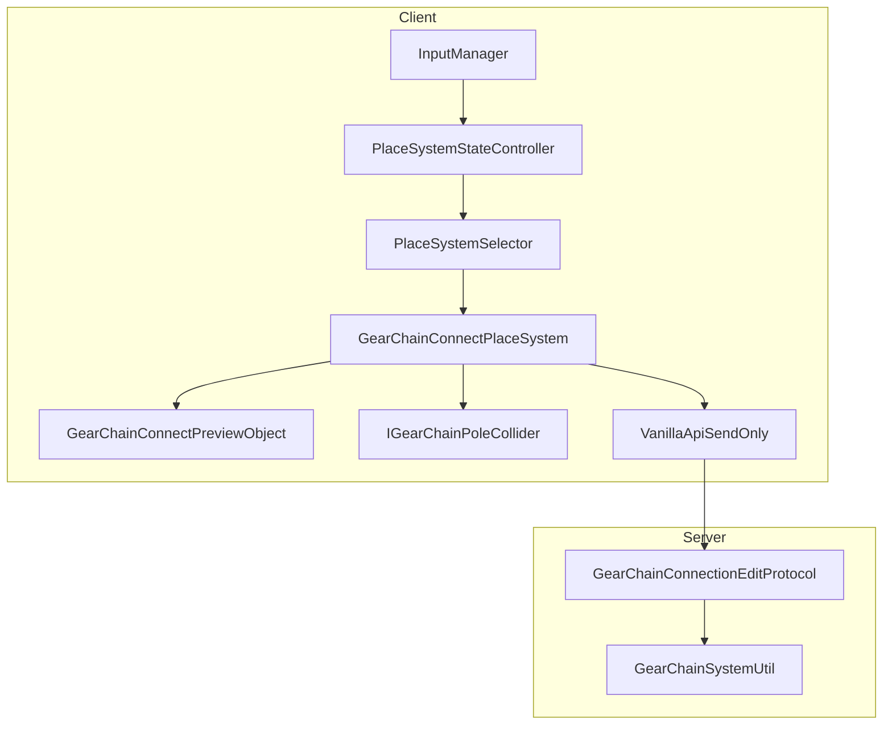
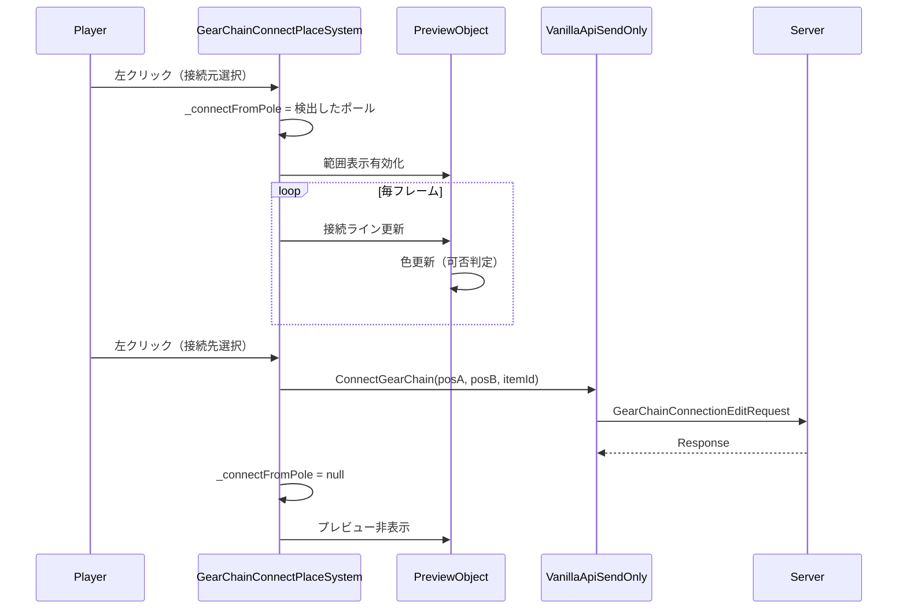

# Design Document: GearChainPole Connect PlaceSystem

## Overview

**Purpose**: GearChainPoleブロック間のチェーン接続をプレイヤーが視覚的に操作できるようにする。

**Users**: プレイヤーがギアネットワークを構築する際に、離れた2つのGearChainPole間をチェーンアイテムで接続する機能を提供する。

**Impact**: クライアント側に新しいPlaceSystem（GearChainConnectPlaceSystem）を追加し、既存のPlaceSystemSelectorとVanillaApiSendOnlyを拡張する。

### Goals
- GearChainPole間の2ステップ接続操作の実現
- 接続範囲と接続可否の視覚的フィードバック提供
- 接続コスト（チェーン消費量）のリアルタイム表示
- 既存接続の切断操作サポート

### Non-Goals
- GearChainPoleブロック自体の配置（既存のCommonBlockPlaceSystemで対応）
- ギアネットワークの自動最適化
- 複数接続の一括操作

## Architecture

### Existing Architecture Analysis

**既存パターン**: TrainRailConnectSystemが2ステップ接続操作の参照実装として存在する。

**遵守すべき境界**:
- PlaceSystemSelector: PlaceModeに基づくPlaceSystem選択
- VanillaApiSendOnly: サーバー通信API
- MainGameStarter: DIコンテナ登録

**統合ポイント**:
- PlaceSystemSelector.GetCurrentPlaceSystem(): switch文への分岐追加
- VanillaApiSendOnly: ConnectGearChain/DisconnectGearChainメソッド追加
- VanillaSchema/placeSystem.yml: GearChainConnect PlaceMode追加

### Architecture Pattern & Boundary Map



**Architecture Integration**:
- Selected pattern: 2ステップ接続パターン（TrainRailConnectSystemと同一）
- Domain boundaries: PlaceSystem層（操作制御）、Preview層（表示）、API層（通信）
- Existing patterns preserved: IPlaceSystemインターフェース、PlaceSystemSelector選択ロジック
- New components rationale: GearChainPole固有の接続ロジックと視覚表示のため専用クラスが必要
- Steering compliance: 既存パターン準拠、単一責任原則

### Technology Stack

| Layer | Choice / Version | Role in Feature | Notes |
|-------|------------------|-----------------|-------|
| Frontend | Unity 2022.3 LTS / C# | PlaceSystem実装 | 既存プロジェクト準拠 |
| UI/Preview | LineRenderer / MonoBehaviour | 接続プレビュー表示 | InventoryConnectorLineViewパターン |
| Data | MasterHolder / PlaceSystemMaster | マスターデータ参照 | 既存システム活用 |
| Messaging | MessagePack | サーバー通信 | 既存プロトコル活用 |

## System Flows

### 接続操作フロー



**Key Decisions**:
- 接続元選択後は毎フレームプレビュー更新
- 接続先クリック時にサーバー送信
- 右クリック/ESCで接続元選択解除

## Requirements Traceability

| Requirement | Summary | Components | Interfaces | Flows |
|-------------|---------|------------|------------|-------|
| 1.1 | チェーンアイテム保持時にシステム有効化 | PlaceSystemSelector | GetCurrentPlaceSystem | - |
| 1.2 | 接続元ポール選択 | GearChainConnectPlaceSystem | IGearChainPoleCollider | 接続操作フロー |
| 1.3 | 接続プレビュー表示 | GearChainConnectPreviewObject | - | 接続操作フロー |
| 1.4 | 接続リクエスト送信 | VanillaApiSendOnly | ConnectGearChain | 接続操作フロー |
| 1.5 | 選択解除 | GearChainConnectPlaceSystem | - | - |
| 2.1 | 最大接続距離表示 | GearChainConnectRangeObject | - | - |
| 2.2-2.5 | 接続可否の色分け | GearChainConnectPreviewObject | - | 接続操作フロー |
| 3.1-3.3 | サーバー通信 | VanillaApiSendOnly | GearChainConnectionEditRequest | 接続操作フロー |
| 3.4 | エラー表示 | GearChainConnectPlaceSystem | - | - |
| 4.1-4.3 | 切断操作 | GearChainConnectPlaceSystem, VanillaApiSendOnly | DisconnectGearChain | - |
| 5.1 | PlaceSystem選択 | PlaceSystemSelector | - | - |
| 5.2 | IPlaceSystem実装 | GearChainConnectPlaceSystem | IPlaceSystem | - |
| 5.3 | 無効化時リセット | GearChainConnectPlaceSystem | Disable | - |
| 6.1-6.3 | コスト表示 | GearChainConnectPreviewObject | - | - |

## Components and Interfaces

| Component | Domain/Layer | Intent | Req Coverage | Key Dependencies | Contracts |
|-----------|--------------|--------|--------------|------------------|-----------|
| GearChainConnectPlaceSystem | PlaceSystem | 接続操作制御 | 1.2-1.5, 3.4, 4.1-4.3, 5.2-5.3 | Camera, Preview, API (P0) | Service |
| GearChainConnectPreviewObject | Preview | プレビュー表示 | 1.3, 2.2-2.5, 6.1-6.3 | LineRenderer (P1) | - |
| GearChainConnectRangeObject | Preview | 範囲表示 | 2.1 | Transform (P2) | - |
| IGearChainPoleCollider | Interface | ポール検出 | 1.2 | - | Service |
| VanillaApiSendOnly (拡張) | API | サーバー通信 | 3.1-3.3, 4.2 | PacketSender (P0) | API |
| PlaceSystemSelector (拡張) | PlaceSystem | システム選択 | 1.1, 5.1 | MasterHolder (P0) | - |

### PlaceSystem Layer

#### GearChainConnectPlaceSystem

| Field | Detail |
|-------|--------|
| Intent | GearChainPole間の接続操作を制御する |
| Requirements | 1.2, 1.3, 1.4, 1.5, 3.4, 4.1, 4.2, 4.3, 5.2, 5.3 |

**Responsibilities & Constraints**
- 2ステップ接続操作（接続元選択→接続先選択→送信）の制御
- 接続元ポールの状態保持
- プレビューオブジェクトの制御
- 入力イベント（左クリック、右クリック、ESC）の処理

**Dependencies**
- Inbound: PlaceSystemStateController — ManualUpdate呼び出し (P0)
- Outbound: GearChainConnectPreviewObject — プレビュー表示 (P0)
- Outbound: VanillaApiSendOnly — サーバー通信 (P0)
- Outbound: IGearChainPoleCollider — ポール検出 (P0)
- External: Camera — レイキャスト (P0)

**Contracts**: Service [x]

##### Service Interface
```csharp
public class GearChainConnectPlaceSystem : IPlaceSystem
{
    // 状態
    private IGearChainPoleCollider _connectFromPole;

    // IPlaceSystem実装
    void Enable();
    void ManualUpdate(PlaceSystemUpdateContext context);
    void Disable();
}
```
- Preconditions: チェーンアイテムがホットバーで選択されている
- Postconditions: 接続/切断リクエストがサーバーに送信される
- Invariants: _connectFromPoleはnullまたは有効なポール参照

**Implementation Notes**
- Integration: TrainRailConnectSystemと同一パターンで実装
- Validation: 接続範囲、接続数上限、既存接続のクライアント側バリデーション
- Risks: サーバー側バリデーションとの不整合（サーバー優先で処理）

#### PlaceSystemSelector (拡張)

| Field | Detail |
|-------|--------|
| Intent | GearChainConnect PlaceModeの選択分岐を追加 |
| Requirements | 1.1, 5.1 |

**Implementation Notes**
- switch文に`PlaceModeConst.GearChainConnect`分岐を追加
- `_gearChainConnectPlaceSystem`フィールドを追加
- コンストラクタ引数にGearChainConnectPlaceSystemを追加

### Preview Layer

#### GearChainConnectPreviewObject

| Field | Detail |
|-------|--------|
| Intent | 接続ラインと接続可否の視覚的フィードバックを表示 |
| Requirements | 1.3, 2.2, 2.3, 2.4, 2.5, 6.1, 6.2, 6.3 |

**Responsibilities & Constraints**
- 接続元から接続先/カーソル位置への接続ライン表示
- 接続可否に応じた色変更（緑/赤/黄）
- チェーン消費量の計算と表示
- インベントリ不足警告

**Dependencies**
- External: LineRenderer — ライン描画 (P1)
- External: Material — 色制御 (P1)

**Contracts**: -

##### State Management
- State model: 接続元位置、接続先位置、接続状態（可能/不可/既存）
- Persistence: なし（フレーム単位で更新）
- Concurrency: シングルスレッド（Unity Main Thread）

**Implementation Notes**
- Integration: InventoryConnectorLineViewパターンを参考に実装
- Validation: 距離計算、接続数チェック
- Risks: 頻繁な色変更によるGC負荷（マテリアルのキャッシュで対応）

#### GearChainConnectRangeObject

| Field | Detail |
|-------|--------|
| Intent | maxConnectionDistanceの範囲を視覚的に表示 |
| Requirements | 2.1 |

**Implementation Notes**
- EnergizedRangeObjectパターンを参考
- transform.localScaleで範囲を表現
- 接続元選択時に表示、選択解除時に非表示

### Interface Layer

#### IGearChainPoleCollider

| Field | Detail |
|-------|--------|
| Intent | レイキャストでGearChainPoleを検出するためのインターフェース |
| Requirements | 1.2 |

##### Service Interface
```csharp
public interface IGearChainPoleCollider
{
    Vector3Int Position { get; }
    float MaxConnectionDistance { get; }
    bool IsConnectionFull { get; }
    bool ContainsConnection(Vector3Int partnerPosition);
}
```

**Implementation Notes**
- GearChainPoleブロックのGameObjectにアタッチされるMonoBehaviour
- ブロック生成時にコンポーネント追加（VanillaGearChainPoleTemplateまたはBlockGameObject生成時）

### API Layer

#### VanillaApiSendOnly (拡張)

| Field | Detail |
|-------|--------|
| Intent | GearChainPole接続/切断リクエストをサーバーに送信 |
| Requirements | 3.1, 3.2, 3.3, 4.2 |

**Contracts**: API [x]

##### API Contract
| Method | Endpoint | Request | Response | Errors |
|--------|----------|---------|----------|--------|
| ConnectGearChain | va:gearChainConnectionEdit | GearChainConnectionEditRequest (Connect) | GearChainConnectionEditResponse | InvalidTarget, TooFar, AlreadyConnected, ConnectionLimit, NoItem |
| DisconnectGearChain | va:gearChainConnectionEdit | GearChainConnectionEditRequest (Disconnect) | GearChainConnectionEditResponse | InvalidTarget, NotConnected |

##### Service Interface
```csharp
public void ConnectGearChain(Vector3Int posA, Vector3Int posB, ItemId itemId)
{
    var request = GearChainConnectionEditRequest.CreateConnectRequest(posA, posB, _playerId, itemId);
    _packetSender.Send(request);
}

public void DisconnectGearChain(Vector3Int posA, Vector3Int posB)
{
    var request = GearChainConnectionEditRequest.CreateDisconnectRequest(posA, posB, _playerId);
    _packetSender.Send(request);
}
```

## Data Models

### Domain Model

**Aggregates**: GearChainPole接続状態（サーバー側で管理）

**Value Objects**:
- `Vector3Int`: ポール位置
- `ItemId`: チェーンアイテムID
- `GearChainConnectionCost`: 接続コスト（アイテムID、数量）

**Business Rules**:
- 接続距離 ≤ min(poleA.maxConnectionDistance, poleB.maxConnectionDistance)
- 各ポールの接続数 ≤ maxConnectionCount
- 接続にはインベントリ内のチェーンアイテムが必要

### Data Contracts & Integration

**API Data Transfer**:
- Request: `GearChainConnectionEditRequest` (MessagePack)
  - `PosA`, `PosB`: Vector3IntMessagePack
  - `Mode`: ChainEditMode (Connect/Disconnect)
  - `PlayerId`: int
  - `ItemId`: int
- Response: `GearChainConnectionEditResponse` (MessagePack)
  - `IsSuccess`: bool
  - `Error`: string

## Error Handling

### Error Strategy
- クライアント側で可能な限りバリデーション（距離、接続数）
- サーバーエラーは通知UIで表示

### Error Categories and Responses

**User Errors**:
- InvalidTarget: 選択対象がGearChainPoleではない → 視覚的フィードバックなし（何も起きない）
- TooFar: 接続距離超過 → ライン赤色表示
- AlreadyConnected: 既存接続あり → ライン黄色表示
- ConnectionLimit: 接続数上限 → ライン赤色表示
- NoItem: アイテム不足 → コスト表示を赤色で警告

**System Errors**:
- 通信エラー → 通知UIで表示

## Testing Strategy

### Unit Tests
- GearChainConnectPlaceSystem: 2ステップ操作の状態遷移
- 接続可否判定ロジック
- コスト計算ロジック

### Integration Tests
- PlaceSystemSelector: GearChainConnect PlaceModeの選択
- VanillaApiSendOnly: プロトコル送信

### E2E Tests
- チェーンアイテム保持 → ポール選択 → 接続完了の一連フロー
- 切断操作フロー

## Optional Sections

### Migration Strategy

**Phase 1: コード実装**
1. IGearChainPoleCollider作成
2. GearChainConnectPreviewObject作成
3. GearChainConnectRangeObject作成
4. GearChainConnectPlaceSystem作成
5. VanillaApiSendOnly拡張
6. PlaceSystemSelector拡張

**Phase 2: マスターデータ更新**
1. VanillaSchema/placeSystem.yml: GearChainConnect追加
2. mods/vanilla/master/placeSystem.json: チェーンアイテム設定追加

**Phase 3: Prefab/DI設定（ユーザー作業）**
1. MainGameStarter.cs: SerializeField追加
2. GameSystem.prefab: プレビューオブジェクト配置
3. GearChainPoleブロックPrefab: Colliderコンポーネント追加
