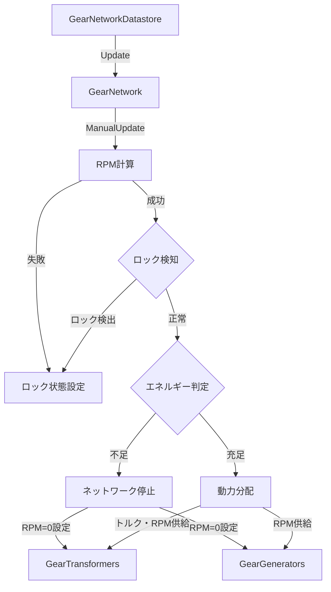
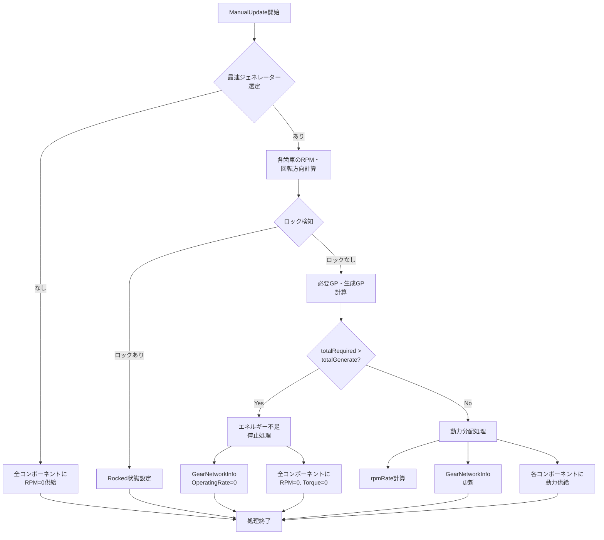

# 技術設計書：歯車ネットワークエネルギー不足停止機能

## 概要

本機能は、歯車ネットワークにおいてエネルギー収支を監視し、必要エネルギーが生成エネルギーを上回った場合にネットワーク全体を停止させる機能です。既存の`GearNetwork.ManualUpdate()`メソッド内の動力分配ロジックを拡張し、エネルギー不足時の明確な停止状態を導入します。

**目的**: プレイヤーに対してエネルギー管理の重要性を明確にし、不足時の動作を予測可能にする。現在の実装では、エネルギー不足時にRPMが減速するのみですが、本機能では完全停止という明確な状態変化を提供します。

**ユーザー**: ゲームプレイヤーが歯車ネットワークを構築・運用する際に利用します。エネルギー不足によるネットワーク停止を視覚的に確認し、ジェネレーターの追加やネットワークの再設計を行います。

**影響**: 既存の`GearNetwork`クラスの`ManualUpdate()`メソッドを修正します。`GearNetworkInfo`構造体は変更不要ですが、新たにエネルギー不足フラグを導入する必要があります。

### ゴール

- エネルギー不足時にネットワーク全体を確実に停止させる
- 既存のロック検知機能との整合性を保つ
- `GearNetworkInfo`を通じてエネルギー状態を正確に報告する
- 既存機能への差分を最小限に抑える

### 非ゴール

- UIでのエネルギー不足通知（別機能として実装）
- エネルギー不足の段階的な警告システム
- ジェネレーター自動追加やネットワーク自動最適化
- 過去のエネルギー履歴の記録

## アーキテクチャ

### 既存アーキテクチャ分析

現在の歯車ネットワークシステムは、以下のアーキテクチャで構成されています：

- **GearNetworkDatastore**: すべての歯車ネットワークを管理し、毎フレームの更新を制御
- **GearNetwork**: 個別のネットワークを表し、RPM計算、ロック検知、動力分配を担当
- **IGearEnergyTransformer**: 歯車コンポーネントのインターフェース（IGearGeneratorを含む）
- **GearNetworkInfo**: ネットワークの状態情報を保持する構造体

**既存のドメイン境界**:
- `Game.Gear` アセンブリ: ネットワークロジックとインターフェース定義
- `Game.Block` アセンブリ: 具体的な歯車コンポーネント実装

**保持すべき統合ポイント**:
- `GearNetworkDatastore.AddGear/RemoveGear`: ネットワーク構築の静的API
- `IGearEnergyTransformer.SupplyPower`: 動力供給インターフェース
- `GearNetworkInfo`: 状態情報の構造体（MessagePack経由でクライアントに送信）

### ハイレベルアーキテクチャ



### 技術スタック整合性

本機能は既存の技術スタックに完全に統合されます：

- **言語**: C# (.NET Standard 2.1)
- **ゲームエンジン**: Unity 2022.3 LTS
- **既存パターン**: `GearNetwork`クラスの`ManualUpdate()`メソッド内でのローカル関数使用
- **依存関係**: 新規外部依存なし、既存の`Game.Gear.Common`名前空間内で完結

**ステアリング原則の遵守**:
- **#regionとローカル関数**: 新しいエネルギー判定ロジックはローカル関数として実装
- **既存システムの活用**: `DistributeGearPower()`の計算結果を再利用
- **XY問題の回避**: エネルギー不足の根本的な対応として完全停止を実装

### 主要設計判断

#### 判断1: エネルギー不足判定の実装場所

**決定**: `GearNetwork.ManualUpdate()`メソッド内の`DistributeGearPower()`呼び出し前に判定ロジックを追加

**コンテキスト**: エネルギー不足時にネットワーク全体を停止させる必要があり、既存のRPM減速ロジック（`DistributeGearPower`内のrpmRate計算）とは異なる動作が求められる

**代替案**:
1. `DistributeGearPower()`内でrpmRate=0として処理
2. 新しい`HaltNetwork()`メソッドを別途作成
3. `GearNetworkInfo`に状態フラグを追加して判定

**選択アプローチ**: `ManualUpdate()`内に新しいローカル関数`CheckEnergyDeficit()`を追加し、不足時は`DistributeGearPower()`をスキップして直接停止処理を実行

**根拠**:
- ロック検知ロジックと同じパターンで実装でき、既存コードとの整合性が高い
- `DistributeGearPower()`は複雑な計算ロジックを含むため、完全にスキップする方が明確
- エネルギー不足とRPM減速は異なる状態であり、コードフローを分離すべき

**トレードオフ**:
- 獲得: コードの可読性向上、エネルギー不足とRPM減速の明確な分離、既存パターンとの整合性
- 犠牲: `ManualUpdate()`メソッドのコード行数増加（ただし#regionで整理可能）

#### 判断2: エネルギー不足状態の表現方法

**決定**: `GearNetworkInfo.OperatingRate`を0に設定し、追加のフラグは導入しない

**コンテキスト**: エネルギー不足時にネットワークが完全停止していることをクライアントやデバッグシステムに通知する必要がある

**代替案**:
1. `GearNetworkInfo`に新しい`IsEnergyDeficit`ブール値を追加
2. `OperatingRate`を負の値（-1など）にしてエネルギー不足を示す
3. 別の状態管理構造体を導入

**選択アプローチ**: `OperatingRate=0`でエネルギー不足による停止を表現し、既存の`GearNetworkInfo`構造を維持

**根拠**:
- エネルギー不足時はRPM=0であり、`OperatingRate=0`は自然な表現
- `GearNetworkInfo`はMessagePackでシリアライズされるため、フィールド追加はプロトコル互換性に影響
- 既存のロック状態も特別なフラグなしで`OperatingRate`から推測可能

**トレードオフ**:
- 獲得: プロトコル互換性維持、構造のシンプルさ、既存パターンとの一貫性
- 犠牲: エネルギー不足とジェネレーター不在の区別が`OperatingRate`のみでは困難（デバッグ時は`TotalRequiredGearPower`と`TotalGenerateGearPower`の比較で判別可能）

## システムフロー

### エネルギー不足判定と停止処理フロー



## 要求事項トレーサビリティ

| 要求 | 要求概要 | コンポーネント | インターフェース | フロー |
|------|----------|----------------|------------------|--------|
| 1.1 | 総必要GP・総生成GPの計算 | GearNetwork | ManualUpdate | エネルギー不足判定フロー |
| 1.2 | エネルギー不足状態判定 | GearNetwork | CheckEnergyDeficit (ローカル関数) | エネルギー不足判定フロー |
| 1.3 | エネルギー充足状態判定 | GearNetwork | CheckEnergyDeficit (ローカル関数) | エネルギー不足判定フロー |
| 1.4 | 状態変化記録 | GearNetwork | GearNetworkInfo.OperatingRate | エネルギー不足判定フロー |
| 2.1 | GearTransformerへRPM=0供給 | GearNetwork | IGearEnergyTransformer.SupplyPower | 停止処理フロー |
| 2.2 | GearGeneratorへRPM=0供給 | GearNetwork | IGearGenerator.SupplyPower | 停止処理フロー |
| 2.3 | すべての歯車コンポーネント停止 | GearEnergyTransformer | SupplyPower実装 | 停止処理フロー |
| 2.4 | エネルギー回復時の通常動作再開 | GearNetwork | DistributeGearPower | 動力分配フロー |
| 3.1 | CurrentGearNetworkInfoへ停止状態反映 | GearNetwork | GearNetworkInfo構造体 | エネルギー不足判定フロー |
| 3.2 | OperatingRate=0設定 | GearNetwork | GearNetworkInfo.OperatingRate | エネルギー不足判定フロー |
| 3.3 | 通常動作時のOperatingRate反映 | GearNetwork | GearNetworkInfo.OperatingRate | 動力分配フロー |
| 3.4 | デバッグ・UI用状態提供 | GearStateDetail | MessagePack経由 | 既存のBlockStateDetail取得フロー |
| 4.1 | ロック検知の優先 | GearNetwork | ManualUpdate処理順序 | エネルギー不足判定フロー |
| 4.2 | ジェネレーター不在時の動作維持 | GearNetwork | ManualUpdate | 既存フロー（変更なし） |
| 4.3 | エネルギー充足時のrpmRate使用 | GearNetwork | DistributeGearPower | 動力分配フロー |
| 4.4 | エネルギー不足時のDistributeGearPowerスキップ | GearNetwork | ManualUpdate | エネルギー不足判定フロー |
| 5.1-5.4 | パフォーマンス・保守性 | GearNetwork | #regionとローカル関数 | 全フロー |

## コンポーネントとインターフェース

### Game.Gear ドメイン

#### GearNetwork (既存クラスの修正)

**責任とドメイン境界**
- **主要責任**: 単一の歯車ネットワーク内のRPM計算、ロック検知、エネルギー判定、動力分配
- **ドメイン境界**: `Game.Gear.Common`名前空間内のネットワークロジック
- **データ所有**: ネットワーク内のGearTransformer/Generator参照、現在のGearNetworkInfo
- **トランザクション境界**: 1回の`ManualUpdate()`呼び出しで全ネットワーク状態が一貫して更新される

**依存関係**
- **インバウンド**: `GearNetworkDatastore`が毎フレーム`ManualUpdate()`を呼び出す
- **アウトバウンド**: `IGearEnergyTransformer`, `IGearGenerator`インターフェースを通じて各コンポーネントに動力を供給
- **外部**: なし（完全にGame.Gear.Common内で完結）

**契約定義**

**サービスインターフェース**:

```csharp
public class GearNetwork
{
    // 既存メンバー
    public IReadOnlyList<IGearEnergyTransformer> GearTransformers { get; }
    public IReadOnlyList<IGearGenerator> GearGenerators { get; }
    public GearNetworkInfo CurrentGearNetworkInfo { get; private set; }
    public readonly GearNetworkId NetworkId;

    // 既存メソッド（修正対象）
    public void ManualUpdate();

    // 新規追加なし（内部ロジックの変更のみ）
}
```

**事前条件**:
- `ManualUpdate()`呼び出し時、ネットワーク内のすべてのGearTransformer/Generatorが有効な状態であること
- 各コンポーネントの`GetGearConnects()`が正しい接続情報を返すこと

**事後条件**:
- すべてのGearTransformer/Generatorに対して`SupplyPower()`または`Rocked()`が呼び出される
- `CurrentGearNetworkInfo`が最新のネットワーク状態を反映する
- エネルギー不足時、すべてのコンポーネントのRPMが0になる

**不変条件**:
- ロック検知が常にエネルギー判定より優先される
- `CurrentGearNetworkInfo`の値が、実際に供給された動力と一致する

**状態管理**

**状態モデル**: ネットワークは以下の3つの状態を持つ
1. **正常動作**: エネルギー充足、RPM > 0
2. **エネルギー不足停止**: 必要GP > 生成GP、RPM = 0
3. **ロック停止**: 回転矛盾検出、`IsRocked = true`

**状態遷移**:
```
正常動作 <--> エネルギー不足停止
    ↓               ↓
    +-> ロック停止 <-+
```

**永続化**: ネットワーク状態は永続化されない（毎フレーム再計算）

**並行性**: 単一スレッドでの実行を前提（Unity Updateループ）

**統合戦略**

**修正アプローチ**: 既存の`ManualUpdate()`メソッドを拡張
- `DistributeGearPower()`呼び出し前にエネルギー判定ロジックを追加
- ローカル関数`HaltNetworkForEnergyDeficit()`を新規追加
- 既存のrpmRate計算ロジックは維持

**後方互換性**: 完全に維持
- `GearNetworkInfo`構造体の変更なし
- 既存のテストケースはすべて動作継続
- エネルギー充足時の動作は完全に同一

**移行パス**: 変更不要（インターフェース変更なし）

### Game.Gear.Common名前空間

#### GearNetworkInfo (既存構造体、変更なし)

**責任とドメイン境界**
- **主要責任**: ネットワークのエネルギー状態をクライアントやデバッグシステムに伝える
- **ドメイン境界**: `Game.Gear.Common`名前空間内のデータ転送オブジェクト
- **データ所有**: 総必要GP、総生成GP、稼働率

**契約定義**:

```csharp
public readonly struct GearNetworkInfo
{
    public readonly float TotalRequiredGearPower;
    public readonly float TotalGenerateGearPower;
    public readonly float OperatingRate; // エネルギー不足時は0

    public GearNetworkInfo(float totalRequiredGearPower, float totalGenerateGearPower, float operatingRate);
    public static GearNetworkInfo CreateEmpty();
}
```

**使用パターン**:
- エネルギー不足時: `new GearNetworkInfo(totalRequiredGearPower, totalGenerateGearPower, 0)`
- エネルギー充足時: `new GearNetworkInfo(totalRequiredGearPower, totalGenerateGearPower, rpmRate)`

## データモデル

### ドメインモデル

本機能は既存のドメインモデルを変更しません。エネルギー不足状態は、既存の`GearNetworkInfo`構造体の`OperatingRate`フィールドを通じて表現されます。

**コア概念**:
- **GearNetwork (Aggregate)**: トランザクション境界を形成するネットワーク全体
- **GearNetworkInfo (Value Object)**: 不変のネットワーク状態スナップショット
- **OperatingRate (Value)**: エネルギー充足度を表す値（0.0～1.0、エネルギー不足時は0）

**ビジネスルールと不変条件**:
- エネルギー不足時、OperatingRateは必ず0でなければならない
- TotalRequiredGearPower > TotalGenerateGearPowerの場合、ネットワークは停止状態でなければならない
- ロック状態はエネルギー不足より優先される

## エラーハンドリング

### エラー戦略

本機能は、エネルギー不足を**エラー**ではなく**正常な動作状態の一つ**として扱います。したがって、例外のスローやエラーログの出力は行いません。

### エラーカテゴリと応答

**想定される異常状態**:

1. **ジェネレーター不在**: 既存動作を維持（全コンポーネントにRPM=0供給）
2. **ロック検知**: 既存動作を維持（ロック状態設定、エネルギー判定より優先）
3. **エネルギー不足**: 新しい動作（ネットワーク停止、OperatingRate=0）

**応答パターン**:
- エネルギー不足検出 → 全コンポーネントに`SupplyPower(RPM=0, Torque=0)`呼び出し
- 状態不整合なし → 値オブジェクト（GearPower, RPM, Torque）で型安全性確保
- nullチェック不要 → すべてのコンポーネントはネットワーク構築時に保証される

### モニタリング

**状態追跡**:
- `GearNetworkInfo.OperatingRate == 0` かつ `TotalRequiredGearPower > TotalGenerateGearPower` でエネルギー不足を検出
- `GearStateDetail`を通じてクライアントに状態が送信される（既存機能）
- デバッグ用に`CurrentGearNetworkInfo`をInspectorで確認可能

**ログ出力**: なし（パフォーマンス重視、状態変化は正常動作）

## テスト戦略

### ユニットテスト

**GearNetworkTest (既存テストクラスの拡張)**:

1. **EnergyDeficitHaltTest**: エネルギー不足時のネットワーク停止
   - セットアップ: SimpleGearGenerator（トルク1）と高負荷歯車（要求トルク計3）を配置
   - 実行: `ManualUpdate()`を呼び出し
   - 検証: すべてのGearTransformer/GeneratorのCurrentRpmが0であること
   - 検証: `CurrentGearNetworkInfo.OperatingRate`が0であること

2. **EnergyRecoveryTest**: エネルギー回復時の通常動作再開
   - セットアップ: エネルギー不足状態を作成
   - 実行: 高負荷歯車を削除してエネルギー充足状態にし、`ManualUpdate()`を呼び出し
   - 検証: GearTransformer/GeneratorのCurrentRpmが0より大きいこと
   - 検証: `CurrentGearNetworkInfo.OperatingRate`が0より大きいこと

3. **RockTakesPriorityOverEnergyDeficitTest**: ロック検知がエネルギー不足より優先
   - セットアップ: RPM矛盾を含むネットワークを構築（同時にエネルギー不足も発生）
   - 実行: `ManualUpdate()`を呼び出し
   - 検証: すべてのコンポーネントの`IsRocked`がtrueであること
   - 検証: `CurrentGearNetworkInfo.OperatingRate`が0であること（ロック状態の結果）

4. **NoGeneratorBehaviorUnchangedTest**: ジェネレーター不在時の既存動作維持
   - セットアップ: ジェネレーターなしでGearTransformerのみ配置
   - 実行: `ManualUpdate()`を呼び出し
   - 検証: すべてのGearTransformerのCurrentRpmが0であること（既存動作）
   - 検証: `CurrentGearNetworkInfo`が`CreateEmpty()`の結果と一致すること

5. **ExactEnergyBalanceTest**: 必要GP = 生成GPの境界値テスト
   - セットアップ: 必要GPと生成GPが完全に等しいネットワークを構築
   - 実行: `ManualUpdate()`を呼び出し
   - 検証: GearTransformer/GeneratorのCurrentRpmが0より大きいこと（エネルギー充足として扱う）
   - 検証: `CurrentGearNetworkInfo.OperatingRate`が1.0であること

### 統合テスト

**GearMachineIOTest (既存テストの回帰確認)**:
- 既存の`ServeTorqueTest`, `ServeTorqueOverTest`がエネルギー充足時の動作を確認
- エネルギー不足機能追加後も、エネルギー充足時の動作が変化しないことを確認

### E2E/UIテスト（該当なし）

本機能はサーバー側のロジックのみのため、E2EテストやUIテストは不要です。クライアント側のUI表示は別機能として実装されます。

### パフォーマンステスト（該当なし）

エネルギー判定は既存の`totalRequiredGearPower`と`totalGenerateGearPower`の計算結果を再利用するため、パフォーマンスへの影響は最小限です。大規模ネットワークでの回帰確認は既存のパフォーマンステストで十分です。
