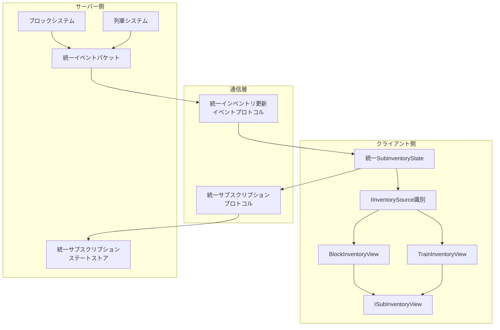
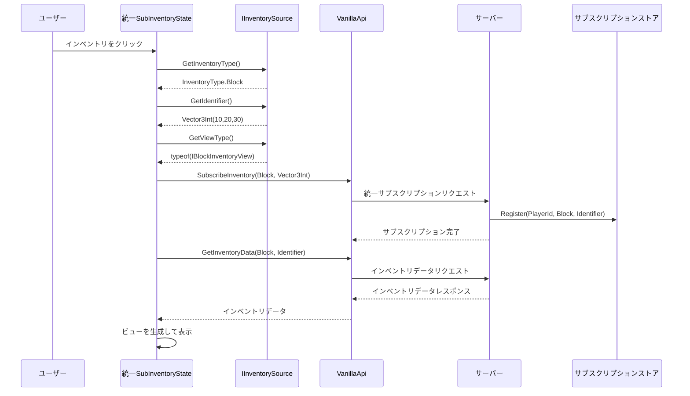
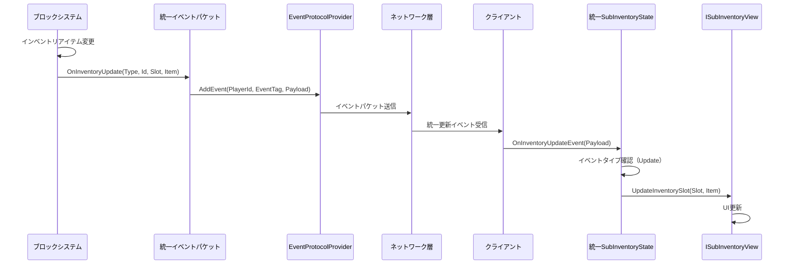
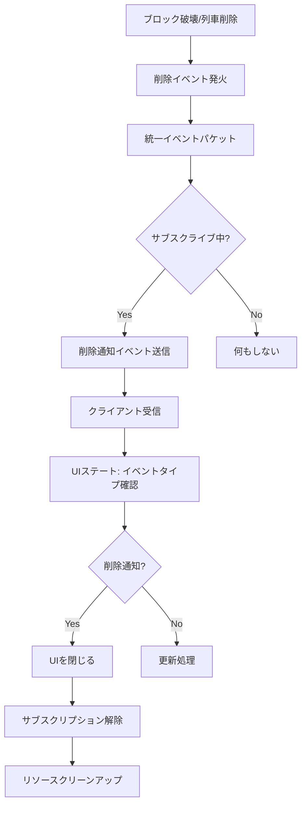
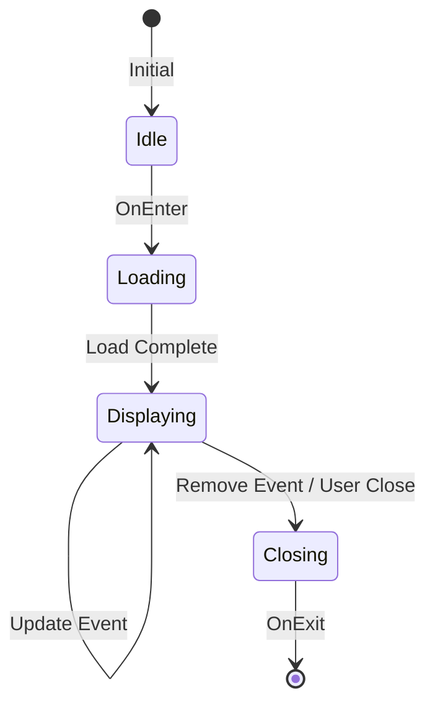
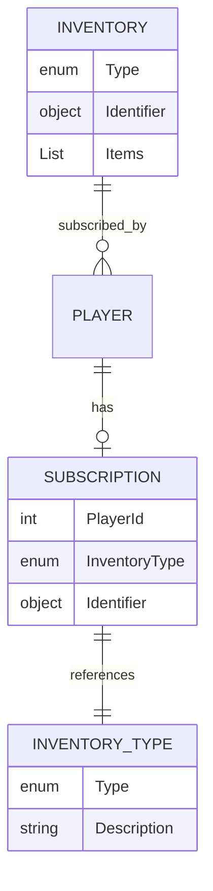
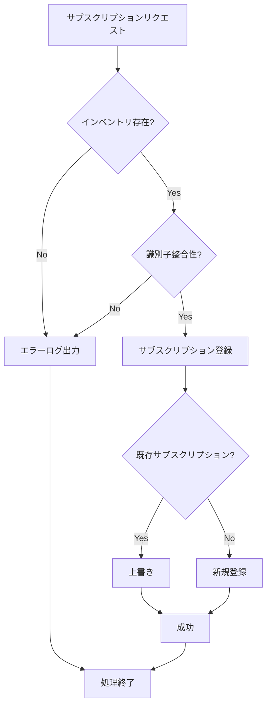
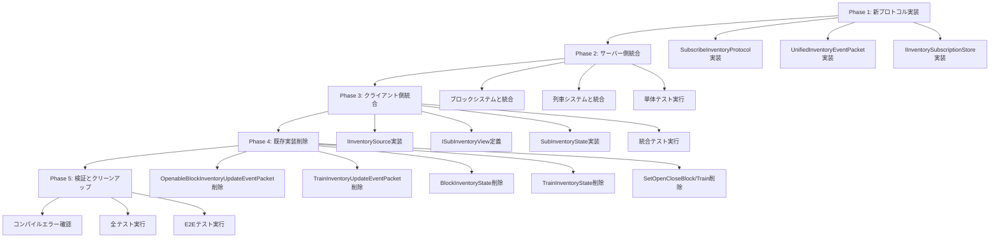

# 技術設計書：インベントリサブスクリプション統一化

## 概要

現在、moorestechではブロックインベントリと列車インベントリが別々のプロトコル、イベントパケット、UIステートクラスとして実装されています。この重複実装により、保守性の低下、バグ増加リスク、新機能追加時の実装コストの増大が発生しています。

本設計では、これらのインベントリサブスクリプションシステムを統一的なアーキテクチャに抽象化します。具体的には、(1) サーバー側でインベントリタイプ（Block/Train）を識別子として持つ統一イベントプロトコルを定義、(2) クライアント側でISubInventoryViewインターフェースを導入してUIステートクラスを統合、(3) インベントリソース識別機構を導入してタイプ別の処理を明確に分離します。

この統一化により、将来的な新しいインベントリタイプ（例：船舶、倉庫）の追加が容易になり、コードの重複を排除し、システム全体の保守性が向上します。

### ゴール

- サーバー側のインベントリ更新イベントプロトコルを統一し、ブロックと列車の両方に対応
- クライアント側のUIステートクラス（BlockInventoryStateとTrainInventoryState）を統合し、重複コードを削減
- インベントリタイプ別の処理を明確に分離し、拡張性を確保
- インベントリ削除通知機能を追加し、インベントリが削除された際にUIを自動的に閉じる

### 非ゴール

- パフォーマンスの最適化（プロジェクト方針により後回し）
- 後方互換性の維持（プロジェクト方針により既存実装を削除）
- 新しいインベントリタイプ（船舶、倉庫等）の実装（将来の拡張として考慮するが、本設計では実装しない）

## アーキテクチャ

### 既存アーキテクチャ分析

現在のインベントリシステムは以下の構造で実装されています：

**サーバー側:**
- `BlockInventoryOpenCloseProtocol`: ブロックインベントリのオープン/クローズを管理
- `OpenableBlockInventoryUpdateEventPacket`: ブロックインベントリ更新イベントを通知
- `TrainInventoryUpdateEventPacket`: 列車インベントリ更新イベントを通知（未実装部分あり）
- `IBlockInventoryOpenStateDataStore`: プレイヤーとブロックインベントリの紐付けを管理

**クライアント側:**
- `BlockInventoryState`: ブロックインベントリUIの状態管理
- `TrainInventoryState`: 列車インベントリUIの状態管理
- `IBlockInventoryView`: ブロックインベントリビューインターフェース
- `ITrainInventoryView`: 列車インベントリビューインターフェース

**問題点:**
- プロトコルとイベントパケットが重複実装されている
- UIステートクラスの実装がほぼ同一だが、別々のクラスとして存在
- 新しいインベントリタイプを追加する際、すべてのレイヤーで実装が必要

### 統一アーキテクチャ設計



### 技術スタック整合性

本機能は既存の技術スタックに完全に準拠します：

**サーバー側:**
- C# (.NET Standard 2.1)
- MessagePack: プロトコルシリアライゼーション
- Microsoft.Extensions.DependencyInjection: 依存性注入
- 既存のプロトコル実装パターンを踏襲

**クライアント側:**
- C# (.NET Standard 2.1)
- VContainer: 依存性注入
- UniRx: イベント処理
- 既存のUIステートパターンを踏襲

**新規導入ライブラリ:** なし

### 主要設計決定

#### 決定1: インベントリタイプ識別方式

**決定:** enum型の`InventoryType`（Block/Train）と、タイプごとの識別子（BlockはVector3Int、TrainはGuid）を組み合わせた識別方式を採用

**コンテキスト:** インベントリの種類を識別し、適切な処理を振り分ける必要がある。各インベントリタイプは異なる識別子（ブロックは座標、列車はID）を持つ。

**代替案:**
1. 文字列ベースの識別子（例：`"block:10,20,30"`）
2. すべてをGuidで統一
3. 継承階層による型ベースの識別

**選択アプローチ:** enum型 + タイプ別識別子

**理由:**
- 型安全性が高く、コンパイル時にエラーを検出できる
- 各インベントリタイプの自然な識別子（座標、GUID）を保持できる
- MessagePackでのシリアライゼーションが効率的
- 新しいインベントリタイプの追加が明確（enumに追加するだけ）

**トレードオフ:**
- 得られるもの: 型安全性、明確な拡張ポイント、効率的なシリアライゼーション
- 犠牲にするもの: 識別子の完全な統一性（タイプごとに異なる識別子型を持つ）

#### 決定2: イベント通知の統一方式

**決定:** 更新イベントと削除通知イベントを単一のプロトコルに統合し、イベントタイプ（Update/Remove）で区別

**コンテキスト:** インベントリの更新通知に加えて、インベントリが削除された際の通知も必要。別々のイベントにするか、単一のイベントで表現するかの選択。

**代替案:**
1. 更新イベントと削除イベントを別々のプロトコルとして定義
2. 削除通知は更新イベントでnullアイテムとして表現
3. 削除通知はブロック削除イベント／列車削除イベントで代用

**選択アプローチ:** 単一プロトコル + イベントタイプ識別

**理由:**
- クライアント側で単一のイベントハンドラーで処理できる
- プロトコル数の削減により保守性が向上
- イベントタイプによる明確な意味の区別
- 将来的な他のイベントタイプ（例：一時停止）の追加が容易

**トレードオフ:**
- 得られるもの: プロトコル数の削減、統一的なイベント処理、拡張性
- 犠牲にするもの: イベントタイプごとの最適化（更新と削除で必要なデータが異なる場合）

#### 決定3: UIステート統合方式

**決定:** インベントリソース識別インターフェース（`IInventorySource`）を導入し、タイプ別の処理を戦略パターンで実装

**コンテキスト:** BlockInventoryStateとTrainInventoryStateはほぼ同一の実装だが、一部でブロック固有/列車固有の処理がある。完全に統合するか、部分的に統合するかの選択。

**代替案:**
1. 完全に単一クラスに統合し、if文でタイプ別処理を分岐
2. 抽象基底クラスを作り、継承で差分を実装
3. 現状維持（統合しない）

**選択アプローチ:** 戦略パターン + インターフェース分離

**理由:**
- タイプ別の処理が明確に分離され、Open-Closed原則に準拠
- 新しいインベントリタイプの追加が容易（新しい戦略クラスを追加するだけ）
- if文による分岐を排除し、保守性が向上
- 各インベントリタイプの実装が独立しており、テストが容易

**トレードオフ:**
- 得られるもの: 高い拡張性、明確な責務分離、テスト容易性
- 犠牲にするもの: クラス数の増加、初期実装の複雑度の増加

## システムフロー

### インベントリオープンシーケンス



### インベントリ更新イベントフロー



### インベントリ削除通知フロー



## 要件トレーサビリティ

| 要件 | 要件概要 | コンポーネント | インターフェース | フロー |
|------|----------|----------------|------------------|--------|
| 1.1 | 統一インベントリ更新イベント | UnifiedInventoryEventPacket | IUnifiedInventoryEvent | インベントリ更新イベントフロー |
| 1.2 | インベントリ削除通知 | UnifiedInventoryEventPacket | IUnifiedInventoryEvent | インベントリ削除通知フロー |
| 2.1 | 統一サブスクリプションプロトコル | SubscribeInventoryProtocol | IPacketResponse | インベントリオープンシーケンス |
| 3.1 | ISubInventoryView定義 | ISubInventoryView | Initialize, UpdateItemList, UpdateInventorySlot, DestroyUI | - |
| 4.1 | インベントリソース識別 | IInventorySource | GetInventoryType, GetIdentifier, GetViewType | インベントリオープンシーケンス |
| 5.1 | 統一UIステート | SubInventoryState | IUIState | すべてのフロー |
| 6.1 | 既存実装の削除 | - | - | マイグレーション戦略 |
| 7.1 | テスト容易性 | すべてのコンポーネント | すべてのインターフェース | テスト戦略 |

## コンポーネントと設計

### Server.Protocol層

#### SubscribeInventoryProtocol

**責務と境界**
- **主要責務:** クライアントからのインベントリサブスクリプション要求を処理し、プレイヤーとインベントリの紐付けを管理
- **ドメイン境界:** Server.Protocol（プロトコル層）
- **データ所有権:** サブスクリプション状態は`IInventorySubscriptionStore`が所有
- **トランザクション境界:** 単一のサブスクリプション操作（Open/Close）

**依存関係**
- **Inbound:** クライアントからのプロトコルリクエスト
- **Outbound:** `IInventorySubscriptionStore`（サブスクリプション状態管理）

**サービスインターフェース**

```csharp
public class SubscribeInventoryProtocol : IPacketResponse
{
    public const string ProtocolTag = "va:invSubscribe";

    ProtocolMessagePackBase GetResponse(List<byte> payload);
}

[MessagePackObject]
public class SubscribeInventoryRequestMessagePack : ProtocolMessagePackBase
{
    [Key(0)] public string Tag { get; set; }
    [Key(1)] public int PlayerId { get; set; }
    [Key(2)] public InventoryType Type { get; set; }
    [Key(3)] public InventoryIdentifier Identifier { get; set; }
    [Key(4)] public bool IsSubscribe { get; set; } // true: Subscribe, false: Unsubscribe
}

[MessagePackObject]
public class InventoryIdentifier
{
    [Key(0)] public Vector3IntMessagePack BlockPosition { get; set; }
    [Key(1)] public string TrainId { get; set; } // Guid as string
}

public enum InventoryType : byte
{
    Block = 0,
    Train = 1
}
```

**事前条件:**
- PlayerId は有効なプレイヤーIDである
- InventoryType は定義された値である
- Identifier はタイプに対応した値が設定されている（BlockならBlockPosition、TrainならTrainId）

**事後条件:**
- IsSubscribe=true の場合、プレイヤーIDとインベントリの紐付けが登録される
- IsSubscribe=false の場合、紐付けが削除される

**不変条件:**
- 1つのプレイヤーは同時に1つのインベントリのみをサブスクライブできる

#### UnifiedInventoryEventPacket

**責務と境界**
- **主要責務:** インベントリの更新および削除イベントをサブスクライブ中のクライアントに通知
- **ドメイン境界:** Server.Event（イベント層）
- **データ所有権:** イベントデータは一時的なもので所有権なし
- **トランザクション境界:** 単一のイベント通知

**依存関係**
- **Inbound:** ブロックシステム、列車システムからのゲームイベント
- **Outbound:** `EventProtocolProvider`（イベント配信）、`IInventorySubscriptionStore`（サブスクライバー取得）

**イベント契約**

```csharp
public class UnifiedInventoryEventPacket
{
    public const string EventTag = "va:event:invUpdate";

    // 購読イベント: ブロックインベントリ更新
    // 購読イベント: 列車インベントリ更新
    // 購読イベント: ブロック削除
    // 購読イベント: 列車削除
}

[MessagePackObject]
public class UnifiedInventoryEventMessagePack : ProtocolMessagePackBase
{
    [Key(0)] public string Tag { get; set; }
    [Key(1)] public InventoryEventType EventType { get; set; }
    [Key(2)] public InventoryType InventoryType { get; set; }
    [Key(3)] public InventoryIdentifier Identifier { get; set; }
    [Key(4)] public int Slot { get; set; } // 更新イベントのみ使用
    [Key(5)] public ItemMessagePack Item { get; set; } // 更新イベントのみ使用
}

public enum InventoryEventType : byte
{
    Update = 0,  // アイテム更新
    Remove = 1   // インベントリ削除
}
```

**配信保証:** At-least-once（EventProtocolProviderの仕様に準拠）

**順序保証:** 同一インベントリに対するイベントは発生順に配信される

**冪等性:** クライアント側でイベント処理時にインベントリの存在チェックを行い、削除済みの場合は無視

#### IInventorySubscriptionStore

**責務と境界**
- **主要責務:** プレイヤーIDとサブスクライブ中のインベントリの紐付けを管理
- **ドメイン境界:** Game.PlayerInventory（プレイヤーインベントリ層）
- **データ所有権:** サブスクリプション状態データを所有
- **トランザクション境界:** 単一のサブスクリプション操作

**サービスインターフェース**

```csharp
public interface IInventorySubscriptionStore
{
    /// <summary>
    /// 指定したインベントリをサブスクライブしているプレイヤーIDのリストを取得
    /// </summary>
    List<int> GetSubscribers(InventoryType type, object identifier);

    /// <summary>
    /// プレイヤーがインベントリをサブスクライブ
    /// </summary>
    void Subscribe(int playerId, InventoryType type, object identifier);

    /// <summary>
    /// プレイヤーのサブスクリプションを解除
    /// </summary>
    void Unsubscribe(int playerId);

    /// <summary>
    /// プレイヤーが現在サブスクライブしているインベントリ情報を取得
    /// </summary>
    (InventoryType type, object identifier)? GetCurrentSubscription(int playerId);
}
```

**事前条件:**
- playerId は有効なプレイヤーIDである
- identifier はInventoryTypeに対応した型である（Block=Vector3Int、Train=Guid）

**事後条件:**
- Subscribe後、GetSubscribersで該当プレイヤーIDが返される
- Unsubscribe後、GetCurrentSubscriptionはnullを返す

**不変条件:**
- 1つのプレイヤーは同時に1つのインベントリのみをサブスクライブできる
- 同一インベントリを複数プレイヤーがサブスクライブできる

**状態管理**

```csharp
// 内部状態モデル
private Dictionary<int, (InventoryType type, object identifier)> _playerSubscriptions;
private Dictionary<(InventoryType, object), HashSet<int>> _inventorySubscribers;
```

**並行性制御:** シングルスレッド前提（Unityメインスレッド）のため、ロック不要

### Client.Game層

#### IInventorySource

**責務と境界**
- **主要責務:** インベントリのタイプと識別子を提供し、どのUIビューを使用するかを決定
- **ドメイン境界:** Client.Game.InGame.UI（UI層）
- **データ所有権:** インベントリ識別情報を保持
- **トランザクション境界:** なし（情報提供のみ）

**サービスインターフェース**

```csharp
public interface IInventorySource
{
    /// <summary>
    /// インベントリタイプを取得
    /// </summary>
    InventoryType GetInventoryType();

    /// <summary>
    /// インベントリ識別子を取得（Block: Vector3Int, Train: Guid）
    /// </summary>
    InventoryIdentifier GetIdentifier();

    /// <summary>
    /// 使用するビューのタイプを取得
    /// </summary>
    Type GetViewType();

    /// <summary>
    /// Addressableパスを取得
    /// </summary>
    string GetAddressablePath();

    /// <summary>
    /// インベントリデータ取得用の非同期処理を実行
    /// </summary>
    UniTask<List<IItemStack>> FetchInventoryData(CancellationToken ct);
}
```

**実装クラス:**

```csharp
public class BlockInventorySource : IInventorySource
{
    private readonly Vector3Int _blockPosition;
    private readonly BlockGameObject _blockGameObject;

    public InventoryType GetInventoryType() => InventoryType.Block;
    public InventoryIdentifier GetIdentifier() => new InventoryIdentifier { BlockPosition = _blockPosition };
    public Type GetViewType() => typeof(IBlockInventoryView);
    public string GetAddressablePath() => _blockGameObject.BlockMasterElement.BlockUIAddressablesPath;

    public async UniTask<List<IItemStack>> FetchInventoryData(CancellationToken ct)
    {
        return await ClientContext.VanillaApi.Response.GetBlockInventory(_blockPosition, ct);
    }
}

public class TrainInventorySource : IInventorySource
{
    private readonly Guid _trainId;
    private readonly TrainEntityObject _trainEntity;

    public InventoryType GetInventoryType() => InventoryType.Train;
    public InventoryIdentifier GetIdentifier() => new InventoryIdentifier { TrainId = _trainId.ToString() };
    public Type GetViewType() => typeof(ITrainInventoryView);
    public string GetAddressablePath() => "InGame/UI/Inventory/TrainInventoryView";

    public async UniTask<List<IItemStack>> FetchInventoryData(CancellationToken ct)
    {
        return await ClientContext.VanillaApi.Response.GetTrainInventory(_trainId, ct);
    }
}
```

#### ISubInventoryView

**責務と境界**
- **主要責務:** インベントリUIの表示と更新を統一的に管理
- **ドメイン境界:** Client.Game.InGame.UI.Inventory（インベントリUI層）
- **データ所有権:** UIの表示状態を所有
- **トランザクション境界:** なし（UI表示のみ）

**サービスインターフェース**

```csharp
public interface ISubInventoryView : ISubInventory
{
    /// <summary>
    /// ビューを初期化（ジェネリック版）
    /// </summary>
    void Initialize(object context);

    /// <summary>
    /// アイテムリストを一括更新
    /// </summary>
    void UpdateItemList(List<IItemStack> items);

    /// <summary>
    /// 特定スロットのアイテムを更新
    /// </summary>
    void UpdateInventorySlot(int slot, IItemStack item);

    /// <summary>
    /// UIを破棄
    /// </summary>
    void DestroyUI();
}
```

**実装クラス:**

```csharp
public interface IBlockInventoryView : ISubInventoryView
{
    // ブロック固有の初期化（型安全版）
    void Initialize(BlockGameObject blockGameObject);
}

public interface ITrainInventoryView : ISubInventoryView
{
    // 列車固有の初期化（型安全版）
    void Initialize(TrainEntityObject trainEntity);
}
```

**統合戦略:**
- 既存の`IBlockInventoryView`と`ITrainInventoryView`は`ISubInventoryView`を継承するように変更
- ブロック固有／列車固有の`Initialize`メソッドは型安全性のために残す
- `ISubInventoryView.Initialize(object)`は基底実装で型チェックして適切なInitializeを呼び出す

#### SubInventoryState

**責務と境界**
- **主要責務:** インベントリUIの状態を管理し、サブスクリプションとイベント処理を統一的に実装
- **ドメイン境界:** Client.Game.InGame.UI.UIState（UIステート層）
- **データ所有権:** 現在表示中のインベントリUIの状態を所有
- **トランザクション境界:** UIのライフサイクル（OnEnter～OnExit）

**依存関係**
- **Inbound:** UIStateControllerからの状態遷移
- **Outbound:** `IInventorySource`（インベントリ識別）、`ISubInventoryView`（UI表示）、`VanillaApi`（通信）

**サービスインターフェース**

```csharp
public class SubInventoryState : IUIState
{
    private IInventorySource _currentSource;
    private ISubInventoryView _currentView;
    private CancellationTokenSource _loadInventoryCts;
    private IDisposable _removeNotificationSubscription;

    public void OnEnter(UIStateEnum lastStateEnum);
    public UIStateEnum GetNextUpdate();
    public void OnExit();
}
```

**状態遷移:**



**状態管理:**
- **Idle:** インベントリが開かれていない状態
- **Loading:** インベントリデータを読み込み中
- **Displaying:** インベントリを表示中
- **Closing:** インベントリを閉じる処理中

**統合方式:**
- `BlockInventoryState`と`TrainInventoryState`を削除
- `SubInventoryState`が`IInventorySource`を使用してタイプ別の処理を委譲
- ブロック固有処理は`IBlockInventoryView`への型チェックで分岐

## データモデル

### 論理データモデル

#### サブスクリプション管理



**エンティティ定義:**

- **Player:** プレイヤーを表すエンティティ（既存）
- **Subscription:** プレイヤーとインベントリの紐付け（新規）
  - PlayerId: プレイヤーID
  - InventoryType: インベントリタイプ（Block/Train）
  - Identifier: インベントリ識別子（Vector3Int or Guid）
- **Inventory:** インベントリエンティティ（既存）
  - Type: インベントリタイプ
  - Identifier: インベントリ識別子
  - Items: アイテムリスト

**ビジネスルール:**
- 1プレイヤーは同時に1つのインベントリのみをサブスクライブできる
- 1つのインベントリは複数プレイヤーにサブスクライブされ得る
- インベントリが削除された場合、すべてのサブスクリプションが無効化される

### データ契約とインテグレーション

#### プロトコルデータスキーマ

**サブスクリプションリクエスト:**

```csharp
[MessagePackObject]
public class SubscribeInventoryRequestMessagePack
{
    [Key(0)] public string Tag { get; set; }
    [Key(1)] public int PlayerId { get; set; }
    [Key(2)] public InventoryType Type { get; set; }
    [Key(3)] public InventoryIdentifier Identifier { get; set; }
    [Key(4)] public bool IsSubscribe { get; set; }
}
```

**イベントペイロード:**

```csharp
[MessagePackObject]
public class UnifiedInventoryEventMessagePack
{
    [Key(0)] public string Tag { get; set; }
    [Key(1)] public InventoryEventType EventType { get; set; }
    [Key(2)] public InventoryType InventoryType { get; set; }
    [Key(3)] public InventoryIdentifier Identifier { get; set; }
    [Key(4)] public int Slot { get; set; }
    [Key(5)] public ItemMessagePack Item { get; set; }
}
```

**共通識別子:**

```csharp
[MessagePackObject]
public class InventoryIdentifier
{
    [Key(0)] public Vector3IntMessagePack BlockPosition { get; set; }
    [Key(1)] public string TrainId { get; set; }
}
```

**バリデーションルール:**
- `InventoryType.Block`の場合、`Identifier.BlockPosition`は非null
- `InventoryType.Train`の場合、`Identifier.TrainId`は非null、かつ有効なGuid文字列
- `EventType.Update`の場合、`Slot`と`Item`は非null
- `EventType.Remove`の場合、`Slot`と`Item`は無視される

#### スキーマバージョニング戦略

**初期バージョン:** v1

**後方互換性方針:** プロジェクト方針により後方互換性は考慮しない

**将来の拡張:**
- 新しいInventoryType追加時は、enumに値を追加
- IdentifierにType別のフィールドを追加（例：ShipId）
- MessagePackのKey番号を連番で追加

## エラーハンドリング

### エラー戦略

moorestechプロジェクトの方針に従い、try-catchは使用せず、適切な条件分岐とnullチェックでエラーに対応します。

### エラーカテゴリと対応

#### ユーザーエラー

**1. 存在しないインベントリのサブスクライブ**
- **検出:** サブスクリプションリクエスト処理時に、インベントリの存在チェック
- **対応:** サブスクリプションを登録せず、クライアントにエラーログを表示（nullチェックで対応）
- **リカバリー:** ユーザーが再度インベントリを開く操作を行う

**2. 無効な識別子の指定**
- **検出:** InventoryTypeとIdentifierの整合性チェック
- **対応:** サブスクリプション処理をスキップし、ログ出力
- **リカバリー:** 自動リカバリーなし、開発時にログで検知

#### システムエラー

**1. ネットワーク切断**
- **検出:** UniTaskのCancellationToken経由で検知
- **対応:** ロード処理をキャンセルし、UIを閉じる
- **リカバリー:** 再接続後にユーザーが再度インベントリを開く

**2. Addressableロード失敗**
- **検出:** AddressableLoader.LoadAsyncがnullを返す
- **対応:** nullチェックでエラーログを出力し、UIを開かない
- **リカバリー:** 自動リカバリーなし、開発時にログで検知

**3. インベントリデータ取得タイムアウト**
- **検出:** UniTaskのキャンセレーション
- **対応:** ロード処理を中断し、UIを閉じる
- **リカバリー:** ユーザーが再度開く操作を行う

#### ビジネスロジックエラー

**1. 重複サブスクリプション**
- **検出:** 同一プレイヤーIDの既存サブスクリプションチェック
- **対応:** 既存サブスクリプションを上書き
- **リカバリー:** 自動リカバリー（最新のサブスクリプションが有効）

**2. インベントリ削除中の更新イベント**
- **検出:** クライアント側でインベントリの存在チェック
- **対応:** 更新イベントを無視（冪等性保証）
- **リカバリー:** 削除通知イベントでUIを閉じる

### エラーフロー



### モニタリング

**ログ戦略:**
- エラーレベル: インベントリが存在しない、識別子が不正、Addressableロード失敗
- 警告レベル: 重複サブスクリプション、ネットワーク切断
- 情報レベル: サブスクリプション登録、削除通知送信

**ログ出力場所:**
- サーバー側: Unity Console（開発時）
- クライアント側: Unity Console（開発時）、InGameDebugConsole

**ヘルスチェック:**
- サブスクリプション数のモニタリング（異常な増加を検知）
- イベント送信頻度のモニタリング（パフォーマンス問題の検知）

## テスト戦略

### 単体テスト

**サーバー側:**

1. **SubscribeInventoryProtocol**
   - 正常系: ブロックインベントリのサブスクリプション登録
   - 正常系: 列車インベントリのサブスクリプション登録
   - 正常系: サブスクリプション解除
   - 異常系: 存在しないインベントリのサブスクリプション
   - 異常系: 無効な識別子の処理

2. **UnifiedInventoryEventPacket**
   - 正常系: ブロックインベントリ更新イベントの送信
   - 正常系: 列車インベントリ更新イベントの送信
   - 正常系: インベントリ削除通知の送信
   - 正常系: サブスクライバーが複数いる場合のイベント配信
   - 境界値: サブスクライバーがいない場合のイベント

3. **InventorySubscriptionStore**
   - 正常系: サブスクリプション登録と取得
   - 正常系: 重複サブスクリプションの上書き
   - 正常系: サブスクライバーリストの取得
   - 境界値: 存在しないインベントリのサブスクライバー取得

**クライアント側:**

1. **BlockInventorySource / TrainInventorySource**
   - 正常系: インベントリタイプの取得
   - 正常系: 識別子の取得
   - 正常系: ビュータイプの取得
   - 正常系: データフェッチ処理

2. **SubInventoryState**
   - 正常系: ブロックインベントリのオープン処理
   - 正常系: 列車インベントリのオープン処理
   - 正常系: 更新イベントの受信と処理
   - 正常系: 削除通知の受信とUI自動クローズ
   - 異常系: ロード中のキャンセル処理
   - 異常系: ネットワークエラー時の処理

### 統合テスト

1. **エンドツーエンドサブスクリプションフロー**
   - ブロックインベントリを開き、更新イベントを受信し、正しく表示される
   - 列車インベントリを開き、更新イベントを受信し、正しく表示される
   - インベントリを開いた状態でブロックが破壊され、UIが自動的に閉じる

2. **複数プレイヤーのサブスクリプション**
   - 複数プレイヤーが同一インベントリをサブスクライブし、すべてに更新イベントが配信される
   - 1人のプレイヤーがサブスクリプションを解除しても、他のプレイヤーは引き続き受信する

3. **サブスクリプション切り替え**
   - プレイヤーがブロックインベントリを開いた状態で列車インベントリを開き、正しく切り替わる
   - 既存のサブスクリプションが解除され、新しいサブスクリプションが登録される

### E2Eテスト

1. **ブロックインベントリの使用**
   - ブロックをクリックしてインベントリを開く
   - アイテムを移動する
   - インベントリが更新イベントで反映される
   - ブロックを破壊してインベントリが自動的に閉じる

2. **列車インベントリの使用**
   - 列車をクリックしてインベントリを開く
   - アイテムを移動する
   - インベントリが更新イベントで反映される
   - 列車が削除されてインベントリが自動的に閉じる

3. **複数インベントリの操作**
   - ブロックインベントリを開いて閉じる
   - 列車インベントリを開いて閉じる
   - ブロックインベントリと列車インベントリを交互に開く

### パフォーマンステスト

1. **大量サブスクリプション**
   - 100プレイヤーが同時に異なるインベントリをサブスクライブ
   - サブスクリプション登録のレスポンスタイム測定

2. **高頻度イベント配信**
   - 1秒間に100回の更新イベントを発生させる
   - イベント配信の遅延測定

## セキュリティ考慮事項

### 認証と認可

**プレイヤー認証:**
- サブスクリプションリクエストにはPlayerIdが含まれる
- PlayerId の正当性は既存の認証システムで検証済み（本設計では変更なし）

**インベントリアクセス権限:**
- ブロックインベントリ: すべてのプレイヤーがアクセス可能（既存仕様を維持）
- 列車インベントリ: すべてのプレイヤーがアクセス可能（既存仕様を維持）
- 将来的にプライベートインベントリを追加する場合は、アクセス権限チェックをSubscribeInventoryProtocolに追加

### データ保護

**個人情報:**
- インベントリデータにはプレイヤーの個人情報は含まれない
- PlayerId は既存のシステムで管理されており、本設計では変更なし

**データ漏洩対策:**
- イベント配信はサブスクライブ中のプレイヤーのみに送信
- 無関係なプレイヤーにインベントリデータが送信されないことを確認

### 脅威モデリング

**1. 不正なサブスクリプション**
- **脅威:** 攻撃者が他のプレイヤーのインベントリをサブスクライブ
- **対策:** PlayerId は認証済みのセッション情報から取得（既存の認証システムで対応）
- **残存リスク:** なし（既存システムで保護済み）

**2. イベント傍受**
- **脅威:** 攻撃者がネットワーク上でイベントを傍受
- **対策:** 通信は既存のプロトコル層で暗号化（本設計では変更なし）
- **残存リスク:** なし（既存システムで保護済み）

**3. DoS攻撃（大量サブスクリプション）**
- **脅威:** 攻撃者が大量のサブスクリプションリクエストを送信
- **対策:** 1プレイヤーは1つのインベントリのみをサブスクライブ可能（設計による制限）
- **残存リスク:** 低（1プレイヤーあたり1サブスクリプションの制限により影響は限定的）

## マイグレーション戦略

プロジェクト方針により後方互換性は考慮せず、既存実装を削除して新実装に置き換えます。

### マイグレーションフェーズ



### フェーズ詳細

#### Phase 1: 新プロトコル実装（1-2日）

**タスク:**
1. `InventoryType` enum定義
2. `InventoryIdentifier` MessagePack定義
3. `SubscribeInventoryProtocol` 実装
4. `UnifiedInventoryEventPacket` 実装
5. `IInventorySubscriptionStore` インターフェースと実装
6. DIコンテナに登録
7. 単体テスト作成と実行

**検証:**
- 単体テストがすべて成功
- コンパイルエラーなし

#### Phase 2: サーバー側統合（1-2日）

**タスク:**
1. ブロックインベントリ更新イベントを`UnifiedInventoryEventPacket`に接続
2. 列車インベントリ更新イベントを`UnifiedInventoryEventPacket`に接続
3. ブロック削除イベントをインベントリ削除通知に接続
4. 列車削除イベントをインベントリ削除通知に接続
5. 統合テスト作成と実行

**検証:**
- 統合テストがすべて成功
- イベントが正しく配信される

#### Phase 3: クライアント側統合（2-3日）

**タスク:**
1. `IInventorySource` インターフェース定義
2. `BlockInventorySource` 実装
3. `TrainInventorySource` 実装
4. `ISubInventoryView` インターフェース定義
5. 既存の`IBlockInventoryView`と`ITrainInventoryView`を継承関係に変更
6. `SubInventoryState` 実装
7. `VanillaApiSendOnly`に`SubscribeInventory`メソッド追加
8. 統合テスト作成と実行

**検証:**
- 統合テストがすべて成功
- UIが正しく動作する

#### Phase 4: 既存実装削除（半日）

**タスク:**
1. `OpenableBlockInventoryUpdateEventPacket.cs` 削除
2. `TrainInventoryUpdateEventPacket.cs` 削除
3. `BlockInventoryOpenCloseProtocol.cs` 削除
4. `IBlockInventoryOpenStateDataStore.cs` と実装削除
5. `BlockInventoryState.cs` 削除
6. `TrainInventoryState.cs` 削除
7. `VanillaApiSendOnly.SetOpenCloseBlock` 削除
8. `VanillaApiSendOnly.SetOpenCloseTrain` 削除
9. 関連するテストコード削除

**検証:**
- コンパイルエラーがない
- すべてのテストが成功

#### Phase 5: 検証とクリーンアップ（1日）

**タスク:**
1. MCPツールでコンパイル確認
2. 全単体テスト実行
3. 全統合テスト実行
4. E2Eテスト実行
5. 不要なimport文の削除
6. コードレビュー

**検証:**
- すべてのテストが成功
- E2Eテストで実際のゲームプレイが正常に動作
- コードレビューで問題なし

### ロールバック戦略

**フェーズごとのロールバック:**
- Phase 1-2: 新プロトコルを削除し、既存プロトコルを使用
- Phase 3: クライアント側の新実装を削除し、既存UIステートを使用
- Phase 4以降: git revert で以前のコミットに戻す

**ロールバックトリガー:**
- コンパイルエラーが解決できない
- 統合テストが失敗し、修正に時間がかかる
- E2Eテストで重大なバグが発見される

### マイグレーション完了基準

- [ ] すべての単体テストが成功
- [ ] すべての統合テストが成功
- [ ] E2Eテストでブロックインベントリが正常に動作
- [ ] E2Eテストで列車インベントリが正常に動作
- [ ] 既存のプロトコルとイベントパケットがすべて削除されている
- [ ] コンパイルエラーがない
- [ ] コードレビューで承認済み
