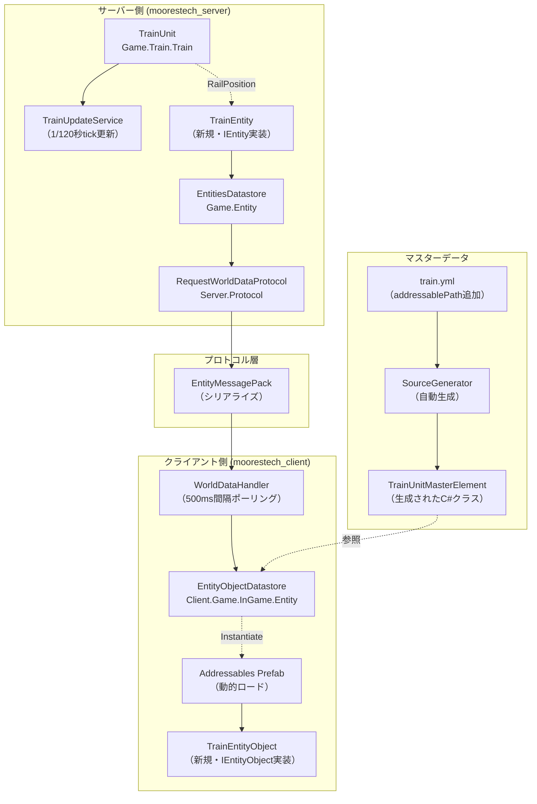
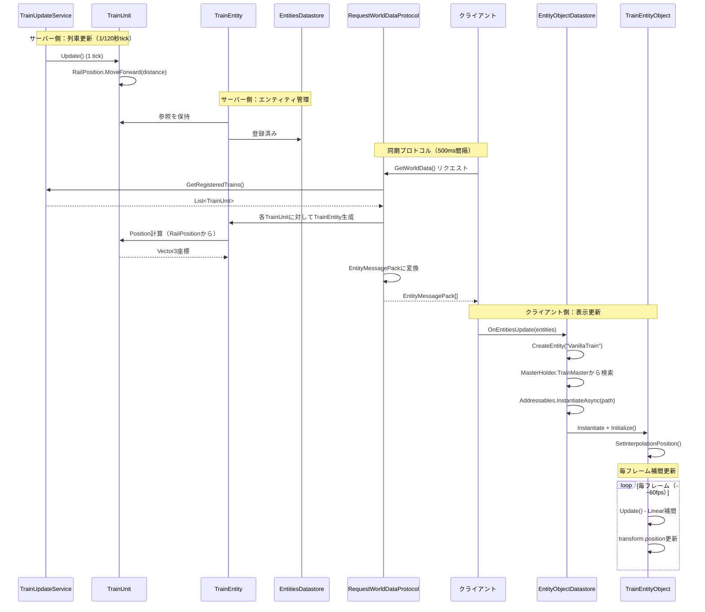
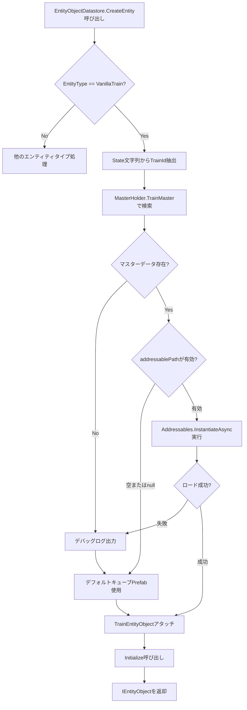
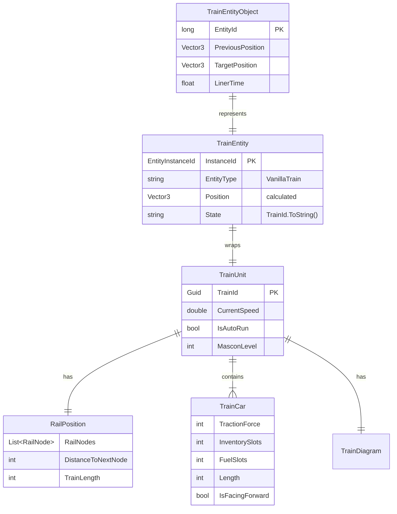
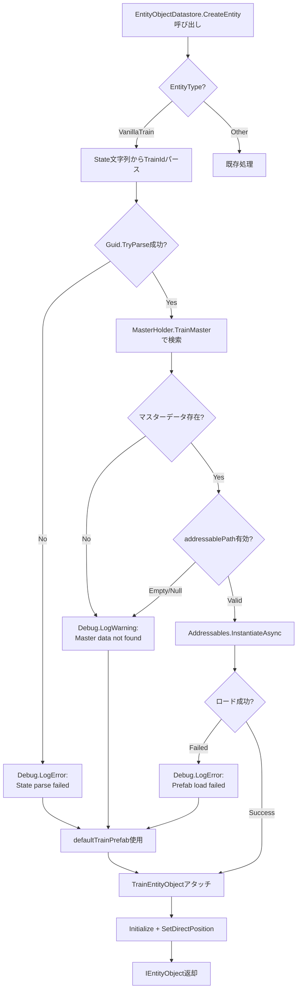
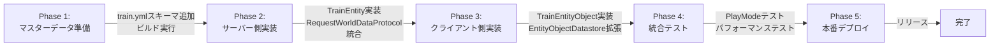

# 技術設計書

## 概要

本機能は、TrainUnitをIEntityインターフェースでラップし、既存のエンティティ同期システム（500ms間隔のポーリングベース）で列車の位置をクライアントに伝達します。クライアント側ではAddressablesを用いてPrefabを動的ロードし、Linear補間により滑らかな列車表示を実現します。

**目的**: プレイヤーが配置した列車をゲーム世界で視覚的に確認できるようにする。既存のエンティティアーキテクチャを最大限活用し、新規プロトコル実装を回避する。

**ユーザー**: プレイヤーは動く列車のビジュアルを確認でき、MOD制作者はtrain.jsonでaddressablePathを指定して独自の列車モデルを追加できます。

**影響**: 既存のエンティティシステムに「VanillaTrain」という新しいエンティティタイプを追加します。RequestWorldDataProtocolの返却エンティティリストに列車が含まれるようになります。

### ゴール
- TrainUnitを既存IEntityインターフェースで抽象化し、エンティティ同期システムで扱えるようにする
- train.ymlにaddressablePath（optional, string）を追加し、SourceGeneratorでC#クラスを自動生成する
- クライアント側でAddressablesを用いてPrefabを非同期ロードし、TrainEntityObjectとして表示する
- 既存のEntityObjectDatastoreの1秒タイムアウトロジックをそのまま利用する

### 非ゴール
- 列車の詳細なアニメーション（車輪回転、煙エフェクト等）は本機能の対象外
- リアルタイムイベントプロトコルによる列車位置更新（既存のポーリング方式を踏襲）
- 複数車両の個別表示（TrainUnitを単一エンティティとして扱う）
- ネットワーク最適化やデルタ圧縮（既存の同期頻度とデータ形式を維持）

## アーキテクチャ

### 既存アーキテクチャ分析

**既存のエンティティシステム構造**:
- **サーバー側**: IEntity（インターフェース）→ ItemEntity, PlayerEntity（実装）→ EntitiesDatastore（管理）
- **プロトコル層**: RequestWorldDataProtocol（500ms間隔でポーリング）→ EntityMessagePack（シリアライズ）
- **クライアント側**: EntityResponse（デシリアライズ）→ EntityObjectDatastore（管理）→ IEntityObject（ItemEntityObject等、ビジュアル表示）

**保持すべき既存パターン**:
- IEntityインターフェースの4つのコアプロパティ（InstanceId, EntityType, Position, State）
- EntityMessagePackによるバイナリシリアライズ形式
- EntityObjectDatastoreの1秒間未更新時の自動削除ロジック
- Linear補間によるスムーズな位置更新（NetworkConst.UpdateIntervalSeconds秒）

**統合ポイント**:
- RequestWorldDataProtocol.GetResponse()に列車収集ロジックを追加（既存のベルトコンベアアイテム収集と並列）
- EntityFactory.CreateEntity()に"VanillaTrain"タイプのハンドリングを追加
- EntityObjectDatastore.CreateEntity()に列車Prefabロード処理を追加

**技術的制約**:
- TrainUnit.RailPositionは複数RailNodeのリストとして経路を保持しているが、エンティティとして同期するのは単一のVector3座標のみ
- TrainUnitはサーバー側でTrainUpdateService（1/120秒tick）で更新されるが、クライアントへの同期は500ms間隔
- Addressablesロードは非同期のため、初回表示までラグが発生する可能性がある

### ハイレベルアーキテクチャ



### 技術スタック整合性

本機能は既存の技術スタックを完全に踏襲します。新規の技術導入は行いません。

**既存技術の利用**:
- **サーバー側**: C# (.NET Standard 2.1), Unity 2022.3 LTS, Microsoft.Extensions.DependencyInjection
- **クライアント側**: C# (.NET Standard 2.1), Unity 2022.3 LTS, VContainer, Addressables
- **シリアライゼーション**: MessagePack
- **マスターデータ**: YAMLスキーマ + SourceGenerator + JSON実データ

**新規依存関係**: なし

**パターンからの逸脱**: なし（全て既存パターンに従う）

### 主要設計判断

#### 判断1: TrainUnitを直接IEntityに変換せず、TrainEntityラッパーを作成

**コンテキスト**: TrainUnitは既に複雑なドメインロジック（自動運転、駅ドッキング、燃料消費等）を持つリッチなドメインオブジェクトであり、IEntityインターフェースの4プロパティ（InstanceId, EntityType, Position, State）のみを要求する軽量な抽象化とは責務が異なります。

**検討した代替案**:
1. TrainUnit自体にIEntityを実装させる
2. TrainEntityというラッパークラスを作成し、TrainUnitへの参照を保持する
3. TrainUnit → IEntity変換を行うアダプタークラスを作成する

**選択したアプローチ**: オプション2（TrainEntityラッパークラス）

TrainEntityはTrainUnitへの参照を保持し、IEntityインターフェースの各プロパティをTrainUnitのデータから動的に計算して返します。

**実装方針**:
- TrainEntity.InstanceIdはTrainUnit.TrainId（Guid）から生成した一意のlongに変換
- TrainEntity.EntityTypeは"VanillaTrain"定数を返す
- TrainEntity.PositionはTrainUnit.RailPosition.GetNodeApproaching()とDistanceToNextNodeから先頭位置を計算
- TrainEntity.StateはTrainId（Guid）を文字列化したもの（クライアント側でマスターデータ検索に使用）

**根拠**:
- TrainUnitのドメインロジックとエンティティ同期の関心を分離できる
- TrainUnitクラスにIEntity依存を注入せず、Game.Entity.Interfaceへの依存を最小化
- 将来的にTrainUnit内部実装が変わってもTrainEntityのアダプター層で吸収可能

**トレードオフ**:
- **獲得**: 単一責任原則の遵守、疎結合、テスト容易性
- **犠牲**: TrainEntity → TrainUnitの参照管理コスト、Position計算のオーバーヘッド（微小）

#### 判断2: RailPositionから3D座標への変換ロジック

**コンテキスト**: RailPositionは「RailNodeリスト + 次ノードまでの距離」という形式で列車位置を管理していますが、IEntity.Positionは単一のVector3座標を要求します。

**検討した代替案**:
1. RailNode間のベジェ曲線補間を用いて正確な3D座標を計算する（既存のBezierUtility使用）
2. 最も近いRailNodeの座標をそのまま返す（簡易実装）
3. RailNodeリストの先頭2ノード間でLinear補間する（中間案）

**選択したアプローチ**: オプション3（Linear補間）

RailPosition.GetNodeApproaching()とGetNodeJustPassed()から先頭2ノードを取得し、DistanceToNextNodeの比率でLinear補間してVector3を算出します。

**実装詳細**:
```csharp
// 擬似コード（実装時の参考）
var approachingNode = trainUnit.RailPosition.GetNodeApproaching();
var passedNode = trainUnit.RailPosition.GetNodeJustPassed();
var totalDistance = passedNode.GetDistanceToNode(approachingNode);
var distanceToNext = trainUnit.RailPosition.GetDistanceToNextNode();
var t = 1.0f - (distanceToNext / (float)totalDistance); // 進行度
var position = Vector3.Lerp(passedNode.Position, approachingNode.Position, t);
```

**根拠**:
- ベジェ曲線計算はコスト高で、500ms間隔のポーリングでは視覚的な差が小さい
- クライアント側でLinear補間を再度行うため、サーバー側も同レベルの精度で十分
- 実装がシンプルで、RailNodeの既存APIを活用できる

**トレードオフ**:
- **獲得**: 実装の簡潔性、計算コストの低減
- **犠牲**: 曲線レールでの視覚的精度（カーブで列車がレールから微妙にずれる可能性）

#### 判断3: Addressablesロード失敗時のフォールバック戦略

**コンテキスト**: MOD制作者が指定したaddressablePathが無効、Prefabが存在しない、またはロードに失敗した場合、ゲームがクラッシュせず継続する必要があります。

**検討した代替案**:
1. エラーログを出力してエンティティ表示をスキップ（非表示）
2. デフォルトのシンプルなキューブPrefabを表示
3. 既存のItemEntityObjectのPrefabを流用

**選択したアプローチ**: オプション2（デフォルトキューブPrefab）

EntityObjectDatastoreに`[SerializeField] private GameObject defaultTrainPrefab`を追加し、Inspectorで設定した白色キューブをフォールバックとして使用します。

**実装方針**:
- addressablePathが空文字列またはnullの場合 → デフォルトPrefab使用
- Addressables.InstantiateAsync()がnullを返却 → デバッグログ出力 + デフォルトPrefab使用
- Addressables.InstantiateAsync()が例外スロー → 条件分岐で検出（try-catch禁止のため、AsyncOperationHandle.Statusチェック）+ デフォルトPrefab使用

**根拠**:
- 非表示にすると「列車が存在するのに見えない」というバグと区別がつかない
- デフォルトPrefabがあれば「ロードエラー」であることが視覚的に明確
- MOD開発時のデバッグ体験向上（Prefabパス間違いに即座に気づける）

**トレードオフ**:
- **獲得**: ゲームの継続性、MOD開発者へのフィードバック、デバッグ容易性
- **犠牲**: デフォルトPrefab管理コスト（Inspectorでの設定必要）

## システムフロー

### 列車エンティティ同期フロー



### Prefab動的ロードフロー



## 要件トレーサビリティ

| 要件 | 要件概要 | 主要コンポーネント | インターフェース/メソッド | フロー参照 |
|------|---------|-----------------|----------------------|----------|
| 1.1-1.4 | train.ymlにaddressablePath追加 | VanillaSchema/train.yml, SourceGenerator | TrainUnitMasterElement.AddressablePath | - |
| 2.1-2.5 | TrainEntity実装 | TrainEntity, EntityFactory | IEntity, CreateEntity() | 列車エンティティ同期フロー |
| 3.1-3.4 | エンティティ同期統合 | RequestWorldDataProtocol | GetResponse(), EntityMessagePack | 列車エンティティ同期フロー |
| 4.1-4.5 | TrainEntityObject実装 | TrainEntityObject | IEntityObject, SetInterpolationPosition() | 列車エンティティ同期フロー |
| 5.1-5.5 | Prefab動的ロード | EntityObjectDatastore | CreateEntity(), Addressables.InstantiateAsync() | Prefab動的ロードフロー |
| 6.1-6.5 | ライフサイクル管理 | EntitiesDatastore, EntityObjectDatastore | Add(), OnEntitiesUpdate(), Update() | 列車エンティティ同期フロー |
| 7.1-7.4 | テストデータ準備 | Tests.Module/TestMod, Addressables | - | - |
| 8.1-8.4 | エラーハンドリング | EntityObjectDatastore | CreateEntity()内の条件分岐 | Prefab動的ロードフロー |

## コンポーネントとインターフェース

### サーバー側：エンティティ層

#### TrainEntity

**責務と境界**
- **主要責務**: TrainUnitをIEntityインターフェースに適合させるアダプター。TrainUnitのRailPosition、TrainId、向き情報をエンティティ同期プロトコルで扱える形式に変換します。
- **ドメイン境界**: Game.Entity.Interface（エンティティ抽象化層）に属します。Game.Trainドメインへの参照を持ちますが、列車ドメインロジックには関与しません。
- **データ所有権**: TrainUnitへの参照を保持しますが、データ所有はしません。TrainUnitの状態を読み取り専用で参照します。
- **トランザクション境界**: トランザクション管理は行いません。TrainUnitはTrainUpdateServiceによって更新され、TrainEntityは現在の状態を読み取るのみです。

**依存関係**
- **Inbound**: RequestWorldDataProtocol（列車エンティティ収集時に生成）
- **Outbound**: TrainUnit（RailPosition、TrainId、Carsへの読み取り専用参照）
- **External**: なし

**契約定義**

**サービスインターフェース**:
```csharp
namespace Game.Entity.Interface.EntityInstance
{
    public interface IEntity
    {
        EntityInstanceId InstanceId { get; }
        string EntityType { get; }
        Vector3 Position { get; }
        string State { get; }
        void SetPosition(Vector3 serverVector3);
    }
}
```

TrainEntityの実装契約:
```csharp
public class TrainEntity : IEntity
{
    public EntityInstanceId InstanceId { get; }
    // TrainUnit.TrainId（Guid）のハッシュコードからlong生成

    public string EntityType { get; }
    // 常に "VanillaTrain" を返す

    public Vector3 Position { get; }
    // RailPosition.GetNodeApproaching()とGetNodeJustPassed()からLinear補間計算

    public string State { get; }
    // TrainUnit.TrainId.ToString() を返す（クライアント側でマスターデータ検索に使用）

    public void SetPosition(Vector3 serverVector3);
    // 列車の位置はRailPositionで管理されるため、このメソッドは空実装
    // または例外をスロー（列車位置は外部から直接設定不可）
}
```

**事前条件**:
- TrainUnitが破棄されていない（OnDestroy()未呼び出し）
- RailPosition.GetNodeApproaching()がnullでない（列車が有効なレール上にある）

**事後条件**:
- Position取得時、常にゲーム世界座標系のVector3が返される
- State文字列はGuid形式の文字列（パース可能）

**不変条件**:
- EntityTypeは常に"VanillaTrain"
- InstanceIdは同じTrainUnitに対して常に同じ値

**状態管理**:
- TrainEntityはステートレス（状態を保持しない）
- 全てのプロパティはTrainUnitから動的に計算される

**統合戦略**:
- **変更アプローチ**: 新規クラス作成（既存コード変更なし）
- **後方互換性**: IEntityインターフェースは変更なし。VanillaEntityTypeクラスに定数追加のみ
- **移行パス**: 段階的導入（まずサーバー側でTrainEntity実装 → RequestWorldDataProtocol統合 → クライアント側実装）

#### EntityFactory拡張

**責務と境界**
- **主要責務**: エンティティタイプ文字列からIEntityインスタンスを生成するファクトリー。既存の"VanillaItem"、"VanillaPlayer"に加えて"VanillaTrain"を追加します。
- **ドメイン境界**: Game.Entity（エンティティ管理層）
- **データ所有権**: エンティティインスタンスの生成のみ。生成後の管理はEntitiesDatastoreが行います。

**依存関係**
- **Inbound**: RequestWorldDataProtocol、その他エンティティ生成が必要な箇所
- **Outbound**: TrainEntity、ItemEntity、PlayerEntity（各エンティティクラス）
- **External**: なし

**契約定義**

既存インターフェース（変更なし）:
```csharp
public interface IEntityFactory
{
    IEntity CreateEntity(string entityType, EntityInstanceId instanceId, Vector3 position = default);
    IEntity LoadEntity(string entityType, EntityInstanceId instanceId, Vector3 serverPosition = default);
}
```

拡張点:
```csharp
public IEntity CreateEntity(string entityType, EntityInstanceId instanceId, Vector3 position = default)
{
    if (entityType == VanillaEntityType.VanillaPlayer) return new PlayerEntity(instanceId, position);
    if (entityType == VanillaEntityType.VanillaItem) return new ItemEntity(instanceId, position);

    // 新規追加
    if (entityType == VanillaEntityType.VanillaTrain)
    {
        // TrainUnitはInstanceIdからTrainUpdateService経由で取得
        // または、TrainEntity生成時にTrainUnitを引数で受け取る別メソッドを用意
        return new TrainEntity(instanceId, trainUnit);
    }

    throw new KeyNotFoundException("Entity type not found : " + entityType);
}
```

**事前条件**:
- entityTypeが有効な文字列（null、空文字列でない）
- instanceIdが一意の値

**事後条件**:
- 指定されたentityTypeに対応するIEntityインスタンスが返される
- 未対応のentityTypeの場合、KeyNotFoundExceptionがスローされる

**統合戦略**:
- **変更アプローチ**: 既存EntityFactoryクラスのCreateEntity()メソッドにif分岐を追加
- **後方互換性**: 既存のVanillaItem、VanillaPlayerの処理は一切変更なし
- **移行パス**: VanillaEntityTypeにVanillaTrain定数追加 → EntityFactoryにif分岐追加 → RequestWorldDataProtocolで使用

### サーバー側：プロトコル層

#### RequestWorldDataProtocol拡張

**責務と境界**
- **主要責務**: クライアントからの「ワールドデータ取得」リクエストに応答し、ブロック情報とエンティティ情報を返却します。既存のベルトコンベアアイテムに加えて、列車エンティティを含めます。
- **ドメイン境界**: Server.Protocol（通信プロトコル層）
- **データ所有権**: データ所有はせず、WorldBlockDatastore、TrainUpdateService、EntitiesDatastoreから情報を収集します。

**依存関係**
- **Inbound**: クライアントのVanillaApiWithResponse.GetWorldData()
- **Outbound**: ServerContext.WorldBlockDatastore、TrainUpdateService.Instance、EntityFactory、CollectBeltConveyorItems
- **External**: MessagePack（シリアライゼーション）

**契約定義**

**APIコントラクト**:

既存メソッド拡張:
```csharp
public ProtocolMessagePackBase GetResponse(List<byte> payload)
{
    // 既存：ブロック収集
    var blockMasterDictionary = ServerContext.WorldBlockDatastore.BlockMasterDictionary;
    var blockResult = new List<BlockDataMessagePack>();
    foreach (var blockMaster in blockMasterDictionary)
    {
        var block = blockMaster.Value.Block;
        var pos = blockMaster.Value.BlockPositionInfo.OriginalPos;
        var blockDirection = blockMaster.Value.BlockPositionInfo.BlockDirection;
        blockResult.Add(new BlockDataMessagePack(block.BlockId, pos, blockDirection));
    }

    // 既存：ベルトコンベアアイテム収集
    var items = CollectBeltConveyorItems.CollectItemFromWorld(_entityFactory);
    var entities = new List<EntityMessagePack>();
    entities.AddRange(items.Select(item => new EntityMessagePack(item)));

    // 新規追加：列車収集
    var trains = TrainUpdateService.Instance.GetRegisteredTrains();
    foreach (var train in trains)
    {
        var trainEntity = new TrainEntity(GenerateEntityInstanceId(train.TrainId), train);
        entities.Add(new EntityMessagePack(trainEntity));
    }

    return new ResponseWorldDataMessagePack(blockResult.ToArray(), entities.ToArray());
}

// 補助メソッド（新規）
private EntityInstanceId GenerateEntityInstanceId(Guid trainId)
{
    // GuidからEntityInstanceId（long）を生成
    // 実装案：trainId.GetHashCode()を使用、または独自の変換ロジック
}
```

**事前条件**:
- TrainUpdateServiceがシングルトンとして初期化済み
- EntityFactoryがDIコンテナから取得可能

**事後条件**:
- ResponseWorldDataMessagePackにブロック配列とエンティティ配列が含まれる
- エンティティ配列には、ベルトコンベアアイテムと列車エンティティの両方が含まれる

**統合戦略**:
- **変更アプローチ**: 既存GetResponse()メソッド内にコード追加（既存ロジックは変更なし）
- **後方互換性**: クライアント側は既存のEntityMessagePack配列を受け取るため、互換性維持
- **移行パス**: サーバー側実装完了後、クライアント側で"VanillaTrain"ハンドリング追加

### クライアント側：エンティティ表示層

#### TrainEntityObject

**責務と境界**
- **主要責務**: 列車エンティティのビジュアル表示を担当します。サーバーから受信した位置情報をLinear補間してスムーズな移動を実現します。
- **ドメイン境界**: Client.Game.InGame.Entity（クライアント側エンティティ表示層）
- **データ所有権**: transform.position、補間用の前回位置・目標位置を保持
- **トランザクション境界**: 単一GameObjectのTransformのみ管理

**依存関係**
- **Inbound**: EntityObjectDatastore（生成・位置更新）
- **Outbound**: Unity Transform（GameObject配置）
- **External**: なし

**契約定義**

**サービスインターフェース**:
```csharp
namespace Client.Game.InGame.Entity
{
    public interface IEntityObject
    {
        long EntityId { get; }
        void Initialize(long entityId);
        void SetDirectPosition(Vector3 position);
        void SetInterpolationPosition(Vector3 position);
        void Destroy();
    }
}
```

TrainEntityObjectの実装契約:
```csharp
public class TrainEntityObject : MonoBehaviour, IEntityObject
{
    public long EntityId { get; private set; }

    private Vector3 _previousPosition;
    private Vector3 _targetPosition;
    private float _linerTime;

    private Guid _trainId; // State文字列からパースしたTrainId
    private bool _isFacingForward; // 列車の向き（将来的な拡張用）

    public void Initialize(long entityId)
    {
        EntityId = entityId;
        // State文字列のパース処理（EntityObjectDatastoreから渡される）
    }

    public void SetDirectPosition(Vector3 position)
    {
        transform.position = position;
        _previousPosition = position;
        _targetPosition = position;
        _linerTime = 0f;
    }

    public void SetInterpolationPosition(Vector3 position)
    {
        _previousPosition = transform.position;
        _targetPosition = position;
        _linerTime = 0f;
    }

    public void Destroy()
    {
        Destroy(gameObject);
    }

    private void Update()
    {
        var rate = _linerTime / NetworkConst.UpdateIntervalSeconds;
        rate = Mathf.Clamp01(rate);
        transform.position = Vector3.Lerp(_previousPosition, _targetPosition, rate);
        _linerTime += Time.deltaTime;
    }
}
```

**事前条件**:
- Initialize()が呼ばれてからSetInterpolationPosition()が呼ばれる
- GameObjectがシーンに存在する

**事後条件**:
- Update()毎にtransform.positionが補間された座標に更新される
- NetworkConst.UpdateIntervalSeconds秒後に_targetPositionに到達

**不変条件**:
- EntityIdは一度設定されたら変更されない
- _linerTimeは0以上、Update()で累積される

**状態管理**:
- ステート: 初期化前 → 初期化済み → 補間中 → 補間完了（次の補間待ち）
- 状態遷移: Initialize() → SetInterpolationPosition() → Update()ループ → Destroy()

#### EntityObjectDatastore拡張

**責務と境界**
- **主要責務**: エンティティタイプに応じたIEntityObjectインスタンスを生成し、1秒間未更新のエンティティを自動削除します。既存のVanillaItem処理に加えて、VanillaTrain処理を追加します。
- **ドメイン境界**: Client.Game.InGame.Entity
- **データ所有権**: エンティティID → (最終更新時刻, IEntityObject)のDictionary
- **トランザクション境界**: 単一Dictionary操作（スレッドセーフではない、メインスレッドのみ）

**依存関係**
- **Inbound**: WorldDataHandler（OnEntitiesUpdate呼び出し）
- **Outbound**: ItemEntityObject、TrainEntityObject（Prefabインスタンス化）、ClientContext（マスターデータ参照）
- **External**: Unity Addressables（Prefabロード）

**契約定義**

拡張点:
```csharp
private IEntityObject CreateEntity(EntityResponse entity)
{
    // 既存：VanillaItem処理
    if (entity.Type == VanillaEntityType.VanillaItem)
    {
        var item = Instantiate(itemPrefab, entity.Position, Quaternion.identity, transform);
        var id = new ItemId(int.Parse(entity.State.Split(',')[0]));
        var viewData = ClientContext.ItemImageContainer.GetItemView(id);
        Texture texture = null;
        if (viewData != null)
        {
            texture = viewData.ItemTexture;
        }
        item.SetTexture(texture);
        return item;
    }

    // 新規追加：VanillaTrain処理
    if (entity.Type == VanillaEntityType.VanillaTrain)
    {
        // State文字列からTrainIdをパース
        if (!Guid.TryParse(entity.State, out var trainId))
        {
            Debug.LogError($"Failed to parse TrainId from State: {entity.State}");
            return CreateFallbackTrainEntity(entity.Position);
        }

        // マスターデータからaddressablePath取得
        var trainMaster = MasterHolder.TrainMaster.GetTrainDataByItemGuid(trainId);
        if (trainMaster == null || string.IsNullOrEmpty(trainMaster.AddressablePath))
        {
            Debug.LogWarning($"Train master data not found or addressablePath is empty for TrainId: {trainId}");
            return CreateFallbackTrainEntity(entity.Position);
        }

        // Addressablesで非同期ロード
        var handle = Addressables.InstantiateAsync(trainMaster.AddressablePath, entity.Position, Quaternion.identity, transform);
        // 非同期完了を待つ処理（UniTaskまたはコールバック）
        // ロード完了後、TrainEntityObjectコンポーネントをアタッチして返却

        // 簡易実装案：同期的に待つ（実際は非同期推奨）
        var prefab = handle.WaitForCompletion();
        if (prefab == null || handle.Status != AsyncOperationStatus.Succeeded)
        {
            Debug.LogError($"Failed to load train prefab: {trainMaster.AddressablePath}");
            return CreateFallbackTrainEntity(entity.Position);
        }

        var trainEntity = prefab.GetComponent<TrainEntityObject>();
        if (trainEntity == null)
        {
            trainEntity = prefab.AddComponent<TrainEntityObject>();
        }
        trainEntity.Initialize(entity.InstanceId);
        trainEntity.SetDirectPosition(entity.Position);
        return trainEntity;
    }

    throw new ArgumentException("エンティティタイプがありません");
}

private IEntityObject CreateFallbackTrainEntity(Vector3 position)
{
    // デフォルトキューブPrefabをインスタンス化
    var fallback = Instantiate(defaultTrainPrefab, position, Quaternion.identity, transform);
    var trainEntity = fallback.AddComponent<TrainEntityObject>();
    return trainEntity;
}
```

**事前条件**:
- MasterHolder.TrainMasterが初期化済み
- Addressablesシステムが初期化済み
- defaultTrainPrefabがInspectorで設定済み

**事後条件**:
- 有効なIEntityObjectインスタンスが返される（Prefabロード失敗時もフォールバック）
- デバッグログが適切に出力される

**エラーハンドリング**:
- Guid.TryParseで失敗 → ログ出力 + フォールバック
- マスターデータ未存在 → 警告ログ + フォールバック
- Addressablesロード失敗 → エラーログ + フォールバック

**統合戦略**:
- **変更アプローチ**: 既存CreateEntity()メソッドにif分岐追加
- **後方互換性**: VanillaItem処理は一切変更なし
- **移行パス**: defaultTrainPrefab設定 → CreateEntity拡張 → マスターデータ準備

### マスターデータ層

#### train.ymlスキーマ拡張

**責務と境界**
- **主要責務**: 列車ユニットのマスターデータスキーマ定義。SourceGeneratorがこのYAMLから型安全なC#クラスを自動生成します。
- **ドメイン境界**: VanillaSchema（マスターデータスキーマ定義）
- **データ所有権**: スキーマ定義のみ（実データはmods/*/master/train.jsonで管理）

**依存関係**
- **Inbound**: SourceGenerator（ビルド時）
- **Outbound**: なし
- **External**: YamlDotNet（YAMLパーサー）

**契約定義**

拡張スキーマ:
```yaml
id: train
type: object
isDefaultOpen: true
properties:
- key: trainUnits
  type: array
  openedByDefault: true
  overrideCodeGeneratePropertyName: TrainUnitMasterElement
  items:
    type: object
    properties:
    - key: itemGuid
      type: uuid
      optional: true
      foreignKey:
        schemaId: items
        foreignKeyIdPath: /data/[*]/itemGuid
        displayElementPath: /data/[*]/name
    # 新規追加
    - key: addressablePath
      type: string
      optional: true
      default: ""
    - key: trainCars
      type: array
      overrideCodeGeneratePropertyName: TrainCarElement
      items:
        # 既存のtrainCarsプロパティ...
```

**生成されるC#クラス（SourceGeneratorによる自動生成）**:
```csharp
namespace Mooresmaster.Model.TrainModule
{
    public class TrainUnitMasterElement
    {
        public Guid? ItemGuid { get; set; }
        public string AddressablePath { get; set; } // 新規追加
        public List<TrainCarElement> TrainCars { get; set; }
    }
}
```

**事前条件**:
- YAMLスキーマの文法が正しい
- SourceGeneratorがビルドパイプラインに組み込まれている

**事後条件**:
- Mooresmaster.Model.TrainModule.TrainUnitMasterElementクラスが自動生成される
- AddressablePathプロパティがstringとして公開される

**統合戦略**:
- **変更アプローチ**: train.ymlに新規プロパティを追加
- **後方互換性**: optionalのため、既存のJSONファイルは変更不要
- **移行パス**: スキーマ追加 → ビルド実行（自動生成）→ 新しいプロパティ使用開始

## データモデル

### ドメインモデル

**コア概念**:

- **TrainUnit（集約ルート）**: 列車編成全体を表すリッチドメインオブジェクト。RailPosition（経路情報）、TrainCar配列（車両リスト）、TrainDiagram（運行ダイアグラム）、ドッキング状態を管理します。ビジネスルールとして、自動運転、燃料消費、駅ドッキングロジックを内包します。

- **RailPosition（値オブジェクト）**: 列車の現在位置を「RailNodeリスト + 次ノードまでの距離」で表現します。MoveForward()、Reverse()などの操作メソッドを持ち、列車の経路移動ロジックをカプセル化します。

- **TrainEntity（アダプター）**: TrainUnitをエンティティ同期システムで扱うための薄いラッパー。IEntityインターフェースを実装し、TrainUnitの状態をPosition、State文字列に変換します。ドメインロジックは持たず、純粋な変換層です。

**ビジネスルールと不変条件**:
- TrainUnitは必ず1つ以上のTrainCarを持つ（空の編成は存在しない）
- RailPositionは必ず1つ以上のRailNodeを持つ（レールから外れることはない）
- TrainEntityのPositionはRailPositionから計算されるため、常にレール上の座標である

### 論理データモデル

**エンティティ関係**:



**属性と型**:
- TrainUnit.TrainId: Guid（一意識別子）
- TrainEntity.InstanceId: EntityInstanceId（longのラッパー）、TrainIdから変換
- TrainEntityObject.EntityId: long（InstanceIdのプリミティブ値）
- RailPosition.RailNodes: List<RailNode>（参照型、RailGraphDatastoreで管理）
- TrainEntity.State: string（Guid.ToString()の結果、クライアント側でGuid.TryParseでパース）

**参照整合性**:
- TrainEntity → TrainUnit: 参照はTrainUpdateService.GetRegisteredTrains()で解決
- TrainEntityObject → MasterHolder.TrainMaster: State文字列からTrainId抽出後、マスターデータ検索

**時間的側面**:
- TrainUnitは永続化対象（セーブデータ）、TrainUnit.CreateSaveData()でシリアライズ
- TrainEntityは一時的（RequestWorldDataProtocol呼び出し時に毎回生成）
- TrainEntityObjectはクライアント側で1秒間未更新時に自動削除（短命）

### データコントラクトと統合

**APIデータ転送**:

EntityMessagePack（既存、変更なし）:
```csharp
[MessagePackObject]
public class EntityMessagePack
{
    [Key(0)] public long InstanceId { get; set; }
    [Key(1)] public string Type { get; set; }
    [Key(2)] public Vector3MessagePack Position { get; set; }
    [Key(3)] public string State { get; set; }

    public EntityMessagePack(IEntity entity)
    {
        InstanceId = entity.InstanceId.AsPrimitive();
        Type = entity.EntityType;
        State = entity.State;
        Position = new Vector3MessagePack(entity.Position);
    }
}
```

**バリデーションルール**:
- State文字列: Guid.TryParseで検証可能な形式でなければならない
- Position: 有効なVector3（NaN、Infinityでない）
- InstanceId: 非ゼロのlong値

**シリアライゼーション形式**: MessagePack（バイナリ、既存システムと同一）

**クロスサービスデータ管理**:
- サーバー・クライアント間の同期は500ms間隔のポーリングベース（最終的整合性）
- クライアント側のEntityObjectDatastoreは1秒間未更新でタイムアウト（サーバー停止を検出）
- 分散トランザクションは不要（サーバー側が唯一の真実の情報源）

## エラーハンドリング

### エラー戦略

本機能では、以下の階層的なエラー処理戦略を採用します：

1. **防御的プログラミング**: 事前条件チェック（nullチェック、範囲チェック）で無効なデータを早期に検出
2. **グレースフルデグラデーション**: ロード失敗時にフォールバック（デフォルトPrefab）を表示し、ゲーム継続を優先
3. **ロギング**: デバッグログを適切に出力し、開発者とMOD制作者がエラー原因を特定可能にする
4. **try-catch禁止**: CLAUDE.mdの制約に従い、条件分岐でエラーケースを処理

### エラーカテゴリと応答

#### ユーザーエラー（MOD制作者起因）

**エラー種別**: 無効なaddressablePath指定、JSONスキーマ違反、Prefabアセット不在

**検出方法**:
- string.IsNullOrEmpty()でaddressablePath検証
- Addressables.InstantiateAsync()のAsyncOperationHandle.Statusチェック
- Guid.TryParse()でState文字列検証

**応答**:
- デバッグログ出力: `Debug.LogWarning($"Train master data not found for TrainId: {trainId}")`
- フォールバックPrefab表示: デフォルトキューブを使用してゲーム継続
- ユーザー通知: なし（ログのみ、ゲーム中断しない）

#### システムエラー（インフラ起因）

**エラー種別**: Addressablesシステム初期化失敗、メモリ不足、ネットワーク切断（サーバー・クライアント間）

**検出方法**:
- AsyncOperationHandle.Status != AsyncOperationStatus.Succeeded
- EntityObjectDatastoreの1秒タイムアウトロジック
- RailPosition.GetNodeApproaching() == nullチェック

**応答**:
- Addressablesロード失敗 → エラーログ + フォールバック
- ネットワーク切断 → クライアント側で自動的にエンティティ削除（既存のタイムアウトメカニズム）
- RailNode不在 → TrainEntity.Position計算時にVector3.zeroを返す（例外スローせず）

#### ビジネスロジックエラー

**エラー種別**: TrainIdの重複、列車がレール外に存在、InstanceIdの衝突

**検出方法**:
- TrainUpdateService.GetRegisteredTrains()で同じTrainIdが複数存在しないか確認（通常はあり得ない）
- RailPosition.ValidatePosition()で経路整合性チェック（TrainUnit生成時）

**応答**:
- TrainId重複 → エラーログ + 最初のTrainUnitのみ使用
- RailPosition不正 → InvalidOperationException（開発時バグ、リリース前に修正）

### エラーフロー可視化



### 監視とロギング

**ログレベル定義**:
- **Error**: Addressablesロード失敗、State文字列パース失敗（データ破損）
- **Warning**: マスターデータ未存在、addressablePath空文字列（MOD設定ミス）
- **Info**: なし（通常動作ではログ出力しない、パフォーマンス優先）

**ロギング実装例**:
```csharp
// State文字列パース失敗
if (!Guid.TryParse(entity.State, out var trainId))
{
    Debug.LogError($"[TrainEntity] Failed to parse TrainId from State: {entity.State}");
    return CreateFallbackTrainEntity(entity.Position);
}

// マスターデータ未存在
var trainMaster = MasterHolder.TrainMaster.GetTrainDataByItemGuid(trainId);
if (trainMaster == null)
{
    Debug.LogWarning($"[TrainEntity] Train master data not found for TrainId: {trainId}");
    return CreateFallbackTrainEntity(entity.Position);
}

// Addressablesロード失敗
if (handle.Status != AsyncOperationStatus.Succeeded)
{
    Debug.LogError($"[TrainEntity] Failed to load train prefab: {trainMaster.AddressablePath}, Status: {handle.Status}");
    return CreateFallbackTrainEntity(entity.Position);
}
```

**ヘルスモニタリング**:
- クライアント側: EntityObjectDatastore._entitiesのサイズ監視（メモリリーク検出）
- サーバー側: TrainUpdateService.GetRegisteredTrains()の戻り値数監視（列車数異常増加検出）
- 既存のGameUpdater、UniRxのObservableで統合（新規監視システム不要）

## テスト戦略

### ユニットテスト

**サーバー側コアロジック**:
1. TrainEntity.Position計算の正確性（RailPositionからVector3への変換）
2. TrainEntity.State文字列生成（Guid → string変換）
3. EntityFactory.CreateEntity("VanillaTrain")の正常動作
4. RequestWorldDataProtocol.GetResponse()に列車が含まれること
5. TrainEntityのInstanceId生成が一意であること

**クライアント側解析ロジック**:
1. EntityObjectDatastore.CreateEntity()でState文字列からGuidパース
2. マスターデータ検索（MasterHolder.TrainMaster）の正常系・異常系
3. フォールバックPrefab使用時のIEntityObject生成
4. TrainEntityObject.SetInterpolationPosition()の補間計算
5. TrainEntityObject.Update()の毎フレーム位置更新

### 統合テスト

**サーバー・クライアント間データフロー**:
1. TrainUnit作成 → RequestWorldDataProtocol呼び出し → EntityMessagePack生成 → クライアント受信
2. クライアントがEntityResponseを受信 → EntityObjectDatastore.OnEntitiesUpdate() → TrainEntityObject生成
3. 列車が移動 → サーバー側Position更新 → クライアント側でLinear補間による滑らかな表示
4. TrainUnit.OnDestroy() → 次回同期でクライアント側タイムアウト → GameObject削除
5. 複数列車が同時に存在する場合の正常動作（InstanceId衝突なし）

**Addressablesロードフロー**:
1. 有効なaddressablePathでPrefabロード成功
2. 無効なaddressablePathでフォールバック使用
3. addressablePath空文字列でフォールバック使用
4. Addressablesシステム未初期化時の挙動（エラーハンドリング）

### E2E/PlayModeテスト

**ユーザーシナリオ**:
1. プレイヤーが列車を配置 → サーバーでTrainUnit生成 → クライアントに列車Prefab表示
2. 列車が自動運転でレール上を移動 → クライアント側でスムーズに追従表示
3. 列車が駅にドッキング → 停止状態の表示（Position更新なし）
4. 列車を削除 → クライアント側で1秒後にGameObject自動削除

**MOD制作者シナリオ**:
1. train.jsonにaddressablePathを追加 → カスタムPrefabが表示される
2. 無効なaddressablePath指定 → デフォルトキューブが表示され、Warningログ出力
3. 複数のMODで異なる列車モデルを追加 → それぞれ正しく表示される

### パフォーマンステスト

**負荷シナリオ**:
1. 同時に100両の列車が存在する場合のサーバー側CPU使用率（TrainUpdateService.UpdateTrains()）
2. 100両の列車エンティティをRequestWorldDataProtocolで送信する際のシリアライズ時間
3. クライアント側で100個のTrainEntityObjectをUpdate()で補間更新する際のフレームレート
4. Addressablesで同時に10個の列車Prefabをロードする際のメモリ使用量とロード時間

**性能目標**:
- サーバー側: 100両の列車で1 tick更新が1ms以内（1/120秒のtick制を維持）
- クライアント側: 50個のTrainEntityObjectでフレームレート60fps維持
- Addressablesロード: 1つのPrefabロードが500ms以内（初回表示ラグ許容範囲）

## セキュリティ考慮事項

本機能は主にビジュアル表示を担当するため、セキュリティリスクは限定的ですが、以下の点に注意します。

**脅威モデリング**:
- **不正なaddressablePathインジェクション**: MOD制作者が意図的に無効なパスを指定してクライアントクラッシュを誘発
- **State文字列改ざん**: 悪意あるクライアントがState文字列を改ざんして存在しないTrainIdを送信

**セキュリティ制御**:
- addressablePathは文字列検証を行い、無効な場合はフォールバックを使用（クラッシュ防止）
- State文字列はGuid.TryParseで厳格に検証し、失敗時はログ出力 + フォールバック
- サーバー側でTrainEntityのInstanceId生成時、既存IDとの衝突を検出（Dictionary.ContainsKey）

**データ保護**:
- TrainIdはGuid（ランダム生成）のため推測困難
- EntityMessagePackはバイナリシリアライズだが、暗号化は不要（ゲーム内データ、機密情報なし）

**認証と認可**:
- 本機能は認証・認可に関与しない（既存のプレイヤー認証システムを踏襲）
- TrainUnitの生成・削除権限は既存のゲームロジックで管理

## パフォーマンスとスケーラビリティ

### ターゲットメトリクス

**応答時間**:
- RequestWorldDataProtocol応答時間: 100ms以内（100両の列車含む）
- Addressablesロード時間: 初回500ms以内、2回目以降100ms以内（キャッシュ）
- TrainEntityObject.Update()処理時間: 0.1ms/個以内（60fps維持）

**スループット**:
- サーバー側: 1秒あたり1000回のTrainEntity.Position計算処理
- クライアント側: 1秒あたり60回のEntityObjectDatastore.OnEntitiesUpdate()処理

**リソース使用量**:
- メモリ: 1列車あたりPrefabサイズ + TrainEntityObject（約1MB想定）、100両で100MB以内
- CPU: TrainUpdateService.UpdateTrains()が全CPU時間の5%以内

### スケーリングアプローチ

**水平スケーリング**: 本機能はサーバー・クライアント分離アーキテクチャのため、サーバー台数増加で対応可能（ただし単一ワールドは単一サーバー想定）

**垂直スケーリング**: 列車数増加に対してLinear計算量のため、サーバーCPU強化でスケール可能

**ボトルネック分析**:
- サーバー側: TrainUpdateService.UpdateTrains()の列車ループ（O(n)）
- クライアント側: EntityObjectDatastore.Update()の1秒タイムアウトチェックループ（O(n)）
- Addressablesロード: 同時ロード数制限（Unity内部のプール制限）

### キャッシング戦略

**Addressablesキャッシング**:
- Unity Addressablesは自動的にロード済みアセットをキャッシュ
- 同じaddressablePathの2回目以降のロードは高速（メモリキャッシュ）

**Position計算キャッシング**:
- TrainEntity.Positionは毎回計算するが、計算コストは低い（Vector3.Lerp 1回）
- キャッシュ不要（500ms間隔の同期のため、キャッシュの恩恵小さい）

**マスターデータキャッシング**:
- MasterHolder.TrainMasterは起動時に全てメモリロード済み
- TrainIdからマスターデータ検索はDictionary（O(1)）で高速

### 最適化テクニック

**オブジェクトプーリング**: 将来的な拡張として、TrainEntityObjectのプーリングを検討（本機能では実装しない、まずは動作する実装を優先）

**バッチ処理**: RequestWorldDataProtocolで全列車を一度に収集・シリアライズ（既に実装済み）

**LOD（Level of Detail）**: 将来的な拡張として、カメラから遠い列車は簡易モデル表示を検討（本機能では実装しない）

## 移行戦略

### 移行フェーズ



**Phase 1: マスターデータ準備**
- train.ymlにaddressablePath追加
- Unityでビルド実行、TrainUnitMasterElement自動生成
- テスト用train.jsonにaddressablePathを含むデータ追加

**Phase 2: サーバー側実装**
- TrainEntityクラス実装（IEntity準拠）
- VanillaEntityTypeにVanillaTrain定数追加
- EntityFactoryにVanillaTrainハンドリング追加
- RequestWorldDataProtocolにTrainUpdateService.GetRegisteredTrains()統合
- サーバー側ユニットテスト実行

**Phase 3: クライアント側実装**
- TrainEntityObjectクラス実装（IEntityObject準拠）
- EntityObjectDatastore.CreateEntity()にVanillaTrainハンドリング追加
- defaultTrainPrefab作成（白色キューブ）、Inspectorで設定
- テスト用列車Prefab作成、Addressables登録
- クライアント側ユニットテスト実行

**Phase 4: 統合テスト**
- サーバー起動 → TrainUnit配置 → クライアント接続 → 列車表示確認
- 列車移動 → クライアント側でスムーズ表示確認
- Prefabロード失敗ケース確認（フォールバック動作）
- パフォーマンステスト実行（100両負荷）

**Phase 5: 本番デプロイ**
- リリースビルド作成
- ドキュメント更新（MOD制作者向けにaddressablePath使用方法を記載）
- リリースノート作成

### ロールバックトリガー

**Phase 2ロールバック条件**:
- サーバー側ユニットテストで致命的な失敗（Position計算不正、InstanceId衝突）
- RequestWorldDataProtocolのレスポンスサイズが異常増加（メモリリーク検出）

**Phase 3ロールバック条件**:
- クライアント側でPrefabロードが全て失敗（Addressablesシステム不具合）
- TrainEntityObjectのUpdate()でフレームレートが30fps以下に低下

**Phase 4ロールバック条件**:
- 統合テストで列車が表示されない（サーバー・クライアント間データフロー断絶）
- パフォーマンステストで目標メトリクスを大幅に下回る（応答時間500ms超過等）

### 検証チェックポイント

**Phase 1検証**:
- SourceGeneratorがTrainUnitMasterElement.AddressablePathを生成したか確認
- テスト用train.jsonがスキーマ検証をパスするか確認

**Phase 2検証**:
- TrainEntity.Positionが正しいVector3座標を返すか確認（ユニットテスト）
- RequestWorldDataProtocol.GetResponse()のEntities配列に列車が含まれるか確認（統合テスト）

**Phase 3検証**:
- EntityObjectDatastore.CreateEntity()がTrainEntityObjectをインスタンス化するか確認（ユニットテスト）
- Addressablesロード成功時に正しいPrefabが表示されるか確認（PlayModeテスト）
- フォールバックPrefab使用時にデバッグログが出力されるか確認

**Phase 4検証**:
- エンドツーエンドで列車配置から表示までの全フローが動作するか確認
- 複数列車が同時に存在する場合の安定性確認
- 列車削除時にクライアント側でGameObjectが削除されるか確認
