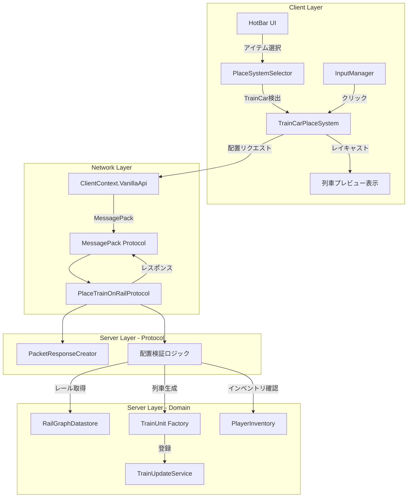
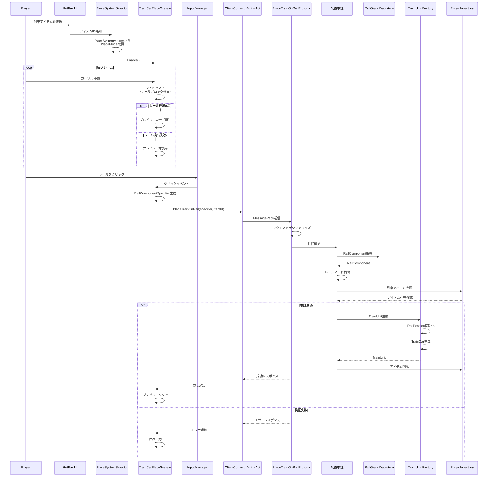
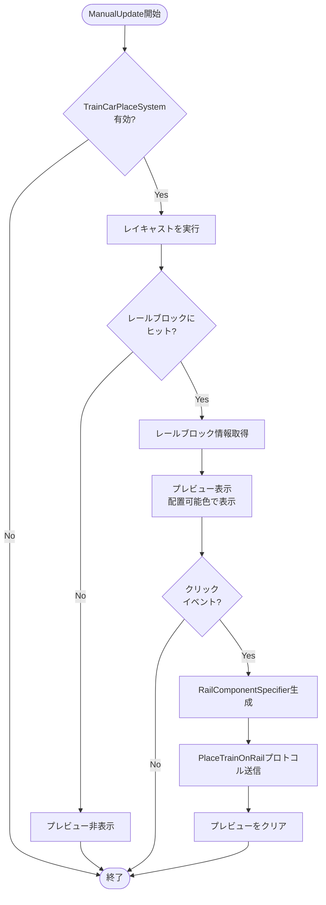
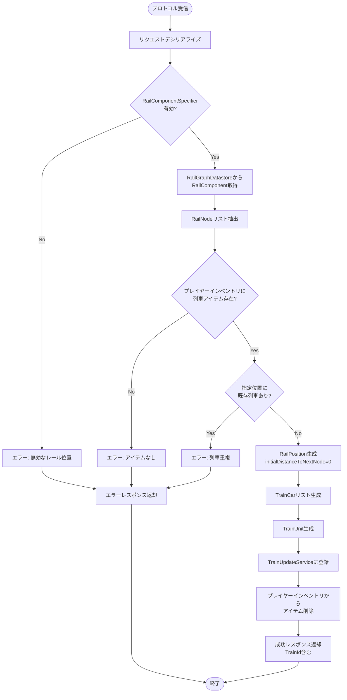
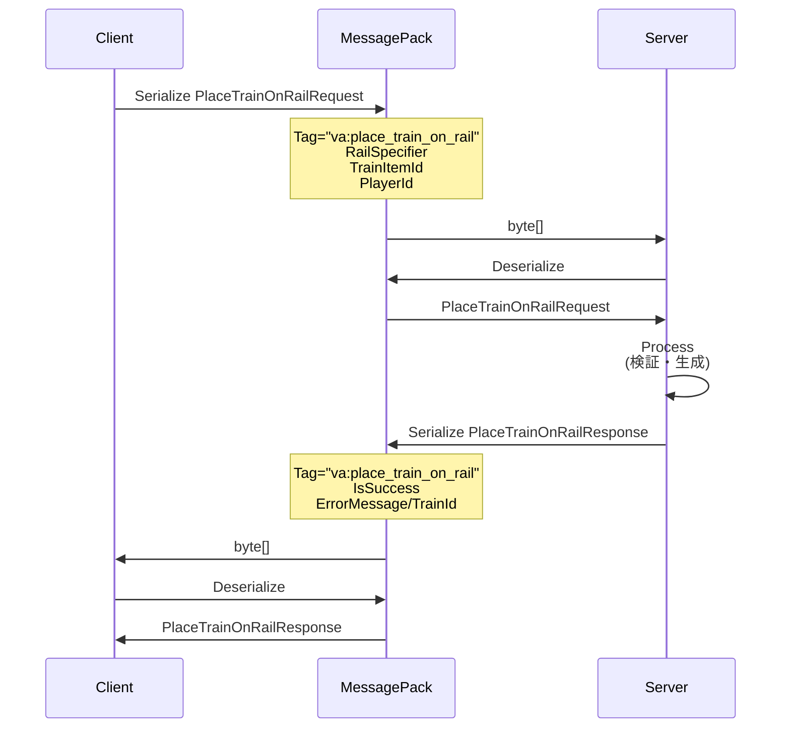
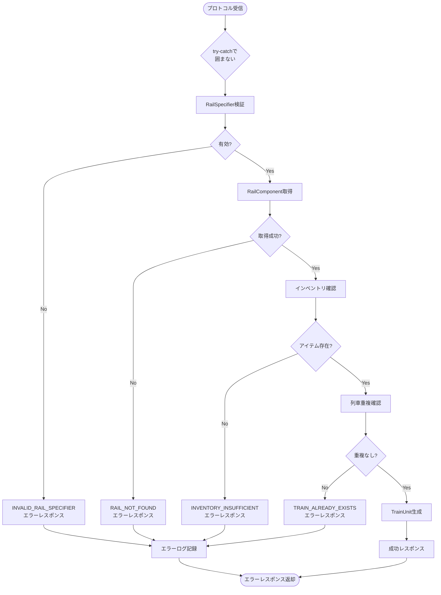

# 技術設計書 - 列車配置システム

## 概要

列車配置システムは、プレイヤーがクライアント側から列車をレール上に配置できる機能を提供します。このシステムは既存のPlaceSystemアーキテクチャを活用し、クライアント側の配置UI/UXと、サーバー側の列車生成・検証ロジックを統合します。

**目的**: プレイヤーがインベントリ内の列車アイテムを選択し、既存のレール上に直感的に列車を配置できるようにします。これにより、プレイヤーは自由に輸送ネットワークを構築でき、ゲームプレイの幅が大きく広がります。

**対象ユーザー**: ゲームプレイヤーは、ホットバーから列車アイテムを選択し、レールをクリックすることで列車を配置します。システムはプレビュー表示により、配置前に位置を視覚的に確認できます。

**システムへの影響**: 既存のPlaceSystemアーキテクチャに新しい `TrainCarPlaceSystem` を追加し、サーバー側に新しいプロトコル `PlaceTrainOnRailProtocol` を実装します。既存のレールシステム、列車システム、インベントリシステムと統合します。

### ゴール

- クライアント側で列車アイテム選択時に自動的に `TrainCarPlaceSystem` が有効化される
- レール上にカーソルを移動すると列車のプレビューが表示される
- クリックでサーバーに配置リクエストを送信し、サーバー側で `TrainUnit` が生成される
- 配置不可能な位置（列車が既に存在、無効なレール等）では適切なフィードバックを表示
- すべての機能がテストされ、品質が保証される

### 非ゴール

- 列車の自動運転設定機能（配置後にプレイヤーが別途設定）
- パフォーマンス最適化（プロジェクト方針により、まず動作する実装を優先）
- 列車の向きのカスタマイズ（レールの方向に自動的に従う）
- 複数車両の同時配置（初期実装では単一列車のみ）

## アーキテクチャ

### 既存アーキテクチャの分析

このシステムは既存の強固なアーキテクチャパターンの上に構築されます：

**PlaceSystemアーキテクチャ**:
- `IPlaceSystem` インターフェースを実装する各種配置システムが存在
- `PlaceSystemSelector` がアイテムに応じて適切な配置システムを選択
- `PlaceSystemStateController` が配置システムのライフサイクルを管理
- 既存実装: `CommonBlockPlaceSystem`, `TrainRailPlaceSystem`, `TrainRailConnectSystem`

**プロトコルアーキテクチャ**:
- `IPacketResponse` インターフェースによる統一されたプロトコル実装
- MessagePackによる効率的なバイナリシリアライゼーション
- `PacketResponseCreator` による一元的なプロトコル管理
- 既存実装: 30以上のプロトコル（ブロック配置、インベントリ移動、レール接続等）

**列車システムアーキテクチャ**:
- `TrainUnit`: 列車の中核エンティティ（位置、速度、車両リスト管理）
- `RailPosition`: レール上の列車位置を管理
- `TrainUpdateService`: 全列車の定期更新を管理
- `RailGraphDatastore`: レールネットワークのグラフ構造を管理

### 高レベルアーキテクチャ



### 技術的アライメント

**既存パターンの保持**:
- PlaceSystemパターン: `IPlaceSystem`インターフェースを実装し、`Enable()`, `Disable()`, `ManualUpdate()` のライフサイクルを踏襲
- プロトコルパターン: `IPacketResponse`インターフェースを実装し、`GetResponse()` メソッドで処理
- MessagePackパターン: `[MessagePackObject]` 属性と `[Key(n)]` 属性による型安全なシリアライゼーション
- DIパターン: VContainerによる依存性注入

**新規コンポーネントの根拠**:
- `TrainCarPlaceSystem`: 列車配置に特化したロジックが必要（レール検出、列車プレビュー、RailComponentSpecifier生成）
- `PlaceTrainOnRailProtocol`: サーバー側で列車生成と検証を行う専用プロトコル
- PlaceSystemMasterへの拡張: 列車アイテムを配置可能アイテムとして登録

**技術スタックの整合性**:
- C# (.NET Standard 2.1): サーバー・クライアント共通
- Unity 2022.3 LTS: ゲームエンジン
- MessagePack: プロトコル通信
- VContainer: クライアント側DI
- Microsoft.Extensions.DependencyInjection: サーバー側DI

**ステアリング準拠**:
- 既存システムの再利用を最優先
- #regionとローカル関数による可読性向上
- 日本語・英語の2行コメント
- Null前提の最小化
- try-catch禁止（条件分岐とnullチェックで対応）

## 主要な技術的決定事項

### 決定1: レール上の配置位置特定方法

**コンテキスト**: プレイヤーがレールをクリックした際、どのレールコンポーネントに列車を配置するかを特定する必要があります。レールブロックには複数のRailComponentが存在する可能性があり、駅の場合は複数のレールが含まれます。

**代替案検討**:
1. **レイキャスト + ブロック座標のみ**: ブロック座標のみを送信し、サーバー側で最初のRailComponentを使用
2. **レイキャスト + レールインデックス**: ブロック座標とレールインデックスを送信
3. **RailComponentSpecifierの活用**: 既存の `RailComponentSpecifier` を活用（レールモード）

**選択アプローチ**: **RailComponentSpecifierの活用（案3）**

既存の `RailComponentSpecifier` を使用し、`CreateRailSpecifier(Vector3Int position)` でレールブロックを指定します。クライアント側でレイキャストによりブロック座標を取得し、サーバー側で `RailGraphDatastore` からRailComponentを解決します。

**根拠**:
- 既存の確立されたパターンを再利用（`RailConnectionEditProtocol` で既に使用）
- サーバー側でRailComponentの解決ロジックを一元管理
- 将来的に駅モードへの拡張が容易（`CreateStationSpecifier` が既に存在）
- プロトコルの一貫性が保たれる

**トレードオフ**:
- **獲得**: コードの再利用性、保守性の向上、将来拡張性
- **犠牲**: サーバー側での追加的なRailComponent解決処理（ただし既存のRailGraphDatastore APIで対応可能）

### 決定2: プレビュー表示の実装方法

**コンテキスト**: 列車を配置する前にプレビューを表示し、配置可能/不可能を視覚的にフィードバックする必要があります。

**代替案検討**:
1. **専用の列車プレビューシステム**: 列車専用のプレビューコンポーネントを新規作成
2. **既存のIPlacementPreviewBlockGameObjectControllerの活用**: ブロック用プレビューシステムを流用
3. **簡易的なGameObject表示**: プレハブを直接表示するだけの軽量実装

**選択アプローチ**: **簡易的なGameObject表示（案3）**

列車専用の軽量なプレビュー表示を実装します。`TrainCarPlaceSystem` 内で列車モデルのGameObjectを管理し、位置・色（配置可能: 緑、不可能: 赤）を制御します。

**根拠**:
- 列車はブロックとは異なる表示要件（複数車両、レール上の位置、向き）
- `IPlacementPreviewBlockGameObjectController` はブロック用に最適化されており、列車には適さない
- シンプルな実装で十分な機能を提供
- パフォーマンス最適化は後回し（プロジェクト方針）

**トレードオフ**:
- **獲得**: 列車に特化した柔軟な表示制御、シンプルな実装
- **犠牲**: 既存プレビューシステムとのコード共有の機会を失う（ただし要件の違いから共有は困難）

### 決定3: 列車の初期RailPosition構築方法

**コンテキスト**: サーバー側でTrainUnitを生成する際、RailPositionを初期化する必要があります。RailPositionはレールノードのリストと列車の長さ、次ノードまでの距離を必要とします。

**代替案検討**:
1. **単一レールノードから開始**: 最初のレールノードのみを使用してRailPositionを初期化
2. **列車の長さ分のレールノードを事前計算**: 列車の全長に基づいて必要なレールノードを事前に計算
3. **RailPositionに自動拡張を任せる**: 最小限のノードで初期化し、`MoveForward()` で自動拡張

**選択アプローチ**: **RailPositionに自動拡張を任せる（案3）**

RailComponentから取得した開始レールノードのみでRailPositionを初期化し、`initialDistanceToNextNode = 0` で開始します。RailPositionの内部ロジックが自動的に必要なノードを追加します。

**根拠**:
- RailPositionの既存の設計に従う（コンストラクタで最小限のノードを受け入れる）
- `RemoveUnnecessaryNodes()` と `MoveForward()` により、動的にノード管理が行われる
- 初期配置時の計算を最小化
- 既存の列車システムと一貫性のある動作

**トレードオフ**:
- **獲得**: シンプルな初期化ロジック、既存システムとの整合性
- **犠牲**: 初回の位置計算時に若干のオーバーヘッド（ただしパフォーマンスは非ゴール）

## システムフロー

### 列車配置フロー（シーケンス図）



### クライアント側の配置判定フロー



### サーバー側の列車生成フロー



## 要件トレーサビリティ

| 要件 | 要件概要 | コンポーネント | インターフェース | フロー |
|------|----------|----------------|------------------|--------|
| 1.1-1.5 | TrainCarPlaceSystem | TrainCarPlaceSystem | IPlaceSystem.Enable/Disable/ManualUpdate | 列車配置フロー |
| 1.6 | 列車重複検出 | PlaceTrainOnRailProtocol | GetResponse内の検証ロジック | サーバー側列車生成フロー |
| 2.1-2.5 | レール位置計算 | TrainCarPlaceSystem | RailComponentSpecifier生成 | クライアント側配置判定フロー |
| 3.1-3.5 | プレビュー表示 | TrainCarPlaceSystem | プレビュー制御メソッド | クライアント側配置判定フロー |
| 4.1-4.8 | サーバー側プロトコル | PlaceTrainOnRailProtocol | IPacketResponse.GetResponse | サーバー側列車生成フロー |
| 5.1-5.5 | MessagePackデータ構造 | Request/ResponseMessagePack | MessagePack属性 | - |
| 6.1-6.4 | プロトコル登録 | PacketResponseCreator | _packetResponseDictionary | - |
| 7.1-7.5 | RailGraph統合 | PlaceTrainOnRailProtocol | RailGraphDatastore API | サーバー側列車生成フロー |
| 8.1-8.5 | 列車初期状態 | TrainUnit生成ロジック | TrainUnitコンストラクタ | サーバー側列車生成フロー |
| 9.1-9.5 | PlaceSystemSelector統合 | PlaceSystemSelector | GetCurrentPlaceSystem | 列車配置フロー |
| 10.1-10.6 | エラーハンドリング | PlaceTrainOnRailProtocol | 各種検証メソッド | サーバー側列車生成フロー |
| 11.1-11.5 | テストカバレッジ | PlaceTrainOnRailProtocolTest | NUnit テストメソッド | - |

## コンポーネントとインターフェース

### クライアント側 - 配置システムレイヤー

#### TrainCarPlaceSystem

**責任と境界**
- **主責任**: 列車アイテム選択時の配置UI/UX制御、プレビュー表示、サーバーへのプロトコル送信
- **ドメイン境界**: クライアント側の配置システムドメイン（Client.Game.InGame.BlockSystem.PlaceSystem）
- **データ所有**: プレビュー状態、選択中のレール位置
- **トランザクション境界**: 単一フレーム内の処理（プレビュー更新、プロトコル送信）

**依存関係**
- **インバウンド**: `PlaceSystemSelector`（アイテム選択時に有効化）、`PlaceBlockState`（UI状態管理）
- **アウトバウンド**: `Camera`（レイキャスト）、`InputManager`（クリック検出）、`ClientContext.VanillaApi`（プロトコル送信）、`MasterHolder.BlockMaster`（ブロック情報取得）
- **外部**: Unity物理システム（レイキャスト）

**契約定義（サービスインターフェース）**

```csharp
public interface IPlaceSystem
{
    /// <summary>
    /// 配置システムが有効化された時に呼ばれる
    /// Called when the place system is enabled
    /// </summary>
    void Enable();

    /// <summary>
    /// 毎フレーム呼ばれる更新処理
    /// Update process called every frame
    /// </summary>
    /// <param name="context">配置システムの更新コンテキスト</param>
    void ManualUpdate(PlaceSystemUpdateContext context);

    /// <summary>
    /// 配置システムが無効化された時に呼ばれる
    /// Called when the place system is disabled
    /// </summary>
    void Disable();
}
```

**事前条件**:
- `Enable()`: プレイヤーがホットバーで列車アイテムを選択していること
- `ManualUpdate()`: `Enable()` が呼ばれた後であること
- `Disable()`: システムが有効化されていること

**事後条件**:
- `Enable()`: プレビューシステムが初期化される
- `ManualUpdate()`: プレビューが適切に更新される、クリック時にプロトコルが送信される
- `Disable()`: プレビューが非表示になり、リソースがクリーンアップされる

**不変条件**:
- 有効化状態では、毎フレーム `ManualUpdate()` が呼ばれる
- 無効化後は `ManualUpdate()` が呼ばれない

**状態管理**

TrainCarPlaceSystemは以下の状態を持ちます：

- **状態モデル**:
  - Disabled: システム無効（デフォルト）
  - Enabled: システム有効、プレビュー準備完了
  - PreviewActive: プレビュー表示中
  - PreviewInactive: プレビュー非表示

- **状態遷移**:
  - Disabled → Enabled: `Enable()` 呼び出し
  - Enabled → PreviewActive: レイキャストでレール検出
  - PreviewActive → PreviewInactive: レイキャストでレール未検出
  - Enabled → Disabled: `Disable()` 呼び出し

- **永続化**: 状態はメモリ内のみ（MonoBehaviourフィールド）
- **並行制御**: 不要（Unity メインスレッドのみ）

**統合戦略**

- **修正アプローチ**: 既存のPlaceSystemアーキテクチャを拡張（新規クラス追加）
- **後方互換性**: 既存の `IPlaceSystem` 実装に影響を与えない
- **移行パス**: `PlaceSystemSelector` に新しい配置モード `TrainCar` を追加、`MainGameStarter` でDI登録

#### TrainCarPreviewController（内部コンポーネント）

**責任と境界**
- **主責任**: 列車モデルのGameObject管理、プレビュー表示制御（色、位置、回転）
- **ドメイン境界**: TrainCarPlaceSystem内の内部コンポーネント
- **データ所有**: プレビュー用GameObjectの参照、表示状態

**依存関係**
- **インバウンド**: `TrainCarPlaceSystem`
- **アウトバウンド**: `MasterHolder.TrainMaster`（列車モデル情報）、`Addressables`（アセット読み込み）

**契約定義（内部インターフェース）**

```csharp
internal interface ITrainCarPreviewController
{
    /// <summary>
    /// プレビューを表示
    /// Display preview
    /// </summary>
    /// <param name="position">配置位置</param>
    /// <param name="isPlaceable">配置可能かどうか</param>
    void ShowPreview(Vector3 position, bool isPlaceable);

    /// <summary>
    /// プレビューを非表示
    /// Hide preview
    /// </summary>
    void HidePreview();

    /// <summary>
    /// プレビューモデルを初期化（列車モデルをロード）
    /// Initialize preview model (load train model)
    /// </summary>
    /// <param name="trainItemId">列車アイテムID</param>
    void InitializeModel(ItemId trainItemId);
}
```

### サーバー側 - プロトコルレイヤー

#### PlaceTrainOnRailProtocol

**責任と境界**
- **主責任**: クライアントからの列車配置リクエストを受信、検証、TrainUnit生成、レスポンス返却
- **ドメイン境界**: サーバー側プロトコルレイヤー（Server.Protocol.PacketResponse）
- **データ所有**: リクエスト/レスポンスのメッセージデータ
- **トランザクション境界**: 単一リクエストの処理（列車生成、インベントリ更新）

**依存関係**
- **インバウンド**: `PacketResponseCreator`（プロトコルルーティング）
- **アウトバウンド**:
  - `RailGraphDatastore`（レール情報取得）
  - `IPlayerInventoryDataStore`（インベントリ操作）
  - `TrainUnit`（列車生成）
  - `TrainUpdateService`（列車登録）
  - `MasterHolder.TrainMaster`（列車マスターデータ）
- **外部**: なし

**契約定義（API Contract）**

| Method | Endpoint | Request | Response | Errors |
|--------|----------|---------|----------|--------|
| - | "va:place_train_on_rail" | PlaceTrainOnRailRequestMessagePack | PlaceTrainOnRailResponseMessagePack | 400（無効なレール）, 409（列車重複）, 422（インベントリ不足） |

**リクエストスキーマ**:
```csharp
[MessagePackObject]
public class PlaceTrainOnRailRequestMessagePack : ProtocolMessagePackBase
{
    [Key(0)] public string Tag { get; set; }
    [Key(1)] public RailComponentSpecifier RailSpecifier { get; set; }
    [Key(2)] public ItemIdMessagePack TrainItemId { get; set; }
    [Key(3)] public int PlayerId { get; set; }
}
```

**レスポンススキーマ**:
```csharp
[MessagePackObject]
public class PlaceTrainOnRailResponseMessagePack : ProtocolMessagePackBase
{
    [Key(0)] public string Tag { get; set; }
    [Key(1)] public bool IsSuccess { get; set; }
    [Key(2)] public string ErrorMessage { get; set; } // null if success
    [Key(3)] public GuidMessagePack TrainId { get; set; } // null if error
}
```

**事前条件**:
- リクエストが正しくシリアライズされていること
- プレイヤーIDが有効であること
- RailComponentSpecifierがRailモードであること

**事後条件（成功時）**:
- TrainUnitが生成され、TrainUpdateServiceに登録される
- プレイヤーのインベントリから列車アイテムが削除される
- 成功レスポンスが返却される

**事後条件（失敗時）**:
- ゲーム状態は変更されない
- エラーレスポンスが返却される

**不変条件**:
- 列車は常に有効なレール上にのみ配置される
- プレイヤーのインベントリと配置された列車の一貫性が保たれる

**統合戦略**

- **修正アプローチ**: 新規プロトコルクラスを追加
- **後方互換性**: 既存のプロトコルに影響を与えない
- **移行パス**: `PacketResponseCreator` のコンストラクタに新しいプロトコルを登録

### サーバー側 - ドメインレイヤー

#### TrainPlacementService（新規コンポーネント）

**責任と境界**
- **主責任**: 列車配置のビジネスロジック（検証、TrainUnit生成、RailPosition初期化）
- **ドメイン境界**: 列車システムドメイン（Game.Train）
- **データ所有**: なし（ステートレスサービス）
- **トランザクション境界**: 単一の列車配置操作

**依存関係**
- **インバウンド**: `PlaceTrainOnRailProtocol`
- **アウトバウンド**:
  - `RailGraphDatastore`
  - `TrainUpdateService`
  - `MasterHolder.TrainMaster`

**契約定義（サービスインターフェース）**

```csharp
public interface ITrainPlacementService
{
    /// <summary>
    /// 列車を配置
    /// Place train on rail
    /// </summary>
    /// <param name="railSpecifier">レール位置指定</param>
    /// <param name="trainItemId">列車アイテムID</param>
    /// <returns>生成されたTrainUnit、失敗時はnull</returns>
    TrainUnit PlaceTrain(
        RailComponentSpecifier railSpecifier,
        ItemId trainItemId);

    /// <summary>
    /// 配置が可能かを検証
    /// Validate if placement is possible
    /// </summary>
    /// <param name="railSpecifier">レール位置指定</param>
    /// <returns>検証結果</returns>
    PlacementValidationResult ValidatePlacement(
        RailComponentSpecifier railSpecifier);
}

public class PlacementValidationResult
{
    public bool IsValid { get; set; }
    public string ErrorMessage { get; set; }
    public List<RailNode> RailNodes { get; set; }
}
```

**事前条件**:
- RailComponentSpecifierがRailモードであること
- trainItemIdが有効な列車アイテムIDであること

**事後条件（成功時）**:
- TrainUnitが生成され、返却される
- TrainUpdateServiceに自動登録される

**事後条件（失敗時）**:
- nullを返却
- ゲーム状態は変更されない

## データモデル

### 論理データモデル

#### RailComponentSpecifier（既存）

```csharp
[MessagePackObject]
public class RailComponentSpecifier
{
    [Key(2)] public RailComponentSpecifierMode Mode { get; set; } // Rail or Station
    [Key(3)] public Vector3IntMessagePack Position { get; set; }
    [Key(4)] public int RailIndex { get; set; } // Unused in Rail mode
}

public enum RailComponentSpecifierMode
{
    Rail = 0,
    Station = 1
}
```

**ビジネスルール**:
- Railモードでは `RailIndex` は0（未使用）
- Stationモードでは `RailIndex` は0-3の範囲（駅の4つのレールを識別）

#### PlaceTrainOnRailRequest（新規）

```csharp
[MessagePackObject]
public class PlaceTrainOnRailRequestMessagePack
{
    [Key(0)] public string Tag { get; set; }
    [Key(1)] public RailComponentSpecifier RailSpecifier { get; set; }
    [Key(2)] public ItemIdMessagePack TrainItemId { get; set; }
    [Key(3)] public int PlayerId { get; set; }
}
```

**整合性ルール**:
- `RailSpecifier.Mode` は `RailComponentSpecifierMode.Rail` である必要がある
- `TrainItemId` はマスターデータに存在する列車アイテムIDである必要がある
- `PlayerId` は有効なプレイヤーIDである必要がある

#### PlaceTrainOnRailResponse（新規）

```csharp
[MessagePackObject]
public class PlaceTrainOnRailResponseMessagePack
{
    [Key(0)] public string Tag { get; set; }
    [Key(1)] public bool IsSuccess { get; set; }
    [Key(2)] public string ErrorMessage { get; set; } // null when IsSuccess=true
    [Key(3)] public GuidMessagePack TrainId { get; set; } // null when IsSuccess=false
}
```

**整合性ルール**:
- `IsSuccess = true` の場合、`TrainId` は非null、`ErrorMessage` はnull
- `IsSuccess = false` の場合、`TrainId` はnull、`ErrorMessage` は非null

### ドメインモデル

#### TrainUnit（既存）

```csharp
public class TrainUnit
{
    private readonly Guid _trainId;
    private readonly RailPosition _railPosition;
    private readonly List<TrainCar> _cars;
    private double _currentSpeed;
    private bool _isAutoRun;

    public Guid TrainId => _trainId;
    public RailPosition RailPosition => _railPosition;
    public IReadOnlyList<TrainCar> Cars => _cars;

    public TrainUnit(
        RailPosition initialPosition,
        List<TrainCar> cars)
    {
        _railPosition = initialPosition;
        _trainId = Guid.NewGuid();
        _cars = cars;
        _currentSpeed = 0.0;
        _isAutoRun = false;
        // TrainUpdateServiceに自動登録
        TrainUpdateService.Instance.RegisterTrain(this);
    }
}
```

**ビジネスルール**:
- TrainIdは一意である（Guid）
- 列車は常に1台以上のTrainCarを持つ
- 初期速度は0
- 自動運転は初期状態では無効

#### RailPosition（既存）

```csharp
public class RailPosition
{
    private List<RailNode> _railNodes;
    private int _trainLength;
    private int _distanceToNextNode;

    public RailPosition(
        List<RailNode> railNodes,
        int trainLength,
        int initialDistanceToNextNode)
    {
        if (railNodes == null || railNodes.Count < 1)
            throw new ArgumentException("RailNodeリストには1つ以上の要素が必要です。");

        if (trainLength < 0)
            throw new ArgumentException("列車の長さは0以上である必要があります。");

        _railNodes = railNodes;
        _trainLength = trainLength;
        _distanceToNextNode = initialDistanceToNextNode;
        ValidatePosition();
        TrainRailPositionManager.Instance.RegisterRailPosition(this);
    }
}
```

**ビジネスルール**:
- RailNodeリストは最低1つ以上必要
- 列車の長さは0以上
- distanceToNextNodeは0以上、次ノードまでの距離以下

### データ契約とサービス統合

#### クライアント・サーバー間のデータフロー



#### スキーマバージョニング戦略

- **現行**: v1（初期実装）
- **後方互換性**: 新しいフィールド追加時は末尾に追加し、既存のKeyを変更しない
- **前方互換性**: 新しいフィールドはオプショナル（デフォルト値を持つ）

## エラーハンドリング

### エラー戦略

列車配置システムでは、以下の3つのエラーカテゴリに応じた戦略を採用します：

1. **検証エラー**: リクエストの内容が不正（無効なレール位置、存在しないアイテム等）
2. **ビジネスロジックエラー**: ビジネスルール違反（インベントリ不足、列車重複等）
3. **システムエラー**: 予期しない内部エラー（NullReferenceException等）

### エラーカテゴリと対応

#### ユーザーエラー（クライアント側）

| エラー | 原因 | 対応 |
|--------|------|------|
| レール未検出 | カーソルがレール外 | プレビュー非表示、配置不可 |
| 配置不可能な位置 | 列車が既に存在 | プレビューを赤色で表示 |

**リカバリー**: ユーザーに視覚的フィードバックを提供し、正しい操作を促す

#### 検証エラー（サーバー側 4xx相当）

| エラーコード | エラーメッセージ | 原因 | 対応 |
|-------------|-----------------|------|------|
| INVALID_RAIL_SPECIFIER | "無効なレール位置です" | RailComponentSpecifierが無効 | エラーレスポンス返却、ログ記録 |
| RAIL_NOT_FOUND | "指定されたレールが見つかりません" | RailGraphDatastoreにレールが存在しない | エラーレスポンス返却、ログ記録 |
| INVALID_TRAIN_ITEM | "無効な列車アイテムです" | 列車アイテムIDがマスターデータに存在しない | エラーレスポンス返却、ログ記録 |

**リカバリー**: クライアントにエラーレスポンスを返却し、ゲーム状態を変更しない

#### ビジネスロジックエラー（サーバー側 422相当）

| エラーコード | エラーメッセージ | 原因 | 対応 |
|-------------|-----------------|------|------|
| INVENTORY_INSUFFICIENT | "列車アイテムがインベントリにありません" | プレイヤーのインベントリにアイテムが存在しない | エラーレスポンス返却、ログ記録 |
| TRAIN_ALREADY_EXISTS | "指定位置に既に列車が存在します" | 同じレール位置に列車が既に配置されている | エラーレスポンス返却、ログ記録 |

**リカバリー**: ビジネスルール違反を説明するエラーメッセージを返却

#### システムエラー（サーバー側 5xx相当）

| エラーコード | エラーメッセージ | 原因 | 対応 |
|-------------|-----------------|------|------|
| INTERNAL_ERROR | "内部エラーが発生しました" | 予期しないException | エラーレスポンス返却、詳細ログ記録、スタックトレース保存 |

**リカバリー**: ゲーム状態をロールバック（実際にはトランザクションが実行される前にエラー検出）

### エラーハンドリングフロー



**重要**: プロジェクト方針により、try-catchは使用しません。すべてのエラーは条件分岐とnullチェックで対応します。

### モニタリング

- **エラートラッキング**: Debug.LogErrorでエラーログを記録
- **ログフォーマット**: `[PlaceTrainOnRailProtocol] Error: {ErrorCode} - {ErrorMessage} | PlayerId: {playerId}, RailPos: {position}`
- **ヘルスモニタリング**: 特別な監視不要（ステートレスなプロトコル処理）

## テスト戦略

### サーバー側テスト

#### 単体テスト（PlaceTrainOnRailProtocolTest）

1. **正常系 - 有効なリクエストで列車が配置される**
   - 有効なRailComponentSpecifierとTrainItemIdでプロトコルを呼び出し
   - レスポンスがIsSuccess=trueであることを確認
   - TrainIdが返却されることを確認
   - プレイヤーのインベントリからアイテムが削除されることを確認
   - TrainUpdateServiceに列車が登録されることを確認

2. **異常系 - 無効なRailComponentSpecifier**
   - 存在しないブロック座標でプロトコルを呼び出し
   - レスポンスがIsSuccess=falseであることを確認
   - ErrorMessageが"無効なレール位置です"であることを確認
   - ゲーム状態が変更されていないことを確認

3. **異常系 - インベントリに列車アイテムがない**
   - プレイヤーのインベントリが空の状態でプロトコルを呼び出し
   - レスポンスがIsSuccess=falseであることを確認
   - ErrorMessageが"列車アイテムがインベントリにありません"であることを確認

4. **異常系 - 指定位置に既に列車が存在**
   - 既に列車が配置されているレール位置で再度プロトコルを呼び出し
   - レスポンスがIsSuccess=falseであることを確認
   - ErrorMessageが"指定位置に既に列車が存在します"であることを確認

5. **TrainUnit生成確認 - RailPositionの初期化**
   - 列車配置後、TrainUnit.RailPositionを確認
   - RailNodeリストが正しく設定されていることを確認
   - initialDistanceToNextNodeが0であることを確認
   - 列車の長さが正しく計算されていることを確認

#### 統合テスト（TrainPlacementIntegrationTest）

1. **レールグラフとの統合 - RailComponentの取得**
   - RailGraphDatastoreにレールを登録
   - PlaceTrainOnRailProtocolを呼び出し
   - 正しいRailComponentが取得されることを確認

2. **インベントリシステムとの統合 - アイテムの削除**
   - プレイヤーのインベントリに列車アイテムを追加
   - PlaceTrainOnRailProtocolを呼び出し
   - インベントリからアイテムが正しく削除されることを確認

3. **TrainUpdateServiceとの統合 - 列車の登録**
   - PlaceTrainOnRailProtocolを呼び出し
   - TrainUpdateServiceに列車が自動登録されることを確認
   - Update呼び出しで列車が更新されることを確認

### クライアント側テスト

#### 手動テスト（TrainCarPlaceSystemManualTest）

1. **プレビュー表示 - レール検出**
   - 列車アイテムをホットバーで選択
   - カーソルをレールブロック上に移動
   - プレビューが表示されることを目視確認
   - プレビューが緑色（配置可能）であることを確認

2. **プレビュー非表示 - レール外**
   - カーソルをレール外に移動
   - プレビューが非表示になることを目視確認

3. **配置実行 - クリック**
   - レールブロックをクリック
   - プロトコルが送信されることをログで確認
   - プレビューがクリアされることを確認

4. **PlaceSystemの切り替え - アイテム変更**
   - 列車アイテムを選択し、TrainCarPlaceSystemが有効化されることを確認
   - 通常のブロックアイテムを選択し、CommonBlockPlaceSystemに切り替わることを確認

#### 統合テスト（クライアント・サーバー統合）

1. **エンドツーエンド - 列車配置の完全フロー**
   - クライアントで列車アイテムを選択
   - レールをクリック
   - サーバー側でTrainUnitが生成されることを確認
   - クライアント側でイベント通知を受信することを確認（将来実装）

### テストデータ

すべてのテストで `ForUnitTestMod` のテストデータを使用：

- **テスト用レールブロック**: `ForUnitTestModBlockId.cs` で定義
- **テスト用列車アイテム**: `mods/forUnitTest/master/items.json` に追加
- **テスト用マスターデータ**: `mods/forUnitTest/master/` 配下

### テスト実行

```bash
# サーバー側テスト
mcp__moorestech_server__RunEditModeTests
groupNames: ["^Tests\\.CombinedTest\\.Server\\.PacketTest\\.PlaceTrainOnRailProtocolTest$"]

# クライアント側テスト（手動）
# Unityエディタで直接実行
```

## セキュリティ考慮事項

### 認証と認可

- **認証**: プレイヤーIDによる認証（既存のプレイヤーシステムを利用）
- **認可**: プレイヤーは自身のインベントリ内のアイテムのみを使用可能

### データ保護

- **入力検証**:
  - RailComponentSpecifierの有効性を検証
  - ItemIdがマスターデータに存在するか検証
  - プレイヤーIDが有効か検証
- **インジェクション対策**: MessagePackによる型安全なデシリアライゼーションにより、インジェクション攻撃を防止

### セキュリティ脅威モデル

| 脅威 | 影響 | 対策 |
|------|------|------|
| 無効なレール位置の送信 | サーバークラッシュ、不正配置 | サーバー側でRailComponentの存在確認 |
| 存在しないアイテムIDの送信 | サーバークラッシュ | マスターデータでの検証 |
| 他プレイヤーのインベントリ操作 | 不正なアイテム取得 | プレイヤーID検証、自身のインベントリのみアクセス可能 |
| プロトコルの重複送信 | 列車の重複生成 | 列車重複検証ロジック |

### コンプライアンス

特別なコンプライアンス要件なし（ゲームロジックのみ）

## まとめ

この技術設計書は、列車配置システムの包括的な設計を提供します。既存のPlaceSystemアーキテクチャとプロトコルパターンを最大限に活用し、クライアント側の直感的なUI/UXとサーバー側の堅牢な検証・生成ロジックを統合します。

**主要な実装ポイント**:
1. `TrainCarPlaceSystem`（クライアント側）: IPlaceSystemを実装し、プレビュー表示とプロトコル送信を担当
2. `PlaceTrainOnRailProtocol`（サーバー側）: IPacketResponseを実装し、検証・生成・レスポンス返却を担当
3. `TrainPlacementService`（サーバー側）: ビジネスロジックを集約し、再利用可能なサービスとして提供
4. `RailComponentSpecifier`の活用: 既存のレール位置指定メカニズムを再利用
5. 包括的なテスト戦略: 単体テスト、統合テスト、手動テストによる品質保証

次のステップは `/kiro:spec-tasks train-placement-system -y` を実行し、実装タスクを生成することです。
