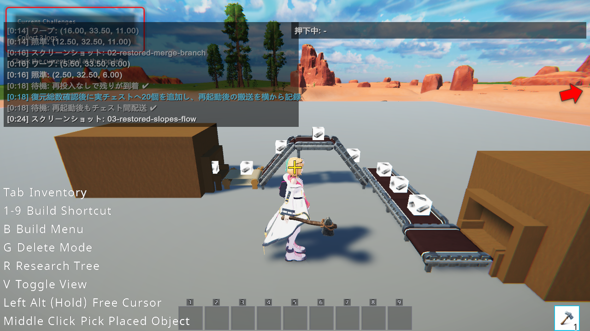
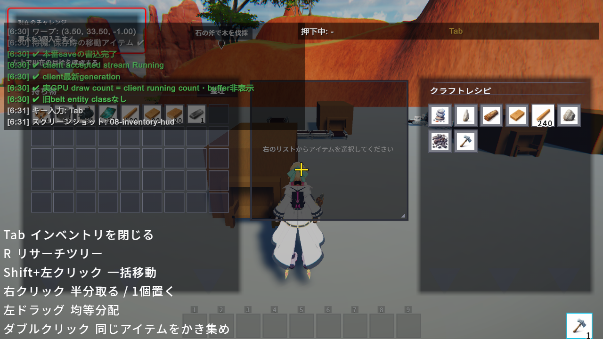

# Belt segment gameplay validation

Task 3 connects the CPU-authoritative world and accepted client CPU/GPU replay to ordinary URP rendering. Materials are registered on snapshot rebuild for existing items and on accepted insertion events for new kinds; the complete master-to-dense-index mapping stays fixed. Missing images log once per renderer lifetime, including across topology rebuilds. Running items are image-textured 0.3-unit cubes with center offset `(0.5, 0.48, 0.5)` in `BeltItemRenderer`. The world currently uses speed 16 progress units per tick (256 per cell); this prototype tuning is independent of gear RPM and remains adjustable.

## Recorded game behavior

The isolated world is `moorestech_client/PlaytestResults/worlds/belt-segment-task3-01`, generated map seed 24691. Existing user worlds were not used. The checked-in scenarios use the existing playtest DSL, ordinary camera/HUD and UI placement. Only inventory seeding and observations use test helpers; transport uses real chest updates, machine ports, authoritative topology and accepted client replay.

`20260924_020546/belt-segment-gameplay` passed 77/77 assertions, with no error logs. The recorded source chest → unpowered gear belt → Up → elevated straight → Down → turns → destination route delivered all 20 initial items. Nine real connector edges were asserted. Two sources inserted six iron and six copper items into a merge and three-exit branch. A four-cell closed loop was filled and its feeder removed through the production removal API: the feeder item was refunded, four running loop items remained, and the obsolete merge buffer's one item disappeared as specified. Accepted generation and actual GPU indirect counts matched the client running items; internal buffers produced no instances. A further 20 items were saved while moving through the main route.

`20260924_022216/belt-segment-reload` passed 14/14 assertions, no error logs. Before reseeding, main-route total 40 and merge-route total 12 survived restart; routes and loop cut matched. Ordinary Look input and player movement exposed the belt surfaces. All 20 additional items then arrived, bringing the destination to 60, followed by a successful production save.

This first reload compares stopped state to the observation made after the first save completed. The original disk at tick 9124 contains progress 240 for one loop item; the later observation and ready-state contain 256. Their identity, entry and round-robin state agree. That run is evidence of conservation and resumed delivery, not exact disk progress equality. The disk-based reload `20260924_022542/belt-segment-reload` passed 14/14 assertions with no error logs. It uses the fully stopped disk save at tick 17036 directly as expected state: all six cells (GUID/progress/entry/RR), topology/cut, main total 60 and merge total 12 agree. After verification, 20 newly seeded items arrive, bringing the destination to 80, and a further production save succeeds. Moving-state equality at the load boundary is covered separately by Task 1's disk-roundtrip tests; ready.marker occurs after ticks resume.

After the material registration correction, `20260924_030412/belt-segment-reload` again passed 14/14 with `ErrorLogs=[]`: the actual saved tick 19121 restored all six stopped cells and totals 80/12; another 20 items reached the destination (100), followed by save success. The complete startup-through-stop Editor log span (8,175,457 bytes) contains zero missing-image diagnostics and zero belt network-apply failures. The MP4 is 10,160,740 bytes, with six PNGs. The final slope image below comes from this run.

## Visual artifacts

All run paths below are relative to `moorestech_client/PlaytestResults/`; each directory retains `result.json`, `recording.mp4` and the named PNGs.

| Run | Evidence |
| --- | --- |
| `20260924_020546/belt-segment-gameplay` | Full UI placement, two kinds, branch, loop, removal/refund, visibility, moving save; `08-inventory-hud.png` verifies the real generic inventory/HUD |
| `20260924_030412/belt-segment-reload` | Final material-fix replay, disk-based equality plus `01a-skit-hidden.png` / `01b-skit-restored.png` visibly remove/restore loop and junction boxes through the registered visibility role |
| `20260924_030412/belt-segment-reload` | `02-restored-merge-branch.png` exposes both textures on the connected route; `03-restored-slopes-flow.png` shows cubes aligned with both slopes and turns |

The first run's chest-facing screenshots occlude parts of the loop and junction. They alone do not establish geometry there. The reload uses the ordinary camera from the side. Recorded video timestamps differ from wall-clock overlay timestamps because capture frame delivery was below the nominal 30 FPS.





## Automated validation and commands

Commands run from the repository root unless a work directory is specified. Native Windows tool paths are recorded in `.superpowers/sdd/task3-evidence/commands.ps1`; the recorded-game launch wrappers are `run-gameplay.sh` and `run-reload.sh` in that directory.

```powershell
uloop compile --project-path <repo>/moorestech_client
uloop run-tests --project-path <repo>/moorestech_client --test-mode EditMode --filter-type regex --filter-value 'BeltDraw|PlaytestInputScopeTest|PlaceBlockProtocolBeltFamilyTest'
python .agents/skills/unity-playmode-recorded-playtest/scripts/platform-probe-test.py
dotnet run --project tools/BeltSegment/Benchmark/BeltSegment.Benchmark.csproj -c Release -- 129 64 10000 1000 replay-packing
```

Focused checks before the material follow-up: 24/24 pass (16 GPU geometry/resources tests, input restoration, real vertical-placement rejection); earlier generic cutover regression run 101/101 pass; native path/port helper tests 2/2 pass. Shader tests include straight/corner/up/down, restored left/right merge entries, wrapped queue head 310 with 259 running items in capacity 320 and varied nonzero gaps across lanes 127/128/255, the 129th segment, sparse item IDs, buffer invisibility and resource replacement. Initial shader failures exposed divergent group barriers and were fixed before the passing runs.

Web work directory `moorestech_web/webui`, using pinned Node 20.18.1/pnpm 9.15.0:

```text
pnpm install --frozen-lockfile
pnpm test src/bridge/contract src/features/blockInventory
pnpm test src/bridge/contract/actionNames.test.ts
pnpm build
pnpm exec tsc -p e2e/tsconfig.json --noEmit
```

Initial Web run was 221/222: a shared action-name fixture still included the removed action. After fixing it, the two action-name tests pass. Production build passes with the existing large-chunk warning; final e2e TypeScript check passes. Browser e2e suites were not run. Actual generic inventory/HUD rendering is recorded above.

Windows automation fixes accept native absolute paths and test port availability by an exclusive native bind. Missing `lsof` no longer implies a free port. Playtest input clones InputSettings, isolates physical keyboard/mouse noise with temporary devices, and restores the original settings and device states on success or cancellation; it does not edit the project's input asset. Live diagnostic injection established that the original unfocused keyboard was disabled, and the scoped setting made the same B key reach the build menu.

The unfiltered client EditMode suite, including imported server tests, completed with **3,552 passed / 29 failed / 6 skipped (3,587 total)**. The CLI disconnected at an EditMode-in-Playing domain reload; the fresh Unity XML is retained at `.superpowers/sdd/task3-evidence/full-client-suite.xml` (end `2026-09-23 17:56:37Z`). No second full run was performed. One obsolete v1 save-migration expectation is refit to the chosen v3 new-world contract and checked separately after the full run.

The remaining 28 failures are retained in `full-client-failures.json`; they are not silently counted as passing. Observed failure groups include Windows readonly Git object deletion, `/w` versus `\w`, missing `chmod`, packet-file sharing/permission errors, OS input injection, source-text newline expectations, a Unix PID-1 assumption, and CSV/JSON parsing through a Git-output helper without explicit output encoding. Video assembly's zero-segment result has no confirmed root cause. The pinned master JSON loads in every game preflight; the changed CSV differs only by the approved removed GUID row. These failures were not reproduced on the baseline, so their baseline status is unproven.

After the material follow-up, the focused client/replay/placement/input/save run passed 86/88. Its two failures were test expectations: a blanket warning assertion included unrelated shader warnings, and the obsolete v1 migration test expected success. The actual renderer regression then passed in a 6/7 follow-up; the remaining save diagnostic expectation was corrected, and all six save-clock/random-state tests passed. These are separate recorded runs, not a claimed single 88/88 rerun. After making the late-Start CPU snapshot accessor available to player compilation and requiring the diagnostic boolean explicitly, compile plus the three resource/material tests pass. The renderer regression verifies snapshot registration, accepted insertion registration, unused-kind silence, one missing-kind warning across rebuilds, old-resource disposal and binding of recreated materials to the new buffers.

Startup audit also found 20 unused master item images absent on disk (clean-room/semiconductor kinds 51–55 and 57–71; full GUID/name/path list in `missing-master-images.json`). Iron and copper images used by the recorded transport are present. Eager creation had logged unused missing images; actual-use registration corrects this without changing master assets or inventing replacement art. Transporting an absent-image kind still creates the required visible magenta cube and emits its diagnostic.

## Measured workload

Local .NET 8.0.16 observation, not a performance guarantee. Setup, warmup and result recording are outside the timed intervals.

| Measurement | Result |
| --- | --- |
| Segments / capacity per segment | 129 / 64 |
| Initial and final running items | 2,064 |
| Warmup / measured ticks | 1,000 / 10,000 |
| Input / output events | 20,253 / 20,253 |
| Actual GPU ABI event packing | 40,506 × 16 = 648,096 upload bytes |
| CPU replay | 43.128 ms; 0 allocated bytes |
| CPU upload preparation | 0.749 ms; 0 allocated bytes |
| Final replay parity | Pass |
| Shared-workload initial snapshot MessagePack payload | 176,594 bytes |
| Shared-workload 10,000 frame MessagePack payloads | 1,192,320 bytes total |
| Unity snapshot serialization | 3.8182 ms |
| Unity 10,000 frame serialization | 24.8777 ms |
| Unity serializer allocations | Unavailable: 8,192-byte positive-control allocation reports 0 |
| GPU execution time | Not measured |

The final .NET rerun uses the same deterministic `BeltRecordedWorkload` source as Unity `BeltRecordedWireMeasurementTest`. Unity warms up 1,000 frame serializations, measures the actual production snapshot/frame DTO serializer, then decodes and replays all 10,000 frames, verifying every previous-state hash, final parity, 20,253 inputs/20,253 outputs and 2,064 initial/final items. The reported wire payload includes generation 1, ticks 0–10,000, per-tick sequence 1, route geometry and prior-state hashes; item Position metadata is null as in the shared Core benchmark. Outer transport envelopes are excluded. This serialized workload is separate from GPU ABI upload bytes and timing. Raw: `.superpowers/sdd/task3-evidence/review-shared-wire-measurement.json`, `review-shared-replay-benchmark.json`.

The earlier wire bytes are a separate real-serializer Unity microbenchmark from Task 2: one segment/one item, 10,000 iterations, snapshot 113 bytes; frame with events 23 bytes, empty frame 18 bytes; GPU events 32/0 bytes respectively. Combined replay/packing CPU time was 1.590/1.144 ms; its Unity allocation counter reported 0. The later positive-control probe shows that counter is unavailable on this runtime, so the earlier zero is not evidence of zero allocations. The .NET allocation measurements above use the separate .NET runtime. Raw: `.superpowers/sdd/task2-evidence/packing-measurement-final.json`; Task 3 raw: `replay-benchmark.json`.

## Cutover and remaining iteration

FilterSplitter schema, master definitions, dedicated UI/actions and the old belt movement/entity path are removed. Shared generic inventory contracts and block geometry remain. The unused old entity and FilterSplitter prefabs and their Addressable entries were deleted using Unity APIs. Main master pin is `65d288662b0abf826fb8f3ad956db00a4609853b`, pushed in [external Draft PR 67](https://github.com/moorestech/moorestech_master/pull/67); only the four approved master/localization files changed.

Rendering performs no production synchronous GPU readback; accepted ticks/rebuilds update positions, ordinary frames submit indirect draws, and the existing skit visibility role hides/restores the same renderer. The benchmark does not establish GPU execution cost or a production scale target. Large-world GPU profiling, visual art tuning and speed tuning remain future measurements.

## Task review follow-up

Protocol rejection now logs the block ID, direction and position before declining vertical belt placement; regression tests retain no-placement/no-cost assertions. Blueprint rejection logs only on an explicit paste attempt, with no repeated preview-frame diagnostic. The GPU ring-wrap test now checks accumulated varied nonzero gaps for all 259 items, including batch boundaries 127/128/255. The obsolete neighboring Web filter comment was removed.

Compile and the 20 affected tests passed (`review-fixes-focused-2.json`, `review-fixes-focused.xml`). The initial compile failure from a missing Blueprint test assembly reference was corrected. Existing warning artifacts remain; neither the full suite nor recordings were repeated for these diagnostic/measurement changes. The remaining 28 full-suite failures retain their stated unresolved status.

The final wire fixture passed again after adding the allocation-counter positive control (`review-wire-final-test.json`, `review-wire-final.xml`): snapshot 3.8182 ms, frames 24.8777 ms; serializer allocation fields are null because an 8,192-byte allocation also reports zero. Snapshot/frame byte totals and parity remain unchanged.

## Final review update — 2026-09-24

The measurements above retain the historical `ApplyTick`/packing and wire paths. Their zero-allocation observations do not describe the current client `TryApplyTick` guard. To exercise the current CPU replay entry:

```sh
uloop run-tests --project-path ./moorestech_client --filter-type regex --filter-value 'BeltRecordedWireMeasurementTest' --unsaved-changes fail --timeout-seconds 1200
```

The fresh-ingress workload uses the same 129 × 64 topology, 10,000 ticks, 2,064 initial/final items and 20,253 input/output events, but assigns a new deterministic transport GUID on ingress, as production does. The historical workload recycles a just-output GUID in the same tick and is rejected by the new live-identity guard. `TryApplyTick` timing includes the previous-state hash, live/same-frame GUID checks and CPU replay; it excludes construction, workload/oracle preparation, DTO decode/validation and GPU work. Two uncontrolled Unity Editor repetitions took **4100.7293 ms and 1837.1325 ms** with parity preserved. These are observations, not a speedup claim or a cross-runtime comparison. The known 8,192-byte allocation probe reported zero, so allocated bytes are unavailable, not measured zero. Historical wire scope remains DTO payloads only: snapshot 176,594 B, 10,000 frames 1,192,320 B, transport envelope excluded; the earlier results remain intact above.

The exact focused test sequence was **241/247 → 246/247 → affected subset 4/4 → latest relevant subset 27/27**. These are separate runs. Final functional-source compilation succeeded, and the comment-only follow-up also compiled (0 errors, 32 warnings). The existing 28 full-suite failures remain without a baseline rerun. Current recorded removal in `20260924_063846/belt-step6-removal-template` passed 28/28; its side view passed 1/1. The earlier generated-map attempt `20260924_062437/belt-step6-removal` remains failed (74/75, startup UI assertion); its terrain-obscured views are not visual acceptance.

Cell saves normalize unused interior `AcceptedInput`, so exact raw graph/hash restoration is not claimed. Head entry and buffer/RR checks remain; unchanged curved-loop tests compare deterministic cut/geometry, ordered GUID/kind/distance and actual GPU positions through 80 replay ticks, with full-hash convergence after a lap. This preserves the observed rendering and future transport contract.

C03/D01 (server failure-tick ownership/policy) is still pending. Refix reported no new Criticals in its applied-diff scope and retained two Warnings: live identity/target checks cost O(K×N + K²) for K insertions and N live items; late `BeltItemRenderer.Start` reconstruction can fail outside the world's Failed/startup-fault boundary when snapshot application already completed. Frequency and large-world impact are unmeasured. These warnings and the pending decision are not resolved by the passing focused checks.

Clean representative views were recaptured in PlayMode, active scene `MainGame`, from the saved world with the playtest diagnostic `PlaytestOverlayView` disabled during capture and restored afterward: [belt items](pr-assets/belt-segment-gameplay/belt-items-clean.png), [player inventory](pr-assets/belt-segment-gameplay/inventory-clean.png). These are unchanged GameView PNGs; ordinary game/tutorial HUD remains visible.
