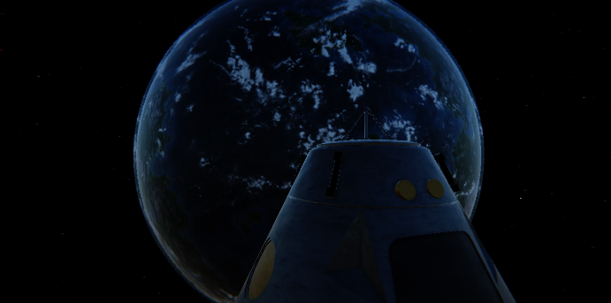

# Skit 星空背景 QA

## 検証条件

- Unity: 6000.3.8f1
- Scene: `Assets/Scenes/Other/SkitTest.unity`
- Skit: `Vanilla/Skit/skits/100_start_game`
- Capture: Game View rendering、691x343

`SkitTest` のDI登録は本番 `MainGameStarter` より古く、`ISkitActionController` が未登録だった。検証時だけ本番と同じ `SkitActionContext` の2 interface登録へ一時的に合わせてコンパイルし、検証後に完全に元へ戻した。このテストハーネス変更はPRへ含めていない。

現行実装は `WebUiScreenGate.IsWebUiMode` が恒久的に `true` のため、台詞はWeb UIへ送られ、Game View rendering captureにはuGUI台詞欄が表示されない。`SkitManager.IsPlayingSkit = true` を確認し、最初の台詞で待機している状態の宇宙描画を取得した。

## 確認結果

- 灰色背景が星空へ置き換わった。
- 惑星と宇宙船が星空より手前に描画された。
- pink Material、全面黒、見えている範囲の継ぎ目、前景遮蔽はなかった。
- runtimeの `SpaceSkybox` はactiveで、新Materialと6面Texture参照がすべて解決していた。
- uLoop packageのdomain reload起因Errorをクリア後、5秒間の安定稼働で新規Errorは0件だった。
- 一時検証コードを戻した最終状態のUnity compileはError 0件だった。

## 補足

スクリーンショットは最初のカメラ方向を確認する証跡であり、6方向すべての視覚比較ではない。6面の対応はprivate側の既存 `StarSkyBox.mat` と同じproperty割当であることを参照検査した。
