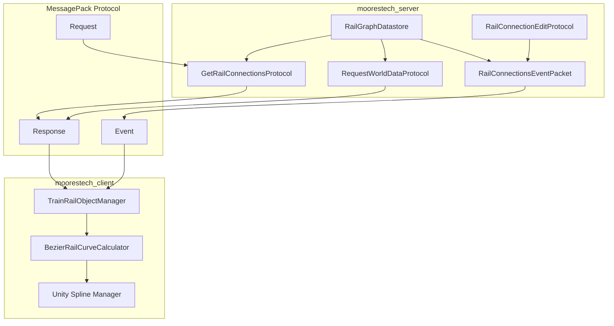
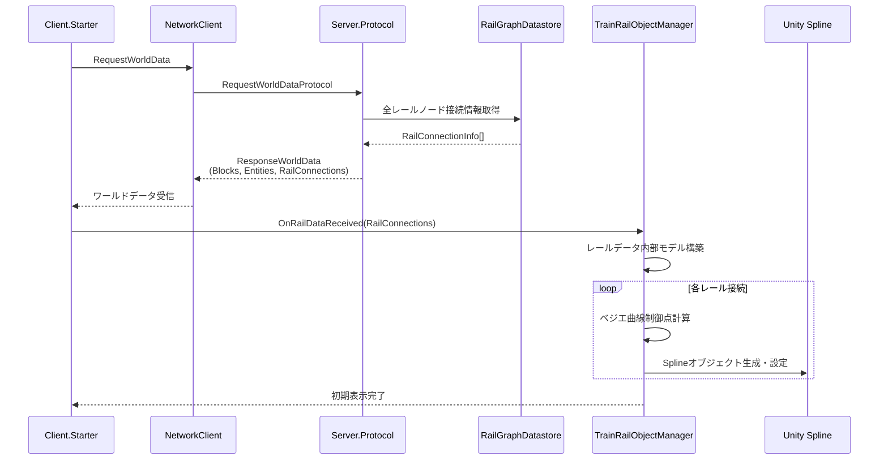
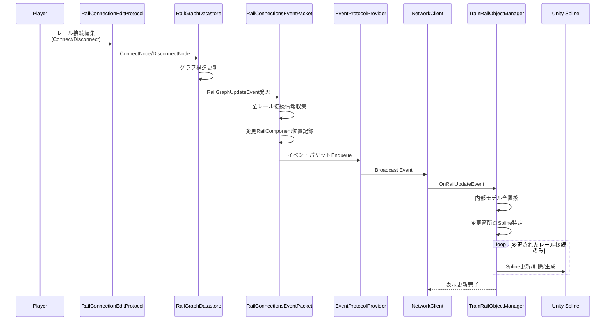
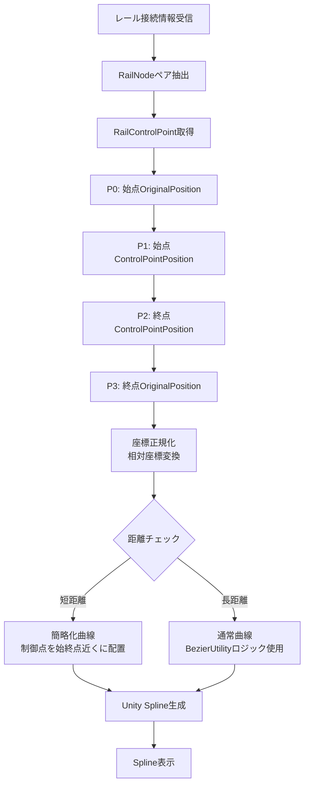
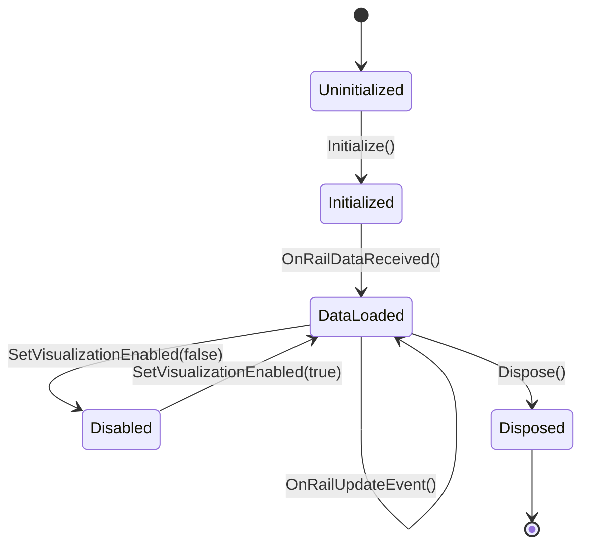
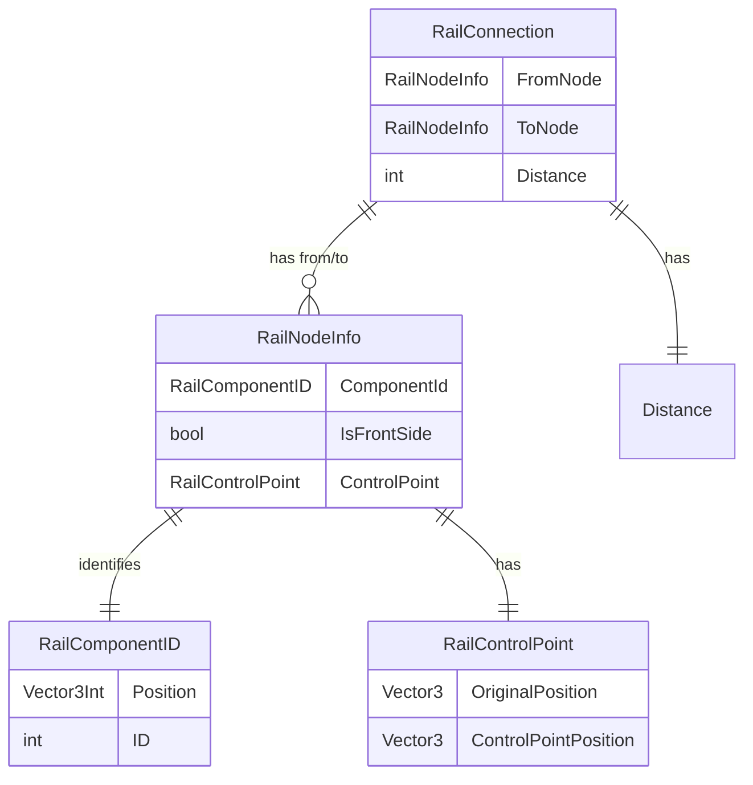
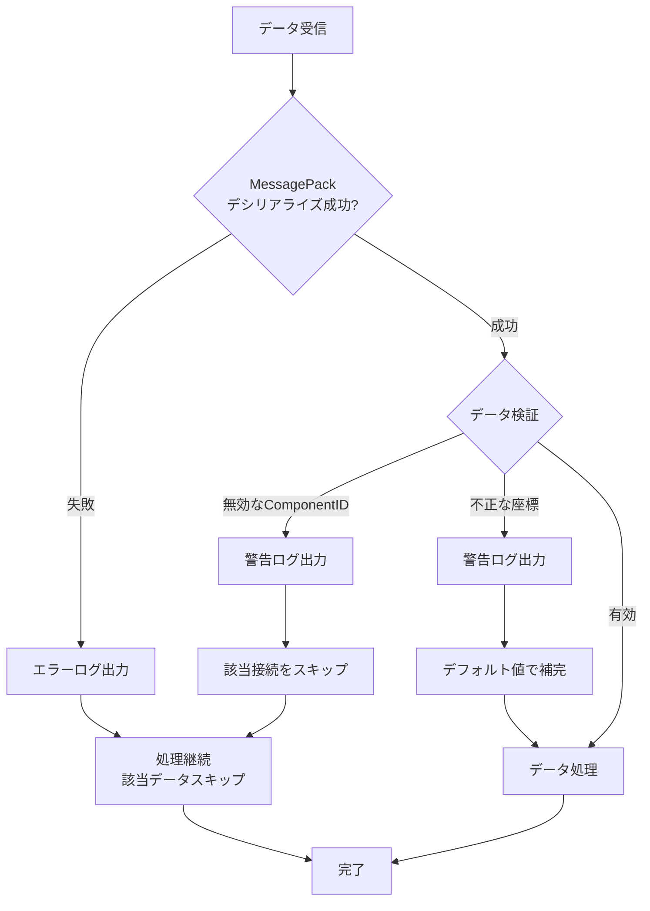
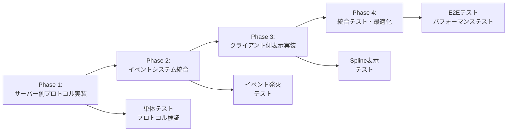

# 技術設計書 - Railway Rail Visualization

## Overview

本機能は、サーバー側のRailGraphDatastoreが管理する鉄道レール接続情報をクライアント側で視覚化するシステムを提供します。プレイヤーはレールの配置状況と接続関係を視覚的に把握でき、効率的な鉄道ネットワークの構築が可能になります。

**目的**: 既存のサーバー側レールグラフデータをプロトコル経由でクライアントへ送信し、Unity Splineパッケージを用いてベジエ曲線による滑らかなレール表示を実現します。

**ユーザー**: ゲームプレイヤーは、レール配置時および配置後にレールの接続状況を視覚的に確認でき、複雑な鉄道ネットワークの構築と管理を効率的に行えます。

**影響**: 既存のRailGraphDatastore、RequestWorldDataProtocol、イベントシステムに対して拡張を行い、新規プロトコルとクライアント側表示システムを追加します。

### Goals

- サーバー側レールグラフ情報のリアルタイム同期
- Unity Splineを使用した視覚的に自然なレール表示
- 既存システムとの完全な統合（RailGraphDatastore、プロトコルパターン）
- 100本以上のレール接続でも60FPS維持

### Non-Goals

- レール編集UI機能（既存のRailConnectionEditProtocolを使用）
- 列車の動作表示（既存のTrain表示システムが担当）
- レールの物理的な当たり判定（既存のブロックシステムが担当）
- 3Dモデルによるレール表示（Unity Splineによる曲線表示に特化）

## Architecture

### Existing Architecture Analysis

本機能は既存のmoorestechアーキテクチャを拡張する形で実装されます。

**既存のアーキテクチャパターンと制約**:
- サーバー・クライアント分離型アーキテクチャ
- MessagePackベースのバイナリプロトコル
- イベント駆動設計（UniRx使用）
- 依存性注入（サーバー: Microsoft.Extensions.DependencyInjection、クライアント: VContainer）

**既存のドメイン境界**:
- `Game.Train.RailGraph`: レールグラフの論理構造管理（RailNode、RailControlPoint、RailGraphDatastore）
- `Server.Protocol.PacketResponse`: リクエスト-レスポンス型プロトコル
- `Server.Event.EventReceive`: サーバー発火型イベントプロトコル
- `Client.Game.InGame.Train`: クライアント側列車関連機能

**保持すべき統合ポイント**:
- RailGraphDatastoreの既存API（GetConnectedNodesWithDistance、ResolveRailNode等）
- RequestWorldDataProtocolの拡張パターン（Blocks、Entitiesと同様）
- EventProtocolProviderを通じたイベント配信
- BezierUtilityの座標計算ロジック（RAIL_LENGTH_SCALE = 1024.0f）

### High-Level Architecture



**アーキテクチャ統合**:
- **既存パターンの保持**: MessagePack + イベント駆動設計、依存性注入パターン
- **新規コンポーネントの根拠**:
  - GetRailConnectionsProtocol: 既存のAllBlockStateProtocolと同様、初期データ取得用
  - RailConnectionsEventPacket: 既存のPlaceBlockEventPacketと同様、変更通知用
  - TrainRailObjectManager: クライアント側データ管理とSpline表示のファサード
- **技術スタック整合性**: Unity 2022.3 LTS、C# .NET Standard 2.1、既存MessagePack/UniRx/VContainer活用
- **ステアリング遵守**: 既存システム活用原則、#region活用、Null安全設計、try-catch禁止

### Technology Alignment

本機能は既存のmoorestechテクノロジースタックに完全に準拠します。

**既存技術スタックとの整合**:
- **サーバー側**: C#、Unity 2022.3 LTS、Microsoft.Extensions.DependencyInjection
- **クライアント側**: C#、Unity 2022.3 LTS、VContainer、Addressables
- **プロトコル**: MessagePack-CSharp
- **イベントシステム**: UniRx（サーバー側）

**新規導入ライブラリ**:
- **Unity Splines package** (com.unity.splines): Unity公式パッケージ、バージョン2.x以上を想定
  - 理由: 標準化された曲線表示、パフォーマンス最適化済み、メンテナンス性
  - 既存のBezierUtilityとの互換性を保ちつつ、表示層でSplineを活用

**既存パターンからの逸脱なし**: すべて確立されたmoorestechのアーキテクチャパターンに従います。

### Key Design Decisions

#### Decision 1: RequestWorldDataProtocolへの統合 vs 専用プロトコルの並行実装

**Context**: クライアント起動時にレール情報を取得する必要があります。既存のRequestWorldDataProtocolに統合するか、独立した専用プロトコルを作成するかの選択です。

**Alternatives**:
1. RequestWorldDataProtocolのレスポンスにレール情報を追加（統合アプローチ）
2. GetRailConnectionsProtocolを別途作成し、InitialHandshake後に呼び出す（分離アプローチ）
3. 両方を実装（ハイブリッドアプローチ）

**Selected Approach**: ハイブリッドアプローチ（統合 + 専用プロトコルの両方）

RequestWorldDataProtocolのResponseWorldDataMessagePackにRailConnectionsフィールドを追加し、同時にGetRailConnectionsProtocolも実装します。これにより：
- 初期ロード: RequestWorldDataで一括取得（1回の通信）
- 動的取得: 必要に応じてGetRailConnectionsで個別取得可能

**Rationale**:
- 初期ロードの最適化: ブロック、エンティティと同時取得により通信回数削減
- 柔軟性: 後からレール情報のみを再取得するユースケースに対応
- 既存パターン踏襲: AllBlockStateProtocolとBlockStateProtocolの関係と同様

**Trade-offs**:
- Gain: 初期ロード時間短縮、API柔軟性向上
- Sacrifice: 若干の実装コード増加（ただし既存パターンのコピーで対応可能）

#### Decision 2: イベントペイロードでの差分更新 vs 全体更新

**Context**: レール接続変更時のイベントパケットで、変更された接続のみ送信するか、全レール情報を送信するかの選択です。

**Alternatives**:
1. 差分のみ送信（追加・削除された接続のみ）
2. 全レール接続情報を送信
3. 変更があったRailComponentの周辺情報のみ送信

**Selected Approach**: 全レール接続情報を送信（要件2.2に明記）

RailConnectionsEventPacketは毎回全レール接続情報を含めます。ただし、変更があったRailComponentの位置情報は別途明示します。

**Rationale**:
- シンプルさ: クライアント側で差分マージロジック不要、全置換で状態同期が確実
- 整合性: サーバーとクライアントの状態が常に一致することを保証
- パフォーマンス: 初期段階では数百接続程度を想定、MessagePack圧縮で帯域は許容範囲
- デバッグ容易性: 状態不整合のデバッグが簡単

**Trade-offs**:
- Gain: 実装シンプル、状態整合性保証、デバッグ容易
- Sacrifice: 帯域使用量増加（ただし想定規模では許容範囲）

#### Decision 3: Unity Spline vs カスタムメッシュ生成 vs LineRenderer

**Context**: レール曲線の視覚化手法の選択です。

**Alternatives**:
1. Unity Splines package（公式パッケージ）
2. カスタムメッシュ生成（ProceduralMeshGeneration）
3. LineRenderer（Unity組み込み）

**Selected Approach**: Unity Splines package

**Rationale**:
- 標準化: Unity公式パッケージ、長期サポート保証
- 機能性: ベジエ曲線、カリング、LOD等の最適化が組み込み済み
- 保守性: ドキュメント充実、コミュニティサポート
- パフォーマンス: GPUインスタンシング等の最適化が適用済み
- 既存BezierUtilityとの互換性: 制御点計算は既存ロジック活用、表示のみSpline

**Trade-offs**:
- Gain: 開発速度、保守性、パフォーマンス、標準化
- Sacrifice: パッケージ依存追加（ただしUnity公式のため許容）

## System Flows

### レール情報取得フロー（初期ロード）



### レール接続更新イベントフロー



### ベジエ曲線計算フロー



## Requirements Traceability

| 要件 | 要件概要 | コンポーネント | インターフェース | フロー |
|------|----------|----------------|------------------|--------|
| 1.x | 全レール情報取得プロトコル | GetRailConnectionsProtocol, RequestWorldDataProtocol拡張 | GetResponse() | 初期ロードフロー |
| 2.x | レール更新イベントプロトコル | RailConnectionsEventPacket | OnRailGraphUpdate() | 更新イベントフロー |
| 3.x | 初期データ取得への統合 | RequestWorldDataProtocol拡張 | ResponseWorldDataMessagePack | 初期ロードフロー |
| 4.x | クライアント側レールデータ管理 | TrainRailObjectManager | OnRailDataReceived(), UpdateRailData() | 初期・更新フロー |
| 5.x | ベジエ曲線計算 | BezierRailCurveCalculator | CalculateBezierControlPoints() | ベジエ曲線計算フロー |
| 6.x | Unity Splineによる表示 | UnitySplineVisualizer (TrainRailObjectManager内部) | CreateSpline(), UpdateSpline() | 全フロー |
| 7.x | TrainRailObjectManagerの責務 | TrainRailObjectManager | Initialize(), OnDestroy() | 全フロー |
| 8.x | パフォーマンス考慮 | TrainRailObjectManager（カリング、段階更新） | UpdateVisibility() | 更新フロー |
| 9.x | エラーハンドリング | 各コンポーネントのバリデーション層 | ValidateRailData() | 全フロー |
| 10.x | テスト容易性 | 各コンポーネント + テストヘルパー | - | テストフロー |

## Components and Interfaces

### サーバー側 / プロトコル層

#### GetRailConnectionsProtocol

**Responsibility & Boundaries**
- **Primary Responsibility**: クライアントからのリクエストに応じて、現在のすべてのレール接続情報を返す
- **Domain Boundary**: Server.Protocol.PacketResponse名前空間、リクエスト-レスポンス型プロトコル
- **Data Ownership**: RailGraphDatastoreからデータを読み取り専用で取得
- **Transaction Boundary**: 単一リクエスト-レスポンスのトランザクション

**Dependencies**
- **Inbound**: NetworkClient（クライアント側）
- **Outbound**: RailGraphDatastore、ServiceProvider（DI）
- **External**: MessagePack-CSharp

**Contract Definition**

**API Contract**:

| Method | Endpoint | Request | Response | Errors |
|--------|----------|---------|----------|--------|
| GetResponse | va:getRailConnections | GetRailConnectionsRequest | GetRailConnectionsResponse | - |

**Request/Response Schema**:

```csharp
[MessagePackObject]
public class GetRailConnectionsRequest : ProtocolMessagePackBase
{
    // リクエストボディなし（全データ取得）
    [Obsolete("デシリアライズ用のコンストラクタです。基本的に使用しないでください。")]
    public GetRailConnectionsRequest() { }

    public GetRailConnectionsRequest()
    {
        Tag = GetRailConnectionsProtocol.Tag;
    }
}

[MessagePackObject]
public class GetRailConnectionsResponse : ProtocolMessagePackBase
{
    [Key(2)] public RailConnectionData[] Connections { get; set; }

    [Obsolete("デシリアライズ用のコンストラクタです。基本的に使用しないでください。")]
    public GetRailConnectionsResponse() { }

    public GetRailConnectionsResponse(RailConnectionData[] connections)
    {
        Tag = GetRailConnectionsProtocol.Tag;
        Connections = connections;
    }
}

[MessagePackObject]
public class RailConnectionData
{
    [Key(0)] public RailNodeInfo FromNode { get; set; }
    [Key(1)] public RailNodeInfo ToNode { get; set; }
    [Key(2)] public int Distance { get; set; }

    [Obsolete("デシリアライズ用のコンストラクタです。基本的に使用しないでください。")]
    public RailConnectionData() { }

    public RailConnectionData(RailNodeInfo from, RailNodeInfo to, int distance)
    {
        FromNode = from;
        ToNode = to;
        Distance = distance;
    }
}

[MessagePackObject]
public class RailNodeInfo
{
    [Key(0)] public RailComponentIDMessagePack ComponentId { get; set; }
    [Key(1)] public bool IsFrontSide { get; set; }
    [Key(2)] public RailControlPointMessagePack ControlPoint { get; set; }

    [Obsolete("デシリアライズ用のコンストラクタです。基本的に使用しないでください。")]
    public RailNodeInfo() { }

    public RailNodeInfo(RailComponentIDMessagePack id, bool isFront, RailControlPointMessagePack cp)
    {
        ComponentId = id;
        IsFrontSide = isFront;
        ControlPoint = cp;
    }
}

[MessagePackObject]
public class RailControlPointMessagePack
{
    [Key(0)] public Vector3MessagePack OriginalPosition { get; set; }
    [Key(1)] public Vector3MessagePack ControlPointPosition { get; set; }

    [Obsolete("デシリアライズ用のコンストラクタです。基本的に使用しないでください。")]
    public RailControlPointMessagePack() { }

    public RailControlPointMessagePack(Vector3 orig, Vector3 ctrl)
    {
        OriginalPosition = new Vector3MessagePack(orig);
        ControlPointPosition = new Vector3MessagePack(ctrl);
    }
}

[MessagePackObject]
public class RailComponentIDMessagePack
{
    [Key(0)] public Vector3IntMessagePack Position { get; set; }
    [Key(1)] public int ID { get; set; }

    [Obsolete("デシリアライズ用のコンストラクタです。基本的に使用しないでください。")]
    public RailComponentIDMessagePack() { }

    public RailComponentIDMessagePack(Vector3Int pos, int id)
    {
        Position = new Vector3IntMessagePack(pos);
        ID = id;
    }
}
```

**Preconditions**:
- サーバーが起動済みであること
- RailGraphDatastoreが初期化済みであること

**Postconditions**:
- 現時点の全レール接続情報がレスポンスに含まれる
- レールが存在しない場合は空配列を返す

**Invariants**:
- RailGraphDatastoreの状態は変更されない（読み取り専用）
- レスポンスはMessagePack形式でシリアライズ可能

**Integration Strategy**:
- 新規プロトコルクラスとして`Server.Protocol.PacketResponse`に追加
- PacketResponseCreatorのコンストラクタに登録
- 既存のAllBlockStateProtocolと同様のパターンを踏襲

#### RequestWorldDataProtocol拡張

**Responsibility & Boundaries**
- **Primary Responsibility**: 既存のブロック・エンティティ情報に加え、レール接続情報も含めて返す
- **Domain Boundary**: Server.Protocol.PacketResponse名前空間、既存プロトコルの拡張
- **Data Ownership**: RailGraphDatastoreからデータを読み取り専用で取得
- **Transaction Boundary**: 単一リクエスト-レスポンスのトランザクション

**Dependencies**
- **Inbound**: NetworkClient（クライアント側）
- **Outbound**: RailGraphDatastore、WorldBlockDatastore、EntityDatastore
- **External**: MessagePack-CSharp

**Contract Definition**

**API Contract（拡張）**:

既存のResponseWorldDataMessagePackにRailConnectionsフィールドを追加：

```csharp
[MessagePackObject]
public class ResponseWorldDataMessagePack : ProtocolMessagePackBase
{
    [Key(2)] public BlockDataMessagePack[] Blocks { get; set; }
    [Key(3)] public EntityMessagePack[] Entities { get; set; }
    [Key(4)] public RailConnectionData[] RailConnections { get; set; } // 新規追加

    [Obsolete("デシリアライズ用のコンストラクタです。基本的に使用しないでください。")]
    public ResponseWorldDataMessagePack() { }

    public ResponseWorldDataMessagePack(
        BlockDataMessagePack[] blocks,
        EntityMessagePack[] entities,
        RailConnectionData[] railConnections)
    {
        Tag = ProtocolTag;
        Blocks = blocks;
        Entities = entities;
        RailConnections = railConnections;
    }
}
```

**Integration Strategy**:
- 既存のRequestWorldDataProtocol.csを修正
- GetResponse()メソッド内でRailGraphDatastoreから全レール情報を取得
- ResponseWorldDataMessagePackの生成時にRailConnections配列を追加
- 後方互換性: 古いクライアントはKey(4)を無視（MessagePackの仕様）

#### RailConnectionsEventPacket

**Responsibility & Boundaries**
- **Primary Responsibility**: レール接続の追加・削除時に全クライアントへイベント通知を送信
- **Domain Boundary**: Server.Event.EventReceive名前空間、サーバー発火型イベント
- **Data Ownership**: RailGraphDatastoreから現在の状態を読み取り、変更情報も記録
- **Transaction Boundary**: イベント発火ごとに全レール情報をスナップショット

**Dependencies**
- **Inbound**: RailGraphDatastore（イベント発火源）
- **Outbound**: EventProtocolProvider（イベントキュー）
- **External**: UniRx、MessagePack-CSharp

**Contract Definition**

**Event Contract**:

- **Published Event**: `va:event:railConnectionsUpdate`
- **Schema**: RailConnectionsEventMessagePack
- **Trigger Conditions**: RailGraphDatastore内でConnectNode/DisconnectNodeが呼ばれた時
- **Ordering**: 変更順に発行（同一フレーム内の複数変更は1イベントに統合可能）
- **Delivery**: EventProtocolProviderのキューを通じて配信（at-least-once）

```csharp
[MessagePackObject]
public class RailConnectionsEventMessagePack
{
    [Key(0)] public RailConnectionData[] AllConnections { get; set; }
    [Key(1)] public RailComponentIDMessagePack[] ChangedComponentIds { get; set; }

    [Obsolete("デシリアライズ用のコンストラクタです。基本的に使用しないでください。")]
    public RailConnectionsEventMessagePack() { }

    public RailConnectionsEventMessagePack(
        RailConnectionData[] allConnections,
        RailComponentIDMessagePack[] changedIds)
    {
        AllConnections = allConnections;
        ChangedComponentIds = changedIds;
    }
}
```

**Idempotency**:
- クライアント側で全置換するため、同じイベントを複数回受信しても結果は同じ

**Recovery**:
- イベント欠損時はRequestWorldDataまたはGetRailConnectionsで状態を再取得可能

**Integration Strategy**:
- RailGraphDatastoreにRailGraphUpdateEventを追加（UniRx.Subject）
- RailConnectionsEventPacketでイベントをSubscribe
- イベント発火時に全レール情報を収集し、EventProtocolProviderへEnqueue
- 既存のPlaceBlockEventPacketと同様のパターン

**イベント初期化場所**:
- サーバー起動時、Game.Train関連の初期化処理内でRailConnectionsEventPacketをインスタンス化
- RailGraphDatastoreの初期化後に実行

### クライアント側 / 表示層

#### TrainRailObjectManager

**Responsibility & Boundaries**
- **Primary Responsibility**: レールデータの受信、管理、ベジエ曲線計算、Unity Spline表示の統合管理
- **Domain Boundary**: Client.Game.InGame.Train名前空間、クライアント側レール表示のファサード
- **Data Ownership**: 受信したレール接続情報の内部モデル、Splineオブジェクトの参照
- **Transaction Boundary**: レールデータ更新ごとに内部モデルとSpline表示を同期

**Dependencies**
- **Inbound**: NetworkClient（プロトコル受信）、ゲームシーンライフサイクル
- **Outbound**: BezierRailCurveCalculator、Unity Splines API
- **External**: Unity Splines package、VContainer

**Contract Definition**

**Service Interface**:

```csharp
public interface ITrainRailObjectManager
{
    // 初期化とライフサイクル
    // Initialize when the game scene starts
    void Initialize();

    // Clean up all spline objects when the scene is destroyed
    void Dispose();

    // レールデータ受信
    // Receive rail connection data from protocol and update display
    void OnRailDataReceived(RailConnectionData[] connections);

    // レール更新イベント受信
    // Receive rail update event and refresh display
    void OnRailUpdateEvent(RailConnectionData[] allConnections, RailComponentIDMessagePack[] changedIds);

    // 表示制御
    // Toggle rail visualization on/off
    void SetVisualizationEnabled(bool enabled);

    // 指定RailComponentのSpline表示更新
    // Update specific rail component spline display
    void UpdateRailComponentSpline(RailComponentIDMessagePack componentId);
}
```

**Preconditions**:
- Initialize()が呼ばれた後、OnRailDataReceivedまたはOnRailUpdateEventを呼ぶこと
- Unity Splinesパッケージがインストール済みであること

**Postconditions**:
- OnRailDataReceived後、全レール接続がSplineとして表示される
- OnRailUpdateEvent後、変更されたレール接続のみSplineが更新される
- Dispose()後、全Splineオブジェクトが破棄される

**Invariants**:
- 内部モデルとSpline表示は常に同期している
- 無効な座標データは内部でスキップされ、エラーログが出力される

**State Management**:



**Integration Strategy**:
- MonoBehaviourとして実装し、ゲームシーンに配置（シングルトンパターン）
- VContainerでITrainRailObjectManagerとして登録
- NetworkClientからプロトコル受信時にコールバック経由で呼び出し
- Awake()でInitialize()、OnDestroy()でDispose()を呼び出し

#### BezierRailCurveCalculator

**Responsibility & Boundaries**
- **Primary Responsibility**: RailControlPoint情報からUnity Spline用のベジエ曲線制御点を計算
- **Domain Boundary**: Client.Game.InGame.Train名前空間、曲線計算ロジック
- **Data Ownership**: 計算結果の制御点リスト（一時的）
- **Transaction Boundary**: 計算メソッド呼び出しごとに独立

**Dependencies**
- **Inbound**: TrainRailObjectManager
- **Outbound**: BezierUtility（Game.Train.Utility、サーバー側の共有ロジック）
- **External**: UnityEngine（Vector3）

**Contract Definition**

**Service Interface**:

```csharp
public interface IBezierRailCurveCalculator
{
    // Calculate Bezier control points from rail node pair
    // Returns: (P0, P1, P2, P3) for cubic Bezier curve
    (Vector3 p0, Vector3 p1, Vector3 p2, Vector3 p3) CalculateBezierControlPoints(
        RailNodeInfo fromNode,
        RailNodeInfo toNode,
        int distance);

    // Validate if rail connection data is valid for curve calculation
    bool ValidateRailConnection(RailNodeInfo fromNode, RailNodeInfo toNode);
}
```

**Preconditions**:
- fromNodeとtoNodeのRailControlPoint情報が有効であること
- distanceが正の値であること

**Postconditions**:
- 4点のベジエ曲線制御点が返される
- 無効なデータの場合はデフォルト値（ゼロベクトル）を返し、エラーログ出力

**Invariants**:
- BezierUtility.RAIL_LENGTH_SCALE（1024.0f）を使用してスケール変換
- 既存のBezierUtility.GetBezierCurveLength()と互換性を保つ座標系

**計算アルゴリズム**:

```
1. fromNode.ControlPoint.OriginalPositionをP0とする
2. fromNode.ControlPoint.ControlPointPositionをP0からの相対位置としてP1を計算
3. toNode.ControlPoint.ControlPointPositionをP3からの相対位置としてP2を計算
4. toNode.ControlPoint.OriginalPositionをP3とする
5. 距離に基づいて制御点を調整（短距離の場合は簡略化）
```

**Integration Strategy**:
- 静的クラスとして実装（状態を持たない純粋な計算ロジック）
- TrainRailObjectManagerから各レール接続ごとに呼び出し

#### Unity Spline Visualization（TrainRailObjectManager内部機能）

**Responsibility & Boundaries**
- **Primary Responsibility**: Unity Splinesパッケージを使用してベジエ曲線を視覚化
- **Domain Boundary**: TrainRailObjectManager内部のプライベート機能
- **Data Ownership**: SplineContainerオブジェクトとその子オブジェクト
- **Transaction Boundary**: Spline生成・更新・削除ごとに独立

**Dependencies**
- **Inbound**: TrainRailObjectManager
- **Outbound**: Unity Splines API（SplineContainer、Spline、BezierKnot）
- **External**: Unity Splines package

**Contract Definition**

**Internal Interface（TrainRailObjectManager内）**:

```csharp
// Internal methods within TrainRailObjectManager
private SplineContainer CreateSplineObject(RailConnectionData connection)
{
    // Create GameObject with SplineContainer component
    // Set Bezier curve control points
    // Apply material and rendering settings
    // Return SplineContainer reference
}

private void UpdateSplineObject(SplineContainer spline, RailConnectionData connection)
{
    // Update existing spline control points
    // Recalculate curve
}

private void DestroySplineObject(SplineContainer spline)
{
    // Properly dispose spline GameObject and resources
    // Remove from internal tracking dictionary
}
```

**Spline生成パターン**:

```
1. GameObject生成（名前: "RailSpline_{FromId}_{ToId}"）
2. SplineContainerコンポーネント追加
3. Splineインスタンス作成
4. BezierKnot（4つの制御点）を設定
5. SplineExtrudeコンポーネント追加（メッシュ生成）
6. マテリアル設定（半透明、カラー指定）
7. 内部Dictionaryで管理（Key: レール接続識別子、Value: SplineContainer）
```

**パフォーマンス最適化**:
- カリング: 画面外のSplineはMeshRendererを無効化
- LOD: カメラ距離に応じてSplineの解像度を調整
- Pooling: 削除されたSplineオブジェクトをプールして再利用（将来的な最適化）

**Integration Strategy**:
- TrainRailObjectManager内のプライベートメソッドとして実装
- 各レール接続に対して1つのSplineContainerを生成
- Dictionary<RailConnectionId, SplineContainer>で管理

## Data Models

### Domain Model

本機能のドメインモデルは、既存のGame.Train.RailGraphドメインを活用します。

**Core Concepts**:

- **RailNode（既存）**: レールグラフの頂点、前後方向と表裏の概念を持つ
- **RailControlPoint（既存）**: ベジエ曲線の制御点情報（OriginalPosition、ControlPointPosition）
- **RailConnection（新規概念）**: 2つのRailNode間の有向接続、距離情報を含む
- **RailComponentID（既存）**: レールブロックの座標とIDによる一意識別子
- **ConnectionDestination（既存）**: 接続先を表す（RailComponentID + 表裏フラグ）

**ドメインイベント**:
- **RailGraphUpdateEvent（新規）**: RailGraphDatastore内でレール接続が追加・削除された時に発火

**Business Rules & Invariants**:
- 各RailNodeは最大4方向（前面2方向、背面2方向）に接続可能
- レール接続は有向グラフ（双方向接続は2本の有向辺で表現）
- RailControlPointは表裏で共有される（メモリ効率化）
- 距離はint型で固定小数点表現（スケール: 1024.0f = 1ワールド単位）

### Logical Data Model

**Entity Relationships**:



**Attributes and Types**:

| Entity | Attribute | Type | Description |
|--------|-----------|------|-------------|
| RailConnection | FromNode | RailNodeInfo | 接続元ノード情報 |
| RailConnection | ToNode | RailNodeInfo | 接続先ノード情報 |
| RailConnection | Distance | int | ノード間距離（固定小数点） |
| RailNodeInfo | ComponentId | RailComponentID | レールブロック識別子 |
| RailNodeInfo | IsFrontSide | bool | 前面側か背面側か |
| RailNodeInfo | ControlPoint | RailControlPoint | ベジエ制御点情報 |
| RailComponentID | Position | Vector3Int | ブロック座標 |
| RailComponentID | ID | int | 同一座標内のレールID |
| RailControlPoint | OriginalPosition | Vector3 | レールブロックの実座標 |
| RailControlPoint | ControlPointPosition | Vector3 | 制御点の相対座標 |

**Natural Keys and Identifiers**:
- RailConnection: (FromNode.ComponentId, FromNode.IsFrontSide, ToNode.ComponentId, ToNode.IsFrontSide)の組み合わせで一意
- RailComponentID: (Position, ID)の組み合わせで一意

**Referential Integrity Rules**:
- RailConnectionのFromNodeとToNodeは、サーバー側RailGraphDatastoreに存在するRailNodeに対応
- 無効なRailComponentIDを含むRailConnectionはクライアント側でスキップ

### Data Contracts & Integration

**API Data Transfer（MessagePack）**:

プロトコル間でやり取りされるデータ構造は、すべてMessagePackObjectとして定義されます。

**Validation Rules**:
- RailComponentID.Positionのx, y, z座標が有効範囲内（-16777216 ~ 16777216、float精度の限界）
- RailComponentID.IDが非負整数
- RailConnection.Distanceが正の整数
- RailControlPoint.OriginalPositionとControlPointPositionがNaN/Infinityでないこと

**Serialization Format**: MessagePack（バイナリ、圧縮効率高）

**Event Schemas**:

RailConnectionsEventMessagePackのスキーマバージョニング戦略：
- 現時点ではバージョン1.0として実装
- 将来的な拡張時はKey番号を追加（MessagePackは後方互換性を保つ）
- 互換性破壊時は新しいEventTagを使用（例: va:event:railConnectionsUpdate_v2）

**Cross-Service Data Management**:
- サーバー側RailGraphDatastoreが真のデータソース（Single Source of Truth）
- クライアント側は表示用のキャッシュとして扱い、常にサーバーと同期
- 同期失敗時はRequestWorldDataで全体を再取得

## Error Handling

### Error Strategy

本機能では、try-catch禁止ルールに従い、適切な条件分岐とnullチェックでエラーを処理します。

### Error Categories and Responses

**User Errors（4xx相当 - プロトコルレベル）**:
- **無効なリクエスト**: クライアントが不正なプロトコルタグで送信 → サーバー側でリクエスト無視、エラーログ出力
- **認証エラー**: （本機能では該当なし、既存の認証システムが担当）

**System Errors（5xx相当 - サーバー内部）**:
- **RailGraphDatastore未初期化**: プロトコル実行時にnullチェック → 空配列を返し、警告ログ出力
- **MessagePackシリアライズ失敗**: デシリアライズ時に条件分岐 → デフォルト値で補完、エラーログ出力

**Business Logic Errors（422相当 - データ検証）**:
- **存在しないRailComponentID**: クライアント側で受信時にValidateRailConnection()でチェック → その接続をスキップ、警告ログ出力
- **不正な向き情報**: IsFrontSideがtrue/false以外 → デフォルトでtrueに補完
- **負の距離値**: Distance < 0 → 絶対値を使用、警告ログ出力
- **NaN/Infinity座標**: Vector3のisNaN/isInfinityチェック → ゼロベクトルで補完、エラーログ出力

### エラーハンドリングフロー



### Monitoring

**Error Tracking**:
- Unity標準のDebug.LogError / Debug.LogWarningを使用
- エラーカテゴリごとに固有のログプレフィックスを付与（例: `[RailVisualization][Protocol]`、`[RailVisualization][Validation]`）

**Logging**:
- サーバー側: プロトコル実行時のエラー、RailGraphDatastoreアクセスエラー
- クライアント側: データ検証エラー、Spline生成エラー、ベジエ曲線計算エラー

**Health Monitoring**:
- クライアント側でフレームレート監視、60FPS未満が継続する場合は警告ログ
- Spline生成失敗数をカウント、閾値（例: 10回連続）を超えたらエラー通知

## Testing Strategy

### Unit Tests

**サーバー側テスト**（`Tests/CombinedTest/Server/PacketTest/`）:
1. GetRailConnectionsProtocol_空のレールグラフで空配列を返す
2. GetRailConnectionsProtocol_複数レール接続の正常系
3. GetRailConnectionsProtocol_MessagePackシリアライズ・デシリアライズ
4. RailConnectionsEventPacket_イベント発火時にキューへ追加
5. RailConnectionsEventPacket_変更RailComponentIdが正しく記録される

**クライアント側テスト**（`Client.Tests/PlayModeTest/`）:
1. BezierRailCurveCalculator_正常な制御点計算
2. BezierRailCurveCalculator_短距離レールの簡略化計算
3. BezierRailCurveCalculator_無効データのバリデーション
4. TrainRailObjectManager_モックデータでSpline生成確認
5. TrainRailObjectManager_更新イベントで差分更新

### Integration Tests

**サーバー・クライアント統合テスト**:
1. 初期ロード: RequestWorldData → レール情報取得 → クライアント側表示確認
2. レール追加: RailConnectionEdit → イベント受信 → Spline生成確認
3. レール削除: RailConnectionEdit → イベント受信 → Spline削除確認
4. 複数レール同時変更: 一括接続 → 単一イベント受信 → 全Spline更新確認
5. イベント欠損シミュレーション: イベント欠損 → 手動再取得 → 状態復元確認

### E2E Tests

**プレイモードテスト**:
1. ゲーム起動 → レール配置 → 視覚的確認（手動テスト）
2. 大量レール配置（100本以上） → フレームレート確認
3. カメラ移動 → カリング動作確認
4. レール編集 → リアルタイム更新確認
5. シーン遷移 → リソースクリーンアップ確認

### Performance/Load Tests

**パフォーマンステスト**:
1. レール100本配置 → フレームレート測定（目標: 60FPS以上）
2. レール500本配置 → フレームレート測定（目標: 30FPS以上）
3. Spline更新頻度測定: 秒間10回更新 → フレーム落ち確認
4. メモリ使用量測定: Spline1000個生成 → メモリリーク確認

## Performance & Scalability

### Target Metrics

- **フレームレート**: レール100本で60FPS維持
- **初期ロード時間**: レール100本の表示完了まで1秒以内
- **更新レスポンス**: レール接続変更からSpline更新まで100ms以内
- **メモリ使用量**: Spline1個あたり50KB以下

### Scaling Approaches

**水平スケーリング**:
- サーバー側は既存のマルチプレイヤーアーキテクチャに依存（本機能では新規スケーリング不要）

**垂直スケーリング**:
- クライアント側GPU性能に依存（Unity Splineの最適化を活用）

### Caching Strategies

**クライアント側キャッシュ**:
- RailConnectionデータを内部Dictionaryでキャッシュ
- SplineContainerオブジェクトをDictionaryで管理、再利用
- ベジエ曲線制御点を計算済みとしてキャッシュ（更新時のみ再計算）

**カリング戦略**:
- カメラ視錐台外のSplineはMeshRenderer無効化
- LOD: カメラ距離に応じてSplineメッシュ解像度を段階的に削減

### Optimization Techniques

**描画最適化**:
- Spline Extrudeの解像度を動的調整（近距離: 高解像度、遠距離: 低解像度）
- マテリアルのバッチング（同じマテリアルを共有）
- GPUインスタンシング（Unity Splineの組み込み機能を活用）

**更新最適化**:
- 差分更新: 変更されたRailComponentのSplineのみ更新
- 段階的更新: 大量レール追加時はフレームごとに10本ずつ生成

## Migration Strategy

本機能は新規機能のため、既存システムからのマイグレーションは不要です。ただし、既存システムへの統合ステップを定義します。

### 統合フェーズ



**Phase 1: サーバー側プロトコル実装**
- GetRailConnectionsProtocol実装
- RequestWorldDataProtocol拡張
- RailGraphDatastore連携
- プロトコル単体テスト作成・実行

**Phase 2: イベントシステム統合**
- RailGraphDatastoreにRailGraphUpdateEvent追加
- RailConnectionsEventPacket実装
- イベント発火テスト作成・実行

**Phase 3: クライアント側表示実装**
- TrainRailObjectManager実装
- BezierRailCurveCalculator実装
- Unity Spline統合
- クライアント単体テスト作成・実行

**Phase 4: 統合テスト・最適化**
- サーバー・クライアント統合テスト
- パフォーマンステスト実行
- カリング・LOD実装
- ドキュメント整備

### Rollback Triggers

以下の条件でロールバックを検討：
- Phase 1終了時に単体テストが50%以上失敗
- Phase 2終了時にイベント発火が不安定
- Phase 3終了時にSpline表示で重大なレンダリングエラー
- Phase 4終了時に60FPS維持できない（100本レール配置時）

### Validation Checkpoints

各フェーズ終了時に以下を確認：
- Phase 1: プロトコル単体テスト全通過、MessagePackシリアライズ正常
- Phase 2: イベント発火確認、EventProtocolProviderへの正常Enqueue
- Phase 3: Spline表示確認、ベジエ曲線計算正常、メモリリーク無し
- Phase 4: E2Eテスト全通過、60FPS維持、統合テスト全通過
