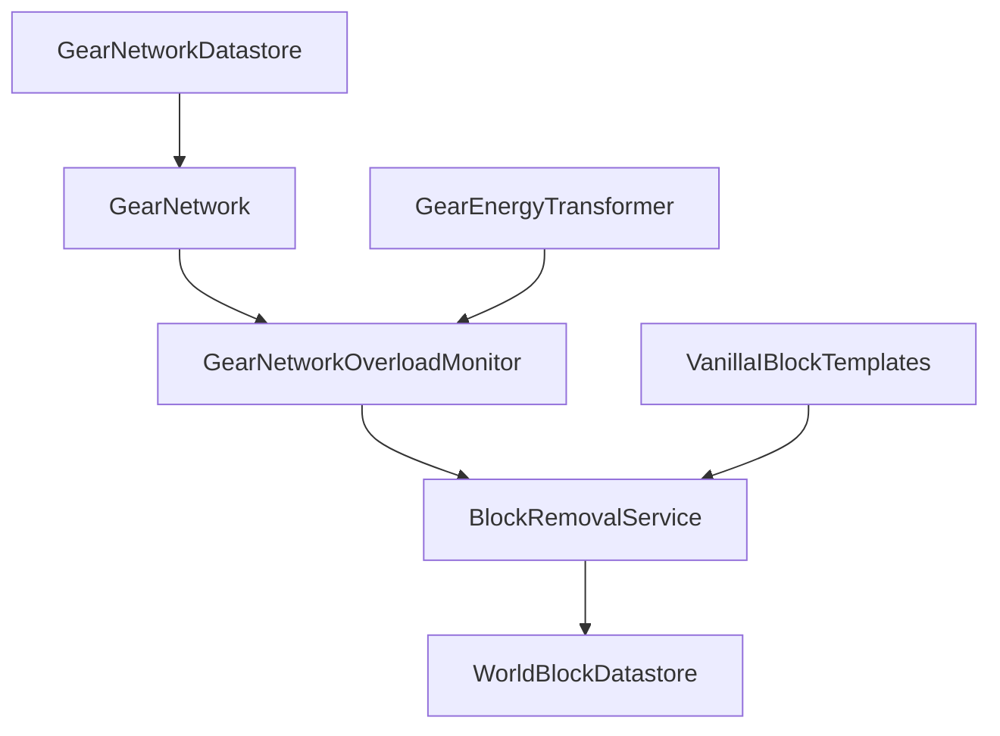
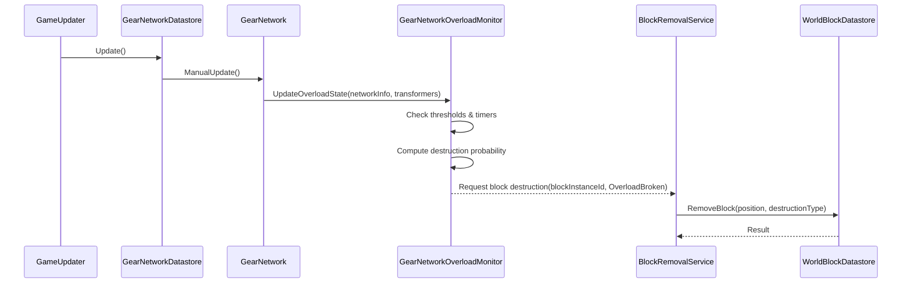

# Design Document - gear-network-overload-break

## Overview 
本機能は、サーバー側の歯車ネットワーク計算（`Game.Gear.Common.GearNetwork`／`GearNetworkDatastore`）に「過負荷監視と破壊トリガー」の責務を追加し、GearEnergyTransform系ブロックを過負荷条件に応じてワールドから破壊可能にするための仕組みを提供する。プレイヤーにとっては、高出力なギア構成や誤ったトルク設計に対してリスクとフィードバックを付与し、ゲームバランスとビジュアルな分かりやすさを向上させることが目的である。

主な利用者は、工場設計プレイヤーおよびゲームデザイナー（バランス調整担当）であり、プレイヤーは高負荷な歯車構成を構築する際の制約と演出として過負荷破壊を体験し、デザイナーはマスターデータのパラメーター調整により過負荷リスクの度合いを制御する。既存のギアネットワーク更新ループとワールドブロックデータストアを拡張する形で設計し、既存アーキテクチャ（ブロックテンプレート、DIコンテナ、サーバーコンテキスト）に整合することを重視する。

### Goals
- 歯車ネットワーク単位でRPM・トルク過負荷状態を検知し、状態に応じた破壊確率を算出できること
- GearEnergyTransform系ブロックを、ワールドデータストア経由で「過負荷破壊」「手動撤去」を区別して破壊できること  
- blocks.yamlスキーマとマスターデータを通じて、閾値・時間・確率・倍率パラメーターをデータ駆動で設定できること

### Non-Goals
- クライアント側のUI・エフェクト・サウンドなど、破壊演出の詳細仕様は本設計では扱わない
- 既存のギアネットワーク計算アルゴリズム（RPM伝播やトルク配分ロジック）の変更や最適化は行わない
- マルチプレイヤー同期やプロトコル仕様の追加は行わず、既存のブロック破壊イベント伝播に依存する

## Architecture

### Existing Architecture Analysis
- **ギアネットワーク管理**:  
  - `Game.Gear.Common.GearNetwork` が、歯車ジェネレーターとトランスフォーマーの接続関係からRPM・トルクを計算し、`ManualUpdate`で1フレーム単位のネットワーク更新を行う。  
  - `GearNetworkInfo` は、ネットワーク単位の総必要ギアパワー・総発生ギアパワー・稼働率・停止理由（`GearNetworkStopReason`）を持ち、現在のネットワーク状態を表現する。  
  - `Game.Gear.Common.GearNetworkDatastore` が、`GearNetworkId` と `BlockInstanceId` をキーにネットワーク集合を保持し、`GameUpdater.UpdateObservable` にサブスクライブすることで全ネットワークの `ManualUpdate` を呼び出す。  
- **ブロックとワールド**:  
  - `Game.Block.Interface.IBlockComponent` を実装する各ブロックコンポーネント（`IGearEnergyTransformer` を含む）が、ブロックインスタンスIDや挙動を表現する。  
  - サーバー全体のコンテキストは `Game.Context.ServerContext` により構成され、`IWorldBlockDatastore` などのインターフェースがDIコンテナから解決される。現在はブロック破壊は `WorldBlockDatastore.RemoveBlock(...)` などワールドデータストアレイヤーを直接呼ぶパターンが中心であり、明確な「ブロック破壊サービス」インターフェースは存在しない。  
- **DIとモジュール分離**:  
  - アセンブリ単位で責務が分割されており、ギアロジックは `Game.Gear`、ブロックの生成は `Game.Block`、サーバーコンテキストは `Game.Context` に配置される。  
  - DI登録はサーバー起動時に集中して行われ、`ServerContext` 経由でスタティックにアクセスされる。ギアロジック側から直接 `ServerContext` を参照する設計はできる限り避け、疎結合なサービスインターフェースを介したアクセスを優先する。

### Architecture Pattern & Boundary Map

選択するアーキテクチャパターンは、既存のサーバー側ドメイン分割（ギア・ブロック・ワールド）を維持した「サービス分離 + イベント駆動」に近い構成とし、以下の新規コンポーネント／境界を導入する。

- **選択パターン**: ドメインサービス分離 + 監視コンポーネント（`GearNetworkOverloadMonitor`）  
- **ドメイン境界**:  
  - ギアネットワーク計算 (`Game.Gear.Common`) と、ブロック破壊サービス (`Game.Block`) を明確に分離し、ギア側は「どのブロックを破壊するか」を決め、実際の破壊は専用のサービスインターフェースに委譲する。  
  - ワールドデータストア (`IWorldBlockDatastore`) は引き続きサーバーコンテキスト配下の共通インフラとみなし、ブロック破壊サービスはそのクライアントとして動作する。  
- **既存パターンの維持**:  
  - `GearNetwork` の更新ループにロジックを集約するパターンを維持し、過負荷状態の検知と破壊判定も原則としてこのループまたはそれに付随する監視コンポーネントで行う。  
  - ブロック生成／テンプレート構成は `Game.Block.Factory.BlockTemplate` の既存パターンを踏襲し、新しい依存性（`IBlockRemover`）はテンプレートコンストラクタ経由で注入する。  
- **新規コンポーネントの狙い**:  
  - `IBlockRemover` インターフェースを導入し、ブロック破壊の共通エントリポイントを提供することで、ギア以外からの破壊も一貫した経路で扱えるようにする余地を残す。  
  - ギアネットワーク単位の過負荷監視・破壊判定は、`GearNetwork` と密接に関連するため `Game.Gear` ドメイン内の責務とし、`GearNetwork` から呼ばれる内部サービス／補助クラスとしてモデル化する。  

### Technology Stack

| Layer | Choice / Version | Role in Feature | Notes |
|-------|------------------|-----------------|-------|
| Backend / Services | C# (.NET Standard 2.1) + Unity | ギアネットワークロジック・過負荷監視・ブロック破壊サービスの実装 | 既存サーバーコードと同一環境 |
| Data / Storage | `IWorldBlockDatastore` 実装 | ブロック実体の永続化と破壊反映 | 既存インフラの再利用 |
| Data / Master | `VanillaSchema/blocks.yml` + SourceGenerator | ギア過負荷パラメーター（閾値・時間・確率・倍率）のスキーマ・マスターデータ管理 | 既存マスターデータシステムに新フィールド追加 |
| Messaging / Events | 既存のブロック更新イベント (`IWorldBlockUpdateEvent` 等) | ブロック破壊後のクライアント通知 | 本設計では詳細変更なし |

## System Flows

### 歯車ネットワーク過負荷破壊フロー

**補足**:  
- `GearNetwork.ManualUpdate` 内で、既存のRPM・トルク計算と `GearNetworkInfo` の更新が行われた後に、過負荷監視コンポーネント（論理的には `GearNetworkOverloadMonitor`）にネットワーク情報とトランスフォーマー一覧を渡し、破壊判定を実施する。  
- 破壊決定はブロックインスタンスIDをキーに `BlockRemovalService` に依頼され、`BlockRemovalService` が内部で `IWorldBlockDatastore` に座標・破壊タイプ付きで削除を依頼する。  

## Requirements Traceability

| Requirement | Summary | Components | Interfaces | Flows |
|-------------|---------|------------|------------|-------|
| 1.1–1.6 | 歯車ネットワークのRPM・トルク過負荷状態の検知 | `GearNetwork`, `GearNetworkOverloadMonitor` | `IGearEnergyTransformer`, `GearNetworkInfo` | ギアネットワーク更新フロー |
| 2.1–2.8 | 閾値・時間・倍率・確率のパラメーター定義と計算 | `GearNetworkOverloadMonitor` | ブロックマスター生成クラス, マスターデータ型 | 過負荷破壊判定フロー |
| 3.1–3.5 | 過負荷状態継続時の判定スケジューリングと破壊トリガー | `GearNetworkOverloadMonitor` | `GameUpdater`, `GearNetwork` | 過負荷破壊フロー |
| 4.1–4.5 | 破壊タイプの区別とワールド破壊処理 | `BlockRemovalService` | `IBlockRemover`, `IWorldBlockDatastore` | ブロック破壊フロー |
| 5.1–5.4 | GearEnergyTransformブロックとの連携とネットワーク構造更新 | `GearNetwork`, `GearNetworkDatastore` | `IGearEnergyTransformer`, `GearNetworkId` | ネットワーク再構成フロー |
| 6.1–6.3 | 可観測性・デバッグ情報の記録と出力 | `GearNetworkOverloadMonitor` | ログ／デバッグ出力基盤 | 過負荷イベント観測フロー |

## Components and Interfaces

### Components Summary

| Component | Domain/Layer | Intent | Req Coverage | Key Dependencies (P0/P1) | Contracts |
|-----------|--------------|--------|--------------|--------------------------|-----------|
| GearNetworkOverloadMonitor | Game.Gear (Server) | ギアネットワーク単位の過負荷状態管理と破壊判定 | 1.x, 2.x, 3.x, 5.x, 6.x | `IGearEnergyTransformer` (P0), `IBlockRemover` (P0), マスターデータ型(P1) | サービス |
| BlockRemovalService (`IBlockRemover`, 実装) | Game.Block (Server) | ブロック破壊の共通エントリポイント | 4.x | `IWorldBlockDatastore` (P0), 破壊タイプEnum(P1) | サービス |
| GearNetwork (拡張) | Game.Gear (Server) | 既存ネットワーク更新＋過負荷監視呼び出し | 1.x, 3.x, 5.x | `GearNetworkOverloadMonitor` (P0) | ドメインサービス |
| GearNetworkDatastore (拡張) | Game.Gear (Server) | ネットワーク更新タイミングの制御 | 3.x | `GameUpdater.UpdateObservable` (P0) | データストア |
| ブロックテンプレート群 (拡張) | Game.Block (Server) | GearEnergyTransformブロックに破壊サービスを注入 | 5.x | `IBlockRemover` (P0) | ファクトリ |
| マスターデータ型 (拡張) | Mooresmaster.Model.BlocksModule | 過負荷パラメーターの保持・提供 | 2.x, 3.x | `MasterHolder.BlockMaster` (P0) | データモデル |

### Game.Gear Domain

#### GearNetworkOverloadMonitor

| Field | Detail |
|-------|--------|
| Intent | 歯車ネットワークごとの過負荷状態（RPM・トルク）を監視し、判定時間間隔ごとに破壊確率を計算してブロック破壊サービスに依頼する。 |
| Responsibilities | 閾値比較、超過倍率計算、判定タイマー管理、破壊対象ブロックの選択、破壊タイプ指定。 |
| Requirement Coverage | 1.1–1.6, 2.1–2.8, 3.1–3.5, 5.1–5.4, 6.1–6.3 |
| Dependencies | `IGearEnergyTransformer`, `GearNetworkInfo`, マスターデータ由来の過負荷設定型, `IBlockRemover` |
| Invariants | ネットワークID単位で過負荷状態・タイマー・乱数シードを一貫して扱う。破壊判定が失敗した場合でも状態管理が破綻しない。 |

**Key Interface Contracts (概念レベル)**  
- `UpdateOverloadState(GearNetworkId, GearNetworkInfo, IReadOnlyList<IGearEnergyTransformer>)`  
  - 入力: ネットワークID、現在のネットワーク情報、当該ネットワークに属するGearEnergyTransformers。  
  - 挙動:  
    - RPM・トルクの閾値をマスターデータから取得し、過負荷状態のフラグと継続時間を更新。  
    - 判定時間間隔に達した場合、超過倍率と倍率係数から最終破壊確率を算出し、乱数判定により破壊を行うか決定。  
    - 破壊が発生する場合、ネットワーク内の対象ブロックを1つ以上選択し、`IBlockRemover` に破壊タイプ「過負荷破壊」とともに依頼する。  
- `ResetNetworkState(GearNetworkId)`  
  - ネットワークが過負荷状態から解放されたとき、内部状態（タイマー・フラグ）を初期化する。  

**Implementation Notes**  
- Integration: `GearNetwork.ManualUpdate` 内で、既存のRPM・トルク計算と `CurrentGearNetworkInfo` 更新が完了した直後に `GearNetworkOverloadMonitor.UpdateOverloadState` を呼び出す形を想定する。  
- Validation: マスターデータに過負荷パラメーターが存在しないネットワークに対しては何も行わないことで、既存ブロックへの影響を限定する。  
- Risks: 破壊判定をフレームごとに行わず、判定時間間隔で集約することでパフォーマンス負荷を抑えるが、ネットワーク数が極端に増えた場合のコストは別途計測が必要。  

#### GearNetwork (extension)

| Field | Detail |
|-------|--------|
| Intent | 既存のギアネットワーク更新ロジックに過負荷監視呼び出しを追加し、ネットワーク情報を過負荷モニターへ提供する。 |
| Responsibilities | RPM・トルクの計算、`GearNetworkInfo` の更新、過負荷モニターへのデータ提供。 |
| Requirement Coverage | 1.1–1.6, 3.1–3.3, 5.1–5.4 |
| Dependencies | `IGearEnergyTransformer`, `IGearGenerator`, `GearNetworkOverloadMonitor` |

**Key Integration Point**  
- `ManualUpdate()` の最後に、`GearNetworkOverloadMonitor.UpdateOverloadState(NetworkId, CurrentGearNetworkInfo, GearTransformers)` を呼び出す設計とし、過負荷ロジックをネットワーク更新の一部として扱う。  

### Game.Block Domain

#### IBlockRemover (interface)

| Field | Detail |
|-------|--------|
| Intent | ブロック破壊の共通インターフェースとして、ブロック位置と破壊タイプに基づく除去を提供する。 |
| Responsibilities | ワールドデータストアへの削除依頼と、必要に応じたイベント発行の橋渡し。 |
| Requirement Coverage | 4.1–4.5 |
| Dependencies | `IWorldBlockDatastore`, 破壊タイプEnum, 位置情報型 (`Vector3Int` 等) |

**Key Interface Contracts (概念レベル)**  
- `RemoveBlock(BlockInstanceId blockInstanceId, BlockDestructionType destructionType)`  
  - 入力: ブロックインスタンスID、破壊タイプ。  
  - 挙動: ブロックインスタンスから位置情報を解決し、`IWorldBlockDatastore` に実際の削除を委譲する。無効IDの場合は何も変更しない。  

#### BlockRemovalService (implementation)

| Field | Detail |
|-------|--------|
| Intent | `IBlockRemover` のサーバー側実装として、`IWorldBlockDatastore` 経由でブロックを破壊する。 |
| Responsibilities | ブロック座標の解決、`IWorldBlockDatastore` への削除呼び出し、破壊タイプ情報の伝搬（必要に応じてイベント／ログ出力に使用）。 |
| Requirement Coverage | 4.1–4.5 |
| Dependencies | `IWorldBlockDatastore`, `ServerContext`/DIコンテナ, 破壊タイプEnum |

**Implementation Notes**  
- Integration: サーバー起動時のDIコンテナ構築処理で `IBlockRemover` を `BlockRemovalService` にバインドし、`ServerContext` 経由またはコンストラクタインジェクションで参照する。  
- Validation: 無効座標・存在しないブロックIDに対しては `IWorldBlockDatastore` の仕様に従い、状態変更を行わないことを明示する。  
- Risks: 破壊タイプ情報をクライアントにどこまで伝搬させるかは別途UI設計時に検討する必要がある。  

### Block Template Integration

#### VanillaIBlockTemplates (extension, conceptual)

| Field | Detail |
|-------|--------|
| Intent | 既存のバニラブロックテンプレートに `IBlockRemover` 依存性を追加し、GearEnergyTransform系ブロックへ破壊サービスを渡すパスを確立する。 |
| Responsibilities | コンストラクタで `IBlockRemover` を受け取り、対象ブロックテンプレートの生成時に適切なコンポーネントへ注入する。 |
| Requirement Coverage | 5.1–5.3 |
| Dependencies | `IBlockRemover`, Gear関連テンプレート (`VanillaShaftTemplate`, `VanillaGearTemplate` など) |

**Implementation Notes**  
- Integration: 既存のテンプレートコンストラクタシグネチャを拡張し、DIコンテナ側の登録も更新する必要がある（詳細は実装フェーズで調整）。  
- Risks: コンストラクタ引数追加に伴い、既存のテンプレートインスタンス生成箇所を網羅的に更新する必要がある。  

## Data Models

### Domain Model

- **GearNetwork**:  
  - 集約ルートとして、複数の `IGearEnergyTransformer` と `IGearGenerator` を束ね、ネットワークID・ギア回転情報・ネットワーク情報を保持する。  
  - 新たに「過負荷状態」と「過負荷判定タイマー」をネットワーク単位の状態として扱うが、物理実装は `GearNetworkOverloadMonitor` 側で保持する方針とする。  
- **BlockDestructionType (Enum)**:  
  - 値例: `OverloadBroken`, `ManualRemove`。  
  - ビジネス上の破壊理由を区別するための値オブジェクトに相当し、ブロック破壊のドメインイベントにも利用可能。  

### Logical Data Model

**過負荷パラメーター構造（概念）**  
- エンティティ: `GearOverloadSetting`（実体は `blocks.yml` で定義されるブロックパラメーターの一部）  
  - 属性例:  
    - `OverloadRpmThreshold` (float)  
    - `OverloadTorqueThreshold` (float)  
    - `OverloadCheckIntervalSeconds` (float)  
    - `BaseBreakProbability` (float, 0〜1)  
    - `RpmProbabilityMultiplier` (float)  
    - `TorqueProbabilityMultiplier` (float)  
  - 関連: 特定のGearEnergyTransformブロック定義に紐づくパラメーターセットとして扱われる。  

**Consistency & Integrity**  
- 閾値・確率・倍率はマスターデータとしてロード時に検証され、実行時は読み取り専用として扱う。  
- 過負荷設定が存在しないブロックは過負荷破壊対象外とすることで、マスターデータ欠損による予期しない破壊を防ぐ。  

### Data Contracts & Integration

- `IBlockRemover` と `IWorldBlockDatastore` 間の契約:  
  - `IBlockRemover` は論理的な破壊タイプとID/位置を扱い、`IWorldBlockDatastore` は物理的な削除処理とサーバー内イベント発行を担う。  
  - 破壊タイプは必要に応じてイベントペイロードに含められるよう、将来的な拡張余地を残しておく。  

## Error Handling

### Error Strategy
- **入力検証**:  
  - マスターデータの閾値・確率・倍率が不正値（負値や1を超える確率など）の場合は、ロード時のバリデーションで検出する前提とし、ランタイムでは前提条件が満たされているとみなす。  
  - 過負荷判定に必要なネットワーク情報やギアリストが欠落しているケースは想定しない（`GearNetwork` 内で一貫して管理されるため）。  
- **破壊要求の失敗**:  
  - 無効なブロックIDや座標に対する破壊要求は、`IWorldBlockDatastore` の仕様に従い「何もしない」処理とし、異常系として扱わない。  

### Error Categories and Responses
- ビジネスロジック系（想定内）:  
  - 過負荷状態であっても乱数判定により破壊が発生しないケースは正常系として扱う。  
- システム系（想定外）:  
  - ネットワーク辞書の整合性崩壊などは既存の `GearNetworkDatastore` の責務であり、本機能で新たな例外ハンドリングを追加しない。  

### Monitoring
- 過負荷状態への遷移／解除、各判定タイミングの最終破壊確率、破壊成否を内部記録し、デバッグ用に抽出可能とする。  
- 既存のログ基盤がある場合は、デバッグモード有効時のみ主要イベントを出力する方針とし、通常プレイ時には冗長なログを避ける。  

## Testing Strategy

- **Unit Tests**  
  - `GearNetworkOverloadMonitor` の単体テスト:  
    - 閾値未満／閾値超過時のフラグ・タイマー更新ロジックの検証。  
    - RPMのみ超過・トルクのみ超過・両方超過の各ケースで、計算される破壊確率倍率が要件どおりになることの検証。  
    - 乱数判定が破壊発生／非発生の境界近傍で正しく動作することの検証。  
  - `BlockRemovalService` の単体テスト:  
    - 有効・無効なブロックIDに対する挙動（`IWorldBlockDatastore` のモックを利用）。  
    - 破壊タイプ別に正しいパラメーターが渡されること。  
- **Integration Tests**  
  - 小規模なGearNetwork構成で、過負荷状態が一定時間続いたときに、GearEnergyTransformブロックが一定確率で破壊されることの確認（テスト用マスターデータを使用）。  
  - 手動撤去操作が、破壊タイプ `ManualRemove` として扱われることの確認。  
- **E2E / Gameplay Tests (必要に応じて)**  
  - プレイヤーが高負荷なギア構成を構築した際に、一定時間後にブロックが破壊されることを目視で確認するテストシナリオ。  

## Optional Sections

### Security Considerations
- 本機能は新しい外部インターフェースや権限境界を導入しないため、セキュリティ面での追加リスクは限定的である。  

### Performance & Scalability
- 過負荷判定は既存のギアネットワーク更新ループに1ステップ追加する形となるが、判定時間間隔を用いて判定頻度を制御することで、高負荷ネットワーク数が増加しても負担を抑制する設計とする。  

### Migration Strategy
- 既存のマスターデータには過負荷関連フィールドが存在しないため、新フィールドを追加しても既存ブロックはデフォルト値により過負荷破壊対象外として動作する。  

