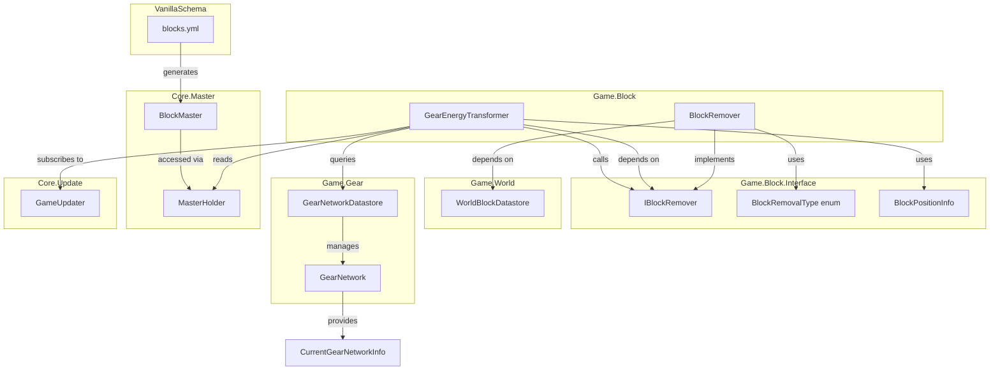
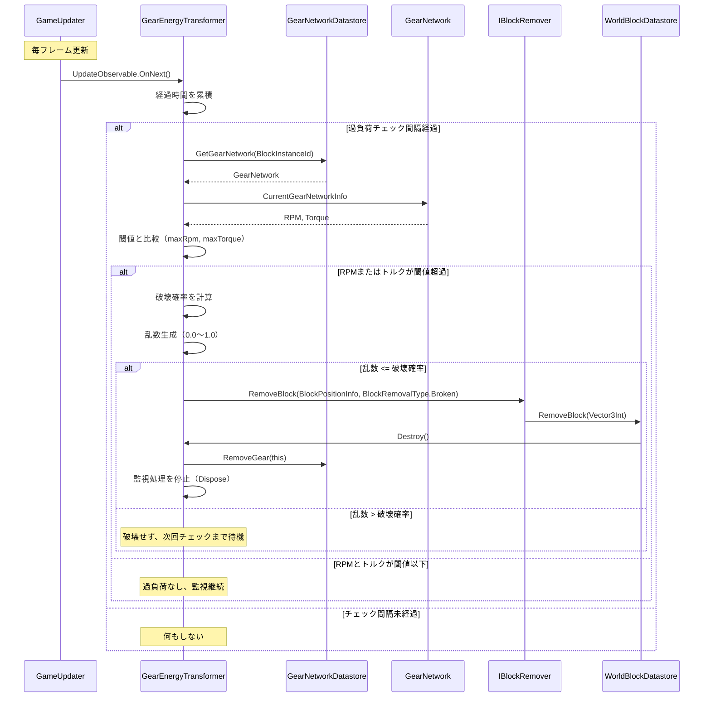

# Technical Design Document

## Overview
本機能は、歯車システムにおける過負荷破壊メカニズムを実装します。歯車ネットワーク内のRPMおよびトルクが指定された閾値を超えた場合、GearEnergyTransformブロック（歯車、シャフト等）が確率的に破壊される仕組みを提供します。

**Purpose**: プレイヤーに歯車システムの設計において適切な負荷管理と耐久性を考慮させることで、ゲームプレイに深みと戦略性を加えます。

**Users**: ゲームプレイヤーは過負荷による破壊リスクを管理しながら、効率的な歯車ネットワークを構築します。ゲーム開発者はマスターデータを通じて破壊パラメータを調整し、ゲームバランスを制御します。

**Impact**: 既存の歯車システムに対して、破壊メカニズムという新しいゲームプレイ要素を追加します。既存のブロック配置・削除システムを拡張し、破壊タイプ（手動削除 vs システムによる破壊）を区別できるようにします。

### Goals
- 歯車ネットワークのRPM・トルクが閾値を超過した場合の確率的ブロック破壊機能を実装
- マスターデータ（blocks.yaml）を通じた破壊パラメータの定義と調整を可能にする
- 既存の歯車システム（GearEnergyTransformer、GearNetwork）との統合を実現
- ブロック破壊タイプ（手動削除、システムによる破壊）の区別とログ記録を実装
- 依存性注入を活用したテスタブルな設計を提供

### Non-Goals
- クライアント側の過負荷UI表示（将来的な拡張として別フィーチャーで実装）
- ブロック破壊時のアニメーション・サウンド効果（UIフィーチャーの責務）
- 破壊されたブロックのアイテムドロップ（既存のブロック破壊システムに依存）
- パフォーマンス最適化（現時点では動作する実装を優先）

## Architecture

### Existing Architecture Analysis
本機能は既存の以下のシステムを拡張します：

**既存の歯車システムアーキテクチャ**:
- `GearEnergyTransformer`: 歯車ブロックの基底クラス、RPM/トルクの受け取りと状態管理
- `GearNetwork`: 歯車ネットワーク全体のRPM/トルク計算とパワー配分
- `GearNetworkDatastore`: 全歯車ネットワークの管理と更新処理

**既存のブロック管理システム**:
- `WorldBlockDatastore`: ワールド内のブロック配置・削除を管理
- `IBlockFactory`と`VanillaIBlockTemplates`: ブロックの生成とテンプレートパターン
- `ServerContext`: 静的コンテキストを通じたグローバルアクセス

**既存の制約**:
- DIコンテナ（Microsoft.Extensions.DependencyInjection）を使用した依存性注入パターン
- マスターデータシステム（YAMLスキーマ + SourceGenerator + JSON）
- Core.Updateシステム（GameUpdater.UpdateObservable）による定期更新

### Architecture Pattern & Boundary Map



**Architecture Integration**:
- **Selected pattern**: Dependency Injection with Interface Segregation
- **Domain/feature boundaries**:
  - `Game.Block.Interface`: ブロック破壊の抽象化（IBlockRemover、BlockRemovalType）
  - `Game.Block`: ブロック実装とビジネスロジック（BlockRemover、GearEnergyTransformer拡張）
  - `Game.World`: ワールド状態管理（既存のWorldBlockDatastore）
  - `Core.Master`: マスターデータアクセス（既存のMasterHolder）
- **Existing patterns preserved**:
  - DIコンテナを使用したシングルトン登録
  - マスターデータ駆動設計（YAMLスキーマ + SourceGenerator）
  - Core.UpdateによるReactive更新パターン
- **New components rationale**:
  - `IBlockRemover`: テスタビリティと単一責任の原則に基づく抽象化
  - `BlockRemovalType`: 破壊原因の型安全な区別
  - `GearEnergyTransformer`内の過負荷監視ロジック: 既存アーキテクチャとの整合性
- **Steering compliance**: プロジェクトのDI原則、マスターデータシステム、#regionパターンに準拠

### Technology Stack

| Layer | Choice / Version | Role in Feature | Notes |
|-------|------------------|-----------------|-------|
| Backend / Services | C# (.NET Standard 2.1) | ブロック破壊ロジック、過負荷監視、確率計算 | 既存のサーバー実装と同じ |
| Data / Storage | YAML + JSON (SourceGenerator) | マスターデータ（過負荷パラメータ）の定義と読み込み | blocks.yamlにIGearOverloadParamインターフェースを追加 |
| Messaging / Events | UniRx (Reactive Extensions) | GameUpdater.UpdateObservableによる定期更新 | 既存のCore.Updateシステムを利用 |
| Infrastructure / Runtime | Unity 2022.3 LTS | ゲームエンジン | 既存プロジェクトと同じ |
| Dependency Injection | Microsoft.Extensions.DependencyInjection | IBlockRemoverのシングルトン登録 | 既存のDIコンテナパターンを踏襲 |

## System Flows

### 過負荷検出と破壊実行フロー



**フロー説明**:
- GameUpdaterが毎フレーム更新通知を発行
- GearEnergyTransformerは経過時間を累積し、`overloadCheckIntervalSeconds`ごとに過負荷チェックを実行
- GearNetworkDatastoreから現在のネットワークを取得し、RPM/トルクを確認
- 閾値超過時は破壊確率を計算し、乱数判定で破壊を実行
- ブロック破壊時はIBlockRemoverを通じてWorldBlockDatastoreに委譲

## Requirements Traceability

| Requirement | Summary | Components | Interfaces | Flows |
|-------------|---------|------------|------------|-------|
| 1.1, 1.2, 1.3, 1.4 | マスターデータスキーマ拡張 | blocks.yml (IGearOverloadParam), SourceGenerator, BlockMaster | - | - |
| 2.1, 2.2, 2.3, 2.4 | ブロック破壊タイプ定義 | BlockRemovalType (enum) | BlockRemovalType | - |
| 3.1, 3.2, 3.3, 3.4 | IBlockRemover定義 | IBlockRemover (interface) | IBlockRemover.RemoveBlock | - |
| 4.1, 4.2, 4.3, 4.4, 4.5 | BlockRemover実装 | BlockRemover | IBlockRemover | - |
| 5.1, 5.2, 5.3, 5.4 | DIコンテナ登録 | MoorestechServerDIContainerGenerator | - | - |
| 6.1, 6.2, 6.3, 6.4 | VanillaIBlockTemplates注入 | VanillaIBlockTemplates | - | - |
| 7.1, 7.2, 7.3, 7.4 | BlockTemplate伝達 | VanillaGearTemplate, VanillaShaftTemplate | - | - |
| 8.1, 8.2, 8.3, 8.4, 8.5 | RPM・トルク監視 | GearEnergyTransformer (監視ロジック) | GameUpdater.UpdateObservable | 過負荷検出フロー |
| 9.1, 9.2, 9.3, 9.4, 9.5, 9.6 | 破壊確率計算 | GearEnergyTransformer (確率計算ロジック) | - | 過負荷検出フロー |
| 10.1, 10.2, 10.3, 10.4, 10.5, 10.6 | 確率的破壊実行 | GearEnergyTransformer (破壊実行ロジック) | IBlockRemover.RemoveBlock | 過負荷検出フロー |
| 11.1, 11.2, 11.3, 11.4, 11.5, 11.6 | エラーハンドリング | GearEnergyTransformer (境界条件チェック) | - | - |
| 12.1, 12.2, 12.3, 12.4, 12.5 | テスタビリティ | GearEnergyTransformer (DIによる注入), テスト用マスターデータ | IBlockRemover (モック可能) | - |

## Components and Interfaces

### Component Summary

| Component | Domain/Layer | Intent | Req Coverage | Key Dependencies (P0/P1) | Contracts |
|-----------|--------------|--------|--------------|--------------------------|-----------|
| BlockRemovalType | Game.Block.Interface | ブロック削除理由を型安全に表現 | 2.1, 2.2, 2.3, 2.4 | なし | - |
| IBlockRemover | Game.Block.Interface | ブロック破壊の抽象化インターフェース | 3.1, 3.2, 3.3, 3.4 | BlockRemovalType (P0), BlockPositionInfo (P0) | Service |
| BlockRemover | Game.Block | IBlockRemoverの具体実装 | 4.1, 4.2, 4.3, 4.4, 4.5 | IWorldBlockDatastore (P0) | Service |
| GearEnergyTransformer拡張 | Game.Block | 過負荷監視・確率計算・破壊実行ロジック | 7.2, 8.1-8.5, 9.1-9.6, 10.1-10.6, 11.1-11.6 | IBlockRemover (P0), GearNetworkDatastore (P0), MasterHolder (P0), GameUpdater (P0) | - |
| IGearOverloadParam | VanillaSchema | 過負荷パラメータのスキーマ定義 | 1.1, 1.2, 1.3, 1.4 | なし | - |
| VanillaIBlockTemplates拡張 | Game.Block | IBlockRemoverの注入と伝達 | 6.1, 6.2, 6.3, 6.4 | IBlockRemover (P0) | - |

### Game.Block.Interface

#### BlockRemovalType

| Field | Detail |
|-------|--------|
| Intent | ブロック削除の理由を型安全に区別するEnum型 |
| Requirements | 2.1, 2.2, 2.3, 2.4 |

**Responsibilities & Constraints**
- プレイヤーによる手動削除とシステムによる破壊を明確に区別
- 将来的な破壊タイプの追加（Expired、Collision等）に対応可能な拡張性
- Game.Block.Interface名前空間に配置し、全モジュールからアクセス可能

**Dependencies**
- なし（基本型としてプロジェクト全体で使用可能）

**Contracts**: Service [X]

##### Enum Definition
```csharp
namespace Game.Block.Interface
{
    /// <summary>
    /// ブロック削除の理由を表すEnum
    /// Block removal reason enumeration
    /// </summary>
    public enum BlockRemovalType
    {
        /// <summary>
        /// プレイヤーによる手動削除
        /// Manual removal by player
        /// </summary>
        ManualRemove,

        /// <summary>
        /// システムによる破壊（過負荷等）
        /// Broken by system (e.g., overload)
        /// </summary>
        Broken
    }
}
```

**Implementation Notes**
- Enumメンバーには日本語と英語のコメントを付与
- 将来的な拡張として`Expired`（耐久度切れ）、`Collision`（衝突）等の追加を想定

---

#### IBlockRemover

| Field | Detail |
|-------|--------|
| Intent | ブロック破壊機能の抽象化インターフェース |
| Requirements | 3.1, 3.2, 3.3, 3.4 |

**Responsibilities & Constraints**
- ブロック位置と削除理由を受け取り、ブロックを削除する単一責任
- 依存性注入を通じて提供され、テスト時にはモック化可能
- 削除処理はWorldBlockDatastoreに委譲し、イベント通知やログ記録を含む
- Game.Block.Interface名前空間に配置し、Game.Block層から依存可能

**Dependencies**
- Inbound: GearEnergyTransformer - 過負荷破壊処理 (P0)
- Inbound: その他ブロックコンポーネント - 将来的な破壊処理 (P1)
- Outbound: なし（インターフェース定義のため）

**Contracts**: Service [X]

##### Service Interface
```csharp
namespace Game.Block.Interface
{
    /// <summary>
    /// ブロック破壊機能を提供するインターフェース
    /// Interface for block removal functionality
    /// </summary>
    public interface IBlockRemover
    {
        /// <summary>
        /// 指定位置のブロックを削除する
        /// Remove the block at the specified position
        /// </summary>
        /// <param name="position">削除するブロックの位置情報 / Position info of the block to remove</param>
        /// <param name="removalType">削除理由 / Removal reason</param>
        void RemoveBlock(BlockPositionInfo position, BlockRemovalType removalType);
    }
}
```

- **Preconditions**:
  - `position`がnullでないこと
  - `position.OriginPos`に有効なブロックが存在すること
- **Postconditions**:
  - 指定位置のブロックがワールドから削除されている
  - ブロックのDestroy()メソッドが呼び出されている
  - 削除理由がログまたはイベントシステムに記録されている
- **Invariants**:
  - 削除処理は冪等性を持たない（同じ位置への複数回呼び出しは2回目以降何もしない）

**Implementation Notes**
- Integration: BlockRemoverクラスで実装し、IWorldBlockDatastoreに委譲
- Validation: `position`のnullチェックは実装クラスで行う（try-catch禁止のため条件分岐で対応）
- Risks: ブロックが存在しない場合の挙動は既存のRemoveBlock()の仕様に従う

---

### Game.Block

#### BlockRemover

| Field | Detail |
|-------|--------|
| Intent | IBlockRemoverインターフェースの具体実装 |
| Requirements | 4.1, 4.2, 4.3, 4.4, 4.5 |

**Responsibilities & Constraints**
- IBlockRemoverインターフェースを実装し、ブロック削除処理を提供
- IWorldBlockDatastore.RemoveBlock()にブロック削除を委譲
- 削除理由（removalType）をログまたはイベントシステムに記録
- Game.Block名前空間に配置

**Dependencies**
- Inbound: GearEnergyTransformer - DIコンテナ経由で注入 (P0)
- Outbound: IWorldBlockDatastore - ブロック削除処理 (P0)

**Contracts**: Service [X]

##### Service Interface
```csharp
namespace Game.Block
{
    using Game.Block.Interface;
    using Game.World.Interface.DataStore;
    using UnityEngine;

    /// <summary>
    /// IBlockRemoverの実装クラス
    /// Implementation of IBlockRemover
    /// </summary>
    public class BlockRemover : IBlockRemover
    {
        private readonly IWorldBlockDatastore _worldBlockDatastore;

        /// <summary>
        /// コンストラクタ
        /// Constructor
        /// </summary>
        /// <param name="worldBlockDatastore">ワールドブロックデータストア / World block datastore</param>
        public BlockRemover(IWorldBlockDatastore worldBlockDatastore)
        {
            _worldBlockDatastore = worldBlockDatastore;
        }

        /// <summary>
        /// ブロックを削除する
        /// Remove block
        /// </summary>
        public void RemoveBlock(BlockPositionInfo position, BlockRemovalType removalType)
        {
            // 削除理由をログに記録
            // Log removal reason
            Debug.Log($"Block removal: Position={position.OriginPos}, Type={removalType}");

            // WorldBlockDatastoreに削除を委譲
            // Delegate removal to WorldBlockDatastore
            _worldBlockDatastore.RemoveBlock(position.OriginPos);
        }
    }
}
```

- **Preconditions**:
  - `_worldBlockDatastore`がnullでないこと（DIコンテナで保証）
  - `position`がnullでないこと
- **Postconditions**:
  - `Debug.Log()`で削除理由が記録される
  - `_worldBlockDatastore.RemoveBlock()`が呼び出される
- **Invariants**:
  - `_worldBlockDatastore`は初期化後不変

**Implementation Notes**
- Integration: MoorestechServerDIContainerGeneratorでIBlockRemoverをシングルトン登録
- Validation: positionのnullチェックは省略（呼び出し側で保証される前提）
- Risks: Debug.Logは開発時のみ有効であり、プロダクションではイベントシステムへの置き換えを検討

---

#### GearEnergyTransformer拡張

| Field | Detail |
|-------|--------|
| Intent | 過負荷監視・確率計算・破壊実行ロジックの追加 |
| Requirements | 7.2, 8.1-8.5, 9.1-9.6, 10.1-10.6, 11.1-11.6, 12.2 |

**Responsibilities & Constraints**
- マスターデータから過負荷パラメータを読み込む
- GameUpdater.UpdateObservableを購読し、定期的に過負荷チェックを実行
- GearNetworkDatastoreから現在のネットワークを取得し、RPM/トルクを確認
- 閾値超過時に破壊確率を計算し、乱数判定で破壊を実行
- IBlockRemover.RemoveBlock()を呼び出してブロックを破壊
- Destroy()時に購読を解除し、監視処理を停止

**Dependencies**
- Inbound: BlockTemplate - ブロック生成時に注入 (P0)
- Outbound: IBlockRemover - ブロック破壊処理 (P0)
- Outbound: GearNetworkDatastore - ネットワーク情報取得 (P0)
- Outbound: MasterHolder.BlockMaster - 過負荷パラメータ取得 (P0)
- Outbound: GameUpdater.UpdateObservable - 定期更新 (P0)
- External: UniRx - Reactive Extensions (P0)

**Contracts**: Service [ ]

##### コンストラクタ拡張
```csharp
// 既存のGearEnergyTransformerコンストラクタを拡張
public GearEnergyTransformer(
    Torque requiredTorque,
    BlockInstanceId blockInstanceId,
    IBlockConnectorComponent<IGearEnergyTransformer> connectorComponent,
    IBlockRemover blockRemover,  // 新規パラメータ
    Guid blockGuid)  // 新規パラメータ（マスターデータ取得用）
{
    RequiredTorque = requiredTorque;
    BlockInstanceId = blockInstanceId;
    _connectorComponent = connectorComponent;
    _blockRemover = blockRemover;
    _blockGuid = blockGuid;
    _simpleGearService = new SimpleGearService(blockInstanceId);

    GearNetworkDatastore.AddGear(this);

    // 過負荷パラメータを読み込み、監視処理を初期化
    // Load overload parameters and initialize monitoring
    InitializeOverloadMonitoring();
}
```

##### 過負荷監視ロジック
```csharp
namespace Game.Block.Blocks.Gear
{
    using System;
    using Core.Master;
    using Core.Update;
    using Game.Block.Interface;
    using Game.Gear.Common;
    using UniRx;
    using UnityEngine;

    public class GearEnergyTransformer : IGearEnergyTransformer, IBlockStateObservable
    {
        // 既存フィールド...
        private readonly IBlockRemover _blockRemover;
        private readonly Guid _blockGuid;

        // 過負荷監視用フィールド
        // Overload monitoring fields
        private IDisposable _updateSubscription;
        private float _accumulatedTime;
        private int _maxRpm;
        private float _maxTorque;
        private float _overloadCheckIntervalSeconds;
        private float _baseBreakageProbability;

        // 既存コンストラクタ...

        private void InitializeOverloadMonitoring()
        {
            // マスターデータから過負荷パラメータを読み込む
            // Load overload parameters from master data
            LoadOverloadParameters();

            // 過負荷チェックが有効な場合のみ監視を開始
            // Start monitoring only if overload check is enabled
            if (_maxRpm > 0 && _maxTorque > 0 && _baseBreakageProbability > 0)
            {
                _updateSubscription = GameUpdater.UpdateObservable.Subscribe(_ => OnUpdate());
            }
        }

        public override void Destroy()
        {
            // 監視処理を停止
            // Stop monitoring
            _updateSubscription?.Dispose();

            // 既存のDestroy処理
            // Existing destroy logic
            IsDestroy = true;
            GearNetworkDatastore.RemoveGear(this);
            _simpleGearService.Destroy();
        }

        #region Internal

        void LoadOverloadParameters()
        {
            var blockData = MasterHolder.BlockMaster.GetBlockMaster(_blockGuid);
            var overloadParam = blockData.BlockParam as IGearOverloadParam;

            if (overloadParam != null)
            {
                _maxRpm = overloadParam.MaxRpm;
                _maxTorque = overloadParam.MaxTorque;
                _overloadCheckIntervalSeconds = overloadParam.OverloadCheckIntervalSeconds;
                _baseBreakageProbability = overloadParam.BaseBreakageProbability;

                // デフォルト値の適用（要件11.2）
                // Apply default values (Requirement 11.2)
                if (_overloadCheckIntervalSeconds <= 0)
                {
                    _overloadCheckIntervalSeconds = 1.0f;
                }
            }
            else
            {
                // 過負荷パラメータが定義されていない場合は無効化
                // Disable if overload parameters are not defined
                _maxRpm = 0;
                _maxTorque = 0;
            }
        }

        void OnUpdate()
        {
            // 経過時間を累積
            // Accumulate elapsed time
            _accumulatedTime += (float)GameUpdater.UpdateSecondTime;

            // チェック間隔経過時のみ処理
            // Process only when check interval has elapsed
            if (_accumulatedTime < _overloadCheckIntervalSeconds)
            {
                return;
            }

            _accumulatedTime = 0;

            // 歯車ネットワークを取得
            // Get gear network
            var gearNetwork = GearNetworkDatastore.GetGearNetwork(BlockInstanceId);
            if (gearNetwork == null)
            {
                // ネットワーク取得失敗時はスキップ（要件11.5）
                // Skip if network acquisition fails (Requirement 11.5)
                return;
            }

            var networkInfo = gearNetwork.CurrentGearNetworkInfo;
            var currentRpm = CurrentRpm.AsPrimitive();
            var currentTorque = CurrentTorque.AsPrimitive();

            // 過負荷チェック
            // Overload check
            var rpmExceeded = currentRpm > _maxRpm;
            var torqueExceeded = currentTorque > _maxTorque;

            if (!rpmExceeded && !torqueExceeded)
            {
                // 過負荷なし
                // No overload
                return;
            }

            // 破壊確率を計算
            // Calculate breakage probability
            var breakageProbability = CalculateBreakageProbability(currentRpm, currentTorque);

            // 乱数判定
            // Random check
            var randomValue = UnityEngine.Random.Range(0f, 1f);

            if (randomValue <= breakageProbability)
            {
                // ブロックを破壊
                // Destroy block
                var blockPositionInfo = GetBlockPositionInfo();
                _blockRemover.RemoveBlock(blockPositionInfo, BlockRemovalType.Broken);

                // 監視処理を停止（ブロックが破壊されるためDestroy()が呼ばれる）
                // Stop monitoring (Destroy() will be called as block is destroyed)
                _updateSubscription?.Dispose();
            }
        }

        float CalculateBreakageProbability(float currentRpm, float currentTorque)
        {
            var rpmMultiplier = 1.0f;
            var torqueMultiplier = 1.0f;

            // RPM超過倍率を計算（要件9.1）
            // Calculate RPM excess multiplier (Requirement 9.1)
            if (currentRpm > _maxRpm && _maxRpm > 0)
            {
                rpmMultiplier = currentRpm / _maxRpm;
            }

            // トルク超過倍率を計算（要件9.2）
            // Calculate torque excess multiplier (Requirement 9.2)
            if (currentTorque > _maxTorque && _maxTorque > 0)
            {
                torqueMultiplier = currentTorque / _maxTorque;
            }

            // 最終破壊確率を計算（要件9.3, 9.4, 9.5）
            // Calculate final breakage probability (Requirements 9.3, 9.4, 9.5)
            var finalProbability = _baseBreakageProbability * rpmMultiplier * torqueMultiplier;

            // 0.0～1.0の範囲に制限（要件9.6）
            // Clamp to 0.0-1.0 range (Requirement 9.6)
            finalProbability = Mathf.Clamp01(finalProbability);

            return finalProbability;
        }

        BlockPositionInfo GetBlockPositionInfo()
        {
            // IBlock経由でBlockPositionInfoを取得
            // Get BlockPositionInfo via IBlock
            // (実装の詳細は既存のブロックシステムに依存)
            // (Implementation details depend on existing block system)

            // Note: GearEnergyTransformer自体がIBlockを実装していない場合、
            // ServerContext.WorldBlockDatastore経由で取得する必要がある
            var blockData = ServerContext.WorldBlockDatastore.GetBlockData(BlockInstanceId);
            return blockData.Block.BlockPositionInfo;
        }

        #endregion
    }
}
```

- **Preconditions**:
  - `_blockRemover`がnullでないこと（DIコンテナで保証）
  - `_blockGuid`が有効なブロックGUIDであること
  - マスターデータにブロック定義が存在すること
- **Postconditions**:
  - 過負荷チェックが有効な場合、定期的に監視処理が実行される
  - 破壊条件を満たした場合、ブロックが削除される
  - Destroy()時に購読が解除される
- **Invariants**:
  - `_updateSubscription`は初期化後または破壊後にのみ変更される
  - 過負荷パラメータは初期化後不変

**Implementation Notes**
- Integration: VanillaGearTemplateおよびVanillaShaftTemplateのCreateBlock()メソッドでIBlockRemoverを渡す
- Validation: GearNetwork取得失敗時は条件分岐でスキップ（try-catch禁止）
- Risks: BlockPositionInfo取得方法は既存システムに依存するため、実装時に確認が必要

---

### VanillaSchema

#### IGearOverloadParam

| Field | Detail |
|-------|--------|
| Intent | 過負荷破壊パラメータのYAMLスキーマ定義 |
| Requirements | 1.1, 1.2, 1.3, 1.4 |

**Responsibilities & Constraints**
- blocks.yamlにdefineInterfaceとして追加
- SourceGeneratorによってMooresmaster.Model.BlocksModule名前空間にC#クラスが自動生成
- 型安全なプロパティアクセスを提供
- デフォルト値により既存ブロックへの影響を最小化

**Dependencies**
- なし（マスターデータスキーマのため）

**Contracts**: Service [ ]

##### YAML Schema Definition
```yaml
# VanillaSchema/blocks.yml に以下を追加

defineInterface:
- interfaceName: IGearOverloadParam
  properties:
  - key: maxRpm
    type: integer
    default: 0
    # 許容最大RPM（0以下の場合は過負荷チェック無効）
    # Maximum allowable RPM (disabled if 0 or less)
  - key: maxTorque
    type: number
    default: 0
    # 許容最大トルク（0以下の場合は過負荷チェック無効）
    # Maximum allowable torque (disabled if 0 or less)
  - key: overloadCheckIntervalSeconds
    type: number
    default: 1.0
    # 過負荷チェック間隔（秒）
    # Overload check interval in seconds
  - key: baseBreakageProbability
    type: number
    default: 0.0
    # 基本破壊確率（0.0～1.0）
    # Base breakage probability (0.0-1.0)
```

**Implementation Notes**
- Integration: SourceGeneratorが自動的にC#クラスを生成するため、手動実装不要
- Validation: デフォルト値により、パラメータ未指定時は過負荷チェックが無効化される
- Risks: SourceGeneratorのビルドエラーが発生した場合、YAMLシンタックスを確認

---

### Server.Boot

#### MoorestechServerDIContainerGenerator拡張

| Field | Detail |
|-------|--------|
| Intent | IBlockRemoverとBlockRemoverをDIコンテナに登録 |
| Requirements | 5.1, 5.2, 5.3, 5.4 |

**Responsibilities & Constraints**
- initializerCollectionにIBlockRemoverをシングルトンとして登録
- BlockRemoverを具体実装として指定
- IWorldBlockDatastoreの後、VanillaIBlockTemplatesの前に登録

**Dependencies**
- Outbound: IBlockRemover - インターフェース定義 (P0)
- Outbound: BlockRemover - 実装クラス (P0)
- Outbound: IWorldBlockDatastore - BlockRemoverの依存 (P0)

**Contracts**: Service [ ]

##### DI Registration Code
```csharp
// MoorestechServerDIContainerGenerator.Create()メソッド内
// initializerCollectionセクションに以下を追加

initializerCollection.AddSingleton<IWorldBlockDatastore, WorldBlockDatastore>();

// IBlockRemoverを追加（VanillaIBlockTemplatesより前に登録）
// Add IBlockRemover (register before VanillaIBlockTemplates)
initializerCollection.AddSingleton<IBlockRemover, BlockRemover>();

initializerCollection.AddSingleton<VanillaIBlockTemplates, VanillaIBlockTemplates>();
initializerCollection.AddSingleton<IBlockFactory, BlockFactory>();
```

**Implementation Notes**
- Integration: Server.Bootの起動時に自動的に登録される
- Validation: DIコンテナの解決時にIWorldBlockDatastore→IBlockRemover→VanillaIBlockTemplatesの順で依存が解決される
- Risks: 登録順序を誤るとDI解決エラーが発生するため、依存関係を厳守

---

### Game.Block.Factory

#### VanillaIBlockTemplates拡張

| Field | Detail |
|-------|--------|
| Intent | IBlockRemoverをコンストラクタで受け取り、BlockTemplateに伝達 |
| Requirements | 6.1, 6.2, 6.3, 6.4 |

**Responsibilities & Constraints**
- コンストラクタでIBlockRemoverパラメータを追加
- 受け取ったIBlockRemoverをプライベートフィールドに保存
- 歯車関連のBlockTemplate（VanillaGearTemplate、VanillaShaftTemplate等）にIBlockRemoverを渡す
- 既存のIBlockOpenableInventoryUpdateEventパラメータとの互換性を保つ

**Dependencies**
- Inbound: MoorestechServerDIContainerGenerator - DIコンテナ経由で注入 (P0)
- Outbound: IBlockRemover - ブロック破壊機能 (P0)
- Outbound: BlockTemplate - テンプレートへの伝達 (P0)

**Contracts**: Service [ ]

##### Constructor Extension
```csharp
namespace Game.Block.Factory
{
    using Game.Block.Interface;
    using Game.Block.Interface.Event;
    using Game.Block.Factory.BlockTemplate;
    using static Mooresmaster.Model.BlocksModule.BlockMasterElement;

    public class VanillaIBlockTemplates
    {
        public readonly Dictionary<string, IBlockTemplate> BlockTypesDictionary;
        private readonly IBlockRemover _blockRemover;

        public VanillaIBlockTemplates(
            IBlockOpenableInventoryUpdateEvent blockInventoryUpdateEvent,
            IBlockRemover blockRemover)  // 新規パラメータ
        {
            _blockRemover = blockRemover;
            var blockInventoryEvent = blockInventoryUpdateEvent as BlockOpenableInventoryUpdateEvent;

            //TODO 動的に構築するようにする
            BlockTypesDictionary = new Dictionary<string, IBlockTemplate>();

            // 既存のテンプレート...
            BlockTypesDictionary.Add(BlockTypeConst.Block, new VanillaDefaultBlock());
            BlockTypesDictionary.Add(BlockTypeConst.BeltConveyor, new VanillaBeltConveyorTemplate());

            // 歯車関連テンプレートにIBlockRemoverを渡す
            // Pass IBlockRemover to gear-related templates
            BlockTypesDictionary.Add(BlockTypeConst.Gear, new VanillaGearTemplate(_blockRemover));
            BlockTypesDictionary.Add(BlockTypeConst.Shaft, new VanillaShaftTemplate(_blockRemover));
            BlockTypesDictionary.Add(BlockTypeConst.SimpleGearGenerator, new VanillaSimpleGearGeneratorTemplate(_blockRemover));
            BlockTypesDictionary.Add(BlockTypeConst.FuelGearGenerator, new VanillaFuelGearGeneratorTemplate(_blockRemover));
            BlockTypesDictionary.Add(BlockTypeConst.GearElectricGenerator, new VanillaGearElectricGeneratorTemplate(_blockRemover));
            BlockTypesDictionary.Add(BlockTypeConst.GearMiner, new VanillaGearMinerTemplate(blockInventoryEvent, _blockRemover));
            BlockTypesDictionary.Add(BlockTypeConst.GearMapObjectMiner, new VanillaGearMapObjectMinerTemplate(_blockRemover));
            BlockTypesDictionary.Add(BlockTypeConst.GearMachine, new VanillaGearMachineTemplate(blockInventoryEvent, _blockRemover));
            BlockTypesDictionary.Add(BlockTypeConst.GearBeltConveyor, new VanillaGearBeltConveyorTemplate(_blockRemover));

            // その他のテンプレート...
        }
    }
}
```

**Implementation Notes**
- Integration: 歯車関連のBlockTemplateコンストラクタにIBlockRemoverパラメータを追加する必要がある
- Validation: DIコンテナがIBlockRemoverを正しく解決することを確認
- Risks: 既存のBlockTemplateコンストラクタシグネチャ変更により、コンパイルエラーが発生する可能性（歯車関連テンプレートのみ）

## Data Models

### Domain Model

**Aggregates and Transactional Boundaries**:
- `GearEnergyTransformer`: 歯車ブロックの集約ルート、過負荷監視と破壊判定を管理
- `GearNetwork`: 歯車ネットワークの集約ルート、ネットワーク全体のRPM/トルク情報を提供
- `WorldBlockDatastore`: ワールドブロックの集約ルート、ブロック配置・削除のトランザクション境界

**Entities**:
- `GearEnergyTransformer`: 歯車ブロックエンティティ（BlockInstanceIdで識別）
- `GearNetwork`: 歯車ネットワークエンティティ（GearNetworkIdで識別）

**Value Objects**:
- `RPM`: 回転数（整数型のラッパー）
- `Torque`: トルク（浮動小数点型のラッパー）
- `BlockPositionInfo`: ブロック位置情報（座標、方向、サイズ）
- `BlockRemovalType`: 削除タイプ（Enum）

**Domain Events**:
- `WorldBlockUpdateEvent`: ブロック削除時に発火（既存イベント）

**Business Rules & Invariants**:
- RPMまたはトルクが閾値を超過した場合、破壊確率が計算される
- 破壊確率は0.0～1.0の範囲に制限される
- 過負荷パラメータ（maxRpm、maxTorque）が0以下の場合、過負荷チェックは無効化される

### Logical Data Model

**Structure Definition**:
- `GearEnergyTransformer`エンティティ:
  - `BlockInstanceId`: エンティティID（一意識別子）
  - `_maxRpm`: 許容最大RPM（整数型、マスターデータから読み込み）
  - `_maxTorque`: 許容最大トルク（浮動小数点型、マスターデータから読み込み）
  - `_overloadCheckIntervalSeconds`: チェック間隔（浮動小数点型）
  - `_baseBreakageProbability`: 基本破壊確率（浮動小数点型、0.0～1.0）
  - `_accumulatedTime`: 経過時間累積（浮動小数点型）

- `BlockRemovalType` Enum:
  - `ManualRemove`: 手動削除（整数値: 0）
  - `Broken`: システム破壊（整数値: 1）

**Consistency & Integrity**:
- `GearEnergyTransformer`の過負荷パラメータはマスターデータから読み込まれ、初期化後不変
- ブロック削除処理はWorldBlockDatastoreを通じて実行され、トランザクション整合性が保証される
- GearNetworkDatastoreからのネットワーク情報取得失敗時は、過負荷チェックをスキップ

**Temporal Aspects**:
- 過負荷チェックは`overloadCheckIntervalSeconds`ごとに実行（時間ベースのポーリング）
- ブロック破壊時は即座にDestroy()が呼び出され、GearNetworkDatastoreから削除される

### Data Contracts & Integration

**API Data Transfer**:
- 該当なし（サーバー内部のみで完結）

**Event Schemas**:
- `WorldBlockUpdateEvent`: 既存イベントを再利用、ブロック削除時に発火

**Cross-Service Data Management**:
- `GearEnergyTransformer` ↔ `GearNetworkDatastore`: GetGearNetwork()を通じたネットワーク情報取得
- `BlockRemover` ↔ `WorldBlockDatastore`: RemoveBlock()を通じたブロック削除委譲
- `GearEnergyTransformer` ↔ `MasterHolder`: GetBlockMaster()を通じたマスターデータ取得

## Error Handling

### Error Strategy
本機能では以下のエラーハンドリング戦略を採用します：

1. **条件分岐による境界値チェック**: try-catch禁止のため、nullチェックと条件分岐でエラーを処理
2. **フェイルセーフ設計**: エラー時は過負荷チェックをスキップし、次回チェックまで待機
3. **ログによる記録**: Debug.Logで削除理由を記録し、開発時のデバッグを支援

### Error Categories and Responses

**User Errors**:
- 該当なし（サーバー内部処理のため、ユーザー入力なし）

**System Errors**:
- **GearNetwork取得失敗** (要件11.5):
  - 条件分岐: `if (gearNetwork == null) return;`
  - 対応: 過負荷チェックをスキップし、次回間隔まで待機
  - ログ: なし（正常な状態として扱う）

- **マスターデータ未定義**:
  - 条件分岐: `if (overloadParam == null) { _maxRpm = 0; _maxTorque = 0; }`
  - 対応: 過負荷チェックを無効化
  - ログ: なし（デフォルト動作として扱う）

**Business Logic Errors**:
- **境界値パラメータ**:
  - `maxRpm`または`maxTorque`が0以下 (要件11.1): 過負荷チェックを無効化
  - `overloadCheckIntervalSeconds`が0以下 (要件11.2): デフォルト値1.0秒を使用
  - `baseBreakageProbability`が0.0以下 (要件11.3): 破壊確率を0.0として扱う（破壊しない）
  - `baseBreakageProbability`が1.0以上 (要件11.4): 破壊確率を1.0として扱う

### Monitoring
- **ログ記録**: `Debug.Log()`でブロック削除理由を記録
- **将来的な拡張**: イベントシステムを通じた削除通知（現時点ではスコープ外）

## Testing Strategy

### Unit Tests
1. **CalculateBreakageProbability()の確率計算ロジック**:
   - RPMのみ超過時の倍率計算
   - トルクのみ超過時の倍率計算
   - RPMとトルク両方超過時の掛け算倍率
   - 破壊確率の0.0～1.0クランプ処理

2. **LoadOverloadParameters()のパラメータ読み込み**:
   - 正常なパラメータ読み込み
   - パラメータ未定義時のデフォルト値適用
   - overloadCheckIntervalSecondsが0以下の場合のデフォルト値適用

3. **BlockRemover.RemoveBlock()の委譲処理**:
   - IWorldBlockDatastore.RemoveBlock()の呼び出し確認
   - Debug.Logの出力確認

### Integration Tests
1. **GearEnergyTransformerと GearNetworkDatastoreの連携**:
   - GetGearNetwork()を通じたネットワーク情報取得
   - ネットワーク取得失敗時のスキップ処理

2. **過負荷チェックフロー全体**:
   - GameUpdater更新通知から破壊実行までのエンドツーエンドテスト
   - 経過時間累積とチェック間隔のタイミング検証

3. **IBlockRemoverとWorldBlockDatastoreの統合**:
   - ブロック破壊時のWorldBlockDatastore.RemoveBlock()呼び出し
   - Block.Destroy()→GearEnergyTransformer.Destroy()→GearNetworkDatastore.RemoveGear()の連鎖確認

### E2E/UI Tests
- スコープ外（サーバー内部機能のため）

### Performance/Load Tests
- **大量GearEnergyTransformerインスタンス時の更新処理**: 数百インスタンスでのGameUpdater.UpdateObservable購読のパフォーマンス検証
- **GearNetworkDatastore.GetGearNetwork()の呼び出し頻度**: 過負荷チェック間隔ごとの呼び出しがパフォーマンスに与える影響を測定

## Optional Sections

### Security Considerations
該当なし（サーバー内部のゲームロジックのため、セキュリティ懸念は最小限）

### Performance & Scalability
**Target Metrics**:
- GearEnergyTransformerインスタンス数: 通常数十～数百、最大1000程度
- 過負荷チェック頻度: デフォルト1秒ごと、設定可能

**Caching Strategies**:
- 過負荷パラメータはマスターデータから初期化時に一度だけ読み込み、以降キャッシュ
- GearNetworkの取得はチェック間隔ごとに実行（キャッシュなし、最新状態を取得）

**Optimization Techniques**:
- GameUpdater.UpdateObservableは毎フレーム通知されるが、経過時間チェックで実際の処理を間隔ごとに制限
- 過負荷チェックが無効な場合（maxRpm <= 0）は購読自体を行わない

### Migration Strategy
該当なし（新規機能のため、既存データのマイグレーションは不要）
