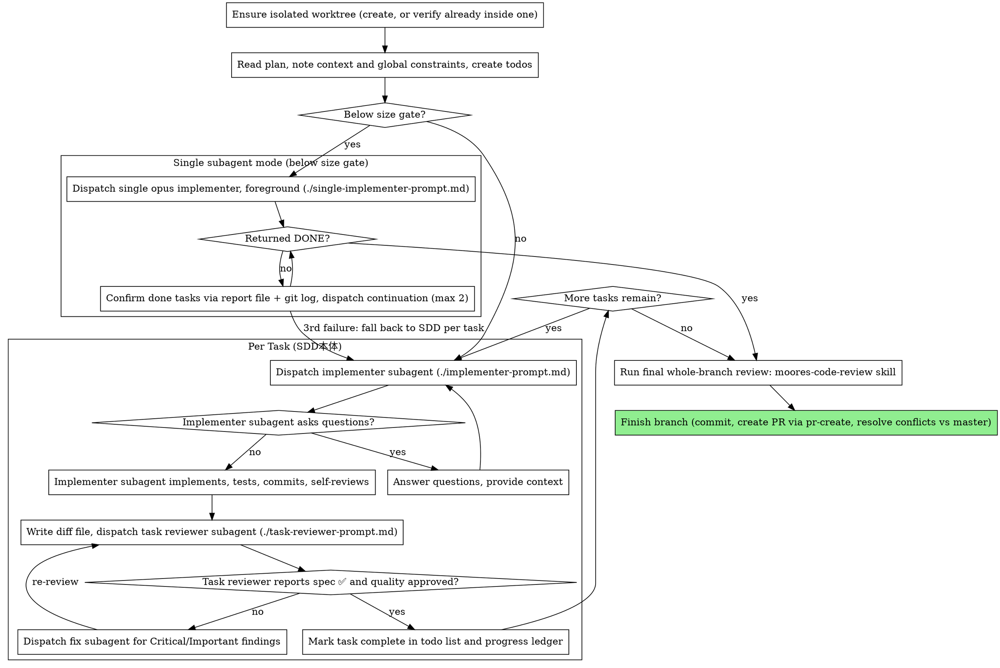

# SDD 単一subagent実装モード Implementation Plan

> **For agentic workers:** REQUIRED SUB-SKILL: subagent-driven-development スキルを使うこと。この plan は規模ゲート未満なので、ADR 0053 の裁定どおり **opus 固定の単一 implementer subagent 1体が Task 1〜5 を順に実装**し、本体はワークスペース隔離・事前計画レビュー・派遣・最終レビュー・PR作成のみを担う（実行時点のスキル本文は旧文言のままだが、裁定が優先する）。ステップはチェックボックス（`- [ ]`）記法で進捗管理する。

**Goal:** `subagent-driven-development` スキルの2系統（moorestech特化版・一般版）で、規模ゲート未満の「本体インライン実装」を「opus固定の単一implementer subagentが計画全体を実装するモード」へ全面置換する。

**Architecture:** 変更対象はMarkdownのスキル文書のみ。SKILL.md の規模ゲート節を新モードの定義＋手順に書き換え、プロセス図・モデル選定・ステータス対応・ファイルハンドオフ・進捗台帳・危険信号を新モードに追従させる。派遣用に `single-implementer-prompt.md` を新設し、既存の `implementer-contract.md` は共有する（「タスクブリーフ」語を一般化するだけ）。2系統は意図的に分岐しているため機械コピーせず、同じ節構成を各語彙で手書きする。

**Tech Stack:** Markdown（Claude Code スキル定義）、git（moorestech repo と `~/.agents` repo の2つ）

## Requirements

設計セッション ADR: `docs/adr/0053-sdd-single-subagent-implementation-mode.md`、裁定: `.decisions/2026-09-08-SDD閾値未満は本体インラインでなく単一opus-subagentで実装する.md`

- R1. 規模ゲート未満は「単一subagent実装モード」が既定になり、本体セッションは実装コードを書かない。受け入れ: 両SKILL.mdに「インラインで実装する」という行き先が残っていない（`grep -c "インライン" SKILL.md` が 1 で、その1行は廃止経緯の説明文）
- R2. 境界閾値（約15ファイル/約1,000行/実装7タスク以下/長いデバッグ往復なし/並列不要のAND）と「実装タスクの数え方」「判定の声出し」「名指し起動でもゲート評価」は現行文をそのまま維持する。受け入れ: 閾値5条件の文言が変更前と一致（数値・ANDの向き不変）
- R3. 単一subagentの implementer と、その最終レビュー所見を直す fix subagent は `model: opus` 固定。受け入れ: `single-implementer-prompt.md` に `model: opus` が固定値で書かれ、SKILL.md「モデル選定」節冒頭に例外条項がある
- R4. 派遣は `single-implementer-prompt.md`（新規）を使い、契約は `implementer-contract.md` を共有する。ブリーフは `scripts/task-brief` を使わず計画ファイル全体のパスを直渡し。受け入れ: 新テンプレが両系統に存在し、契約の「タスクブリーフ」語がタスク単位/計画全体の両方を指す表現になっている
- R5. 単一subagentはタスク順に実装しタスクごとにコミットし、報告ファイルへ `Task N: done <sha7>` 形式のタスク別進捗を追記する。受け入れ: テンプレの「進め方」節にこの2点が明記されている
- R6. worktree隔離は単一subagentモードにも必須。受け入れ: 「worktree隔離が必要なだけならworktree + インラインでよく」の一文が両SKILL.mdから消え、隔離節の見出し・本文が「最初のsubagent派遣前」を指す
- R7. タスクごとのレビューゲートは置かず、最終レビュー1本（moores-code-review／一般版はレビュースキル）を自動・無条件で実行。所見は単一fix subagent（opus）へ。受け入れ: プロセス図に単一subagent分岐があり、task-reviewer を経由せず最終レビューへ繋がる
- R8. 途中失敗（一部タスクのみ完了・BLOCKED・NEEDS_CONTEXT・コンテキスト枯渇）は、報告ファイルのタスク別進捗と `git log` で完了タスクを確定し、残りタスクのみを指示した継続subagentを同テンプレで派遣する。継続は最大2回、それでも終わらなければ残りをSDD本体（タスクごと派遣）へ切り替える。受け入れ: 規模ゲート節に「継続再派遣」段落があり、旧「途中切替（インライン→SDD）」段落が消えている
- R9. 進捗台帳（`.superpowers/sdd/progress.md`）にはコントローラーが派遣行と完了行の2行のみ書く。タスク別進捗は報告ファイル。compaction後の復旧順は台帳→（元subagentの生存確認）→報告ファイル→`git log`。受け入れ: 「永続的な進捗管理」節に4点が書かれ、危険信号に生存確認なしの再派遣が挙がっている
- R10. 単一subagentはフォアグラウンドで派遣する（バックグラウンド孤児化事故の再発防止）。受け入れ: テンプレと危険信号に明記
- R11. 使用場面dot図・プロセスdot図・危険信号・ワークフロー例・frontmatter description が新モードと矛盾しない。受け入れ: dot図のノード名に "Inline" が無く、"Single opus subagent" 系ノードがある
- R12. 2系統とも変更する。moorestech版は moores-code-review / pr-create / `.claude/skills/moores-code-review/references/lens-digest.md` の語彙、一般版は「レビュースキル」「PR作成」「[PROJECT_RULES]」の語彙。受け入れ: 両系統の規模ゲート節を diff したとき、差分が語彙差の3箇所（第1段落末尾の裁定参照・条件段落の最終レビュー名・手順8の最終レビュー名）のみ
- R13. `~/.agents` は独立したgitリポジトリ（origin: github.com:sakastudio/.agents）なので、変更を同repoでコミットしpushする
- やらないこと: `task-reviewer-contract.md` / `task-reviewer-prompt.md` / `scripts/*` は変更しない（新モードはタスクレビューを使わない）。`.moorestech-external-revisions.json` の既存の未コミット差分（ユーザーの別作業）は触らない・コミットに含めない。閾値の数値変更はしない。

## Global Constraints

- 契約ファイルは1つ（`implementer-contract.md`）を両モードで共有する。単一モード専用の契約ファイルを作らない（ADR 0053 棄却案）
- `model: opus` は固定値として書く。「SKILL.mdのモデル選定に従う」のようなプレースホルダーにしない
- 「インライン」という語は、規模ゲート節・使用場面・危険信号から完全に除去する（`task-reviewer-contract.md` の「これだけはインライン必須」は別概念なので触らない）
- 両系統の差分は語彙のみ。節構成・段落順・箇条書きの数は一致させる
- 日本語本文。コミットメッセージは `skills(sdd): …` 形式
- `.decisions/2026-09-08-SDD閾値未満は本体インラインでなく単一opus-subagentで実装する.md` と ADR 0053 の記述が正。矛盾したらplanでなくADRを優先し、矛盾箇所を報告する
- moorestech側の作業ブランチは `skills/sdd-single-subagent-mode`（origin/master から分岐済み、d9e492581 に ADR・裁定・本plan）。本体ディレクトリは planning セッション終了時に master へ戻してあるので、実行セッションは `git worktree add ~/moorestech-worktrees/sdd-single-subagent-mode skills/sdd-single-subagent-mode` で既存ブランチを worktree に checkout する（`already used by worktree` が出たら本体が同ブランチを掴んでいる。本体側で `git switch master` してから再実行）。`~/.agents` 側は master に直接コミットしpushする（同repoの既存慣行）

---

### Task 1: moorestech版 SKILL.md — 規模ゲート節・使用場面図・descriptionを新モードへ書き換える

**Files:**
- Modify: `.agents/skills/subagent-driven-development/SKILL.md:1-64`（frontmatter・規模ゲート節・使用場面図）

**Interfaces:**
- Consumes: なし
- Produces: 節見出し `## 規模ゲート: 閾値未満は単一subagent実装モード（2026-09-08 ADR 0053）`、段落見出し `**単一subagent実装モードの手順:**`、`**継続再派遣（途中失敗時）:**`。Task 2・3 はこの見出し名を参照する。台帳行フォーマット `Single-subagent: dispatched base <sha7> report <path>` / `Single-subagent: continuation #k from Task N base <sha7>` / `Single-subagent: complete (commits <base7>..<head7>)`

- [ ] **Step 1: 変更前の閾値文言を控える（R2の照合用）**

Run:
```bash
sed -n '22,28p' .agents/skills/subagent-driven-development/SKILL.md > /tmp/sdd-threshold-before.txt
cat /tmp/sdd-threshold-before.txt
```
Expected: `**インラインで実装する条件（すべて満たすならインライン。AND）:**` と 1〜5 の箇条書きが表示される

- [ ] **Step 2: frontmatter description を更新する**

`SKILL.md` L3 を次に置換:

```markdown
description: 現在のセッションで、独立したタスクからなる実装計画を実行する際に使用する。規模ゲート未満はopus固定の単一subagentが計画全体を実装し、閾値超はタスクごと派遣＋タスクレビューで進める
```

- [ ] **Step 3: 規模ゲート節（L18〜40）を丸ごと次の内容に置換する**

置換範囲は `## 規模ゲート: 既定はインライン実装（2026-08-18 実測に基づく）` の行から `**途中切替:** …` の行まで（次の `## 使用場面` の直前まで）。

````markdown
## 規模ゲート: 閾値未満は単一subagent実装モード（2026-09-08 ADR 0053）

計画があっても、**規模が閾値未満ならタスクごとの派遣＋タスクレビューゲート（以下「SDD本体」）を使わず、opus固定のimplementer subagent 1体に計画全体を実装させる「単一subagent実装モード」が既定**である。本体セッションは実装コードを書かない — 担うのはワークスペース隔離・事前計画レビュー・派遣・最終レビュー・PR作成のみ。SDD本体の実装subagent自体は安いが、派遣往復によるコントローラーの肥大とタスクごとのレビューゲートが固定費として乗る（実測: 1計画あたり$40〜90相当 + 本体ループ肥大。実装subagentは大型セッション総額の6〜25%に過ぎなかった）。かつて閾値未満は本体が直接書くインライン実装だったが、本体コンテキストを実装で消費し最終レビュー対応の余力を削るため廃止した（`.decisions/2026-09-08-SDD閾値未満は本体インラインでなく単一opus-subagentで実装する.md`）。

**単一subagent実装モードの条件（すべて満たすなら単一subagent。AND）:**

1. **予想変更が約15ファイル以下**、かつ
2. **予想変更が全体で約1,000行以下**、かつ
3. **計画の独立タスクが7個以下**、かつ
4. 実装と並行した**長いデバッグ・実機e2e往復が見込まれない**（調査churnがコンテキストを食う）、かつ
5. **並列実行したい独立タスク群が無い**

**この5つを全部満たすなら単一subagent実装モードで実装する。** 1つでも外れた場合（約15ファイル超／約1,000行超／独立タスク8個以上／長いデバッグ往復あり／並列実行したい）だけSDD本体を発動する。単一subagentモードでも最終レビュー1本（moores-code-review）は省略しない。worktree隔離はどちらのモードでも必須である（下記「ワークスペース隔離」）。

**タスク数の数え方:** 数えるのは**実装タスク**である。実サービス・実機での動作確認タスク、最終レビュータスク、コミット/PR作成タスクのような、コードを書かない末尾の定型タスクは数に含めない。計画のタスク見出しを機械的に数えて発動判定をしないこと（2026-08-20: 実装4タスク・4ファイルの計画を「タスク6個」と数えてSDD本体を発動した実例がある）。

**閾値の根拠（両Mac 130+セッションのtranscript実測、2026-08-18）:** 単一コンテキストでの実装は編集約20ファイル・読み書き合計約45ファイルまでcompaction発生ゼロで完走している（25〜32ファイルも読み込みが少なければ可）。編集25〜30ファイル超または長いデバッグ往復を伴うと高頻度でcompactionし、文脈喪失は「完了済みタスクの再派遣」級の最も高くつく失敗につながる。15ファイルはこの実測限界に対する安全マージンである。単一subagentは履歴を継承しない新規コンテキストだが、新モードの実測が無いため同じ閾値を流用する。実測が溜まったら再裁定する。

**判定は必ず声に出す。** 最初のsubagent派遣より前に、数えた実装タスク数・予想ファイル数・判定結果を1行でユーザーへ出す（例:「実装4タスク・4ファイル → 単一subagent」）。黙って派遣を始めると、誤判定はsubagentが1本走り終えるまで是正されない（2026-08-20の実例）。

**ユーザーがスキル名を明示して起動した場合もゲートは評価する。** 閾値未満なら「この規模なら単一subagentモードが既定です」と1行述べてから指示に従う。名指し起動はゲートの免除ではない。

**単一subagent実装モードの手順:**

1. ワークスペース隔離（下記、必須。単一subagentもコミットを行うimplementerである）
2. 事前計画レビュー（下記）
3. 判定を1行で声に出す
4. `scripts/sdd-workspace` で作業ディレクトリを確保し、報告ファイルパスを `<workspace>/single-report.md` に決める。派遣直前の `git rev-parse --short HEAD` を BASE として控える
5. 進捗台帳（下記）へ派遣行を書く: `Single-subagent: dispatched base <sha7> report <path>`
6. [single-implementer-prompt.md](single-implementer-prompt.md) で `model: opus` を明示し、**フォアグラウンド**で派遣する（バックグラウンド派遣は孤児化して止まる事故があった）
7. 返ってきたステータスに対応する（下記「Implementerのステータス対応」の「単一subagent実装モードの場合」）
8. DONE なら台帳へ完了行 `Single-subagent: complete (commits <base7>..<head7>)` を書き、最終ブランチ全体レビュー（moores-code-review）→ PR作成へ進む。タスクレビュアーは派遣しない

**継続再派遣（途中失敗時）:** subagentが DONE 以外（一部タスクのみ完了して BLOCKED・NEEDS_CONTEXT・コンテキスト枯渇による途中終了）で返ったら、報告ファイルの `Task N: done <sha7>` 行と `git log <base>..HEAD --oneline` で完了タスクを確定し、残りタスクだけを `[TASK_RANGE]` に列挙した継続subagentを同じテンプレで派遣する。台帳に `Single-subagent: continuation #k from Task N base <sha7>` を追記する。継続は最大2回。それでも終わらなければ規模誤判定とみなし、残りタスクをSDD本体（タスクごと派遣＋タスクレビュー）へ切り替え、台帳に切替点を記録する。NEEDS_CONTEXT は不足コンテキストを足した継続派遣として数える。
````

- [ ] **Step 4: 使用場面dot図のノードを置換する**

L42〜64 の dot 図で、次の2箇所を置換:

```
    "Inline implementation + final review" [shape=box];
```
→
```
    "Single opus subagent implements whole plan + final review" [shape=box];
```

```
    "Over size gate? (>~15 files / >~1000 lines / 8+ impl tasks / long debug loop / want parallel)" -> "Inline implementation + final review" [label="no - below gate"];
```
→
```
    "Over size gate? (>~15 files / >~1000 lines / 8+ impl tasks / long debug loop / want parallel)" -> "Single opus subagent implements whole plan + final review" [label="no - below gate"];
```

- [ ] **Step 5: 検証（R1・R2・R11）**

Run:
```bash
F=.agents/skills/subagent-driven-development/SKILL.md
grep -c "インライン" $F
grep -c "Inline" $F
grep -c "単一subagent実装モードの手順" $F
grep -c '^\*\*継続再派遣（途中失敗時）:' $F
grep -c "Single opus subagent" $F
diff <(sed 's/^\*\*インラインで実装する条件（すべて満たすならインライン。AND）:\*\*/**単一subagent実装モードの条件（すべて満たすなら単一subagent。AND）:**/' /tmp/sdd-threshold-before.txt) <(sed -n '/^\*\*単一subagent実装モードの条件/,/^5\. /p' $F) && echo THRESHOLD_SAME
```
Expected:
```
1        ← 「かつて閾値未満は本体が直接書くインライン実装だったが…廃止した」の説明1行のみ
0
1
1        ← 定義段落の見出し1本（`SKILL.md` 本文の参照行は行頭パターンに一致しない）
2        ← dot図のノード定義＋エッジ
THRESHOLD_SAME
```
※ `grep -c "インライン"` は説明文の1行だけが残る。R1の受け入れ基準「規模ゲート節に行き先としてのインラインが無い」はこの1行が「廃止した」の文脈であることを目視で確認する
※ **件数一致だけを合格としない。** 上の各パターンを `grep -n` で出し直し、該当行が意図した文脈（行き先としてのインラインが無い・定義段落が1入口である等）になっていることを目視で突合する。件数はあくまで見落とし検知の補助である

- [ ] **Step 6: コミット**

```bash
git add .agents/skills/subagent-driven-development/SKILL.md
git commit -m "skills(sdd): 規模ゲート未満を単一opus subagent実装モードへ置換（ADR 0053）"
```

---

### Task 2: moorestech版 SKILL.md — プロセス図・モデル選定・ステータス対応・ハンドオフ・台帳・危険信号を新モードへ追従させる

**Files:**
- Modify: `.agents/skills/subagent-driven-development/SKILL.md:66-68`（ワークスペース隔離見出し）、`:122-162`（プロセス図）、`:195-215`（モデル選定）、`:217-233`（ステータス対応）、`:256-265`（ファイルハンドオフ）、`:267-276`（進捗台帳）、`:278-282`（プロンプトテンプレート）、`:284-346`（ワークフロー例）、`:379-413`（危険信号）

**Interfaces:**
- Consumes: Task 1 の見出し `**単一subagent実装モードの手順:**`・`**継続再派遣（途中失敗時）:**`、台帳行フォーマット
- Produces: `single-implementer-prompt.md` へのリンク（Task 3 がファイルを作る）。プレースホルダー名 `[TASK_RANGE]`・`[PLAN_FILE_ABS]`・`[REPORT_FILE]` は Task 3 のテンプレと一致させる

- [ ] **Step 1: ワークスペース隔離の見出しと前提文を「最初のsubagent派遣前」に変える**

L66:
```
## ワークスペース隔離（タスク1派遣前・必須）
```
→
```
## ワークスペース隔離（最初のsubagent派遣前・必須）
```

L68 の末尾 `隔離は「あれば良いもの」ではなくタスク1の前提条件である。` → `隔離は「あれば良いもの」ではなく最初の派遣（SDD本体ならタスク1、単一subagentモードならその1体）の前提条件である。`

L418（統合節）の `上記「ワークスペース隔離（タスク1派遣前・必須）」` → `上記「ワークスペース隔離（最初のsubagent派遣前・必須）」`（見出し改名に追従。残すと参照切れ＋Step 10 の検証が失敗する）

L186（事前計画レビュー）の `タスク1を派遣する前に、計画を一度スキャンして矛盾を確認する:` → `最初のsubagent（SDD本体ならタスク1のimplementer、単一subagentモードならその1体）を派遣する前に、計画を一度スキャンして矛盾を確認する:`

イントロ L8 の冒頭 `計画を実行する際、タスクごとに新しいimplementer subagentを派遣し、` → `計画を実行する際、規模ゲート超なら タスクごとに新しいimplementer subagentを派遣し、`、L12 `**核となる原則:** タスクごとの新規subagent + タスクレビュー（spec + 品質） + 広範な最終レビュー = 高品質・高速なイテレーション` → `**核となる原則:** 本体は実装を書かない（閾値未満はopus単一subagent、閾値超はタスクごとの新規subagent + タスクレビュー） + 広範な最終レビュー = 高品質・高速なイテレーション`

- [ ] **Step 2: プロセスdot図に単一subagent分岐を足す**

L122〜162 の `digraph process` を次に置換:

````markdown

````

- [ ] **Step 3: モデル選定節の冒頭に例外条項を足す**

`## モデル選定` の直後、`コストを抑え速度を高めるため、各役割をこなせる最も非力なモデルを使うこと。` の**前**に次の段落を挿入:

```markdown
**例外（先に適用）: 単一subagent実装モードのimplementerと、その最終レビュー所見を直すfix subagentは `opus` 固定。** 以下のティア規則はSDD本体のタスク単位派遣にのみ適用する。単一subagentは計画全体の統合判断を1体で担うため「機械的タスクは安価モデル」の前提が成り立たず、ユーザー裁定（2026-09-08「トークンコストがそこまで大きくならないのと精度優先」）でopusに固定した。
```

- [ ] **Step 4: Implementerのステータス対応に単一モードの項を足す**

`## Implementerのステータス対応` 節の末尾（`**エスカレーションを無視したり、…決してしないこと。** …` の段落の後）に追加:

```markdown
**単一subagent実装モードの場合:** DONE ならタスクレビュアーを派遣せず、台帳へ完了行を書いて最終ブランチ全体レビューへ直行する。DONE_WITH_CONCERNS は懸念を読み、正しさ・スコープに関するものなら最終レビュー所見と同じ経路（単一fix subagent・opus）で直してから最終レビューへ（継続派遣ではないので上限2回には数えない）。単なる所見ならメモして最終レビューへ。BLOCKED・NEEDS_CONTEXT・途中終了は「継続再派遣（途中失敗時）」（規模ゲート節）に従う — 完了タスクは報告ファイルと `git log` で確定し、同じ subagent に再試行を強制しない。継続は最大2回で、3回目が必要なら残りをSDD本体へ切り替える。
```

- [ ] **Step 5: ファイルハンドオフ節に単一モードの箇条書きを足す**

`## ファイルハンドオフ` 節の箇条書き末尾（`- **契約ファイル:** …` の後）に追加:

```markdown
- **単一subagent実装モード:** `scripts/task-brief` は使わず、計画ファイル全体の絶対パスをブリーフとして直渡しする（`[PLAN_FILE_ABS]`）。実装範囲は `[TASK_RANGE]` で列挙する（末尾の最終レビュー・PR作成タスクは含めない）。報告ファイルは `<workspace>/single-report.md` 固定で、subagentがタスク完了ごとに `Task N: done <sha7> — <1行要約>` を追記する。継続派遣は同じ報告ファイルに追記する。
```

- [ ] **Step 6: 進捗台帳節に単一モードの記帳規則を足す**

`## 永続的な進捗管理` 節の箇条書き末尾（`` - `git clean -fdx`は台帳を破壊する… `` の後）に追加:

```markdown
- **単一subagent実装モードの記帳はコントローラーが2行だけ書く:** 派遣時 `Single-subagent: dispatched base <sha7> report <path>`、完了時 `Single-subagent: complete (commits <base7>..<head7>)`（継続派遣があれば `Single-subagent: continuation #k from Task N base <sha7>` を間に挟む）。タスク別の完了は subagent が報告ファイルへ書く。compaction後の復旧順は **台帳 → 報告ファイル → `git log`**。台帳に `dispatched` があって `complete` が無ければ、subagentが走っているか途中終了している — **継続派遣の前に ListAgents 等で元subagentの生存を確認し、生きていれば結果を待つ**（compaction後も subagent は生存しており、死亡と決めつけて再派遣し同一worktreeを二重編集した実事故がある）。不在または報告済みなら、報告ファイルの `Task N: done` 行と `git log` で完了タスクを確定してから継続再派遣する。
```

- [ ] **Step 7: プロンプトテンプレート一覧に新テンプレを足す**

`## プロンプトテンプレート` 節の1行目の前に追加:

```markdown
- [single-implementer-prompt.md](single-implementer-prompt.md) - 単一subagent実装モードの派遣（規模ゲート未満。`model: opus` 固定。定型は[implementer-contract.md](implementer-contract.md)をsubagentが読む）
```

- [ ] **Step 8: ワークフロー例の冒頭に単一モードの例を足す**

`## ワークフロー例` の直後、既存のコードブロック（```` ``` ````で始まる `You: この計画をSubagent-Driven Developmentで実行します。`）の**前**に追加:

````markdown
**単一subagent実装モード（規模ゲート未満）:**

```
You: 実装4タスク・5ファイル → 単一subagent。worktreeを作成し事前計画レビューを通しました。

[sdd-workspace で報告パスを確保、BASE=ab12cd3 を台帳に記帳]
[single-implementer-prompt.md で model: opus をフォアグラウンド派遣]

Implementer:
  - Task 1〜4 を順に実装、タスクごとにコミット（4コミット）
  - 報告ファイルに Task N: done <sha> を4行追記
  - 12/12 tests passing、自己レビュー: 問題なし
  - ステータス: DONE

[台帳に complete 行を記帳]
[moores-code-review を Skill ツールで実行 → 所見2件 → 単一fix subagent(opus)へ]
[pr-create で PR 作成]
```

**SDD本体（閾値超）:**
````

- [ ] **Step 9: 危険信号に3項目を足す**

`## 危険信号` の `**絶対にしないこと:**` リストで、`- 明示的なユーザー同意なしにmain/masterブランチで実装を開始する` の**直後**に追加:

```markdown
- 規模ゲート未満だからという理由で本体セッションが実装コードを書く — 閾値未満は単一subagent実装モードであり、本体が書く選択肢は無い（ADR 0053）
- 単一subagentを `model: opus` 以外・model未指定・バックグラウンドで派遣する
- 単一subagentが途中終了したとき、元subagentの生存確認（ListAgents）と報告ファイル・`git log` の確認を経ずに再派遣する（生存中なら同一worktreeの二重編集、終了済みなら完了タスクの二重実装になる）
```

また `- worktreeを作らずに（あるいは既にworktree内かを確認せずに）タスク1のimplementerを派遣する — 「今回は小さい計画だから」は理由にならない` を次に置換:

```markdown
- worktreeを作らずに（あるいは既にworktree内かを確認せずに）最初のimplementer（単一subagent含む）を派遣する — 「今回は小さい計画だから」は理由にならない
```

さらに、SDD本体専用の規則なのに無修飾で新モードと衝突する3行を限定書き換えする:

L385 `- タスクレビューをスキップする、または片方の判定（spec準拠とタスク品質の両方が必須）を欠く報告を受け入れる` → `- SDD本体でタスクレビューをスキップする、または片方の判定（spec準拠とタスク品質の両方が必須）を欠く報告を受け入れる（単一subagentモードはタスクレビューを持たず最終レビュー1本が正）`

L388 `- subagentに計画ファイル全体を読ませる（代わりにタスクブリーフ — `scripts/task-brief` — を渡す）` → `- SDD本体のタスク単位派遣でsubagentに計画ファイル全体を読ませる（代わりにタスクブリーフ — `scripts/task-brief` — を渡す。単一subagentモードは計画ファイル全体のパスを渡すのが正）`

L393 `- implementerの自己レビューを実際のレビューの代替にする（両方が必要）` → `- implementerの自己レビューを実際のレビュー（SDD本体ならタスクレビュー、単一subagentモードなら最終レビュー）の代替にする（両方が必要）`

- [ ] **Step 10: 検証（R3・R6・R7・R9・R11）**

Run:
```bash
F=.agents/skills/subagent-driven-development/SKILL.md
grep -n "タスク1派遣前\|タスク1の前提条件\|worktree + インライン" $F | wc -l
grep -c "single-implementer-prompt.md" $F
grep -c "例外（先に適用）" $F
grep -c "単一subagent実装モードの記帳" $F
grep -c "cluster_single" $F
grep -c "Below size gate" $F
grep -c "Inline" $F
grep -c "^- subagentに計画ファイル全体を読ませる" $F
grep -c "タスク1を派遣する前に" $F
```
Expected:
```
0
8        ← 手順6(1)・プロセス図のノード定義＋エッジ3本(4)・ファイルハンドオフ(1)・テンプレ一覧(1)・ワークフロー例(1)
1
1
1
4        ← ノード定義＋流入エッジ＋yes＋no
0
0
0
```
※ **件数一致だけを合格としない。** 各パターンを `grep -n` で出し直し、該当行が意図した文脈になっていることを目視で突合する

- [ ] **Step 11: コミット**

```bash
git add .agents/skills/subagent-driven-development/SKILL.md
git commit -m "skills(sdd): プロセス図・モデル選定・ステータス対応・台帳・危険信号を単一subagentモードへ追従"
```

---

### Task 3: moorestech版 — single-implementer-prompt.md 新設と implementer-contract.md の一般化

**Files:**
- Create: `.agents/skills/subagent-driven-development/single-implementer-prompt.md`
- Modify: `.agents/skills/subagent-driven-development/implementer-contract.md:19`

**Interfaces:**
- Consumes: Task 2 のプレースホルダー名 `[PLAN_FILE_ABS]`・`[TASK_RANGE]`・`[REPORT_FILE]`、報告行 `Task N: done <sha7> — <1行要約>`
- Produces: ファイル `single-implementer-prompt.md`（Task 5 が一般版を同構成で作る）

- [ ] **Step 1: single-implementer-prompt.md を作成する**

`````markdown
# Single Implementer Subagent プロンプトテンプレート（単一subagent実装モード）

規模ゲート未満の計画を、`opus` 固定のimplementer subagent 1体に丸ごと実装させる際に使う。
作業手順・自己レビュー・報告フォーマットの定型部分は[implementer-contract.md](implementer-contract.md)に
あり、subagentが自分で読む。派遣プロンプトには計画固有の情報だけを書くこと。
**フォアグラウンドで派遣する**（バックグラウンド派遣は孤児化して止まる事故があった）。

```
Subagent (general-purpose, フォアグラウンド):
  description: "Implement whole plan: [PLAN_NAME]"
  model: opus
  prompt: |
    あなたは実装計画 [PLAN_NAME] の全タスクを1体で実装する。

    まず契約ファイルを読む: [SKILL_DIR_ABS]/implementer-contract.md
    作業手順・質問すべきタイミング・エスカレーション方法・自己レビュー・
    報告フォーマットのすべてが書かれている。厳守すること。

    次にブリーフを読む: [PLAN_FILE_ABS]
    計画ファイル全体があなたの要件であり、値はそのまま使うこと。
    `## Requirements`・`## Global Constraints`・`## 判断記録（ADR）`は全タスク共通の制約として扱う。
    実装対象: [TASK_RANGE]（末尾の最終レビュー・PR作成タスクはコントローラーが行うので実装しない）

    moorestech設計ルール: .claude/skills/moores-code-review/references/lens-digest.md（実装前に読むこと）

    作業ディレクトリ: [WORKTREE_ABS_PATH]（隔離worktree。この外で編集・コミット禁止）
    報告ファイル: [REPORT_FILE]（完全な報告をここに書く。返答は契約の15行未満フォーマット）

    ## 進め方（計画全体を担うための追加規律）

    - タスクは計画の順に1つずつ実装し、**タスクごとにコミット**する（subjectに `Task N:` を含める）
    - タスクを1つ終えるたびに報告ファイルへ `Task N: done <sha7> — <1行要約>` を追記する。
      途中で止まっても完了タスクが判別できるようにするため
    - 契約の自己レビューはタスクごとに行い、最後に全体をもう一度通す
    - コンテキストが逼迫し全タスクを終えられないと判断したら、現タスクをコミット可能な状態まで
      戻して報告ファイルに `Task N: partial — <残作業>` を書き、ステータス BLOCKED で返す。
      最終メッセージに完了タスク番号と最後のコミットshaを含める。無理に続けない
    - 計画同士の矛盾・計画と実コードの矛盾を見つけたら推測で進めず NEEDS_CONTEXT で返す

    ## コンテキスト

    [状況説明: この計画がプロジェクトのどこに位置するかの1行、
     ブリーフで気づいた曖昧さに対するコントローラーの解消]
```

**継続派遣（途中失敗時）:** 同じテンプレで `[TASK_RANGE]` を残りタスクに絞り、`## コンテキスト` に
「Task 1〜N は完了済み（commits <base7>..<head7>、報告ファイルの `Task N: done` 行を参照）。Task N+1 から続行せよ」を1行足す。
報告ファイルは同じものに追記させる。継続は最大2回（SKILL.md「継続再派遣（途中失敗時）」）。

**プレースホルダー:**
- `[PLAN_NAME]` — 計画の名前（planファイルのH1）
- `[SKILL_DIR_ABS]` — このスキルディレクトリの絶対パス
- `[PLAN_FILE_ABS]` — 計画ファイルの絶対パス（`scripts/task-brief` は使わない）
- `[TASK_RANGE]` — 実装するタスク番号の範囲（例: `Task 1〜4`。継続派遣では残りのみ）
- `[WORKTREE_ABS_PATH]` — 隔離worktreeの絶対パス
- `[REPORT_FILE]` — `scripts/sdd-workspace` が表示したディレクトリ配下の `single-report.md`
`````

- [ ] **Step 2: implementer-contract.md の「タスクブリーフ」語を一般化する**

L19:
```
1. タスクブリーフが指定する内容を正確に実装する
```
→
```
1. ブリーフ（タスク単位のブリーフ、または単一subagent実装モードでは計画ファイル全体）が指定する内容を正確に実装する
```

- [ ] **Step 3: 検証（R3・R4・R5・R10）**

Run:
```bash
D=.agents/skills/subagent-driven-development
grep -c "model: opus" $D/single-implementer-prompt.md
grep -n "タスクごとにコミット\|Task N: done <sha7>\|フォアグラウンド\|\[TASK_RANGE\]\|\[PLAN_FILE_ABS\]" $D/single-implementer-prompt.md | wc -l
grep -n "タスクブリーフ" $D/implementer-contract.md | wc -l
grep -c "計画ファイル全体" $D/implementer-contract.md
```
Expected:
```
1
7以上
0
1
```

- [ ] **Step 4: コミット**

```bash
git add .agents/skills/subagent-driven-development/single-implementer-prompt.md .agents/skills/subagent-driven-development/implementer-contract.md
git commit -m "skills(sdd): 単一subagent派遣テンプレを新設し契約のブリーフ語を一般化"
```

---

### Task 4: 一般版 SKILL.md（~/.agents）— Task 1・2 と同じ変更を一般語彙で入れる

**Files:**
- Modify: `/Users/katsumi/.agents/skills/subagent-driven-development/SKILL.md:1-64`、`:66-68`、`:119-159`（プロセス図）、`:192-212`（モデル選定）、`:214-230`（ステータス対応）、`:252-261`（ファイルハンドオフ）、`:263-272`（進捗台帳）、`:274-278`（プロンプトテンプレート）、`:280-342`（ワークフロー例）、`:375-409`（危険信号）

**Interfaces:**
- Consumes: Task 1・2 で確定した節見出し・台帳行フォーマット・プレースホルダー名（すべて同一）
- Produces: なし

語彙の対応表（この表以外は Task 1・2 の文言をそのまま使う）:

| moorestech版 | 一般版 |
|---|---|
| `最終レビュー1本（moores-code-review）` | `最終レビュー1本（プロジェクトのレビュースキル or `/code-review`）` |
| `最終ブランチ全体レビュー（moores-code-review）` | `最終ブランチ全体レビュー（レビュースキル）` |
| dot図 `Run final whole-branch review: moores-code-review skill` | `Run final whole-branch review: code-review skill`（既存ノード名のまま） |
| dot図 `Finish branch (commit, create PR via pr-create, resolve conflicts vs master)` | `Finish branch (commit, push, create PR, resolve conflicts vs base)`（既存のまま） |
| ワークフロー例 `[moores-code-review を Skill ツールで実行 …]` | `[レビュースキルを Skill ツールで実行 …]` |
| ワークフロー例 `[pr-create で PR 作成]` | `[push して PR 作成]` |
| `.decisions/2026-09-08-…` へのパス参照 | パスは書かず `（2026-09-08 裁定。moorestech版 ADR 0053）` |

- [ ] **Step 1: 変更前の閾値文言を控える**

Run:
```bash
sed -n '22,28p' ~/.agents/skills/subagent-driven-development/SKILL.md > /tmp/sdd-threshold-before-home.txt
```

※ 本planは単一subagentが全文を読む前提（判断記録参照）のため、Task 4・5 は Task 1〜3 の本文を再掲せず参照する。順不同で読む場合は Task 1〜3 を先に読むこと。

- [ ] **Step 2: Task 1 の Step 2〜4 を一般語彙で適用する**

description は Task 1 Step 2 と同文。規模ゲート節は Task 1 Step 3 の本文をベースに、上の対応表に従って `最終レビュー1本（moores-code-review）` → `最終レビュー1本（プロジェクトのレビュースキル or `/code-review`）`、手順8の `最終ブランチ全体レビュー（moores-code-review）` → `最終ブランチ全体レビュー（レビュースキル）`、第1段落末尾の `（`.decisions/2026-09-08-…`）` → `（2026-09-08 裁定。moorestech版 ADR 0053）` に置き換える。使用場面dot図は Task 1 Step 4 と同一。

- [ ] **Step 3: Task 2 の Step 1〜9 を一般語彙で適用する**

一般版の該当行番号は L8/L12（イントロ）・L66/L68（隔離見出し）・L183（事前計画レビュー）・L381/L384/L389（危険信号3行）・L414（統合節の参照）。プロセス図（Task 2 Step 2）は `Run final whole-branch review: code-review skill` と `Finish branch (commit, push, create PR, resolve conflicts vs base)` のノード名を既存のまま使う。モデル選定・ステータス対応・ファイルハンドオフ・進捗台帳・プロンプトテンプレート・危険信号は Task 2 と同文。ワークフロー例は対応表の2行を置換。

- [ ] **Step 4: 検証（両版の節構成一致）**

Run:
```bash
A=.agents/skills/subagent-driven-development/SKILL.md
B=~/.agents/skills/subagent-driven-development/SKILL.md
diff <(grep "^## " $A) <(grep "^## " $B) && echo HEADINGS_SAME
diff <(sed -n '/^## 規模ゲート/,/^## 使用場面/p' $A) <(sed -n '/^## 規模ゲート/,/^## 使用場面/p' $B)
grep -c "インライン" $B; grep -c "Inline" $B; grep -c "single-implementer-prompt.md" $B
grep -c "^- subagentに計画ファイル全体を読ませる" $B; grep -c "タスク1派遣前" $B; grep -c "タスク1を派遣する前に" $B
diff <(sed 's/^\*\*インラインで実装する条件（すべて満たすならインライン。AND）:\*\*/**単一subagent実装モードの条件（すべて満たすなら単一subagent。AND）:**/' /tmp/sdd-threshold-before-home.txt) <(sed -n '/^\*\*単一subagent実装モードの条件/,/^5\. /p' $B) && echo THRESHOLD_SAME
```
Expected:
```
HEADINGS_SAME
（規模ゲート節のdiffは3箇所・語彙差のみ: 第1段落末尾の裁定参照、条件段落の最終レビュー名、手順8の最終レビュー名）
1
0
8
0
0
0
THRESHOLD_SAME
```
※ **件数一致だけを合格としない。** 各パターンを `grep -n` で出し直し、該当行が意図した文脈になっていることを目視で突合する

- [ ] **Step 5: コミット（~/.agents repo）**

```bash
git -C ~/.agents add skills/subagent-driven-development/SKILL.md
git -C ~/.agents commit -m "subagent-driven-development: 規模ゲート未満を単一opus subagent実装モードへ置換（moorestech ADR 0053 の横展開）"
```

---

### Task 5: 一般版 — single-implementer-prompt.md 新設と implementer-contract.md の一般化（~/.agents）

**Files:**
- Create: `/Users/katsumi/.agents/skills/subagent-driven-development/single-implementer-prompt.md`
- Modify: `/Users/katsumi/.agents/skills/subagent-driven-development/implementer-contract.md:19`

**Interfaces:**
- Consumes: Task 3 のテンプレ本文
- Produces: なし

- [ ] **Step 1: single-implementer-prompt.md を作成する**

Task 3 Step 1 の本文をベースに、次の1箇所だけ差し替える。

```
    moorestech設計ルール: .claude/skills/moores-code-review/references/lens-digest.md（実装前に読むこと）
```
→
```
    [PROJECT_RULES — プロジェクトにレビュー規約のダイジェスト（設計レンズ集・
    レイヤーマップ・CLAUDE.md/AGENTS.mdの規約等）がある場合、
    「プロジェクト設計ルール: <パス>（実装前に読むこと）」の1行をここに入れる。
    無い場合はこのブロックを削る]
```

プレースホルダー一覧に `- `[PROJECT_RULES]` — プロジェクト設計ルールのパス（あれば）` を `[PLAN_FILE_ABS]` の行の後に追加する。それ以外は Task 3 Step 1 と同一。

- [ ] **Step 2: implementer-contract.md L19 を Task 3 Step 2 と同文に置換する**

- [ ] **Step 3: 検証**

Run:
```bash
A=.agents/skills/subagent-driven-development/single-implementer-prompt.md
B=~/.agents/skills/subagent-driven-development/single-implementer-prompt.md
diff $A $B
grep -n "タスクブリーフ" ~/.agents/skills/subagent-driven-development/implementer-contract.md | wc -l
```
Expected:
```
（diffは moorestech設計ルール1行 ⇔ PROJECT_RULESブロック4行 と、プレースホルダー1行の追加のみ）
0
```

- [ ] **Step 4: コミット＆push（~/.agents repo）**

```bash
git -C ~/.agents add skills/subagent-driven-development/single-implementer-prompt.md skills/subagent-driven-development/implementer-contract.md
git -C ~/.agents commit -m "subagent-driven-development: 単一subagent派遣テンプレを新設し契約のブリーフ語を一般化"
git -C ~/.agents push origin master
```
Expected: push が成功し `master -> master` が表示される。失敗（non-fast-forward）なら `git -C ~/.agents pull --no-rebase origin master` で取り込んでから再push

---

### Task 6: 最終レビュー（moores-code-review）→ PR作成

**Files:**
- 変更なし（レビュー所見の反映があれば Task 1〜5 のファイル）

- [ ] **Step 1: 必ず最後に moores-code-review スキルで全ブランチレビューを実行すること（自動実行・ゴール文言による省略不可）**

Skill ツールで `moores-code-review` を起動する（同スキルが Step 1 で自前に `<RUNDIR>/patch.diff` を作るため、事前の `scripts/review-package` は不要）。対象はMarkdownのみなのでコンパイル・Unityテストは不要。所見があれば単一fix subagent（`model: opus`）へ全所見を渡し、反映後に Task 1〜5 の検証コマンドを再実行する。

- [ ] **Step 2: pr-create スキルでPRを作成する**

ブランチ `skills/sdd-single-subagent-mode` → `master`。PR本文に ADR 0053 と `.decisions/2026-09-08-…` へのリンク、`~/.agents` 側のコミットsha（Task 4・5）を記載する。masterとのコンフリクトがあれば master をマージして解消（opus subagent へ委譲）。

- [ ] **Step 3: 事後確認**

Run:
```bash
git status --short
```
Expected: `.moorestech-external-revisions.json` の既存差分（ユーザーの別作業）だけが残る。それ以外が残っていればコミット漏れ

---

## 配置と前例（spec-architecture-review）

| # | 項目 | 配置先 | 機構 | 前例 |
|---|---|---|---|---|
| 1 | 規模ゲート節の書き換え | 両 SKILL.md 既存節 | Markdown本文 | 2026-08-20 の同節改訂（OR→AND反転） |
| 2 | `single-implementer-prompt.md` | スキルディレクトリ直下 | 派遣テンプレ（契約は共有） | `implementer-prompt.md` / `task-reviewer-prompt.md` の「テンプレ＋契約分離」構成 |
| 3 | 契約L19の一般化 | `implementer-contract.md` | 語の一般化のみ | 一般版が既に `[PROJECT_RULES]` で語彙を抽象化している前例 |
| 4 | 台帳行フォーマット | 既存 `progress.md` 規約 | 既存の `Task N: complete (...)` に並ぶ行種 | 同節の既存行フォーマット |
| 5 | プロセス図の分岐 | 既存 dot 図 | subgraph 追加 | 既存 `cluster_per_task` |

新規パターン: なし。機能パリティ（死活表）: 既存の「インライン実装」は廃止が裁定（ADR 0053）であり、SDD本体・タスクレビュー・最終レビュー・PRゲート・worktree隔離・進捗台帳はすべて生きる。

## 判断記録（ADR）

- 設計ADR: `docs/adr/0053-sdd-single-subagent-implementation-mode.md`（8裁定＋agent前提4項）
- 裁定台帳: `.decisions/2026-09-08-SDD閾値未満は本体インラインでなく単一opus-subagentで実装する.md`、`.decisions/2026-08-20-SDD規模ゲートはインライン優先のAND条件にする.md`（追記あり）
- **ADR番号を 0051 → 0053 に振り直した。** 出所: agent前提（origin/master に `0051-pump-ui…` と `0052-ugui-removal…` が既に存在したため。grill時の共通理解では 0051 と述べていた）
- ~~**途中終了のステータスは BLOCKED で返させる。** 契約の4ステータスを増やさず、「完了タスク番号と最後のコミットsha」を最終メッセージに含めることで継続派遣の入力にする。出所: agent前提（契約の `BLOCKED = タスクを完了できない` の定義に合致し、契約ファイルの改変を最小にする）~~
  - **却下（2026-09-09 ユーザー裁定・最終レビュー C4）:** BLOCKED への相乗りは「真の行き詰まり」と「コンテキスト枯渇による途中終了」を区別できず、同テンプレ・同モデルでの無変更リトライを招く。契約に `PARTIAL`（= 一部まで完了・残りあり・ブロッカー無し）を新設し、継続再派遣の対象を PARTIAL のみに限定した。この裁定が上記 agent前提 に優先する。本plan本文に埋め込まれた SKILL.md／テンプレの逐語案のうち `BLOCKED で返す`・`BLOCKED・NEEDS_CONTEXT・途中終了` の箇所は、実ファイル側が正である
- **継続上限2回に数えるのは PARTIAL のみ（2026-09-09 ユーザー裁定・最終レビュー C1）。** `NEEDS_CONTEXT` は回答して再派遣し数えない。`BLOCKED` の原因が計画欠陥なら回数に関わらず人間へエスカレーションする
- **`~/.agents` は master へ直接コミット・push する。** 出所: agent前提（同repoの履歴 `747bfe1`・`b8ce5d9` が master 直コミットの慣行。引き継ぎメモの「git管理外」は誤りで、`github.com:sakastudio/.agents` を origin に持つ独立repo）
- **タスク分割は「moorestech版 SKILL.md 2タスク → prompt/contract 1タスク → 一般版 2タスク → レビュー/PR」。** 出所: agent前提（SKILL.md の変更が9節に及ぶため前半（ゲート＋使用場面）と後半（追従節）で分け、レビュアーが片方だけ差し戻せる粒度にした）
- **継続再派遣の前に元subagentの生存確認（ListAgents）を必須にする。** 出所: シミュレーター予測→ユーザー承認 2026-09-08（AskUserQuestion「生存確認」で A を選択。根拠メモリ: compaction後もsubagentはpeerとして生存・二重編集事故）
- **user-simulator review で適用した指摘（8件）:** 危険信号L385/L388/L393の限定書き換え、統合節L418の参照更新、イントロL8/L12と事前計画レビューL186の修飾、検証グレップの期待値修正（継続再派遣=1・Below size gate=4）、R12の「3箇所」、worktree checkout手順、DONE_WITH_CONCERNSの経路（fix subagent・継続回数に数えない）、planヘッダの実行モード表現。出所: agent前提（判事レポートを現物で照合し全件確認）
- **この plan 自体の実行モードについて:** 実装5タスク・6ファイル・約250行で規模ゲート未満だが、実行時点のスキルはまだ旧文言（インライン既定）である。ADR 0053 のユーザー裁定に従い、実行セッションは opus 単一subagent で実装する（plan ヘッダと開始プロンプトに明記）。出所: ユーザー裁定 2026-09-08「A. 全面置換」の適用
