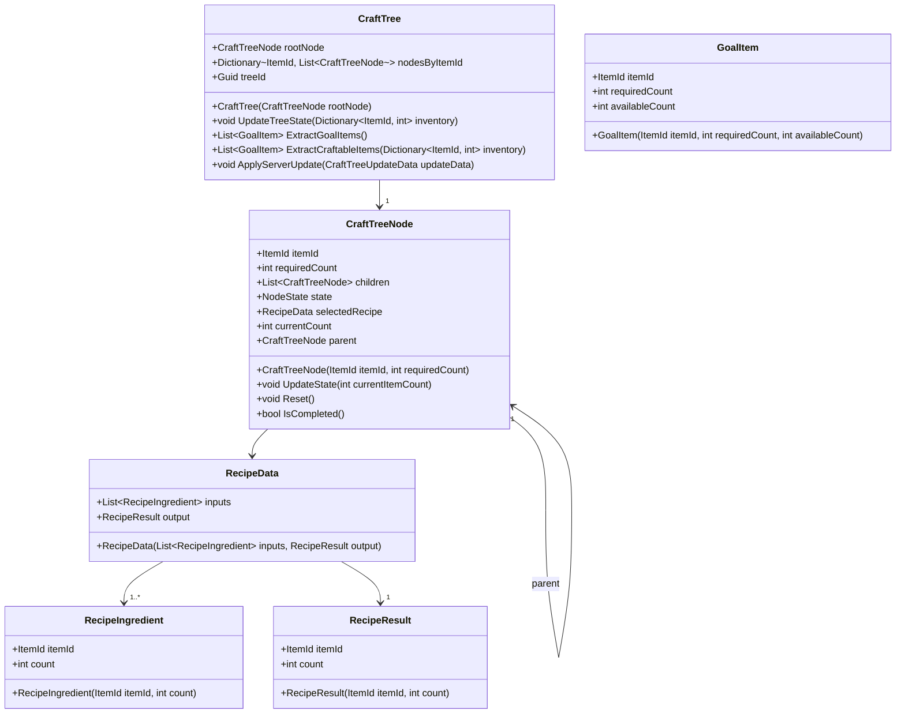
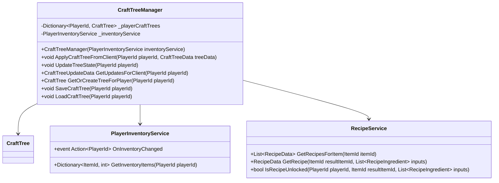
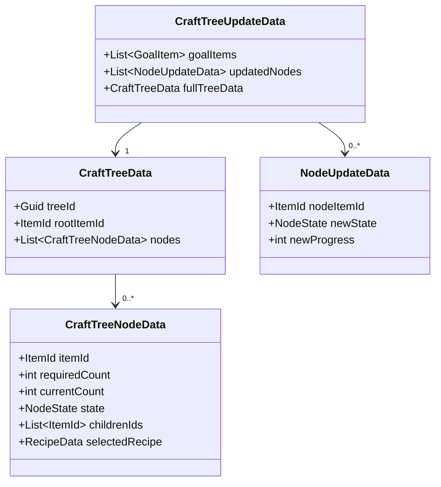
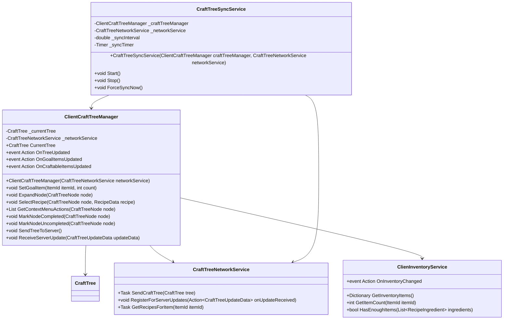
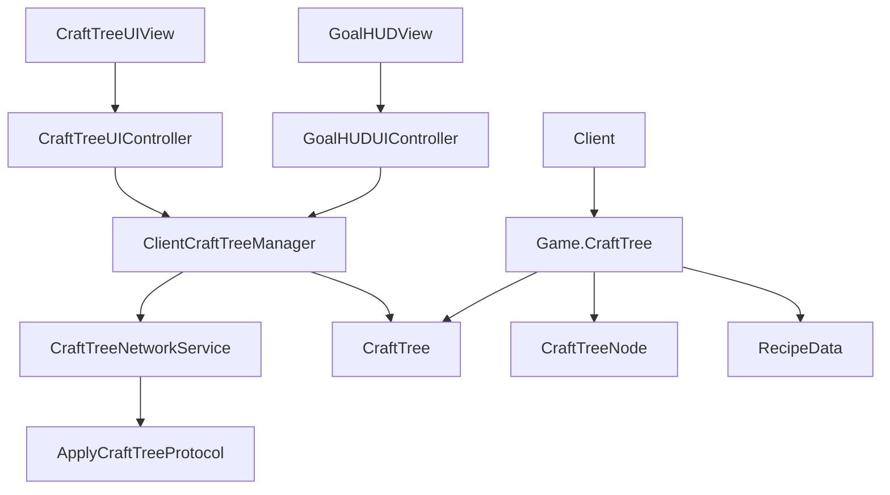

# クラフトツリー／目標表示　機能設計書

## 概要

本設計書は「クラフトツリー」と「目標表示（HUD）」機能の実装のためのクラス設計を記述したものです。クライアント側でデータを編集し、サーバー側で永続化と進捗管理を行う構造となっています。なお、データモデルはサーバー側に定義し、クライアント側はそれを参照します。

## 基本方針

1. **サーバー側の役割**
   - 基本データモデルの定義
   - クラフトツリーデータの永続化
   - インベントリに基づくノード進捗・完了の判定
   - 目標アイテムの計算とクライアントへの通知
   - レシピのアンロック状態の管理

2. **クライアント側の役割**
   - サーバー側のデータモデルを使ったツリーの編集
   - ユーザー操作の処理（ノード選択、レシピ選択など）
   - クラフトツリーの視覚的表示
   - 目標表示HUDの表示
   - サーバーへの更新の送信

3. **通信の基本フロー**
   - クライアント側で編集したクラフトツリーデータをサーバーに送信
   - サーバー側でノードの進捗や完了が発生した場合、イベントでクライアントに通知
   - サーバー側からクラフトツリーデータが送られてきた場合はそのデータを優先

## サーバー側クラス設計

### 1. データモデル



#### NodeState 列挙型
```csharp
// Game.CraftTree/Data名前空間に定義
public enum NodeState
{
    Incomplete,  // 未完了
    Completed    // 完了
}
```

### 2. サーバーサイドマネージャーとサービス



### 3. データ転送クラス



### 4. サーバー側プロトコル実装

```csharp
// Game.CraftTree/Network 名前空間に定義
public sealed class ApplyCraftTreeProtocol : IPacketResponse
{
    public const string ProtocolTag = "va:applyCraftTree";
    
    private readonly CraftTreeManager _craftTreeManager;
    
    public ApplyCraftTreeProtocol(ServiceProvider serviceProvider)
    {
        _craftTreeManager = serviceProvider.GetService<CraftTreeManager>();
    }
    
    public ProtocolMessagePackBase GetResponse(List<byte> payload)
    {
        var request = MessagePackSerializer.Deserialize<ApplyCraftTreeRequestMessagePack>(payload.ToArray());
        
        // クライアントから受け取ったツリーデータをサーバー側に適用
        _craftTreeManager.ApplyCraftTreeFromClient(new PlayerId(request.PlayerId), request.TreeData);
        
        return new ApplyCraftTreeResponseMessagePack();
    }
}

// Game.CraftTree/Network 名前空間に定義
public class CraftTreeUpdateEventSender
{
    private readonly CraftTreeManager _craftTreeManager;
    private readonly IClientEventSender _eventSender;
    
    public CraftTreeUpdateEventSender(ServerCraftTreeManager craftTreeManager, IClientEventSender eventSender)
    {
        _craftTreeManager = craftTreeManager;
        _eventSender = eventSender;
        
        // プレイヤーのインベントリ変更イベントを監視
        var inventoryService = ServerContext.GetService<PlayerInventoryService>();
        inventoryService.OnInventoryChanged += OnPlayerInventoryChanged;
    }
    
    private void OnPlayerInventoryChanged(PlayerId playerId)
    {
        // ツリーの状態を更新
        _craftTreeManager.UpdateTreeState(playerId);
        
        // 更新があればクライアントに通知
        SendUpdates(playerId);
    }
    
    public void SendUpdates(PlayerId playerId)
    {
        var updates = _craftTreeManager.GetUpdatesForClient(playerId);
        if (updates.updatedNodes.Count > 0 || updates.goalItems.Count > 0)
        {
            var eventData = new CraftTreeUpdateEventMessagePack(updates);
            _eventSender.SendEvent(playerId, CraftTreeUpdateEventMessagePack.EventTag, eventData);
        }
    }
}
```

## クライアント側クラス設計

### 1. クライアント側マネージャーとサービス



### 2. UI コントローラーとビュー

```mermaid
classDiagram
    class CraftTreeUIController {
        -ClientCraftTreeManager _craftTreeManager
        -CraftTreeNetworkService _networkService
        -ItemSearchService _itemSearchService
        -CraftTreeUIView _view
        +CraftTreeUIController(ClientCraftTreeManager craftTreeManager, CraftTreeNetworkService networkService, ItemSearchService itemSearchService)
        +void ShowCraftTreeUI()
        +void HideCraftTreeUI()
        +void OnNodeClick(CraftTreeNode node)
        +void OnNodeRightClick(CraftTreeNode node, Vector2 screenPosition)
        +void OnGoalItemSelect(ItemId itemId, int count)
    }
    
    class CraftTreeUIView {
        -GameObject _craftTreePanel
        -SearchItemUI _searchItemUI
        -CraftTreeNodeUI _nodeUIPrefab
        -RecipeSelectModalUI _recipeSelectModal
        -NodeContextMenuUI _contextMenu
        +event Action~CraftTreeNode~ OnNodeClick
        +event Action~CraftTreeNode, Vector2~ OnNodeRightClick
        +event Action~ItemId, int~ OnGoalItemSelect
        +void ShowUI()
        +void HideUI()
        +void RenderTree(CraftTree tree)
        +void ShowRecipeSelectModal(CraftTreeNode node, List~RecipeData~ recipes, Action~RecipeData~ onRecipeSelect)
        +void ShowContextMenu(List~NodeContextMenuAction~ actions, Vector2 position)
    }
    
    class GoalHUDUIController {
        -ClientCraftTreeManager _craftTreeManager
        -GoalHUDView _view
        +GoalHUDUIController(ClientCraftTreeManager craftTreeManager)
        +void Initialize()
        +void ToggleCraftableItemsVisibility()
    }
    
    class GoalHUDView {
        -GameObject _goalPanel
        -Transform _goalItemsContainer
        -Transform _craftableItemsContainer
        -GoalItemUI _goalItemUIPrefab
        -int _maxDisplayItems
        +void ShowUI()
        +void HideUI()
        +void UpdateGoalItems(List~GoalItem~ goalItems)
        +void UpdateCraftableItems(List~GoalItem~ craftableItems)
    }
    
    class NodeContextMenuAction {
        +string name
        +Action action
        +bool isEnabled
        +NodeContextMenuAction(string name, Action action, bool isEnabled)
    }
    
    class ItemSearchService {
        +List~ItemId~ SearchItems(string query)
        +Dictionary~ItemCategory, List~ItemId~~ GetCategorizedItems()
    }
    
    CraftTreeUIController --> ClientCraftTreeManager
    CraftTreeUIController --> CraftTreeNetworkService
    CraftTreeUIController --> ItemSearchService
    CraftTreeUIController --> CraftTreeUIView
    GoalHUDUIController --> ClientCraftTreeManager
    GoalHUDUIController --> GoalHUDView
```



### 3. クライアント側のネットワークサービス実装

```csharp
// Client.Game.InGame.CraftTree.Network 名前空間に定義
public class CraftTreeNetworkService
{
    private readonly IVanillaApi _vanillaApi;
    private Action<CraftTreeUpdateData> _onUpdateReceived;
    
    public CraftTreeNetworkService(IVanillaApi vanillaApi)
    {
        _vanillaApi = vanillaApi;
        
        // サーバーからのイベント通知を受け取るよう登録
        _vanillaApi.Event.SubscribeEventResponse(
            CraftTreeUpdateEventMessagePack.EventTag, 
            OnCraftTreeUpdateEvent);
    }
    
    public void RegisterForServerUpdates(Action<CraftTreeUpdateData> onUpdateReceived)
    {
        _onUpdateReceived = onUpdateReceived;
    }
    
    private void OnCraftTreeUpdateEvent(byte[] payload)
    {
        var updateEvent = MessagePackSerializer.Deserialize<CraftTreeUpdateEventMessagePack>(payload);
        var updateData = updateEvent.ToUpdateData();
        
        _onUpdateReceived?.Invoke(updateData);
    }
    
    public async Task SendCraftTree(CraftTree tree)
    {
        try
        {
            var treeData = new CraftTreeDataMessagePack(tree);
            await _vanillaApi.Response.ApplyCraftTree(treeData);
        }
        catch (Exception ex)
        {
            Debug.LogError($"Failed to send craft tree to server: {ex.Message}");
        }
    }
    
    public async Task<List<RecipeData>> GetRecipesForItem(ItemId itemId)
    {
        try
        {
            return await _vanillaApi.Response.GetRecipesForItem(itemId);
        }
        catch (Exception ex)
        {
            Debug.LogError($"Failed to get recipes for item {itemId}: {ex.Message}");
            return new List<RecipeData>();
        }
    }
}
```

## 名前空間構成

```
Game.CraftTree/ (サーバー側)
├── Data/
│   ├── CraftTree.cs
│   ├── CraftTreeNode.cs
│   ├── GoalItem.cs
│   ├── NodeState.cs
│   ├── RecipeData.cs
│   └── RecipeIngredient.cs
├── Manager/
│   ├── CraftTreeManager.cs
│   ├── PlayerInventoryService.cs
│   └── RecipeService.cs
├── Network/
│   ├── ApplyCraftTreeProtocol.cs
│   ├── CraftTreeDataMessagePack.cs
│   ├── CraftTreeUpdateEventMessagePack.cs
│   └── CraftTreeUpdateEventSender.cs
└── Utility/
    ├── CraftTreeSerializer.cs
    └── GoalItemExtractor.cs

Client.Game.InGame.CraftTree/ (クライアント側)
├── Manager/
│   ├── ClientCraftTreeManager.cs
│   ├── ClientInventoryService.cs
│   └── CraftTreeSyncService.cs
├── Network/
│   └── CraftTreeNetworkService.cs
├── UI/
│   ├── CraftTreeUIController.cs
│   ├── CraftTreeUIView.cs
│   ├── GoalHUDUIController.cs
│   ├── GoalHUDView.cs
│   ├── CraftTreeNodeUI.cs
│   ├── GoalItemUI.cs
│   ├── RecipeSelectModalUI.cs
│   └── NodeContextMenuUI.cs
└── Utility/
    └── ItemSearchService.cs
```

## 実装の詳細

### 1. データモデルと状態管理

```csharp
// Game.CraftTree/Data/CraftTree.cs
public class CraftTree
{
    public CraftTreeNode rootNode { get; private set; }
    public Dictionary<ItemId, List<CraftTreeNode>> nodesByItemId { get; private set; }
    public Guid treeId { get; private set; }
    
    public CraftTree(CraftTreeNode rootNode)
    {
        this.rootNode = rootNode;
        this.treeId = Guid.NewGuid();
        this.nodesByItemId = new Dictionary<ItemId, List<CraftTreeNode>>();
        
        // ルートノードを登録
        RegisterNode(rootNode);
    }
    
    private void RegisterNode(CraftTreeNode node)
    {
        // ItemIdをキーにノードを登録
        if (!nodesByItemId.TryGetValue(node.itemId, out var nodes))
        {
            nodes = new List<CraftTreeNode>();
            nodesByItemId[node.itemId] = nodes;
        }
        
        nodes.Add(node);
        
        // 子ノードも登録
        foreach (var child in node.children)
        {
            RegisterNode(child);
        }
    }
    
    public void UpdateTreeState(Dictionary<ItemId, int> inventory)
    {
        // インベントリ情報に基づいてツリー全体の状態を更新
        UpdateNodeState(rootNode, inventory);
    }
    
    private void UpdateNodeState(CraftTreeNode node, Dictionary<ItemId, int> inventory)
    {
        // 現在のアイテム数を取得
        int currentCount = inventory.GetValueOrDefault(node.itemId, 0);
        node.UpdateState(currentCount);
        
        // 子ノードを更新
        foreach (var child in node.children)
        {
            UpdateNodeState(child, inventory);
        }
    }
    
    // 深さ優先探索で「直近取得すべき」ノードを抽出
    public List<GoalItem> ExtractGoalItems()
    {
        var result = new List<GoalItem>();
        var visited = new HashSet<CraftTreeNode>();
        
        void DfsVisit(CraftTreeNode node)
        {
            if (visited.Contains(node)) return;
            visited.Add(node);
            
            // 親が完了で自身が未完了のノードを「直近取得すべき」と定義
            bool isParentCompleted = node.parent == null || node.parent.state == NodeState.Completed;
            
            if (isParentCompleted && node.state == NodeState.Incomplete)
            {
                result.Add(new GoalItem(node.itemId, node.requiredCount, node.currentCount));
            }
            
            // 子ノードを探索
            foreach (var child in node.children)
            {
                DfsVisit(child);
            }
        }
        
        DfsVisit(rootNode);
        return result;
    }
    
    // 現在インベントリでクラフト可能なアイテム抽出
    public List<GoalItem> ExtractCraftableItems(Dictionary<ItemId, int> inventory)
    {
        var result = new List<GoalItem>();
        
        foreach (var nodeList in nodesByItemId.Values)
        {
            foreach (var node in nodeList)
            {
                if (node.state == NodeState.Incomplete && node.selectedRecipe != null)
                {
                    bool canCraft = true;
                    foreach (var child in node.children)
                    {
                        int availableCount = inventory.GetValueOrDefault(child.itemId, 0);
                        if (availableCount < child.requiredCount)
                        {
                            canCraft = false;
                            break;
                        }
                    }
                    
                    if (canCraft)
                    {
                        result.Add(new GoalItem(node.itemId, node.requiredCount, node.currentCount));
                    }
                }
            }
        }
        
        return result;
    }
}

// Game.CraftTree/Data/CraftTreeNode.cs
public class CraftTreeNode
{
    public ItemId itemId { get; private set; }
    public int requiredCount { get; private set; } 
    public List<CraftTreeNode> children { get; private set; }
    public NodeState state { get; private set; }
    public RecipeData selectedRecipe { get; set; }
    public int currentCount { get; private set; }
    public CraftTreeNode parent { get; set; }
    
    public CraftTreeNode(ItemId itemId, int requiredCount)
    {
        this.itemId = itemId;
        this.requiredCount = requiredCount;
        this.children = new List<CraftTreeNode>();
        this.state = NodeState.Incomplete;
        this.currentCount = 0;
    }
    
    public void UpdateState(int currentItemCount)
    {
        this.currentCount = currentItemCount;
        if (currentItemCount >= requiredCount)
        {
            state = NodeState.Completed;
        }
        else
        {
            state = NodeState.Incomplete;
        }
    }
    
    public void Reset()
    {
        state = NodeState.Incomplete;
        currentCount = 0;
        foreach (var child in children)
        {
            child.Reset();
        }
    }
    
    public bool IsCompleted()
    {
        return state == NodeState.Completed;
    }
}
```

### 2. サーバー側マネージャー

```csharp
// Game.CraftTree/Manager/CraftTreeManager.cs
public class CraftTreeManager
{
    private Dictionary<PlayerId, CraftTree> _playerCraftTrees;
    private PlayerInventoryService _inventoryService;
    private RecipeService _recipeService;
    
    public CraftTreeManager(PlayerInventoryService inventoryService, RecipeService recipeService)
    {
        _playerCraftTrees = new Dictionary<PlayerId, CraftTree>();
        _inventoryService = inventoryService;
        _recipeService = recipeService;
    }
    
    public void ApplyCraftTreeFromClient(PlayerId playerId, CraftTreeData treeData)
    {
        // クライアントから受け取ったデータを変換
        var tree = CraftTreeSerializer.Deserialize(treeData);
        _playerCraftTrees[playerId] = tree;
        
        // インベントリに基づいてツリーの状態を更新
        UpdateTreeState(playerId);
        
        // 変更を永続化
        SaveCraftTree(playerId);
    }
    
    public void UpdateTreeState(PlayerId playerId)
    {
        if (!_playerCraftTrees.TryGetValue(playerId, out var tree)) return;
        
        // プレイヤーのインベントリを取得
        var inventory = _inventoryService.GetInventoryItems(playerId);
        
        // ツリーの状態を更新
        tree.UpdateTreeState(inventory);
    }
    
    public CraftTreeUpdateData GetUpdatesForClient(PlayerId playerId)
    {
        if (!_playerCraftTrees.TryGetValue(playerId, out var tree)) 
            return new CraftTreeUpdateData();
        
        var goalItems = tree.ExtractGoalItems();
        var inventory = _inventoryService.GetInventoryItems(playerId);
        var craftableItems = tree.ExtractCraftableItems(inventory);
        
        // クライアントへの更新を作成
        return new CraftTreeUpdateData
        {
            goalItems = goalItems,
            updatedNodes = new List<NodeUpdateData>(), // 差分更新データ
            fullTreeData = CraftTreeSerializer.Serialize(tree)
        };
    }
    
    public CraftTree GetOrCreateTreeForPlayer(PlayerId playerId)
    {
        if (_playerCraftTrees.TryGetValue(playerId, out var tree))
            return tree;
        
        // プレイヤー用の初期ツリーを作成
        var newTree = new CraftTree(null); // 仮のルートノード
        _playerCraftTrees[playerId] = newTree;
        return newTree;
    }
    
    public void SaveCraftTree(PlayerId playerId)
    {
        if (!_playerCraftTrees.TryGetValue(playerId, out var tree)) return;
        
        // プレイヤーデータとしてツリー状態を保存
        // 実装省略
    }
    
    public void LoadCraftTree(PlayerId playerId)
    {
        // プレイヤーデータからツリー状態をロード
        // 実装省略
    }
}
```

### 3. クライアント側マネージャー

```csharp
// Client.Game.InGame.CraftTree/Manager/ClientCraftTreeManager.cs
public class ClientCraftTreeManager
{
    private CraftTree _currentTree;
    private CraftTreeNetworkService _networkService;
    private ClientInventoryService _inventoryService;
    
    public CraftTree CurrentTree => _currentTree;
    
    public event Action OnTreeUpdated;
    public event Action<List<GoalItem>> OnGoalItemsUpdated;
    public event Action<List<GoalItem>> OnCraftableItemsUpdated;
    
    public ClientCraftTreeManager(CraftTreeNetworkService networkService, ClientInventoryService inventoryService)
    {
        _networkService = networkService;
        _inventoryService = inventoryService;
        
        // サーバーからの更新通知を処理するハンドラを登録
        _networkService.RegisterForServerUpdates(ReceiveServerUpdate);
        
        // インベントリ変更時にローカルのツリー状態を更新
        _inventoryService.OnInventoryChanged += () => {
            if (_currentTree != null)
            {
                UpdateLocalTreeState();
            }
        };
    }
    
    public void SetGoalItem(ItemId itemId, int count)
    {
        // 新しいツリーのルートノードを作成
        var rootNode = new CraftTreeNode(itemId, count);
        
        // 新しいCraftTreeを作成
        _currentTree = new CraftTree(rootNode);
        
        // UIを更新
        OnTreeUpdated?.Invoke();
        
        // ツリーをサーバーに送信
        SendTreeToServer();
    }
    
    public void ExpandNode(CraftTreeNode node)
    {
        // ノードが既に展開されている場合は何もしない
        if (node.children.Count > 0) return;
        
        // サーバーからノード用のレシピを取得
        _networkService.GetRecipesForItem(node.itemId)
            .ContinueWith(task => {
                if (task.IsFaulted)
                {
                    Debug.LogError($"Failed to get recipes: {task.Exception}");
                    return;
                }
                
                var recipes = task.Result;
                if (recipes.Count == 1)
                {
                    // レシピが1つだけなら自動選択
                    SelectRecipe(node, recipes[0]);
                }
                else if (recipes.Count > 1)
                {
                    // UIコントローラー側でレシピ選択UIを表示
                    // イベント発火などで通知
                }
            }, TaskScheduler.FromCurrentSynchronizationContext());
    }
    
    public void SelectRecipe(CraftTreeNode node, RecipeData recipe)
    {
        // 以前のレシピがあれば、子ノードをクリア
        node.children.Clear();
        
        // 新しいレシピを設定
        node.selectedRecipe = recipe;
        
        // レシピの材料に基づいて子ノードを作成
        foreach (var ingredient in recipe.inputs)
        {
            var childNode = new CraftTreeNode(ingredient.itemId, ingredient.count);
            childNode.parent = node;
            node.children.Add(childNode);
        }
        
        // ツリー全体の状態を更新
        UpdateLocalTreeState();
        
        // ツリーをサーバーに送信
        SendTreeToServer();
    }
    
    public List<NodeContextMenuAction> GetContextMenuActions(CraftTreeNode node)
    {
        var actions = new List<NodeContextMenuAction>();
        
        if (node.state == NodeState.Completed)
        {
            // 完了状態のノードのアクション
            actions.Add(new NodeContextMenuAction(
                "レシピ変更", 
                () => {
                    // レシピ変更の実装
                    // サーバーからレシピを取得してUI表示
                },
                true
            ));
            
            actions.Add(new NodeContextMenuAction(
                "ここから上を未完了", 
                () => {
                    MarkNodeUncompleted(node);
                },
                true
            ));
        }
        else
        {
            // 未完了状態のノードのアクション
            actions.Add(new NodeContextMenuAction(
                "レシピ変更", 
                () => {
                    // レシピ変更の実装
                },
                true
            ));
            
            actions.Add(new NodeContextMenuAction(
                "下位を完了にする", 
                () => {
                    MarkNodeCompleted(node);
                },
                true
            ));
        }
        
        return actions;
    }
    
    public void MarkNodeCompleted(CraftTreeNode node)
    {
        // ノードとその子孫を完了状態にマーク
        node.state = NodeState.Completed;
        foreach (var child in node.children)
        {
            MarkNodeCompleted(child);
        }
        
        // UIを更新
        OnTreeUpdated?.Invoke();
        
        // ツリーをサーバーに送信
        SendTreeToServer();
    }
    
    public void MarkNodeUncompleted(CraftTreeNode node)
    {
        // ノードとその先祖を未完了状態にマーク
        node.state = NodeState.Incomplete;
        
        var current = node.parent;
        while (current != null)
        {
            current.state = NodeState.Incomplete;
            current = current.parent;
        }
        
        // UIを更新
        OnTreeUpdated?.Invoke();
        
        // ツリーをサーバーに送信
        SendTreeToServer();
    }
    
    public void SendTreeToServer()
    {
        if (_currentTree == null) return;
        
        _networkService.SendCraftTree(_currentTree)
            .ContinueWith(task => {
                if (task.IsFaulted)
                {
                    Debug.LogError($"Failed to send tree: {task.Exception}");
                }
            });
    }
    
    public void ReceiveServerUpdate(CraftTreeUpdateData updateData)
    {
        if (updateData.fullTreeData != null)
        {
            // サーバーから完全なツリーデータを受信
            _currentTree = CraftTreeSerializer.Deserialize(updateData.fullTreeData);
            
            // UI更新
            OnTreeUpdated?.Invoke();
        }
        else if (updateData.updatedNodes.Count > 0)
        {
            // 部分的な更新のみ
            foreach (var nodeUpdate in updateData.updatedNodes)
            {
                // ノードの状態を更新
                var nodes = _currentTree.nodesByItemId.GetValueOrDefault(nodeUpdate.nodeItemId) ?? new List<CraftTreeNode>();
                foreach (var node in nodes)
                {
                    node.state = nodeUpdate.newState;
                    // 進捗も更新
                }
            }
            
            // UI更新
            OnTreeUpdated?.Invoke();
        }
        
        // 目標アイテムとクラフト可能アイテムを更新
        if (updateData.goalItems != null)
        {
            OnGoalItemsUpdated?.Invoke(updateData.goalItems);
        }
    }
    
    private void UpdateLocalTreeState()
    {
        if (_currentTree == null) return;
        
        // プレイヤーのインベントリを取得
        var inventory = _inventoryService.GetInventoryItems();
        
        // ツリーの状態を更新
        _currentTree.UpdateTreeState(inventory);
        
        // 目標アイテムと製作可能アイテムを抽出
        var goalItems = _currentTree.ExtractGoalItems();
        var craftableItems = _currentTree.ExtractCraftableItems(inventory);
        
        // イベント発火
        OnTreeUpdated?.Invoke();
        OnGoalItemsUpdated?.Invoke(goalItems);
        OnCraftableItemsUpdated?.Invoke(craftableItems);
    }
}
```

## 依存関係



## Dependency Injection 設定

```csharp
// サーバー側のDI設定
public static void RegisterServerCraftTreeServices(IServiceCollection services)
{
    // サービス
    services.AddSingleton<PlayerInventoryService>();
    services.AddSingleton<RecipeService>();
    
    // マネージャー
    services.AddSingleton<CraftTreeManager>();
    
    // イベント送信
    services.AddSingleton<CraftTreeUpdateEventSender>();
    
    // プロトコル
    services.AddSingleton<ApplyCraftTreeProtocol>();
}

// クライアント側のDI設定
public static void RegisterClientCraftTreeServices(Container container)
{
    // サービス
    container.Bind<CraftTreeNetworkService>().FromNew().AsSingle();
    container.Bind<ClientInventoryService>().FromNew().AsSingle();
    container.Bind<ItemSearchService>().FromNew().AsSingle();
    
    // マネージャー
    container.Bind<ClientCraftTreeManager>().FromNew().AsSingle();
    container.Bind<CraftTreeSyncService>().FromNew().AsSingle();
    
    // UI Controller
    container.Bind<CraftTreeUIController>().FromNew().AsSingle();
    container.Bind<GoalHUDUIController>().FromNew().AsSingle();
    
    // UI View
    container.Bind<CraftTreeUIView>().FromComponentInNewPrefab(Resources.Load<GameObject>("UI/CraftTreeUI")).AsSingle();
    container.Bind<GoalHUDView>().FromComponentInNewPrefab(Resources.Load<GameObject>("UI/GoalHUD")).AsSingle();
}
```

## 実装順序の推奨

1. サーバー側のデータモデル実装（CraftTreeNode, CraftTree等）
2. サーバー側マネージャークラスの実装
3. 通信プロトコルの実装
4. クライアント側の参照設定とNetworkServiceの実装
5. クライアント側マネージャーの実装
6. UI要素の実装
7. 統合テスト