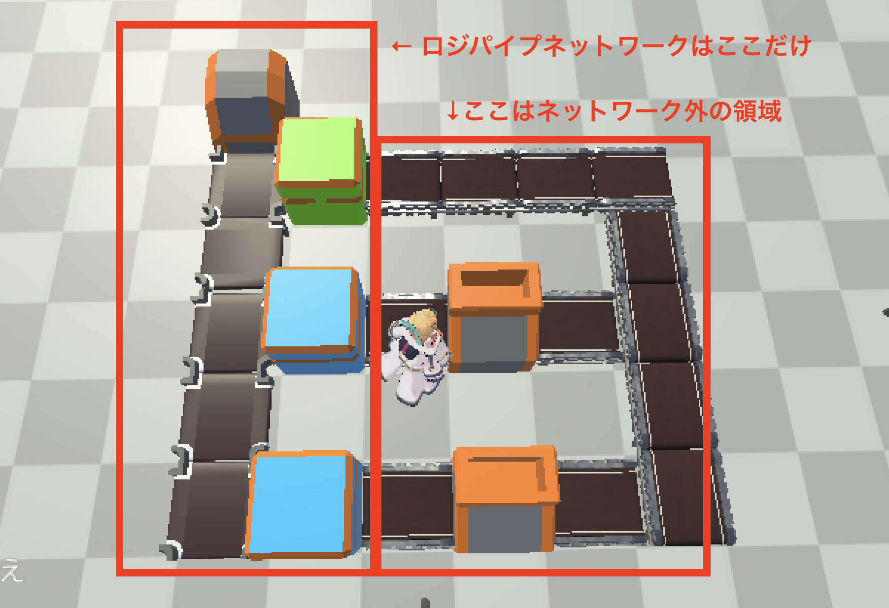
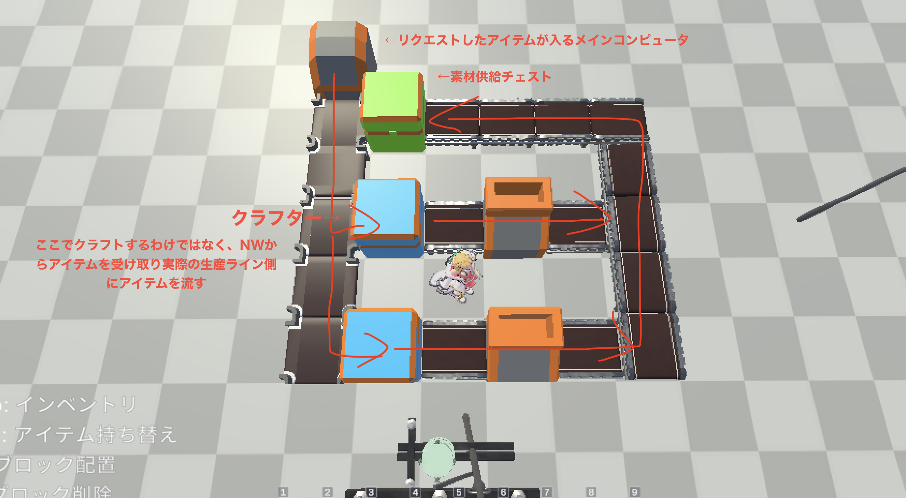

クラフトチェイナーはMinecraftでいう、ロジスティクスパイプやAE2、Refined Storageのような倉庫管理、オンデマンドクラフトシステムです。ロジスティクスパイプに近いです。

このクラフトチェイナーシステムはオミットします。

現状の構成でもバグでちゃんと動かないこと珍しくないのに、今後待っている大量のデバッグや機能修正、演出追加Ωかを考えたらちょっと個人開発の手に負える範囲ではなくなってしまう。

マスタとかは全部消すけど、一応機能として残しておきます。今後開発進めてちゃんと動く状態が維持できるかはわからないけど。

動かしたかったら当時のマスタを引っ張ってきて、テストコードとかを参照してNWを作ってみてください。

一応最小構成の参考画像も貼っておきます。

Craft Chaine is a warehouse management and on-demand crafting system in Minecraft, similar to Logistics Pipes, AE2, or Refined Storage. It's closer to Logistics Pipes.

This Craft Chaine system will be omitted.

Even with the current setup, it's not uncommon for bugs to prevent it from working properly. Considering the massive amount of debugging, feature fixes, and visual enhancements still needed, it's simply beyond the scope of a personal development project.

I'll remove all the master files, but I'll leave the functionality intact for now. I can't guarantee future development will maintain a stable, working state.

If you want to try running it, pull the master files from back then and use the test code as a reference to build the network.

I'll also attach a reference image of the minimal configuration for reference.

